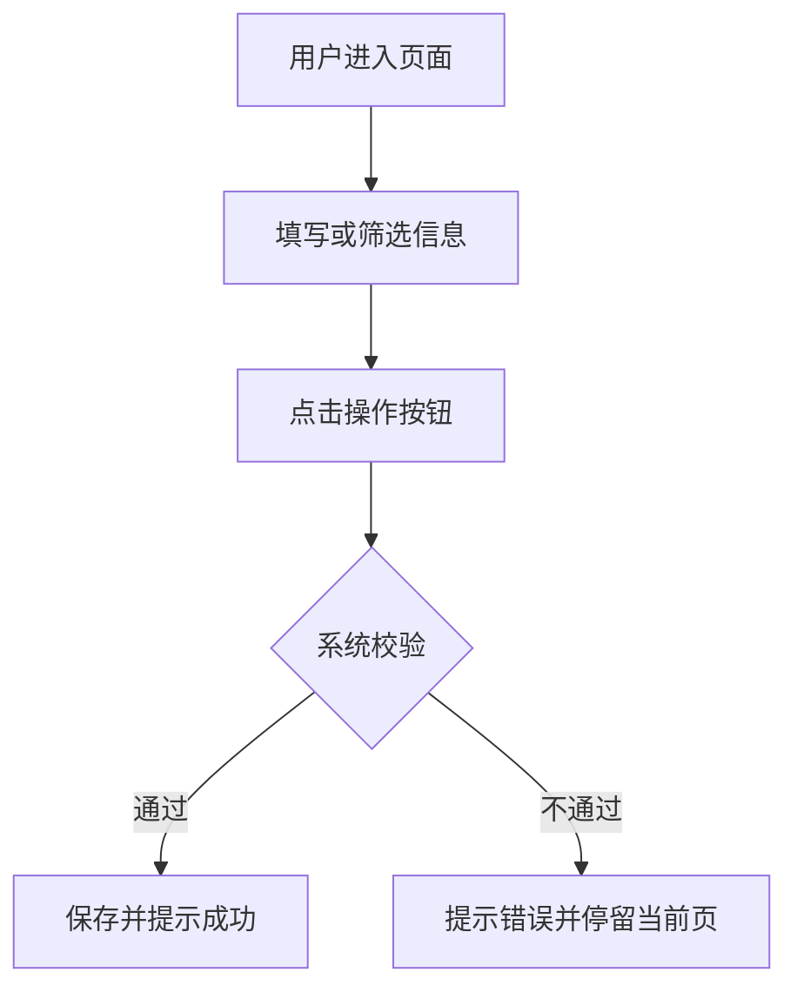

# 原型模板

> Plan 方案经用户确认后，才能输出原型。原型未经用户确认，不得进入 PRD 阶段。

## 一、原型范围

- 对应 Plan：
- 覆盖页面：
- 不覆盖内容：
- 原型形式：Markdown 低保真原型 / HTML 原型 / 图片原型 / 其他

## 二、页面清单

| 页面编号 | 页面名称 | 页面目标 | 使用角色 |
|----------|----------|----------|----------|
| P-001 | 示例页面 | 示例目标 | 示例角色 |

## 三、页面结构

### 3.1 页面：示例页面

#### 页面目标

- 这个页面帮助用户完成什么：

#### 页面布局

```text
┌──────────────────────────────────────┐
│ 页面标题                              │
├──────────────────────────────────────┤
│ 查询区                                │
├──────────────────────────────────────┤
│ 操作区                                │
├──────────────────────────────────────┤
│ 列表区                                │
├──────────────────────────────────────┤
│ 分页/汇总区                           │
└──────────────────────────────────────┘
```

## 四、查询条件

| 字段 | 控件 | 默认值 | 筛选逻辑 | 联动规则 |
|------|------|--------|----------|----------|
| 示例字段 | 输入框/下拉框/日期范围 | - | 精确/模糊/范围 | - |

## 五、列表字段

| 列名 | 字段来源 | 展示规则 | 排序规则 | 备注 |
|------|----------|----------|----------|------|
| 示例列 | 示例来源 | 示例规则 | 默认倒序/不支持排序 | - |

## 六、表单字段

| 字段 | 控件 | 必填 | 校验规则 | 默认值 | 说明 |
|------|------|------|----------|--------|------|
| 示例字段 | 输入框 | 是/否 | 示例校验 | - | 示例说明 |

## 七、按钮与操作

| 按钮 | 位置 | 权限 | 点击后行为 | 成功提示 | 失败提示 |
|------|------|------|------------|----------|----------|
| 示例按钮 | 页面右上角 | 示例权限 | 示例行为 | 示例提示 | 示例提示 |

## 八、状态展示

| 状态 | 展示文案 | 颜色 | 可执行操作 | 说明 |
|------|----------|------|------------|------|
| 示例状态 | 示例文案 | #52C41A | 查看/编辑 | 示例说明 |

## 九、弹窗、抽屉或二级页面

| 触发操作 | 组件形式 | 展示内容 | 提交行为 | 关闭行为 |
|----------|----------|----------|----------|----------|
| 示例操作 | 弹窗/抽屉/页面 | 示例内容 | 示例行为 | 示例行为 |

## 十、关键交互流程



## 十一、异常与空状态

| 场景 | 页面表现 | 用户可执行操作 | 系统处理 |
|------|----------|----------------|----------|
| 空数据 | 展示空状态 | 调整筛选/新建 | 不写入数据 |
| 权限不足 | 展示无权限提示 | 返回上一页 | 阻断访问 |

## 十二、确认结论

- 原型是否确认：待用户确认
- 进入下一阶段条件：用户明确确认原型后，才生成 PRD
