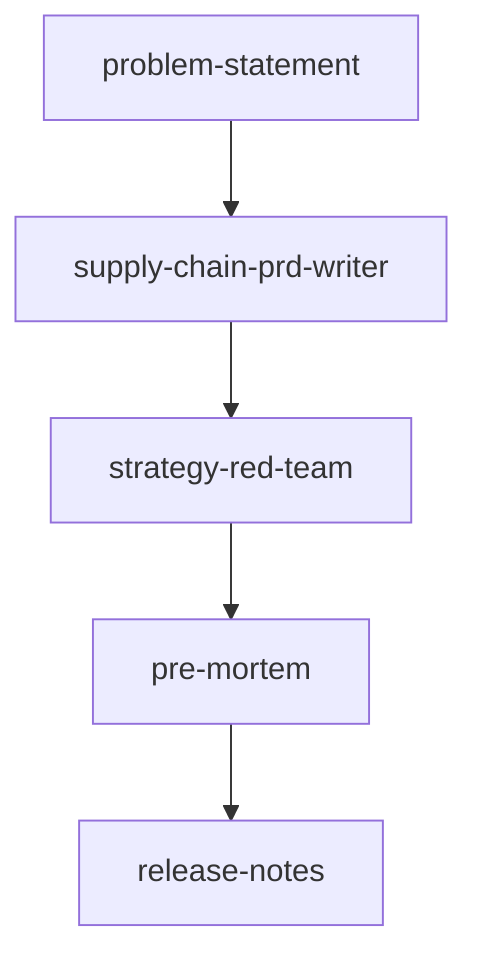

# 主编排方案

## 1. 主入口

主编排入口是 `supply-chain-prd-writer`。

它负责把供应链后台需求从原始材料推进到四阶段交付：

1. 需求分析
2. Plan 方案
3. 原型
4. PRD

## 2. 辅助技能

- `problem-statement`：把问题、阻塞点、目标人群先说清楚
- `strategy-red-team`：在定稿前攻击方案里的关键假设
- `pre-mortem`：在上线前预演失败场景
- `release-notes`：在发布时把变化说给业务方听

## 3. 推荐顺序

## 4. 角色边界

| 角色 | 职责 | 不负责 |
|---|---|---|
| `supply-chain-prd-writer` | 负责主链路编排和四阶段文档输出 | 不负责风险评审和发版说明 |
| `problem-statement` | 负责问题定义和阻塞点描述 | 不负责完整 PRD |
| `strategy-red-team` | 负责逻辑攻击和假设验证 | 不负责改写主文档 |
| `pre-mortem` | 负责上线风险预演 | 不负责方案成稿 |
| `release-notes` | 负责版本发布说明 | 不负责需求定义 |

## 5. 推荐使用场景

- 你先有零散材料，需要先变成可评审的需求
- 你要从需求一路走到 PRD，不想在不同 skill 之间来回跳
- 你要在定稿前和上线前做一次质量校验
- 你要在发布时输出业务能看懂的变更说明
