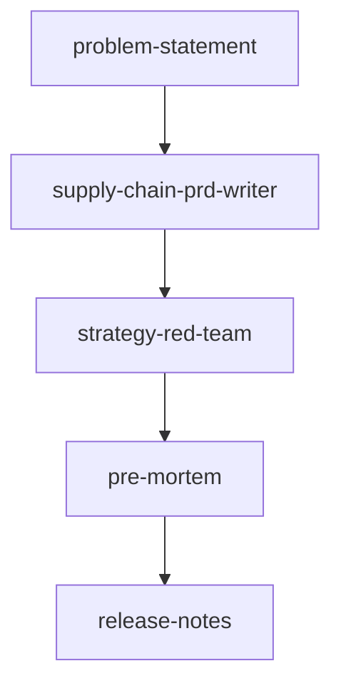

# Supply Chain PRD Workflow

这是供应链后台文档工作的工作流目录。这里存放的是相关 skill 的副本，用于把问题定义、需求分析、方案、原型/PRD、风险校验和发版说明串起来。

## 定位

- `skills/core/`：最小必需集合
- `skills/optional/`：可选扩展集合

### core

- 主编排入口：`supply-chain-prd-writer`
- 风险校验：`strategy-red-team`、`pre-mortem`
- 发版沟通：`release-notes`

### optional

- 推荐前置：`problem-statement`
- 通用补位：`prd-development`、`create-prd`
- 交互支撑：`workshop-facilitation`
- 概念支撑：`jobs-to-be-done`、`proto-persona`

## 推荐顺序

## 最小必需集合

如果目标是完成一条可落地的供应链文档闭环，最小集合是：

1. `supply-chain-prd-writer`
2. `strategy-red-team`
3. `pre-mortem`
4. `release-notes`

`problem-statement` 是推荐前置，不是硬性必需；其余都属于可选扩展。

## 原则

- 只复制，不回写原始 `~/.codex/skills`
- 这个目录是独立快照
- 后续如果继续收缩，只优先保留最小集合

## 入口文档

- [`ORCHESTRATION.md`](ORCHESTRATION.md)
- [`MINIMAL_SET.md`](MINIMAL_SET.md)
- [`SOURCE_MAP.md`](SOURCE_MAP.md)
