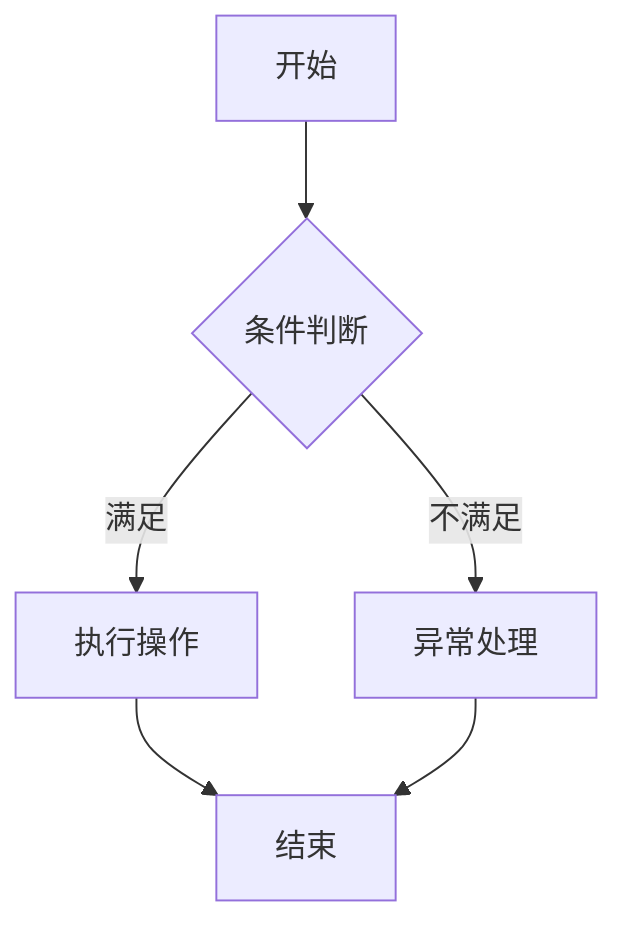

# Plan 方案模板

> 需求分析文档经用户确认后，才能输出 Plan 方案。Plan 未经用户确认，不得进入原型阶段。
> 对于供应链、WMS、TMS 场景，Plan 方案必须写成可直接协同研发、测试、仓内执行和运维的落地底稿，避免停留在概念描述。

## 0. 文档信息

- 标题：
- 文档类型：Plan
- 版本：
- 日期：
- 作者：
- 相关方：

## 一、需求理解

### 1.1 背景

- 业务背景：
- 当前问题：
- 影响对象：

### 1.2 目标

- 业务目标：
- 用户目标：
- 成功标准：

## 二、范围定义

### 2.1 本次要做

| 模块 | 说明 | 优先级 |
|------|------|--------|
| 示例模块 | 示例说明 | P0/P1/P2 |

### 2.2 本次不相关

| 内容 | 不做原因 | 后续处理 |
|------|----------|----------|
| 示例内容 | 示例原因 | 后续版本/待确认 |

## 三、用户与场景

| 用户角色 | 使用场景 | 核心诉求 |
|----------|----------|----------|
| 示例角色 | 示例场景 | 示例诉求 |

## 四、业务流程

## 五、关键业务规则

| 规则编号 | 规则名称 | 规则说明 | 影响范围 |
|----------|----------|----------|----------|
| BR-001 | 示例规则 | 示例说明 | 示例范围 |

## 六、页面与操作范围

| 页面 | 页面目标 | 主要操作 | 备注 |
|------|----------|----------|------|
| 示例页面 | 示例目标 | 查询/新增/编辑/提交 | - |

## 七、使用者与系统交互场景（必填）

> Plan 阶段必须确认使用者与系统的交互场景。必须明确使用者做什么、系统如何反馈、页面或状态如何变化、数据如何读写；信息不明确时标注“待确认”，不得省略本章节。

| 交互编号 | 使用者角色 | 使用入口 | 用户动作 | 系统响应 | 页面/状态变化 | 数据读取/写入 | 异常反馈 | 交互结果 |
|----------|------------|----------|----------|----------|--------------|---------------|----------|----------|
| INT-001 | 示例角色 | 示例页面/菜单 | 示例动作 | 示例响应 | 示例变化 | 读取/写入示例数据 | 示例异常提示 | 示例结果 |

## 八、UC 用例清单（必填）

> Plan 阶段必须输出 UC 用例清单。至少覆盖正常路径、边界用例、异常用例；信息不明确时标注“待确认”，不得省略本章节。

| 用例编号 | 用例类型 | 用例名称 | 用户角色 | 前置条件 | 触发条件 | 操作步骤 | 预期结果 | 优先级 |
|----------|----------|----------|----------|----------|----------|----------|----------|--------|
| UC-001 | 正常路径 | 示例用例 | 示例角色 | 示例前置条件 | 示例触发条件 | 1. 用户操作 2. 系统处理 | 示例结果 | P0/P1/P2 |
| UC-002 | 边界用例 | 示例边界 | 示例角色 | 示例前置条件 | 示例触发条件 | 1. 用户操作 2. 系统处理 | 示例结果 | P0/P1/P2 |
| UC-003 | 异常用例 | 示例异常 | 示例角色 | 示例前置条件 | 示例触发条件 | 1. 用户操作 2. 系统处理 | 示例结果 | P0/P1/P2 |

## 九、数据与系统边界

> 本章承接需求分析阶段的数据说明，继续明确数据对象、来源、流向、关联关系和系统边界；这里开始面向方案设计，但仍不进入 PRD 的字段级设计。

### 9.1 关键数据对象

| 数据对象 | 来源 | 用途 |
|----------|------|------|
| 示例对象 | 示例来源 | 示例用途 |

### 9.2 系统边界

> 下面这几项必须按顺序确认；未明确时统一标注“待确认”。

- 目标系统：`OMS` / `WMS` / `TMS` / 其他
- 库存责任归属：
- 作业节点/状态口径：
  - 业务发生在哪个作业节点、页面或动作入口
  - 该节点的进入条件、离开条件、前后状态
- 是否手工单：
  - 仅手工单存在该节点，还是所有单据都会经过该节点
- 与物流商揽收系统/TMS 的交接口径：
  - 由谁发起
  - 由谁接收
  - 是撤销、剔除、确认、回传，还是仅查询
- 不应单列为业务场景的状态/节点：
  - 仅后台流转的中间态
  - 非独立人机交互入口的状态
- 上游系统：
- 下游系统：

## 十、风险与待确认项

> 本节待确认项只是临时占位。每一项一旦确认，必须回填到对应章节中并从本节删除；最终目标是清空本节后再进入原型阶段。

| 类型 | 内容 | 需要谁确认 | 影响 |
|------|------|------------|------|
| 待确认 | 示例问题 | 业务方/技术方/运营方 | 示例影响 |

## 十一、原型建议

- 需要覆盖的页面：
- 需要重点表达的交互：
- 需要重点校验的业务规则：

## 十二、确认结论

- Plan 是否确认：待用户确认
- 进入下一阶段条件：用户明确确认 Plan 后，才生成原型
