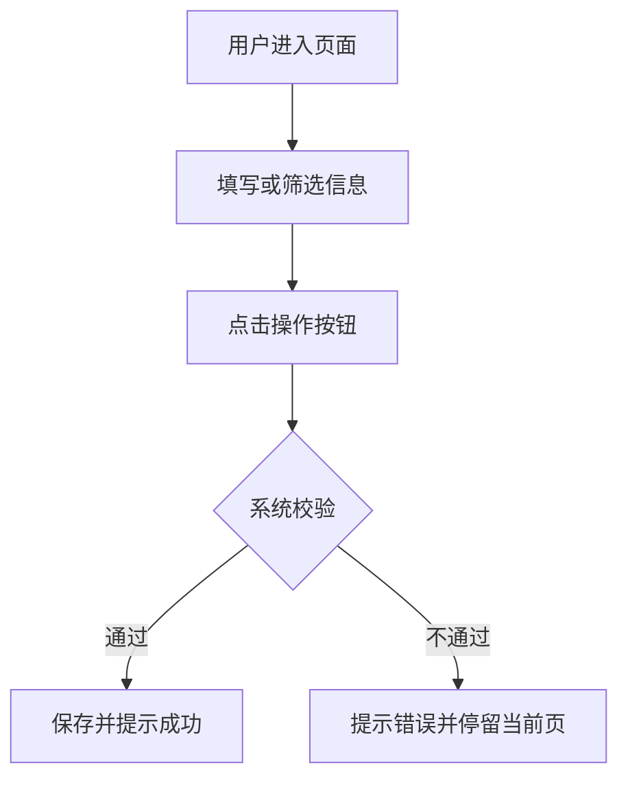

# 原型模板

> Plan 方案经用户确认后，才能输出原型。原型未经用户确认，不得进入 PRD 阶段。
> 原型不是概念图，而是供研发、测试、仓内执行对齐的多页静态页面稿。默认交付格式为 Markdown 低保真原型，用户确认后可再输出 HTML 原型。每个页面都要能看出入口、动作、校验、状态、数据变化、异常提示和页面流转关系。

## 0. 文档信息

- 标题：
- 文档类型：原型
- 版本：
- 日期：
- 作者：
- 相关方：

## 一、原型范围

- 对应 Plan：
- 覆盖页面：
- 不覆盖内容：
- 原型形式：Markdown 低保真多页静态稿（默认） / HTML 静态页面稿（确认后可输出） / 图片原型 / 其他
- 原型目标：说明这套页面要帮助谁完成什么业务动作，且能直接进入研发联调和测试设计

## 二、页面设计约束

> 原型页面必须先满足业务协同和研发可执行，再考虑视觉表现。
> 原型不要求可点击模拟，页面之间的跳转、分支和状态变化用说明、编号或页面流转图表达即可。

- 默认只覆盖 PC 端业务页面，PDA / 移动端不在本 skill 的默认范围内
- 每个页面只承载一个主要业务任务，避免把多个业务动作混在同一页
- 页面结构默认遵循“标题区 → 查询区 → 操作区 → 列表/表单区 → 分页或汇总区”
- 页面风格与组件表达默认遵循 Ant Design 原生组件规范，只使用 Ant Design 已有组件，不自造组件名；组件名称、状态反馈、表单校验、空状态、加载状态、错误状态都要对齐 Ant Design；参考网址：https://ant.design/index-cn
- 主要操作按钮不宜超过 3 个，破坏性操作必须二次确认
- 查询、列表、表单、状态、弹窗都要明确数据来源、校验规则、状态变化和结果反馈
- 空状态、无权限、异常状态、处理完成状态都必须可见
- 如果存在多状态流转，页面上必须能看出当前状态、可执行操作和下一步动作
- HTML 原型仅输出静态页面稿，不要求可点击模拟

## 三、页面清单

| 页面编号 | 页面名称 | 页面目标 | 使用角色 | 核心 Ant Design 组件 | 对应交互/UC |
|----------|----------|----------|----------|----------------------|------------|
| P-001 | 示例页面 | 示例目标 | 示例角色 | Form / Table / Modal | INT-001 / UC-001 |

## 四、页面结构

### 4.1 页面：示例页面

#### 页面目标

- 这个页面帮助用户完成什么：
- 这个页面对应哪个业务场景/UC：
- 核心 Ant Design 组件：

#### 页面布局

```text
┌──────────────────────────────────────┐
│ 页面标题                              │
├──────────────────────────────────────┤
│ 查询区                                │
├──────────────────────────────────────┤
│ 操作区                                │
├──────────────────────────────────────┤
│ 列表区                                │
├──────────────────────────────────────┤
│ 分页/汇总区                           │
└──────────────────────────────────────┘
```

## 五、查询条件

| 字段 | Ant Design 组件 | 默认值 | 筛选逻辑 | 联动规则 | 权限/备注 |
|------|------------------|--------|----------|----------|------------|
| 示例字段 | Input / Select / DatePicker | - | 精确/模糊/范围 | - | 无 |

## 六、列表字段

| 列名 | 字段来源 | 展示规则 | Ant Design 组件/展示方式 | 排序规则 | 数据属性/备注 |
|------|----------|----------|-------------------------|----------|--------------|
| 示例列 | 示例来源 | 示例规则 | Table 列 / Typography | 默认倒序/不支持排序 | - |

## 七、表单字段

| 字段 | Ant Design 组件 | 必填 | 校验规则 | 默认值 | 数据写入/联动 |
|------|------------------|------|----------|--------|--------------|
| 示例字段 | Input / Select / DatePicker | 是/否 | 示例校验 | - | 示例说明 |

## 八、按钮与操作

| 按钮 | Ant Design 按钮类型 | 位置 | 权限 | 点击后行为 | 成功提示 | 失败提示 | 影响数据 |
|------|----------------------|------|------|------------|----------|----------|----------|
| 示例按钮 | primary / default / danger | 页面右上角 | 示例权限 | 示例行为 | 示例提示 | 示例提示 | 示例数据变更 |

## 九、状态展示

| 状态 | 展示文案 | Ant Design 组件 | 颜色 | 可执行操作 | 状态来源/说明 |
|------|----------|------------------|------|------------|----------------|
| 示例状态 | 示例文案 | Tag / Badge | #52C41A | 查看/编辑 | 示例说明 |

## 十、弹窗、抽屉或二级页面

| 触发操作 | 组件形式 | Ant Design 组件 | 展示内容 | 提交行为 | 关闭行为 | 校验/结果 |
|----------|----------|------------------|----------|----------|----------|----------|
| 示例操作 | 弹窗/抽屉/页面 | Modal / Drawer | 示例内容 | 示例行为 | 示例行为 | 示例校验/结果 |

## 十一、页面流转说明



## 十二、异常与空状态

| 场景 | 页面表现 | 用户可执行操作 | 系统处理 | 是否影响后续流程 |
|------|----------|----------------|----------|----------------|
| 空数据 | 展示空状态 | 调整筛选/新建 | 不写入数据 | 否 |
| 权限不足 | 展示无权限提示 | 返回上一页 | 阻断访问 | 是 |

## 十三、确认结论

- 原型是否确认：待用户确认
- 进入下一阶段条件：用户明确确认原型后，才生成 PRD
