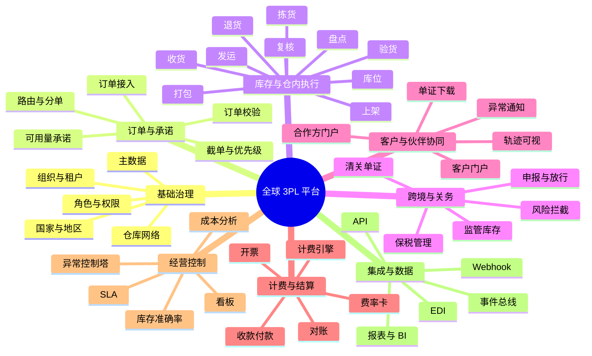

# 3PL 平台业务能力树

状态：草案  
日期：2026-06-17  
关联蓝图：`docs/superpowers/specs/2026-06-17-global-3pl-platform-blueprint-design.md`

## 1. 目标

这份文档把全球 3PL 平台需要具备的业务能力拆成一棵可执行的能力树，用来统一国内仓、海外仓、保税仓，以及跨境电商和一般贸易两条业务线。

这里强调的是“能力”，不是“功能列表”。能力树要回答三件事：

- 平台必须具备什么能力
- 每个能力依赖什么
- 哪些能力是核心底座，哪些是国家 / 仓型差异化配置

## 2. 总体能力树

## 3. 分层说明

### 3.1 基础治理

基础治理是所有其他能力的前提，主要负责“谁能看、谁能做、在哪个国家、哪个仓、哪个客户范围内做”。

子能力包括：

- 组织与租户管理
- 角色与权限
- 国家 / 地区配置
- 仓库网络管理
- 客户与合作方档案
- SKU / 包装 / 单位主数据

依赖关系：

- 订单、库存、计费、协同都依赖统一主数据
- 多租户隔离和权限控制必须先于对外门户

### 3.2 订单与承诺

订单与承诺层决定“能不能接、接到哪里、什么时候交、由哪个仓交”。

子能力包括：

- 订单接入
- 订单格式标准化
- 库存可承诺判断
- 路由与仓网分配
- 分单 / 合单
- 截单时间和优先级控制

依赖关系：

- 依赖客户主数据、仓库能力、库存快照
- 依赖国家 / 仓型规则来决定是否允许承诺

### 3.3 库存与仓内执行

这是 3PL 系统的作业底盘，决定仓库能否真实运转。

子能力包括：

- 收货
- 验货
- 上架
- 库位管理
- 调拨
- 拣货
- 复核
- 打包
- 发运
- 盘点
- 退货
- 增值服务

依赖关系：

- 依赖库存流水和任务引擎
- 依赖移动作业端和条码 / 扫码能力
- 依赖仓型配置决定是否启用批次、效期、序列号、托盘级管理

### 3.4 跨境与关务

这部分把保税仓、监管库存、单证、申报、放行和风险拦截统一起来。

子能力包括：

- 保税库存管理
- 进出区管理
- 清关单证生成
- 申报与放行状态跟踪
- 监管校验
- 风险拦截

依赖关系：

- 依赖商品主数据、订单信息、库存状态、单证中心
- 依赖国家 / 地区法规配置包

### 3.5 客户与伙伴协同

这部分决定平台是不是能被外部组织真正使用，而不只是内部后台。

子能力包括：

- 客户门户
- 合作方门户
- 订单状态可视化
- 库存可视化
- 异常通知
- 单证下载
- SLA 通知

依赖关系：

- 依赖权限隔离和组织边界
- 依赖事件驱动的状态回传

### 3.6 计费与结算

计费与结算负责把作业结果转成可收可付的经营结果。

子能力包括：

- 费率卡
- 计费规则
- 仓储费 / 操作费 / 运输费
- 赔付 / 罚扣
- 对账
- 开票
- 收款 / 付款

依赖关系：

- 依赖订单、任务、库存时间占用、异常事件
- 依赖合同和客户费率配置

### 3.7 经营控制

经营控制层回答“运营得怎么样”。

子能力包括：

- 全局看板
- SLA 监控
- 异常控制塔
- 成本分析
- 库存准确率
- 履约时效
- 仓库绩效

依赖关系：

- 依赖统一事件流和标准化指标口径
- 依赖跨仓、跨国、跨客户的可比数据

### 3.8 集成与数据

集成与数据层负责把平台接入外部世界。

子能力包括：

- API 接入
- EDI / 文件接入
- Webhook 回传
- 事件总线
- 主数据同步
- BI / 报表输出

依赖关系：

- 依赖统一的领域事件
- 依赖版本化接口和错误重试机制

## 4. 核心能力优先级

如果从“全球 3PL 平台”角度看，优先级应为：

1. 基础治理
2. 订单与承诺
3. 库存与仓内执行
4. 计费与结算
5. 客户与伙伴协同
6. 跨境与关务
7. 经营控制
8. 集成与数据

说明：

- 关务和协同非常重要，但它们建立在基础底座之上
- 如果库存和订单不统一，其他层都会碎片化

## 5. 能力边界

这棵树刻意不把以下内容单独拆成独立产品：

- 通用 ERP
- 单点 WMS
- 仅面向财务的计费软件
- 只给客户看的门户

原因是：这类系统要服务的是全球 3PL 经营，而不是某一个孤立职能。

