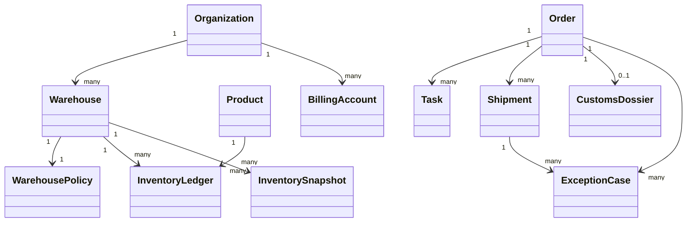

# 3PL 平台核心领域模型

状态：草案  
日期：2026-06-17  
关联蓝图：`docs/superpowers/specs/2026-06-17-global-3pl-platform-blueprint-design.md`

## 1. 目标

这份文档定义全球 3PL 平台的核心领域模型，用来统一数据语义、边界和对象关系。

重点不是表结构，而是领域边界：

- 哪些对象应该是主对象
- 哪些对象应该是派生对象
- 哪些对象必须保持不可混淆
- 哪些数据必须走流水账

## 2. 建模原则

### 2.1 库存以流水为准

库存不是“某一张当前库存表”决定的，而是由库存流水推导而来。快照只用于加速查询。

### 2.2 订单与履约分离

订单是业务请求，履约是执行结果。一个订单可以拆成多个仓、多个任务、多个发运单。

### 2.3 仓库是配置化实体

仓库本身是统一对象，但仓型、监管属性、国家规则、运营模式必须配置化。

### 2.4 计费独立于执行

作业层记录“发生了什么”，计费层记录“应该怎么算钱”。两者不能混成一层。

### 2.5 合规数据可审计

保税、清关、单证、放行等数据必须完整留痕，且可回溯到订单、SKU、库存和操作人。

## 3. 核心对象

### 3.1 Organization

组织实体，用于表示总部、区域公司、客户、合作方等租户或业务主体。

关键属性：

- `organization_id`
- `organization_type`
- `parent_organization_id`
- `status`
- `country_code`

### 3.2 Warehouse

仓库实体，表示一个物理仓或逻辑仓节点。

关键属性：

- `warehouse_id`
- `organization_id`
- `warehouse_type`，国内 / 海外 / 保税
- `operation_mode`，自营 / 合作方 / 客户驻场
- `country_code`
- `time_zone`
- `status`

### 3.3 WarehousePolicy

仓库配置实体，定义仓型规则、作业限制和国家差异。

关键属性：

- `warehouse_policy_id`
- `warehouse_id`
- `supports_batch`
- `supports_serial`
- `supports_expiry`
- `supports_pallet`
- `customs_profile_id`
- `service_calendar_id`

### 3.4 Product

商品主数据，支持 SKU、包装层级和监管属性。

关键属性：

- `product_id`
- `sku_code`
- `product_name`
- `brand`
- `package_levels`
- `hs_code`
- `dangerous_goods_flag`
- `battery_flag`

### 3.5 InventoryLedger

库存流水账，是库存事实来源。

关键属性：

- `ledger_id`
- `warehouse_id`
- `product_id`
- `lot_id`
- `serial_id`
- `inventory_event_type`
- `quantity_delta`
- `transaction_ref`
- `event_time`
- `operator_id`

### 3.6 InventorySnapshot

库存快照，是查询层对象。

关键属性：

- `snapshot_id`
- `warehouse_id`
- `product_id`
- `available_qty`
- `reserved_qty`
- `inbound_qty`
- `quarantine_qty`
- `bonded_qty`

### 3.7 Order

业务订单，可能来自客户、上游系统或平台内部任务。

关键属性：

- `order_id`
- `order_type`
- `customer_id`
- `source_system`
- `warehouse_id`
- `service_level`
- `order_status`

### 3.8 Shipment

发运单，表示一次实际出库、运输和交付动作。

关键属性：

- `shipment_id`
- `order_id`
- `carrier_id`
- `origin_warehouse_id`
- `destination_country_code`
- `shipment_status`
- `tracking_number`

### 3.9 Task

任务是仓内执行单位，表示一个明确的作业动作。

关键属性：

- `task_id`
- `task_type`
- `warehouse_id`
- `source_ref`
- `assigned_worker_id`
- `task_status`

### 3.10 CustomsDossier

关务与单证包，承载保税、清关、申报所需信息。

关键属性：

- `dossier_id`
- `order_id`
- `warehouse_id`
- `declaration_status`
- `release_status`
- `document_set`
- `audit_trail_id`

### 3.11 BillingAccount

计费主体，承载客户合同、费率、账单和对账结果。

关键属性：

- `billing_account_id`
- `customer_id`
- `currency_code`
- `tax_profile_id`
- `billing_cycle`

### 3.12 ExceptionCase

异常对象，用于统一处理缺货、破损、拒收、超时、申报失败等问题。

关键属性：

- `exception_id`
- `exception_type`
- `severity`
- `related_ref`
- `owner_role`
- `resolution_status`

## 4. 领域关系图

## 5. 聚合边界

### 5.1 组织聚合

负责组织、租户、上下级关系、权限范围。

### 5.2 仓库聚合

负责仓库主数据、仓型配置、服务能力和国家属性。

### 5.3 库存聚合

负责库存流水、库存快照、冻结、预留、可用量、监管库存。

### 5.4 订单聚合

负责订单生命周期、分单、状态、履约承诺和回传。

### 5.5 任务聚合

负责收货、上架、拣货、复核、发运、盘点等执行动作。

### 5.6 关务聚合

负责单证、申报、放行、合规审计。

### 5.7 计费聚合

负责费率、账单、对账、发票和争议处理。

## 6. 生命周期状态

### 6.1 Order 状态

- `draft`
- `confirmed`
- `allocated`
- `in_fulfillment`
- `shipped`
- `completed`
- `cancelled`
- `exception`

### 6.2 Shipment 状态

- `planned`
- `picked`
- `packed`
- `handed_over`
- `in_transit`
- `delivered`
- `failed`

### 6.3 Inventory 状态

- `available`
- `reserved`
- `inbound`
- `quarantine`
- `bonded`
- `damaged`
- `returned`

### 6.4 Task 状态

- `created`
- `assigned`
- `in_progress`
- `done`
- `cancelled`
- `exception`

## 7. 关键不变量

1. 一个库存数量必须能够追溯到对应流水。
2. 一个订单可以对应多个任务和多个发运单，但不能失去主引用。
3. 保税库存不能与普通可售库存混淆。
4. 合规放行前，受监管库存不能被越权出库。
5. 计费结果必须能追溯到订单、任务或库存占用事件。
6. 外部协同对象只能看到自己组织范围内的数据。

## 8. 领域事件

建议平台以事件驱动方式串联领域对象：

- `OrderCreated`
- `InventoryReceived`
- `InventoryPutawayCompleted`
- `ShipmentAllocated`
- `ShipmentDispatched`
- `CustomsDeclarationSubmitted`
- `CustomsReleaseApproved`
- `BillingItemGenerated`
- `InvoiceIssued`
- `ExceptionRaised`
- `ExceptionResolved`

领域事件的价值：

- 解耦仓库、关务、协同和财务
- 方便审计和回放
- 方便构建控制塔和看板

## 9. 模型边界

这套领域模型不建议把以下对象做成核心实体：

- 报表表
- 临时导入表
- 单次接口返回对象
- 页面专用 DTO

这些对象可以存在，但不应该污染核心领域。

