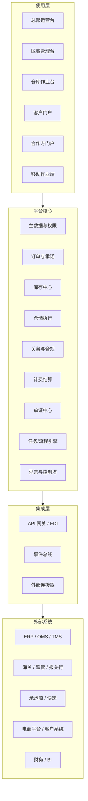

# 全球 3PL 平台蓝图

状态：草案  
日期：2026-06-17

## 1. 背景

这是一个面向中国 3PL 组织的目标态系统蓝图，不是单一功能设计，也不是只服务一个仓型的局部方案。

这家企业同时要运营：

- 国内仓
- 海外仓
- 保税仓

并且需要同时面向三类使用者：

- 内部运营团队
- 货主 / 客户
- 海外仓合作方 / 本地执行伙伴

业务范围同时覆盖：

- 跨境电商
- 一般贸易

目标市场是中国企业出海后的全球仓网扩张，重点区域包括：

- 东盟
- 日韩
- 澳大利亚
- 美国
- 欧盟
- 俄罗斯

因此，这个系统的本质不是“一个 WMS”，而是一个“全球 3PL 经营操作系统”。

## 2. 目标

这套平台的目标是把 3PL 的核心经营链路统一起来：

1. 统一仓网管理
2. 统一订单管理
3. 统一库存真相
4. 统一履约执行
5. 统一客户协同
6. 统一合规与单证
7. 统一计费与结算
8. 统一经营可视化

最终要做到的是：

- 一个平台，支持多国家
- 一套核心模型，支持多仓型
- 一套流程引擎，支持多业务线
- 一套数据底座，支持多角色协同

## 3. 关键判断

这类系统最容易做错的地方，是把“海外仓”“保税仓”“国内仓”当成三套系统分别做。

正确的蓝图应该是：

- 核心能力统一
- 差异能力配置化
- 国家规则本地化
- 运营流程可编排
- 合规要求可切换

也就是说，仓库类型不是代码分叉点，而是配置维度。

## 4. 设计原则

### 4.1 一个全球核心

订单、库存、履约、计费这些核心能力必须共享同一套主数据与流程逻辑，不能按国家拆成互不相通的孤岛。

### 4.2 仓型用配置表达

每个仓库都应该有自己的仓型配置，而不是靠不同系统区分。建议至少支持这些维度：

- 仓库类型：国内 / 海外 / 保税
- 运营模式：自营 / 合作方 / 客户驻场
- 服务对象：B2B / B2C / 混合
- 监管属性：普通监管 / 保税监管 / 特殊监管
- 国家或地区：用于本地规则、税务、语言、时区

### 4.3 库存真相必须统一

库存不能散落在多个表、多个仓、多个系统里。建议采用：

- 库存流水账作为事实来源
- 库存快照作为查询加速
- 库位、批次、序列号、效期按品类启用

### 4.4 流程要能编排

不同国家、不同仓型、不同客户的作业流程不会完全一致，所以流程必须是规则驱动、可配置、可审计的，而不是写死在代码里。

### 4.5 执行和结算分层

仓内作业和财务结算要解耦。执行层关注“发生了什么”，结算层关注“应该收多少钱、按什么规则收”。

### 4.6 对外协同是产品能力，不是附属功能

客户门户和合作方门户不是简单的报表页面，而是系统的一部分。订单协同、库存可视、异常通知、单证下载、对账确认都必须产品化。

## 5. 业务对象

这套系统的基础对象建议统一为以下几类：

| 对象 | 作用 |
|---|---|
| 组织 / 租户 | 区分总部、区域公司、客户、合作方 |
| 仓库 | 表示一个物理或逻辑运营节点 |
| 仓库配置 | 表示仓型、运营模式、监管属性、国家规则 |
| 客户 | 货主、品牌方、电商卖家、贸易公司 |
| SKU / 物料 | 商品主数据，支持包装层级 |
| 库存流水 | 记录每一次库存变化 |
| 库存快照 | 提供高性能查询视图 |
| 订单 | 业务请求来源，可来自客户或上游系统 |
| 任务 | 仓内执行动作，如收货、上架、拣货、复核 |
| 发运单 / Shipment | 实际出库与运输交付单元 |
| 单证 | 发票、装箱单、标签、报关资料等 |
| 关务单据 | 保税、清关、申报、放行相关记录 |
| 计费规则 | 服务费、仓储费、操作费、附加费规则 |
| 对账单 / 发票 | 面向客户或合作方的结算结果 |
| 异常 | 缺货、超时、拒收、报关失败、破损等 |

## 6. 用户与角色

| 角色 | 主要诉求 |
|---|---|
| 总部运营 | 看全局仓网、订单、库存、成本、SLA |
| 区域负责人 | 管理国家/区域差异、伙伴和本地交付 |
| 仓库经理 | 看现场作业效率、异常、人员与库位 |
| 仓库作业员 | 扫描、上架、拣货、复核、发运 |
| 合规 / 关务 | 看单证、监管要求、放行状态、风险提醒 |
| 财务 | 看计费、对账、应收应付、成本回收 |
| 客户经理 / CS | 看客户订单、库存、异常、服务承诺 |
| 客户 / 货主 | 下单、查库存、看轨迹、下载单证、对账 |
| 海外合作方 | 接单、收货、作业、回传状态、对账 |

## 7. 能力地图

### 7.1 基础层

- 组织与租户管理
- 角色与权限
- 主数据管理
- 国家 / 地区配置
- 仓库网络管理
- 语言、时区、币种、单位配置

### 7.2 订单与承诺层

- 订单接入
- 订单校验
- 可用量承诺
- 分单 / 合单
- 仓网路由与分配
- 优先级与截单策略

### 7.3 库存与仓内执行层

- 收货
- 验货
- 上架
- 库位管理
- 调拨
- 拣货
- 复核
- 打包
- 发运
- 盘点
- 退货
- 增值服务

### 7.4 跨境与关务层

- 保税逻辑
- 清关单证
- 申报与放行状态
- 监管库存
- 进出区管理
- 合规校验
- 风险拦截

### 7.5 协同层

- 客户门户
- 合作方门户
- 异常通知
- 单证下载
- 轨迹可视
- SLA 通知

### 7.6 计费与结算层

- 费率卡
- 仓储计费
- 操作计费
- 运输计费
- 赔付 / 罚扣
- 对账
- 开票 / 收款 / 付款

### 7.7 经营控制层

- 实时看板
- SLA 监控
- 异常控制塔
- 成本分析
- 库存准确率
- 履约时效

### 7.8 集成层

- ERP / OMS / TMS / 外部仓储系统接口
- 海关 / 监管 / 报关行接口
- 承运商接口
- 电商平台接口
- 文件 / EDI / API / Webhook

## 8. 目标架构

建议采用“全球核心 + 区域配置 + 事件驱动”的结构。

### 8.1 使用层

不同角色看到不同工作台：

- 总部关注全局经营
- 区域关注本地执行与伙伴
- 仓库关注现场作业
- 客户关注订单、库存、轨迹、单证
- 合作方关注任务、回传、对账
- 移动作业端负责扫描和现场执行

### 8.2 平台核心

核心不是单一大系统，而是几个边界清晰的域：

- 主数据与权限
- 订单与承诺
- 库存中心
- 仓储执行
- 关务与合规
- 计费结算
- 单证中心
- 任务 / 流程引擎
- 异常与控制塔

### 8.3 集成层

所有外部系统都通过集成层进入平台，避免业务逻辑直接写死在接口里。这样后续替换报关行、承运商、客户系统或外部仓储系统时，影响可控。

## 9. 核心流程

### 9.1 客户接入

1. 建立客户档案、合同、费率、权限
2. 绑定可操作仓库和服务国家
3. 配置 SKU、包装、单证要求和异常规则
4. 开通门户或 API

### 9.2 入库

1. 上游发送 ASN / 预报
2. 仓库收货、验货、记录差异
3. 系统生成上架任务
4. 完成入库后同步库存和可视化状态

### 9.3 出库

1. 接收订单
2. 校验库存、截单、优先级和路由
3. 生成拣货 / 复核 / 打包 / 发运任务
4. 回传轨迹和出库结果

### 9.4 跨仓转运

1. 发起调拨单
2. 记录起运仓和目的仓
3. 中间运输过程持续回传状态
4. 到仓后完成接收和库存过账

### 9.5 保税 / 关务

1. 订单进入监管流
2. 单证与商品信息完成前置校验
3. 触发申报、放行、入区、出区等状态
4. 系统保留完整审计链

### 9.6 退货

1. 识别退货来源和原因
2. 入退货检验
3. 匹配可再售 / 返修 / 报废规则
4. 回写库存和财务处理

### 9.7 对账结算

1. 按订单、任务、仓储天数、附加服务、运费生成计费项
2. 合并成账单
3. 支持客户确认、争议、调整和开票
4. 形成收支闭环

## 10. 区域适配策略

这套平台不能靠“为每个国家重新开发”来扩张，应该采用“共性核心 + 区域配置包”。

| 区域 | 主要差异 | 系统要求 |
|---|---|---|
| 东盟 | 国家差异较大，流程多样 | 多语言、多税制、多仓协同 |
| 日韩 | 时效和精细化要求高 | 高精度库存、批次 / 序列追踪、严格 SLA |
| 澳大利亚 | 进口与合规要求细 | 单证门禁、申报前校验、合规提醒 |
| 美国 | 规模大、承运商多 | 多承运商、多节点、高并发履约 |
| 欧盟 | 多国协同、税务复杂 | 多币种、多语言、税务和单证模板化 |
| 俄罗斯 | 风险变化快 | 合规筛查、审计留痕、策略可快速更新 |

> 注：各国具体监管细则需要由当地法务 / 合规团队维护，系统只提供可配置能力和审计能力，不固化单一国家规则。

## 11. 非功能要求

### 11.1 可用性

- 核心作业系统必须满足高可用要求
- 仓库现场动作不能依赖单点服务
- 关键任务应支持降级和重试

### 11.2 性能

- 仓库作业动作要接近实时
- 扫描、上架、拣货、发运反馈不能有明显卡顿
- 查询类能力可使用快照和缓存加速

### 11.3 安全

- 角色权限控制
- 多租户数据隔离
- 审计日志
- 关键操作留痕
- 支持 SSO / MFA

### 11.4 数据治理

- 主数据统一管理
- 库存流水可追溯
- 财务口径与作业口径分离
- 报表口径标准化

### 11.5 本地化

- 多语言
- 多币种
- 多时区
- 多单位制
- 本地文档模板

## 12. 成功指标

这类系统的成功，不是功能数量，而是经营指标改善。建议重点看：

- 库存准确率
- 订单履约及时率
- 仓内作业时效
- 客户可视化覆盖率
- 异常关闭时长
- 单证错误率
- 计费准确率
- 对账周期
- 海外仓复制速度

### 12.1 验证方式

这份蓝图落地前，建议用下面几类场景做验证，而不是只做静态评审：

- 新国家仓复制演练
- 国内仓 / 海外仓 / 保税仓切换演练
- 客户下单到出库的全链路回放
- 关务单证缺失和异常拦截演练
- 退货、短少、破损、拒收等异常演练
- 跨币种、跨税率、跨合作方对账演练

## 13. 边界与约束

这份蓝图明确不把以下内容当成主线：

- 不把系统拆成多个国家版产品
- 不把仓库类型做成三套孤立系统
- 不把财务和仓内执行混成一层
- 不把合规规则硬编码为不可变逻辑
- 不把客户协同做成纯展示页面
- 不把自己做成通用 ERP

## 14. 结论

这套系统最合理的目标态，是一个“全球 3PL 仓配中台”：

- 上承总部经营
- 中连区域与仓网
- 下接仓库现场、客户与合作方
- 左右覆盖跨境电商与一般贸易
- 横向适配不同国家的规则差异

如果后续继续推进，下一份材料应该不是功能列表，而是：

1. 业务能力树
2. 核心领域模型
3. 角色权限矩阵
4. 主流程泳道图
5. 国家 / 仓型配置清单
