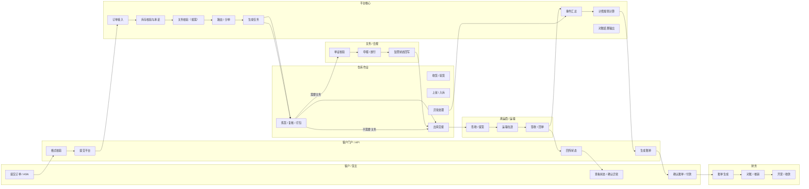

# 3PL 平台主流程泳道图

状态：草案（**试点范围已更新为 V2**，见 [泓湖 3PL 试点主干流程](./2026-06-20-3pl-core-flow-v2.md)）  
日期：2026-06-17  
关联蓝图：`docs/superpowers/specs/2026-06-17-global-3pl-platform-blueprint-design.md`

## 1. 目标

这份文档描述全球 3PL 平台的主流程泳道，重点是“订单到履约到结算”的主链路。

主流程覆盖：

- 客户下单
- 系统承诺
- 仓库执行
- 按需关务
- 承运交接
- 状态回传
- 对账结算

它是平台最核心的运营闭环。

## 2. 主流程泳道图

## 3. 泳道说明

### 3.1 客户 / 货主

客户发起订单、查看状态、确认异常、确认账单。客户不直接参与仓内执行，但会影响订单优先级、发货约束和结算确认。

### 3.2 客户门户 / API

门户和 API 负责接入、格式校验、状态回传和账单呈现。这里是客户与平台之间的标准化接口层。

### 3.3 平台核心

平台核心负责校验库存、承诺、路由、分单、任务生成、事件汇总和计费计算。它是所有角色之间的中枢。

### 3.4 仓库作业

仓库负责实际收货、上架、拣货、复核、打包和出库交接，同时处理现场异常。

### 3.5 承运商 / 运输

承运商负责提货、运输和签收回单，并持续回传在途状态。

### 3.6 关务 / 合规

保税或跨境场景下，关务层对单证、申报和放行进行控制，并把监管状态回写给平台。

### 3.7 财务

财务层根据作业和履约结果生成账单、完成对账核销，并进入开票和收款流程。

## 4. 关键变体流程

### 4.1 入库流程

适用于海外仓补货、国内仓入仓、保税入区。

主链路：

1. 预报 / ASN
2. 到仓收货
3. 验货
4. 上架
5. 入库完成

### 4.2 出库流程

适用于电商订单、批发出库、调拨出库。

主链路：

1. 接单
2. 库存承诺
3. 拣货
4. 复核
5. 打包
6. 发运

### 4.3 退货流程

适用于拒收、退件、售后退货。

主链路：

1. 创建退货
2. 到仓接收
3. 质检
4. 判定可再售 / 报废 / 返修
5. 库存和财务回写

### 4.4 保税 / 关务流程

适用于保税仓和受监管货物。

主链路：

1. 单证准备
2. 合规校验
3. 申报
4. 放行
5. 监管状态回写

## 5. 控制点

主流程里必须嵌入以下控制点：

- 库存承诺前校验
- 单证前置校验
- 出库前复核
- 异常即时回传
- 财务依据作业结果自动计费

这些控制点决定平台能否真正形成闭环，而不是只做“流程展示”。
