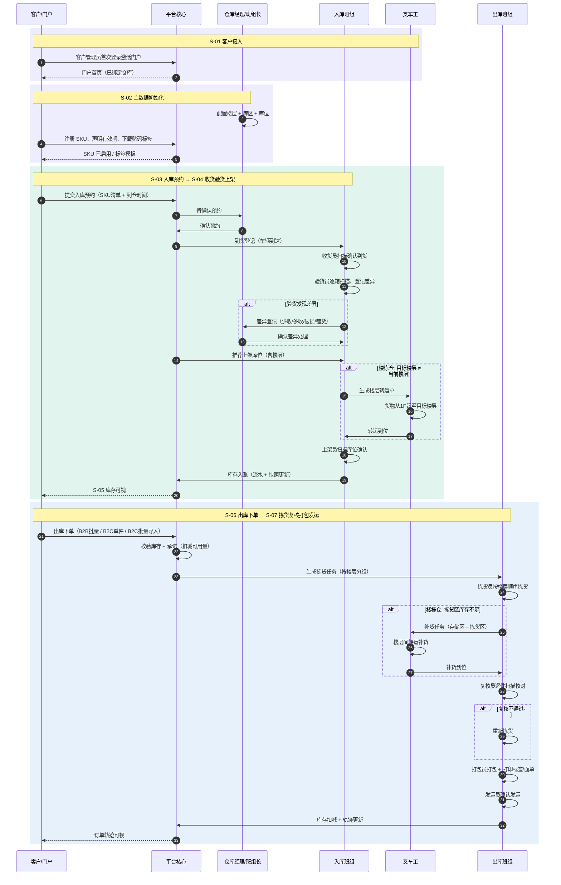

# 泓湖 3PL 试点主干流程

状态：草案  
版本：V0.2  
日期：2026-06-20  
作者：Martin  
关联：试点范围 ([hh-pilot-scope](./2026-06-20-hh-pilot-scope.md))、场景需求 S-01 ~ S-07

## 1. 文档定位

本文档是试点范围（国内仓，B2B+B2C 混合）的主干流程泳道图，替代 06-17 版全球蓝图泳道（含关务/财务/合作方等本期不涉及的泳道）。

覆盖 5 条泳道、S-01 到 S-07 七个场景的端到端链路，兼容平层仓和楼栋仓。

## 2. 泳道图



## 3. 泳道说明

### 3.1 客户 / 门户

| 角色 | 本期操作 | 终端 |
|---|---|---|
| 客户管理员 | 首次登录激活、SKU 注册与贴码管理、提交入库预约、创建出库订单、查看库存和订单轨迹 | 门户 |
| 客户操作员 | 入库预约、出库下单、查库存 | 门户 |

消费者（货主的 C 端客户）不直接使用 3PL 平台，退货时通过货主间接关联。

### 3.2 平台核心

| 系统动作 | 关联场景 |
|---|---|
| 客户档案与权限 | S-01 |
| SKU 注册校验、贴码规则判断 | S-02 |
| 入库订单状态管理（待确认→已确认→已到货） | S-03 |
| 库存流水记录 + 快照更新 | S-04 / S-07 |
| 库存可用量查询 | S-05 |
| 订单校验 + 库存承诺 + 任务生成 | S-06 |

### 3.3 仓库经理 / 班组长

| 角色 | 本期操作 | 终端 |
|---|---|---|
| 仓库经理 | 仓库类型选择（平层/楼栋）、楼层与库区配置、库位管理、查看作业进度 | Web |
| 总部运营 | 库区类型模板定义、客户服务规则配置、全局数据查看 | Web |
| 班组长（入库） | 确认预约、分派收货/验货/上架单、审批差异 | Handheld + Web |
| 班组长（出库） | 分派拣货/复核/打包/发运任务、查看完成进度 | Handheld + Web |

### 3.4 入库班组

| 角色 | 本期操作 | Handheld 可见 | 不可见 |
|---|---|---|---|
| 收货员 | 扫描入库订单号、清点到货 | 到货登记页 | 拣货/打包 |
| 验货员 | 逐箱扫描、差异登记、拍照 | 验货清单、差异登记 | 拣货/库位 |
| 上架员 | 扫描 SKU、确认库位 | 待上架清单、推荐库位 | 订单/复核 |

### 3.5 叉车工

| 场景 | 本期操作 |
|---|---|
| 楼栋仓：楼层转运 | 货物在 1F 收货区 → 目标库位在 7F 存储区，叉车工从 Handheld 领取转运任务，运至目标楼层后扫描确认到位 |
| 楼栋仓：补货 | 拣货区（3F）库存不足，从存储区（6F）补货至拣货区 |
| 平层仓 | 无楼层转运单，仅执行大件/整托搬运 |

### 3.6 出库班组

| 角色 | 本期操作 | Handheld 可见 | 不可见 |
|---|---|---|---|
| 拣货员 | 按楼层分组拣货、扫描库位+SKU、输入拣货数量 | 拣货任务（按楼层分组） | 收货/打包 |
| 复核员 | 逐件扫描核对、确认差异 | 复核任务（应发+实拣） | 库位/收货 |
| 打包员 | 打包确认、打印标签/面单 | 打包清单、标签打印 | 拣货/库位 |
| 发运员 | 扫描订单、确认发运 | 待发运列表 | 拣货/复核 |

## 4. 关键决策节点

### 4.1 贴码判断（S-02 → S-03）

```
SKU 有条码？
  ├── 是 → 条码已被其他客户使用？
  │         ├── 是 → 系统生成内部码 + 标签模板，客户必须贴码
  │         └── 否 → 无需贴码，收货扫商品自带条码
  └── 否 → 系统生成内部码 + 标签模板，客户必须贴码
```

### 4.2 楼层转运判断（S-04 上架时）

```
当前楼层 == 目标库位楼层？
  ├── 是 → 直接上架（平层仓100%走此分支）
  └── 否 → 生成楼层转运单 → 叉车工执行 → 上架员在目标楼层确认
```

### 4.3 补货判断（S-07 拣货时）

```
拣货区库存 >= 需求数量？
  ├── 是 → 直接拣货
  └── 否 → 查找存储区库存 → 生成补货任务 → 叉车工跨层转运 → 拣货继续
```

## 5. 楼栋仓 vs 平层仓适配

| 差异点 | 平层仓 | 楼栋仓 |
|---|---|---|
| S-02 仓库配置 | 默认 1 层，不显示楼层配置入口 | 仓库经理填写层数、逐层配置库区 |
| 库位编码 | A-01-01 | 4F-A-01-01 |
| S-04 上架 | 不收楼层转运节点 | 收楼层转运节点（叉车工介入） |
| S-07 拣货 | 按库位顺序展示 | 按楼层分组展示 |
| S-07 补货 | 不涉及 | 存储区→拣货区跨层补货 |
| S-05 库存查询 | 按库区筛选 | 增加楼层筛选维度 |

## 6. B2B vs B2C 差异

| 差异点 | B2B | B2C |
|---|---|---|
| S-06 下单 | 多行项批量下单 + 模板导入 | 单件快速下单 + 批量导入 C 端订单 |
| S-06 收货信息 | 收货方（公司） | 收件人（个人消费者） |
| S-07 拣货 | 行项多，需按楼层分组 | 行项少（1-2行），流程更短 |
| S-07 打包 | 整箱/整托 + 出库标签 | 快递包裹 + 面单 + 装箱单 |
| 效期管理 | 必填（S-02 注册时声明） | 必填（S-02 注册时声明） |

## 7. 本期不涉及的泳道

| 泳道 | 原因 |
|---|---|
| 关务/合规 | 国内仓无清关场景 |
| 财务/计费 | 决策暂不纳入第一期 |
| 海外合作方 | 国内仓无合作方 |
| 退货（S-08） | P1，正向链路优先 |
| 经营看板（S-12） | P1，等指标集稳定 |
