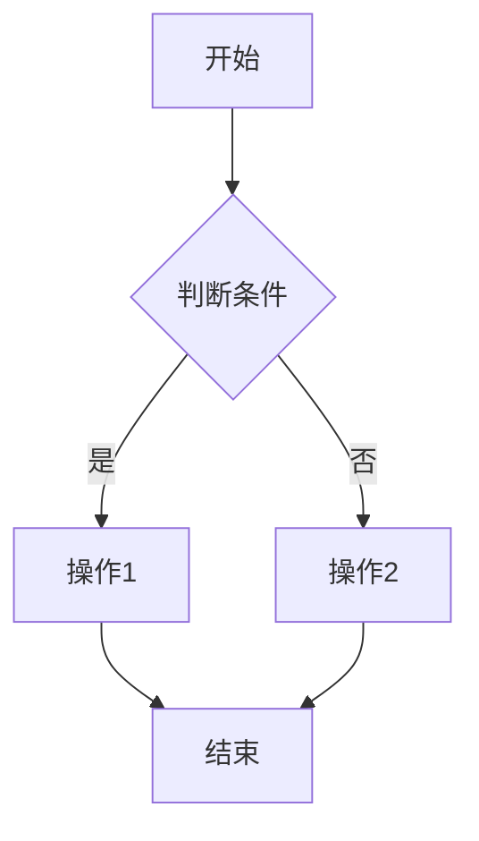

# 流程设计文档

本目录存放泓湖3PL平台各端侧的系统流程设计文档，包含详细的业务流程图（Mermaid格式）。

## 📖 建议阅读顺序

1. [Web管理后台-订单处理流程](./flow-01-web-order-processing.md)
2. [PDA移动作业-拣货流程](./flow-02-pda-picking.md)
3. [客户门户-自助下单流程](./flow-03-portal-order.md)
4. [开放平台API-订单同步流程](./flow-04-api-order-sync.md)
5. [数据看板-BI分析流程](./flow-05-bi-dashboard.md)
6. [退货处理-RMA管理流程](./flow-06-return-rmma.md)

---

## 📋 文档列表

| 流程编号 | 文档 | 简介 |
|---------|------|------|
| flow-01 | [Web管理后台-订单处理](./flow-01-web-order-processing.md) | 订单处理全流程 |
| flow-02 | [PDA移动作业-拣货](./flow-02-pda-picking.md) | 拣货作业流程（V2多人协同模型） |
| flow-03 | [客户门户-自助下单](./flow-03-portal-order.md) | 客户自助下单流程 |
| flow-04 | [开放平台API-订单同步](./flow-04-api-order-sync.md) | API订单同步流程 |
| flow-05 | [数据看板-BI分析](./flow-05-bi-dashboard.md) | 数据流与展示流程 |
| flow-06 | [退货处理-RMA管理](./flow-06-return-rmma.md) | RMA全生命周期流程 |

---

## 📌 文档定位

流程设计文档描述系统各端侧的具体操作流程，包括：

- **操作流程**: 用户或系统如何完成某个业务操作
- **界面流转**: 页面之间的跳转关系
- **数据流转**: 数据如何在不同模块间流转
- **异常处理**: 异常情况如何处理

这些文档是研发实现和测试编写测试用例的重要依据。

---

## 🎯 使用指南

**不同角色如何使用这些文档：**

- **产品经理**: 验证流程设计是否符合需求
- **架构师**: 评估流程的技术可行性
- **研发**: 作为开发依据，实现具体功能
- **测试**: 作为编写测试用例的依据
- **实施**: 了解系统操作流程，编写用户手册

---

## 📝 文档规范

流程设计文档建议包含以下内容：

1. **流程概述**: 简要描述本流程
2. **参与角色**: 哪些角色会参与这个流程
3. **流程图**: 使用Mermaid语法绘制流程图
4. **流程步骤**: 详细的步骤说明
5. **业务规则**: 流程中的业务规则
6. **异常处理**: 异常情况的处理方式
7. **数据要求**: 流程涉及的数据对象

### Mermaid 流程图示例

---

## 📝 维护规则

1. **新增流程**: 新增流程文档时，请更新本文档的"文档列表"
2. **文档更新**: 流程变更时，请及时更新对应文档
3. **命名规范**: 请遵循 `flow-<NN>-<流程名称>.md` 的命名规范
4. **流程图**: 优先使用Mermaid语法绘制流程图，便于在Markdown中直接展示

---

**回到 [项目主页](../README.md)**
