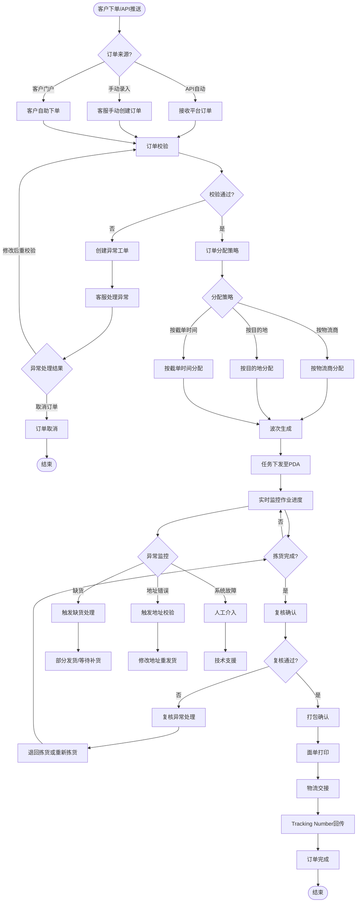

# Web管理后台 - 订单处理全流程

## 流程图

## 流程说明

### 1. 订单接入（3条路径）
- **API自动**：从电商平台自动拉取订单
- **手动录入**：客服后台手动创建
- **客户门户**：客户在Portal自助下单

### 2. 订单校验（关键节点）
校验内容：
- ✅ 地址有效性（格式、邮编、国家）
- ✅ SKU匹配（平台SKU vs 本地SKU）
- ✅ 库存预占（避免超卖）
- ✅ 合规检查（产品认证、禁运品）

异常处理：
- 创建异常工单 → 客服处理 → 修改后重校验 或 取消订单

### 3. 订单分配策略
- **按物流商**：小件用USPS，大件用FedEx
- **按目的地**：加州订单优先从加州仓发货
- **按截单时间**：当天17:00前订单当天发

### 4. 波次生成与任务下发
- 按分配策略生成波次
- 任务下发至PDA移动作业端
- 实时监控作业进度

### 5. 作业闭环
拣货 → 复核 → 打包 → 面单打印 → 物流交接 → Tracking回传 → 订单完成

### 6. 异常监控
- **缺货**：部分发货 或 等待补货
- **地址错误**：修改地址后重发货
- **系统故障**：人工介入 + 技术支援

## 关键业务规则

| 规则类型 | 规则内容 | 系统实现 |
|---|---|---|
| **库存预占** | 订单校验通过后立即预占库存 | Redis原子操作，避免超卖 |
| **波次策略** | 每30分钟生成一个波次 | 定时任务 + 订单池 |
| **截单时间** | 当天17:00前订单当天发 | 系统时间判断 + 物流商截单时间 |
| **异常处理SLA** | 异常订单2小时内处理 | 异常工单 + 超时提醒 |

## 配套的页面清单

| 页面名称 | 功能 | 用户角色 |
|---|---|---|
| 订单列表页 | 查看所有订单状态 | 客服、仓库经理 |
| 订单详情页 | 查看订单明细、处理异常 | 客服 |
| 波次管理页 | 查看波次、手动调整 | 仓库经理 |
| 异常工单页 | 处理异常订单 | 客服 |
| 订单跟踪页 | 实时查看订单状态 | 客服、客户 |

## 配套的API接口

| 接口名称 | 接口路径 | 调用方向 |
|---|---|---|
| 接收订单 | `POST /api/v1/orders` | 外部 → 系统 |
| 获取订单状态 | `GET /api/v1/orders/{id}` | 外部 ← 系统 |
| 回传Tracking | `POST /api/v1/orders/{id}/tracking` | 外部 ← 系统 |
| 订单异常通知 | Webhook | 系统 → 外部 |
