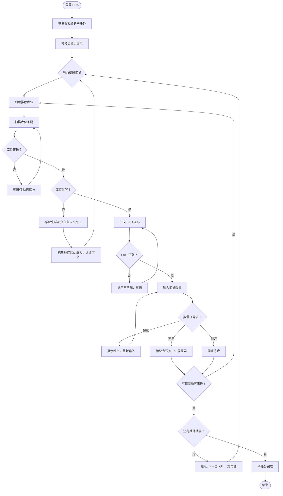

# PDA移动作业端 - 拣货作业流程（V2）

文档类型：端侧流程  
版本：V0.2  
日期：2026-06-20  
作者：Martin  
关联：S-07 拣货复核打包发运 ([2026-06-20-3pl-s07-picking-shipping](./2026-06-20-3pl-s07-picking-shipping.md))、主干流程 V2

## 1. 文档定位

本文档描述 PDA（Handheld）端的拣货作业流程，对齐 S-07 场景需求。覆盖多人协同、楼栋仓楼层分组、拣货区补货衔接三个关键场景。旧版单人不协同模型已废弃。

## 2. 角色与终端

| 角色 | Handheld 可见内容 | 不可见内容 |
|---|---|---|
| 拣货员 | 拣货任务（按楼层分组）、库位导航、SKU 扫描、数量录入 | 复核、打包、收货 |
| 班组长（出库） | 组员任务分派、完成进度总览、组内任务重新分配 | 收货/验货班组任务 |
| 叉车工 | 楼层转运单、补货任务 | 拣货、复核 |
| 复核员 | 复核任务（逐件扫描）、差异确认 | 拣货、库位 |
| 打包员 | 打包清单、标签/面单打印 | 拣货、复核 |
| 发运员 | 待发运列表、发运确认 | 拣货、打包 |

## 3. 多人协同拣货模型

### 3.1 任务拆分

订单承诺（S-06）后，系统生成拣货任务。一个订单（尤其是 B2B 大单）可能涉及多个楼层和数十个 SKU，单人不现实。

```
订单 → 拣货任务
         │
         班组长在 Web 端拆分
         │
         ├── 子任务 A（3F 拣货区 SKU-001×5, SKU-002×3）
         │        └── 分配给 拣货员-张三
         │
         ├── 子任务 B（6F 存储区 SKU-003×10, SKU-004×2）
         │        └── 分配给 拣货员-李四
         │
         └── 子任务 C（补充：如果拣货区缺货）
                  └── 生成补货任务 → 叉车工
```

**拆分规则（本期）：**

| 维度 | 规则 |
|---|---|
| 按楼层 | 不同楼层的 SKU 分到不同子任务（电梯是天然分界线） |
| 按库区 | 同一楼层内不同库区可分可不分（班组长判断） |
| 按 SKU 数量 | 单个子任务 SKU 数量 ≤ 20 行（本期默认上限） |

### 3.2 汇合节点

所有子任务完成后，系统检查该订单是否全部拣完：

```
子任务 A (张三) ✅ 完成
子任务 B (李四) ✅ 完成
         │
         ▼
    系统校验：所有子任务 = 完成？
         │
    是 → 订单状态变更为"待复核" → 复核员可领取
    否 → 等待剩余子任务
```

### 3.3 库位锁定（防冲突）

当两个拣货员被分配到同一库位的同一 SKU 时：

| 时机 | 动作 |
|---|---|
| A 先到达该库位 | A 开始拣该 SKU → 系统锁定该库位+SKU → B 到达时看到"正在拣货中，请稍候" |
| A 拣完确认 | 该库位+SKU 释放 → B 可继续 |
| A 拣货数量不足以覆盖 B 的需求 | B 看到剩下的可用量，或触发补货 |

**本期处理：**
- 库位锁定粒度 = 库位 + SKU（不是整库位锁）
- 锁定时长上限 = 5 分钟（超时自动释放，防止遗忘）
- 如果释放后库存不足，触发补货流程

## 4. 拣货员 Handheld 流程



### 4.1 楼层分组展示（Handheld 主界面）

```
═══════════════════════════════
订单 O-20260620-0042
子任务 PICK-3F-01（3F 拣货区）
═══════════════════════════════
☐ 3F-A-01-01  SKU-001  无线耳机     x5
☐ 3F-A-02-03  SKU-002  充电线       x3
  进度：0/8 件
───────────────────────────────
子任务 PICK-6F-02（6F 存储区）
☑ 6F-C-05-02  SKU-003  包装盒      x10  ✓
☐ 6F-D-01-01  SKU-004  说明书      x2
  进度：10/12 件
═══════════════════════════════
```

**设计要点：**
- 当前子任务排最上面
- 已完成的灰掉 + ✓
- 当前楼层拣完后，系统弹出"下一层：6F —— 请乘电梯至 6F 继续"
- 如果拣货员只有一个楼层的子任务，不显示楼层切换提示

### 4.2 补货衔接

当拣货区（如 3F）库存不足以覆盖需求时：

```
拣货员扫描 SKU → 系统检测 3F 库存不足
  │
  ├── 系统自动查找 4-9F 存储区是否有余量
  │     │
  │     ├── 有 → 生成补货任务 → 推送到叉车工 Handheld
  │     │       ┌──────────────────────────┐
  │     │       │ 补货任务 REP-0042        │
  │     │       │ 从: 6F-C-05-02           │
  │     │       │ 至: 3F-拣货区-A区        │
  │     │       │ SKU-003  包装盒  x10     │
  │     │       │ 优先级: 高               │
  │     │       └──────────────────────────┘
  │     │
  │     ├── 拣货员 Handheld: "库存不足，已触发补货，请先拣其他 SKU"
  │     ├── 叉车工: 领取 → 6F取货 → 电梯 → 3F放货 → 扫描确认
  │     └── 拣货员 Handheld: 收到通知 "SKU-003 补货到位，可继续拣货"
  │
  └── 无 → 标记为短拣，生成差异记录，继续下一个 SKU
```

### 4.3 防错校验

| 校验点 | 动作 |
|---|---|
| 扫库位 → 库位无目标 SKU | 提示"库位不匹配"，展示正确库位 |
| 扫 SKU → SKU 不在当前子任务中 | 提示"SKU 不匹配" |
| 拣货数量 > 需求数量 | 提示"超出需求"，不允许确认 |
| 拣货数量 < 需求数量（部分拣） | 允许提交，标记"短拣"，生成差异记录 |
| 库位被他人锁定 | 提示"SKU 正在被 XX 拣货中，请稍候（剩余 X 分钟自动释放）" |

## 5. 班组长 Handheld + Web 视图

| 视图 | 内容 | 终端 |
|---|---|---|
| 任务分派 | 查看所有待分配拣货任务 → 选择拆分方式 → 指派给组员 | Web |
| 组员进度 | 每个组员的已拣/待拣件数、完成百分比 | Handheld + Web |
| 任务转移 | 某组员中途离岗 → 将其未完成的子任务转移给其他人 | Web |
| 补货状态 | 查看当前所有挂起等待补货的 SKU，确认叉车工是否已接单 | Handheld + Web |

## 6. 异常处理

| 异常类型 | 处理方式 | 角色 |
|---|---|---|
| 拣货区缺货（存储区有余） | 触发补货 → 叉车工转运 → 拣货员恢复 | 拣货员 + 叉车工 |
| 全仓缺货（库存不足） | 标记短拣 → 差异记录 → 班组长确认 | 拣货员 → 班组长 |
| SKU 条码不可读 | 手动输入 SKU 编码（系统记录"手工录入"标记） | 拣货员 |
| 商品破损 | 拍照 → 标记破损 → 班组长判断是否补拣 | 拣货员 → 班组长 |
| 库位被锁定超时 | 系统自动释放 → 通知拣货员可继续 | 系统自动 |

## 7. 本期不做

| 项目 | 原因 |
|---|---|
| 波次合并拣货 | 第一期逐单拣 |
| 自动派单（不经过班组长） | 保留人工分派灵活性 |
| 库内路径最短算法（Dijkstra） | 楼栋仓按楼层分组后，每层内走固定顺序即可，算法优化第二期 |
| 称重复核 | 仅做逐件扫描 |
| 语音拣货 | 第二期 |
| API 定义 | 先定单据结构，再定 API |
