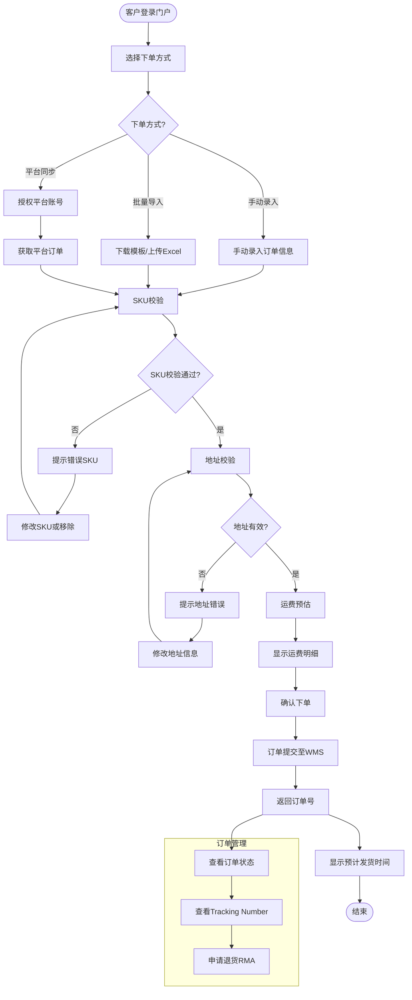

# 客户门户Web端 - 自助下单流程

## 流程图

## 流程说明

### 1. 下单方式（3种路径）
- **手动录入**：客户手动输入订单信息（SKU、数量、地址）
- **批量导入**：下载模板，填写后上传Excel
- **平台同步**：授权平台账号（如亚马逊、Shopify），自动同步订单

### 2. SKU校验（关键节点）
校验内容：
- ✅ SKU是否存在
- ✅ SKU是否合规（认证、标签）
- ✅ SKU是否有库存

异常处理：
- 提示错误SKU → 修改或移除 → 重新校验

### 3. 地址校验（关键节点）
校验内容：
- ✅ 地址格式（如美国Zip Code格式）
- ✅ 地址有效性（是否在配送范围内）
- ✅ 特殊地址要求（如偏远地区附加费）

异常处理：
- 提示地址错误 → 修改地址 → 重新校验

### 4. 运费预估
- **实时计算**：根据重量、目的地、物流商计算运费
- **运费明细**：显示各物流商价格对比
- **客户选择**：客户可选择物流商

### 5. 订单提交
- 订单提交至WMS系统
- 返回订单号
- 显示预计发货时间

### 6. 订单管理（后续操作）
- **查看订单状态**：待处理、已发货、已完成
- **查看Tracking Number**：点击查看物流跟踪
- **申请退货RMA**：发起退货申请

## 关键业务规则

| 规则类型 | 规则内容 | 系统实现 |
|---|---|---|
| **SKU校验** | 下单时实时校验SKU是否存在、是否有库存 | 实时查询库存数据库 |
| **地址校验** | 调用地址校验API（如Google Maps API） | 第三方API集成 |
| **运费预估** | 根据重量、目的地、物流商实时计算 | 物流商API对接 |
| **订单限额** | 单笔订单最多100个SKU | 前端校验 + 后端校验 |

## 配套的页面清单

| 页面名称 | 功能 | 用户角色 |
|---|---|---|
| 订单创建页 | 手动录入订单、批量导入、平台同步 | 客户管理员、操作员 |
| SKU选择页 | 选择SKU、查看库存 | 客户管理员、操作员 |
| 地址填写页 | 填写收货地址、地址校验 | 客户管理员、操作员 |
| 运费预估页 | 显示运费明细、选择物流商 | 客户管理员、操作员 |
| 订单确认页 | 确认订单信息、提交订单 | 客户管理员、操作员 |
| 订单列表页 | 查看订单状态、Tracking Number | 客户管理员、操作员 |
| 退货申请页 | 提交退货申请、查看退货进度 | 客户管理员、操作员 |

## 配套的API接口

| 接口名称 | 接口路径 | 调用方向 |
|---|---|---|
| 校验SKU | `POST /api/v1/portal/orders/validate-sku` | 门户 → 系统 |
| 校验地址 | `POST /api/v1/portal/orders/validate-address` | 门户 → 系统 |
| 预估运费 | `POST /api/v1/portal/orders/estimate-shipping` | 门户 → 系统 |
| 提交订单 | `POST /api/v1/portal/orders` | 门户 → 系统 |
| 查询订单状态 | `GET /api/v1/portal/orders/{id}` | 门户 ← 系统 |
| 申请退货 | `POST /api/v1/portal/returns` | 门户 → 系统 |
