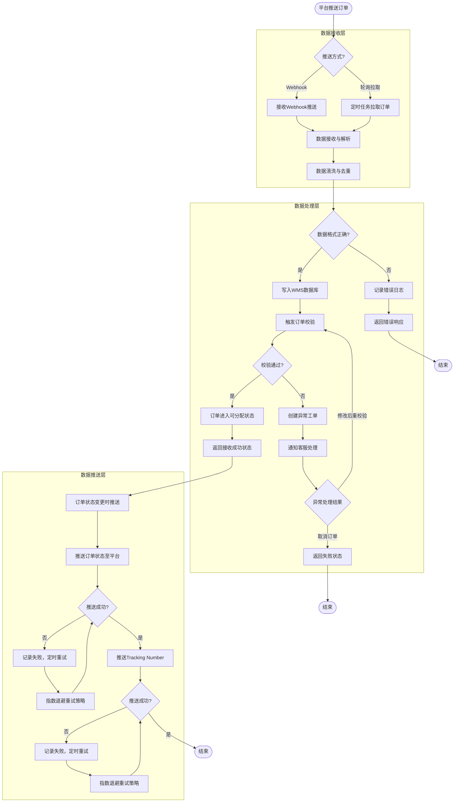

# 开放平台API - 订单同步流程

## 流程图

## 流程说明

### 1. 数据接收（2种方式）
- **Webhook推送**：平台主动推送订单数据
- **轮询拉取**：定时任务主动拉取平台订单

### 2. 数据清洗与去重（关键节点）
处理内容：
- ✅ 数据格式校验（JSON结构、必填字段）
- ✅ 去重处理（根据平台订单号去重）
- ✅ 数据转换（平台字段 → 内部统一格式）

异常处理：
- 记录错误日志 → 返回错误响应 → 平台重推

### 3. 订单校验（关键节点）
校验内容：
- ✅ 地址有效性（格式、邮编、国家）
- ✅ SKU匹配（平台SKU vs 本地SKU）
- ✅ 库存预占（避免超卖）
- ✅ 合规检查（产品认证、禁运品）

异常处理：
- 创建异常工单 → 通知客服处理 → 修改后重校验 或 取消订单

### 4. 订单状态推送
推送时机：
- **订单接收成功**：推送至平台
- **订单发货**：推送Tracking Number至平台
- **订单取消**：推送取消状态至平台

推送策略：
- **重试机制**：推送失败定时重试
- **指数退避**：重试间隔逐渐增加（1s、2s、4s...）
- **最大重试次数**：如10次后不再重试

## 关键业务规则

| 规则类型 | 规则内容 | 系统实现 |
|---|---|---|
| **幂等性** | 同一订单号多次推送，只处理一次 | 根据platform_order_id去重 |
| **重试策略** | 推送失败定时重试，指数退避 | 重试队列 + 指数退避算法 |
| **限流保护** | 限制平台推送频率，避免压垮系统 | 令牌桶算法限流 |
| **数据映射** | 不同平台字段映射为内部统一格式 | 字段映射配置表 |

## 配套的API接口清单

| 接口名称 | 接口路径 | 调用方向 | 说明 |
|---|---|---|---|
| 接收订单推送 | `POST /api/v1/orders/webhook` | 平台 → 系统 | Webhook方式接收订单 |
| 获取订单列表 | `GET /api/v1/orders` | 系统 → 平台 | 轮询方式拉取订单 |
| 回传订单状态 | `POST /api/v1/orders/{id}/status` | 系统 → 平台 | 推送订单状态变更 |
| 回传Tracking | `POST /api/v1/orders/{id}/tracking` | 系统 → 平台 | 推送Tracking Number |
| 获取物流状态 | `GET /api/v1/shipping/tracking` | 系统 → 物流商 | 查询物流跟踪信息 |

## 异常场景处理

| 异常场景 | 处理方式 | 系统操作 |
|---|---|---|
| **平台推送重复订单** | 根据platform_order_id去重 | 返回成功，但不重复处理 |
| **推送数据格式错误** | 记录错误日志，返回详细错误信息 | 通知平台修正数据格式 |
| **推送失败（网络超时）** | 定时重试，指数退避 | 重试队列 + 监控告警 |
| **系统维护中** | 返回维护中状态码，平台稍后重推 | 维护窗口期管理 |

## 监控与告警

| 监控指标 | 告警阈值 | 处理动作 |
|---|---|---|
| **订单推送成功率** | < 99% | 立即告警，排查接口问题 |
| **订单处理延迟** | > 5分钟 | 立即告警，排查系统性能 |
| **重试队列长度** | > 1000 | 立即告警，排查推送失败原因 |
| **API调用频率** | 超过限流阈值 | 限流保护，返回429状态码 |
