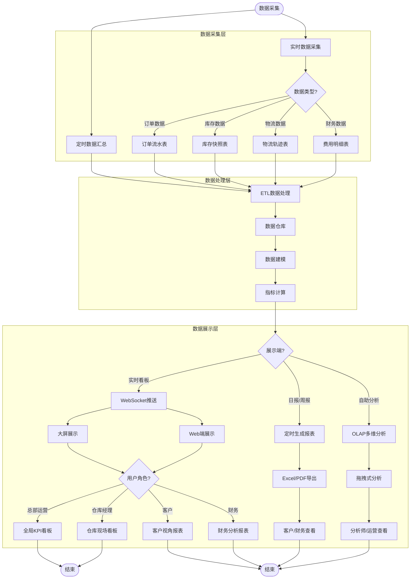

# 数据看板/BI端 - 数据流与展示流程

## 流程图

## 流程说明

### 1. 数据采集（2种方式）
- **实时数据采集**：订单状态变更、库存变动、物流轨迹更新
- **定时数据汇总**：日报、周报、月报的定时生成

### 2. 数据处理（关键节点）
处理内容：
- ✅ ETL数据清洗（去重、补全、格式统一）
- ✅ 数据仓库存储（历史数据归档）
- ✅ 数据建模（星型模型、雪花模型）
- ✅ 指标计算（KPI、同比、环比）

### 3. 数据展示（3种方式）
- **实时看板**：WebSocket推送，大屏/Web端实时刷新
- **日报/周报**：定时生成，Excel/PDF导出
- **自助分析**：OLAP多维分析，拖拽式生成报表

### 4. 用户视角（4种角色）
- **总部运营**：全局KPI看板（订单量、履约率、异常率）
- **仓库经理**：仓库现场看板（人效、库存准确率、设备状态）
- **客户**：客户视角报表（库存周转率、订单履约时效、物流成本）
- **财务**：财务分析报表（仓储费、操作费、运费明细）

## 关键业务规则

| 规则类型 | 规则内容 | 系统实现 |
|---|---|---|
| **数据实时性** | 订单状态变更5秒内推送至看板 | WebSocket + Redis缓存 |
| **数据准确性** | 所有指标需与源系统一致 | 数据对账 + 差异告警 |
| **数据安全性** | 客户只能看到自己的数据 | 数据权限隔离（按client_id） |
| **数据保留期** | 原始数据保留3年，聚合数据永久保留 | 数据归档策略 |

## 配套的页面清单

| 页面名称 | 功能 | 用户角色 |
|---|---|---|
| 全局KPI看板 | 订单量、履约率、异常率 | 总部运营 |
| 仓库现场看板 | 人效、库存准确率、设备状态 | 仓库经理 |
| 实时订单监控 | 当前处理中订单、异常订单 | 总部运营、仓库经理 |
| 库存分析报表 | 库存周转率、滞销库存分析 | 客户、总部运营 |
| 物流成本分析 | 各物流商成本对比、时效分析 | 客户、财务 |
| 财务分析报表 | 仓储费、操作费、运费明细 | 财务、客户 |

## 配套的API接口

| 接口名称 | 接口路径 | 调用方向 |
|---|---|---|
| 获取实时指标 | `GET /api/v1/bi/realtime/{metric}` | 看板 ← 系统 |
| 获取报表数据 | `GET /api/v1/bi/report/{type}` | 看板 ← 系统 |
| 导出报表 | `POST /api/v1/bi/export` | 看板 → 系统 |
| 订阅实时推送 | `WebSocket /api/v1/bi/ws` | 看板 ← 系统 |

## 技术指标

| 指标类型 | 技术要求 | 实现方案 |
|---|---|---|
| **实时性** | 数据延迟 < 5秒 | WebSocket + Redis缓存 |
| **并发量** | 支持1000+用户同时在线 | 负载均衡 + 缓存策略 |
| **数据存储** | 支持3年历史数据查询 | 数据仓库 + 分区表 |
| **可用性** | 99.9% SLA | 主从备份 + 故障切换 |
