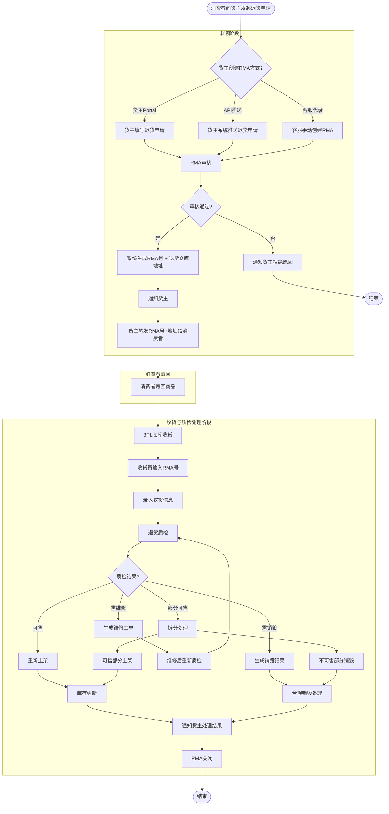

# 退货处理Web端 - RMA全生命周期流程

## 角色说明（按 2026-06-18 用户画像定义）

| 角色 | 在本流程中的身份 | 与平台的关系 |
|---|---|---|
| **消费者** | 货主的C端客户，发起退货申请的一方 | 不直接使用3PL平台，通过货主间接关联 |
| **货主** | 委托3PL服务的品牌方/客户（客户管理员/客户操作员） | 通过Portal提交退货单，查看RMA状态 |
| **客服** | 3PL客户成功人员 | 可代货主录入RMA，处理异常 |
| **仓库人员** | 3PL仓库现场执行人员（收货员/验货员/仓库经理） | 执行收货、质检、处理决策等操作 |

## 流程图

## 流程说明

### 1. 退货申请（3种方式）
- **货主Portal**：货主在Portal自助提交退货申请（对应消费者向货主提出的退货需求）
- **API推送**：货主系统推送退货申请（如电商平台自动推送）
- **客服代录**：客服手动创建RMA（货主电话申请，由客服代录）

### 2. RMA审核（关键节点）
审核内容：
- ✅ 退货原因是否合理（错发、质量问题、消费者不喜欢）
- ✅ 商品是否在退货期内
- ✅ 商品是否已使用/损坏

审核结果：
- **通过**：系统生成RMA号及退货仓库地址，通知货主
- **拒绝**：通知货主拒绝原因

### 3. 消费者寄回商品
- 系统生成RMA号 + 退货仓库地址，通知货主（邮件/短信/站内信）
- 货主将RMA号 + 退货地址转发给消费者
- 消费者自行叫快递寄回，在快递面单备注RMA号

### 4. 3PL仓库收货
- 仓库收到退货商品
- 收货员输入或扫描RMA号，录入收货信息
- 系统自动关联原订单

### 5. 退货质检（关键节点）
质检内容：
- ✅ 商品是否完好（可售）
- ✅ 商品是否需要维修
- ✅ 商品是否需要销毁

质检结果：
- **可售**：重新上架，库存更新
- **需维修**：生成维修工单，维修后重新质检
- **需销毁**：生成销毁记录，合规处理
- **部分可售**：拆分处理（可售部分上架，不可售部分销毁）

### 6. 处理决策
- **重新上架**：质检通过后，库存重新上架
- **维修/翻新**：生成维修工单（外包或内部）
- **销毁**：生成销毁记录（合规处理）

### 7. RMA关闭
- 通知货主退货处理结果
- RMA关闭

## 关键业务规则

| 规则类型 | 规则内容 | 系统实现 |
|---|---|---|
| **退货期限** | 收货后30天内可退货 | 系统自动计算退货期限 |
| **退货原因分类** | 错发、质量问题、消费者不喜欢 | 退货原因下拉选择 |
| **质检标准** | 未拆封可重新上架 | 质检标准配置表 |
| **销毁合规** | 销毁需符合环保要求 | 销毁记录 + 合规证明 |

## 配套的页面清单

| 页面名称 | 功能 | 用户角色 |
|---|---|---|
| RMA申请页 | 提交退货申请 | 货主管理员、货主操作员 |
| RMA审核页 | 审核退货申请 | 客服、仓库经理 |
| 退货收货页 | 输入RMA号，录入收货信息 | 收货员、验货员 |
| 退货质检页 | 录入质检结果 | 验货员、仓库经理 |
| 处理决策页 | 决定重新上架/维修/销毁 | 仓库经理 |
| RMA详情页 | 查看RMA状态、处理结果 | 客服、货主 |

## 配套的API接口

| 接口名称 | 接口路径 | 调用方向 |
|---|---|---|
| 申请退货 | `POST /api/v1/returns` | 货主 → 系统 |
| 审核RMA | `POST /api/v1/returns/{id}/approve` | 系统 → 客服/仓库经理 |
| 到货签收 | `POST /api/v1/returns/{id}/receive` | 仓库 → 系统 |
| 质检结果 | `POST /api/v1/returns/{id}/inspect` | 仓库 → 系统 |
| 处理决策 | `POST /api/v1/returns/{id}/decide` | 仓库 → 系统 |
| 查询RMA状态 | `GET /api/v1/returns/{id}` | 货主 ← 系统 |

## 异常场景处理

| 异常场景 | 处理方式 | 系统操作 |
|---|---|---|
| **消费者寄错商品** | 联系货主确认 | 生成异常工单，通知客服 |
| **商品损坏无法销售** | 与货主协商赔偿 | 生成赔偿工单，通知财务 |
| **退货期限已过** | 拒绝退货申请 | 通知货主拒绝原因 |
| **RMA号丢失** | 根据订单号查询 | 客服手动关联RMA号 |

## 监控与告警

| 监控指标 | 告警阈值 | 处理动作 |
|---|---|---|
| **RMA审核时效** | > 24小时 | 立即告警，催审 |
| **退货收货时效** | > 7天未收货 | 立即告警，联系货主 |
| **质检完成时效** | > 3天未完成质检 | 立即告警，催检 |
| **RMA关闭率** | < 90% | 分析未关闭原因 |
