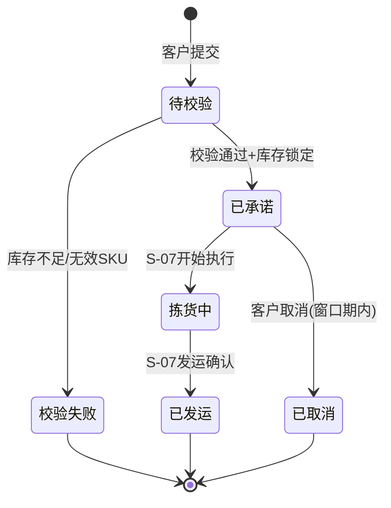

# S-06 出库下单与承诺

文档类型：场景需求  
版本：V0.1  
日期：2026-06-20  
作者：Martin  
相关方：产品、架构、研发、仓储运营

## 1. 场景定位

| 项目 | 内容 |
|---|---|
| 场景编号 | S-06 |
| 场景名称 | 出库下单与承诺 |
| 所属链路 | 出库主链路 |
| 前置场景 | S-05 库存查询与占用 |
| 后置场景 | S-07 拣货复核打包发运 |
| 优先级 | P0 |

## 2. 场景描述

客户在门户提交出库订单（B2B 批量或 B2C 单件），系统校验库存可用量、服务规则（截单时间等）后做出承诺——锁定库存、生成拣货任务。出库下单是客户侧最高频的动作，也是仓内执行（S-07）的触发器。

## 3. 场景主干

```
客户下单 → 系统校验 → 库存承诺 → 生成任务 → 下发 S-07
```

## 4. 子场景展开

### 4.1 子场景 A：B2B 客户下单（批量出库）

| 字段 | 内容 |
|---|---|
| 角色 | 客户管理员 / 客户操作员 |
| 触发条件 | 客户有批量发货需求（如给线下门店补货、经销商调拨） |
| 终端 | 门户 |

**操作流程：**

1. 客户在门户点击"出库下单"
2. 选择出库仓库（本期仅一个）
3. 填写订单基本信息：

| 信息项 | 说明 | 必填 |
|---|---|---|
| 客户订单号 | 客户侧业务单号（用于对账） | 否 |
| 期望发货日期 | 客户希望哪天发出 | 是 |
| 收货方 | 收货公司/仓库名称 | 是 |
| 收货地址 | 省/市/区 + 详细地址 | 是 |
| 收货联系人 + 电话 | 收货方对接人 | 是 |
| 运输方式 | 客户自提 / 委托仓库发货（本期仅客户自提） | 是 |
| 备注 | 特殊要求 | 否 |

4. 填写出库明细（B2B 模式）：

**方式一：逐行添加 SKU**

| 行项 | 说明 |
|---|---|
| SKU | 从该客户已导入的 SKU 列表中选择 |
| 需求数量 | 整数 |
| 库存可用量 | 系统实时展示该 SKU 当前可用量 |

**方式二：Excel 模板批量导入**

- 适用于 SKU 种类多（几十到上百行）的 B2B 订单
- 下载模板 → 填入 SKU + 数量 → 上传

5. 提交订单

6. 系统进入校验流程（见 4.3）

**B2B 下单页特征：**
- 支持行项数量大（理论上无上限，建议一期限制 100 行）
- 每行实时显示可用库存
- 提交前做全量校验（不是逐条校验）

### 4.2 子场景 B：B2C 客户下单（单品出库）

| 字段 | 内容 |
|---|---|
| 角色 | 客户管理员 / 客户操作员 |
| 触发条件 | 客户收到 C 端订单，需要从仓库发货给消费者 |
| 终端 | 门户 |

**操作流程：**

1. 客户在门户点击"出库下单"
2. 选择出库仓库
3. 填写订单信息：

| 信息项 | B2C 特有 | 必填 |
|---|---|---|
| 客户订单号 | 对应 C 端平台（淘宝/抖音/独立站等）的订单号 | 是 |
| 收件人姓名 | C 端消费者 | 是 |
| 收件人手机 | C 端消费者 | 是 |
| 收件地址 | C 端收货地址 | 是 |
| SKU | 通常 1 个 | 是 |
| 数量 | 通常 1-2 件 | 是 |
| 备注 | 如"送礼，请勿放价格单" | 否 |

4. 提交订单

**B2C 下单页特征：**
- 与 B2B 同页但流程更短（通常1-2行）
- 支持连续创建（提交后快速进入下一单）
- **批量导入模式：B2C 客户可能一次性导入几十上百个 C 端订单**

**B2C 批量导入（本期做）：**

| 步骤 |
|---|
| 1. 下载 C 端订单模板（Excel：订单号、SKU、数量、收件人、手机、地址） |
| 2. 填入多个订单 |
| 3. 上传 |
| 4. 系统逐行校验库存，校验通过的订单进入待承诺状态 |

### 4.3 子场景 C：系统校验与承诺

| 字段 | 内容 |
|---|---|
| 角色 | 系统自动 |
| 触发条件 | 客户提交出库订单 |

**校验流程（按顺序）：**

| 步骤 | 校验项 | 未通过时的处理 |
|---|---|---|
| 1 | SKU 是否存在于该客户下 | 订单行标记为"无效SKU"，提示客户修正 |
| 2 | 需求数量是否 > 0 | 订单行标记为"数量无效" |
| 3 | 可用库存是否 >= 需求数量 | 订单行标记为"库存不足"，显示当前可用量 |
| 4 | 是否超过截单时间 | 订单标记为"次日处理"，不立即承诺 |
| 5 | 该 SKU 是否有未完成的差异处理 | 订单行标记为"SKU待处理"，提示联系仓库 |

**校验通过后——库存承诺：**

1. 系统对每个订单行进行库存承诺
2. 承诺逻辑：

| 动作 | 库存影响 |
|---|---|
| 可用库存 - 需求数量 | available_qty -= N |
| 已占用库存 + 需求数量 | reserved_qty += N |
| 写入库存流水 | change_type = "订单占用" |

3. 承诺成功后，订单状态 = "已承诺"
4. 系统自动生成拣货任务，下发至 S-07

**部分承诺（本期不做）：**
- 第一期如果一个订单中有多个 SKU，只要有任一 SKU 库存不足，整个订单标记为"库存不足"，不做部分承诺
- 第二期支持部分承诺（有多少先发多少）

**边界情况：**
- 同一 SKU 被多个订单同时承诺时，按提交时间先到先得
- 订单提交后30分钟内（窗口期）客户可在门户取消（订单状态回滚，库存释放）
- 窗口期过后订单进入"已承诺"状态，取消需联系仓库经理线下处理

### 4.4 子场景 D：客户查看订单状态（门户）

| 字段 | 内容 |
|---|---|
| 角色 | 客户 |
| 终端 | 门户 |

**订单列表页：**

| 列 | 说明 |
|---|---|
| 订单编号 | 系统生成的唯一编号 |
| 客户订单号 | 客户侧业务单号 |
| 下单时间 | 提交时间 |
| 订单类型 | B2B / B2C |
| 订单状态 | 待校验 / 已承诺 / 拣货中 / 已发运 / 已取消 |
| 行项数 + 总件数 | 概要 |
| 操作 | 查看详情 / 取消（窗口期内） |

**订单详情页：**

| 模块 | 内容 |
|---|---|
| 订单信息 | 编号、类型、状态、时间线 |
| 收货信息 | 收货方/收件人、地址、联系方式 |
| 出库明细 | SKU、需求数量、已拣数量、已发数量（按行） |
| 轨迹 | 关键时间节点（已承诺 / 拣货开始 / 复核完成 / 已发运） |

**本期简化：**
- 轨迹数据来自 S-07 执行状态回写
- 不做承运商轨迹对接（第二期）

## 5. 订单状态流转



## 6. 与前后场景的关联

### 前置依赖 S-05
- 下单时实时读取可用库存
- 客户通常先查库存再下单

### 后置支撑 S-07
- 订单承诺后自动生成拣货任务
- 任务下发到拣货员 Handheld 端的作业队列

## 7. 交付物清单

| 交付物 | 终端 | 使用角色 |
|---|---|---|
| B2B 出库下单页（逐行添加） | 门户 | 客户 |
| B2C 出库下单页（单件快速下单） | 门户 | 客户 |
| B2C 批量导入页（模板上传） | 门户 | 客户 |
| 订单列表页 | 门户 | 客户 |
| 订单详情页（含轨迹） | 门户 | 客户 |
| 订单管理列表（仓库侧） | Web | 仓库经理 |

## 8. 本期试点边界

| 本期做 | 本期不做 |
|---|---|
| B2B 逐行 + B2C 单件下单 | B2C 电商平台 API 对接 |
| B2C Excel 批量导入 | 部分承诺（一个订单不全则不承诺） |
| 自动库存校验 + 承诺 + 锁定 | 库存预留策略（如优先级、分仓） |
| 截单时间规则校验 | 承运商运单生成 |
| 窗口期内客户自行取消 | 窗口期后在线取消 |
| 订单状态全程可追踪 | 承运商轨迹回传 |
