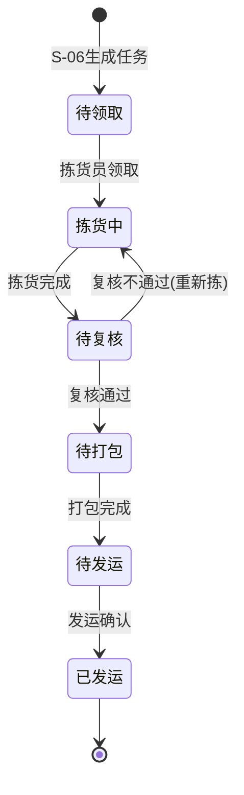

# S-07 拣货、复核、打包、发运

文档类型：场景需求  
版本：V0.1  
日期：2026-06-20  
作者：Martin  
相关方：产品、架构、研发、仓储运营

## 1. 场景定位

| 项目 | 内容 |
|---|---|
| 场景编号 | S-07 |
| 场景名称 | 拣货、复核、打包、发运 |
| 所属链路 | 出库主链路 |
| 前置场景 | S-06 出库下单与承诺 |
| 后置场景 | S-05 库存查询（库存更新反馈） |
| 优先级 | P0 |

## 2. 场景描述

订单承诺（S-06）后，拣货任务下发到仓库。拣货员、复核员、打包员、发运员在 Handheld 上按系统指引依次完成拣货、复核、打包、复核、打包，最后发运交接。整个过程是仓内出库执行的核心闭环，完成后库存真正减少，客户在门户看到发运轨迹。

## 3. 场景主干

```
任务下发 → 拣货 → 复核 → 打包 → 发运确认 → 库存扣减 → 客户看轨迹
```

## 4. 子场景展开

### 4.1 子场景 A：拣货任务生成与领取

| 字段 | 内容 |
|---|---|
| 角色 | 系统自动（生成）/ 拣货员（领取） |
| 触发条件 | S-06 订单承诺完成 |
| 终端 | Handheld |

**任务生成规则（本期）：**

| 规则 | 说明 |
|---|---|
| 按订单生成 | 一个订单对应一个拣货任务（不做波次合并） |
| 优先级 | 按订单提交时间，先提交先拣 |
| 任务分配 | 拣货员在 Handheld 上手动领取（不做自动派单） |

**拣货任务数据结构：**

| 字段 | 来源 |
|---|---|
| 订单编号 | S-06 |
| 订单类型 | B2B / B2C |
| 拣货行项 | SKU + 需求数量 + 推荐库位 |
| 推荐库位来源 | S-02 仓库结构 + S-04 上架时记录的库位 |

**推荐库位逻辑（本期）：**

| 策略 | 说明 |
|---|---|
| 同 SKU 优先合并 | 如果同一 SKU 在多个库位，优先推荐库存量最大的库位 |
| 就近原则（人工） | 系统展示所有有库存的库位，拣货员根据现场情况选择 |

**Handheld 领取流程：**
1. 拣货员打开 Handheld "拣货任务"
2. 看到待拣货订单列表（按提交时间排序）
3. 点击领取某个订单的任务
4. 该任务从待领取变为"拣货中"，其他人不可再领取

### 4.2 子场景 B：拣货执行（Handheld）

| 字段 | 内容 |
|---|---|
| 角色 | 拣货员 |
| 触发条件 | 已领取拣货任务 |
| 终端 | Handheld |

**平层仓与楼栋仓通用拣货流程：**

1. Handheld 展示该订单的拣货清单，**按楼层分组展示**：

| 楼层 | 库位 | SKU | 数量 |
|---|---|---|---|
| 3F | 3F-A-01-01 | SKU-A | x5 |
| 3F | 3F-A-02-03 | SKU-B | x3 |
| 6F | 6F-C-05-02 | SKU-C | x10 |
| 6F | 6F-D-01-01 | SKU-D | x2 |

2. 拣货员按楼层顺序执行：先从 3F 开始，3F 拣完后再去 6F
3. 在每层内按库位顺序逐个扫描执行
4. 楼栋仓跨层时拣货员需乘电梯，系统不计算等待时间

**平层仓行为：** 所有 SKU 都在 1F，楼层分组无效，直接按库位顺序展示。

**楼栋仓补货（拣货区库存不足时）：**

当拣货区（如 3F）的 SKU 库存不足时：

| 步骤 | 角色 | 动作 |
|---|---|---|
| 1 | 系统 | 检测 3F 拣货区库存不足，自动查找 4-9F 存储区是否有库存 |
| 2 | 系统 | 生成补货任务："从 6F-C-05-02 补 x10 到 3F 拣货区" |
| 3 | 叉车工 | Handheld 领取补货任务，从 6F 取货 → 乘电梯 → 送至 3F 拣货区 |
| 4 | 叉车工 | 扫描目标库位确认补货到位 |
| 5 | 拣货员 | Handheld 刷新后看到 3F 库存已恢复，继续拣货 |

**B2B 订单拣货流程：**

1. Handheld 展示该订单的拣货清单（按楼层分组）
2. 拣货员前往当前楼层推荐库位
3. 扫描库位条码
4. 系统校验该库位是否有目标 SKU
5. 扫描 SKU 条码
6. 系统校验是否为目标 SKU
7. 输入拣货数量（与需求数量比对）
8. 系统展示已拣/待拣进度
9. 当前楼层拣完后，系统提示"下一层：XF"
10. 重复步骤 2-8，直到该订单所有 SKU 拣完
11. 拣货完成，任务进入"待复核"状态

**B2C 订单拣货流程：**

与 B2B 基本相同，但：
- 通常只有 1-2 个行项，流程更短
- 收货信息（收件人、地址）在 Handheld 上可见，方便复核时对照

**防错机制：**

| 校验点 | 动作 |
|---|---|
| 扫库位 → 库位无目标 SKU | 提示"库位不匹配"，要求选择正确库位 |
| 扫 SKU → SKU 不在拣货清单中 | 提示"SKU 不匹配" |
| 拣货数量 > 需求数量 | 提示"超出需求数量" |
| 拣货数量 < 需求数量 | 允许提交但标记为"短拣"，生成差异记录 |

**本期简化：**
- 不做波次合并拣货（多个订单合并成一个拣货路线）
- 不做路径优化（系统按推荐库位逐个展示，不计算最优路线）
- 不强制扫码库位（拣货员可跳过库位校验，直接扫 SKU，但系统记录跳过标记）

### 4.3 子场景 C：复核（Handheld）

| 字段 | 内容 |
|---|---|
| 角色 | 复核员（可与拣货人不同） |
| 触发条件 | 拣货完成，任务为"待复核" |
| 终端 | Handheld |

**复核流程：**

1. 复核员打开"复核"任务
2. 扫描订单编号或输入
3. 系统展示该订单的应发清单：

| 展示信息 | 说明 |
|---|---|
| SKU 名称 + 条码 | 应发的 SKU |
| 应发数量 | S-06 的需求数量 |
| 实拣数量 | S-07 拣货步骤的实际数量 |
| 差异标记 | 实拣 = 应发（正常） / 实拣 < 应发（短拣） |

4. 复核员逐件扫描实物 SKU 条码
5. 系统核对：

| 核对结果 | 系统动作 |
|---|---|
| 扫描的 SKU 在应发清单中 | 该 SKU 计件 +1 |
| 扫描的 SKU 不在应发清单中 | 提示"错货"，高亮报警 |
| 某 SKU 计件数 > 应发数 | 提示"多货" |

6. 全部 SKU 核对完成，复核员确认"复核通过"
7. 任务进入"待打包"状态

**复核不通过的处理：**

| 情况 | 处理方式 |
|---|---|
| 实拣数量 < 应发（短拣，已在拣货阶段标记） | 复核员确认差异，系统记录"短少X件"，按实拣数量进入打包 |
| 扫描到错货 | 复核员将错货放回，重新拣正确的 SKU |
| 外包装破损 | 换货或标记破损，重新拣货 |

**本期处理：**
- 复核采用逐件扫描，不做称重复核（第二期加）
- 复核不通过需要仓库经理介入（Web 端审批）

### 4.4 子场景 D：打包（Handheld）

| 字段 | 内容 |
|---|---|
| 角色 | 打包员 |
| 触发条件 | 复核通过，任务为"待打包" |
| 终端 | Handheld |

**B2B 打包流程：**

1. 打包员打开"打包"任务
2. 系统展示该订单的打包明细 + 收货信息
3. 打包员将商品装入外箱/托盘
4. 打包员在 Handheld 上记录：

| 记录项 | 说明 |
|---|---|
| 包装数量 | 该订单使用了几箱/几托 |
| 包装规格 | 箱号/托盘号（手动输入或扫码） |
| 送货单号 | 客户自提时可填（本期选项） |

5. 系统生成出库标签（含收货方、SKU 摘要、箱号）
6. 打包员打印标签贴在包装上（或手写）
7. 确认打包完成，任务进入"待发运"

**B2C 打包流程：**

| 差异点 | B2C 特有 |
|---|---|
| 快递面单 | 系统生成快递面单（含收件人、地址、电话），打包员打印粘贴 |
| 装箱单 | 自动生成装箱单（SKU + 数量），放入包裹内 |
| 包装材料 | 快递袋/纸箱，一张面单对应一个包裹 |

**本期简化：**
- 快递面单采用系统内置模板，不做各家快递公司格式对接
- B2B 标签和 B2C 面单都在 Web 端打印（仓库作业区配置一台标签打印机）
- 不做称重自动记录（第二期）

### 4.5 子场景 E：发运确认与库存扣减

| 字段 | 内容 |
|---|---|
| 角色 | 发运员 |
| 触发条件 | 打包完成，商品已移至发货区 |
| 终端 | Handheld |

**发运确认流程：**

1. 发运员在发货区扫描订单编号
2. 确认发运方式：

| 发运方式 | 本期操作 |
|---|---|
| 客户自提 | 发运员确认货物已交接给客户/物流方 |
| 委托发货 | 发运员选择承运商（本期不做，第二期扩展） |

3. 发运员点击"确认发运"

**确认发运后的系统动作：**

| 系统动作 | 说明 |
|---|---|
| 订单状态变更 | "已承诺/拣货中" → "已发运" |
| 库存扣减 | reserve_qty -= N（已占用释放），库存流水记"发运出库" |
| 客户门户 | 订单详情轨迹新增"已发运"节点 |

**发运后回退（本期不做）：**
- 发运确认后不做系统内撤回，如需取消走线下流程

## 5. 任务状态流转



## 6. 与前后场景的关联

### 前置依赖 S-06
- 订单承诺后自动生成拣货任务
- 任务中的 SKU、数量、收货信息全部来自 S-06

### 联动 S-05
- 发运确认后库存扣减，S-05 客户查库存时可用量减少
- 发运后客户在门户看到轨迹更新

## 7. 交付物清单

| 交付物 | 终端 | 使用角色 |
|---|---|---|
| 拣货任务领取页 | Handheld | 拣货员 |
| 拣货执行页（含防错校验） | Handheld | 拣货员 |
| 复核执行页（逐件扫描） | Handheld | 复核员 |
| 打包确认页（含标签打印触发） | Handheld | 打包员 |
| 发运确认页 | Handheld | 发运员 |
| 任务进度看板 | Web | 仓库经理 / 班组长 |
| 出库标签模板 | Web | 打包员 |
| 快递面单模板（B2C） | Web | 打包员 |

## 8. 本期试点边界

| 本期做 | 本期不做 |
|---|---|
| 按订单生成拣货任务（逐单拣） | 波次合并拣货 |
| 系统推荐库位 + 人工可改 | 拣货路径优化 |
| 防错校验（库位/SKU/数量三重） | 称重复核 |
| 逐件扫描复核 | 自动分拣设备对接 |
| 手动打印标签和面单 | 各家快递公司面单 API 对接 |
| 单步发运确认 | 承运商在途轨迹回传 |
| 发运后库存扣减 | 发运后撤回 |
| Handheld 全流程操作 | 语音拣货 |
