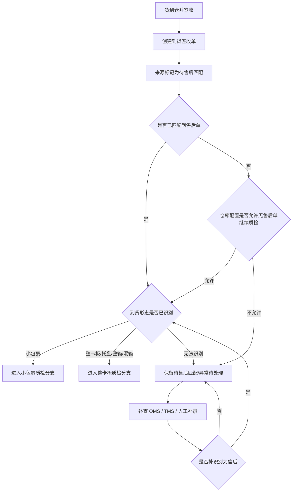
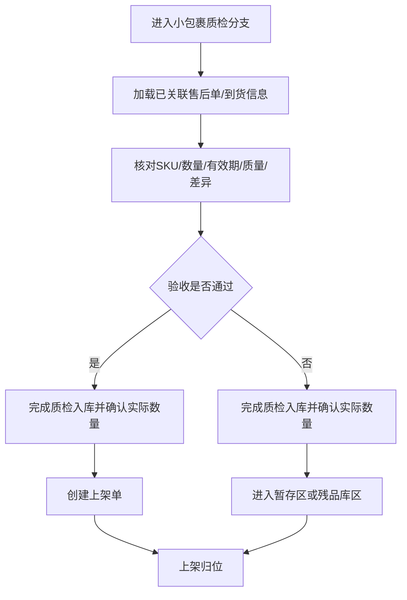
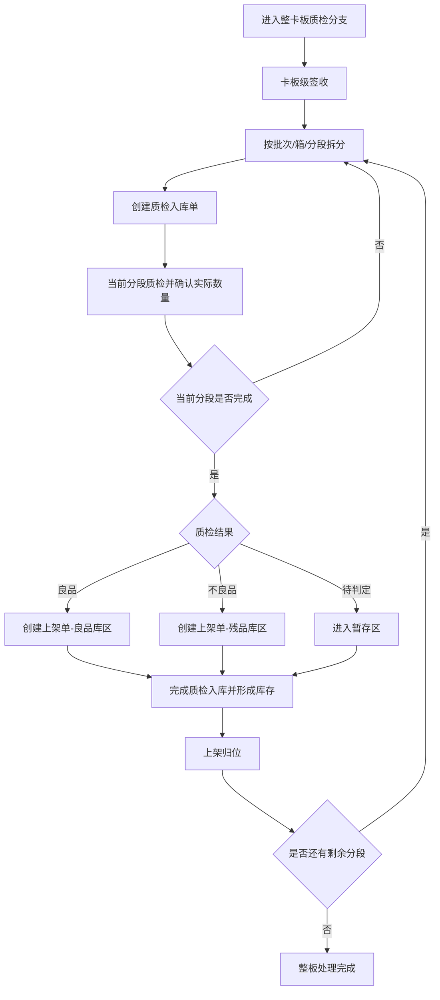
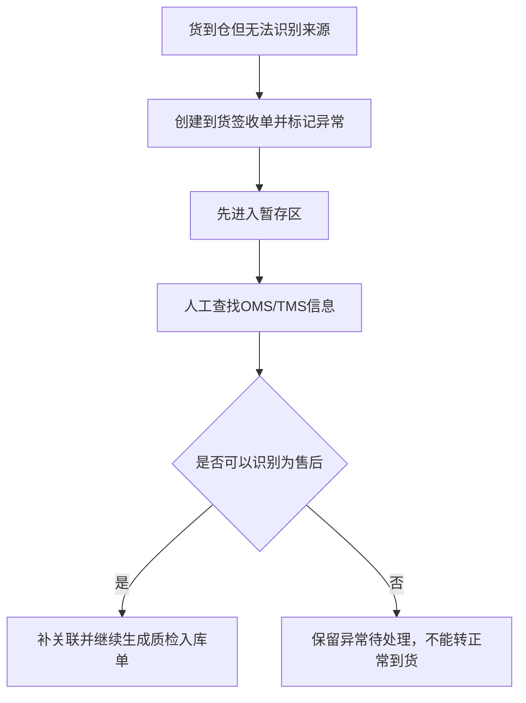

# xyWMS 售后到货入库需求分析文档

## 1. 文档信息

- 标题：xyWMS 售后到货入库需求分析
- 文档类型：需求
- 版本：V0.9
- 日期：2026-06-18
- 作者：Martin
- 相关方：仓库运营、收货岗位、质检岗位、上架岗位、仓内主管、OMS 对接、客服/售后、产品、研发、测试
- WMS 入库作业单据：到货签收单、质检入库单、上架单
- 来源材料：当前对话补充信息、现有 `00Requirements/After-sales Receipt Requirements.md`
- 模板来源：`reference/requirement-analysis-template.md`

## 2. 背景

- 为什么要做这件事：
  - 正常到货由 OMS 预先下发到货通知，并随货附纸质到货签收单处理，属于正常到货流程，超出本需求范围。
  - 本需求关注没有 OMS 预通知时人工创建的到货签收单，这类单据只允许后续匹配售后，不允许流转为正常到货。
  - 售后属性需要在后续通过 OMS、运单信息、人工补录或其他识别方式再确认。
  - 一旦确认这批货属于售后退回，就要继续走质检入库和上架流程，并由 WMS 在质检入库时确认实际数量并形成库存。
  - 小包裹电商退件和整卡板分销退货都属于售后退回货到仓场景，主链路一致，差异在到货形态和作业粒度。
  - 售后退回货需要按良品、不良品、有效期、少件、多件、错货等规则验收，并按良品库区、残品库区、暂存区分流。

- 当前业务或系统问题：
  - 售后退回货到仓时，如果等 OMS 售后单先到，实物会滞留，无法及时进入 WMS 作业。
  - 没有 OMS 预通知的到货，如果被人工创建到货签收单，就必须先按售后待匹配处理，不能误入正常到货流程。
  - 小包裹和整卡板如果走不同流程，现场收货、质检、上架会被拆成两套逻辑。
  - 整卡板货量大，不能要求一次性完成全量质检和全量上架，需要支持分段处理。
  - 如果没有统一的验收和库区规则，良品、不良品和待判定货物容易混放。

## 3. 目标

- 希望达到什么结果：
  - 支持无 OMS 预通知的到货先按人工创建的到货签收单进入待匹配状态，不因售后单晚到而阻断收货。
  - 支持根据仓库级配置，决定无售后单匹配时是否继续质检入库。
  - 支持后续识别为售后的到货继续生成质检入库单和上架单，并在质检入库时完成实际数量确认。
  - 支持电商小包裹和整卡板退回共用同一套售后入库主流程，并通过三类作业单据承载作业。
  - 支持整卡板分段质检、分段上架，直到整板处理完成。
  - 支持按照良品、不良品、有效期、少件、多件、错货记录验收结果，并分流到对应库区。

- 成功标准：
  - 无 OMS 预通知的到货能够先进入 WMS 的待匹配作业，不依赖售后单是否已到。
  - 人工创建的到货签收单不能转入正常到货流程，是否继续质检入库由仓库级配置决定。
  - 无售后单匹配时，仓库配置允许和不允许两种处理都能被系统正确区分。
  - 质检结果和库区分流规则清晰，良品、不良品和暂存货不混放。
  - 库存流水能够说明售后退回货从到仓、签收、质检确认数量、上架归位的全过程。

### 3.1 5W2H 分析

| 维度 | 内容 |
| --- | --- |
| Why | 解决售后退回货到仓时的收货、匹配、质检、上架和库存确认问题，避免实物因售后单晚到而滞留。 |
| What | 建立一条以人工到货签收单为入口、由仓库级配置决定是否允许无售后单继续质检入库的 WMS 售后入库链路。 |
| Who | 收货员、质检人员、上架人员、仓内主管、OMS 对接人员。 |
| When | 货到仓并完成签收后，依据是否匹配到售后单以及仓库配置决定后续是否继续质检入库。 |
| Where | WMS 的到货签收、质检入库、上架作业链路中，覆盖售后退回货场景。 |
| Which | 适用于电商小包裹退件、整卡板分销退货，以及无售后单匹配时的仓库级差异化处理。 |
| How | 先签收，再判断是否匹配售后单；若未匹配，则按仓库配置决定是否允许继续质检入库；库存数量在质检入库时确认。 |
| How much | 库存记账以 WMS 为准，数量确认发生在质检入库环节，签收单不计库存。 |

## 4. 问题定义

- 现在具体卡在哪里：
  - WMS 到货签收时无法判断货物是否售后，若流程要求先识别后签收，会导致作业卡顿。
  - OMS 售后单晚于货到仓时，仓库如果等单据到齐才收货，会导致实物滞留。
  - 小包裹和整卡板如果采用不同逻辑，仓内操作和系统记录会分裂。
  - 整卡板如果只能一次性完成质检和上架，现场无法按实际拆分节奏作业。
  - 如果没有统一的验收和库区规则，良品、不良品和待判定货物容易混放。

- 不解决会带来什么影响：
  - 售后退回货到仓后无法及时签收和处理。
  - 货品可能因为单据未到或来源未识别而长期滞留。
  - 整卡板退货无法按实际处理节奏拆分，影响作业效率。
  - 破损、过期、错货等异常品有机会误入正常库存。

## 5. 适用范围

- 这次要做什么：
  - 以人工创建的到货签收单承接没有 OMS 预通知的到仓货物，并作为售后匹配入口。
  - 对于后续识别为售后的到货，继续生成质检入库单和上架单。
  - 电商小包裹退件的收货、验收、入库和上架。
  - 整卡板售后退货的收货、分段质检、分段上架。
  - 验收异常处理和库存数量确认。

- 这次不做什么：
  - 不展开 OMS 售后单创建、审批和退款流程。
  - 不展开客服、财务、平台仲裁流程。
  - 不展开正常到货最终入库流程。
  - 不展开复核工位拦截返库上架链路。
  - 不新增到货签收单、质检入库单、上架单之外的入库作业单据类型。
  - 不允许人工创建的到货签收单转入正常到货流程。
  - 不设计具体接口、表结构、索引和事务实现。

## 6. 目标系统边界

- 目标系统：`WMS`

- 库存责任归属：
  - WMS 负责售后退回货到仓后的签收、质检入库、上架和库存数量确认。
  - OMS 负责下发售后单、原订单信息、客户信息和应退明细。
  - WMS 在没有 OMS 预通知时可以先创建人工到货签收单，是否允许在未匹配售后单时继续质检入库由仓库级配置决定。
  - 到货签收单后续可补关联到售后单；人工创建的到货签收单不允许流转到正常到货流程。
  - 正常到货由 OMS 预通知和纸质到货签收单承接，超出本需求范围。
  - WMS 入库环节仅生成到货签收单、质检入库单、上架单三类作业单据，其他状态与异常留痕作为附属记录存在。
  - 到货签收单只承接货到仓，不形成库存数量；质检入库单在完成时确认实际数量并形成库存；上架单只做库位归位，不再改变数量。

- 与其他系统的交互边界：
  - OMS：下发售后单、原订单号、客户信息、应退明细，后续可补关联到 WMS 的到货签收单。
  - TMS / 承运系统：提供运单号、到货信息、卡板或托盘运输信息。
  - WMS：负责签收、收货、质检、上架、库存数量确认、异常留痕；其中收货、质检、上架分别承载在到货签收单、质检入库单、上架单上。

- 作业节点/状态口径：
  - 业务发生在到货签收、质检入库、上架三个作业节点。
  - 到货签收节点的进入条件是货物到仓并完成签收，离开条件是已进入待售后匹配、已匹配售后或进入异常待处理。
  - 质检入库节点的进入条件是到货签收完成且满足继续质检条件，离开条件是完成实际数量确认并生成上架去向。
  - 上架节点的进入条件是质检入库完成，离开条件是货物完成库位归位。
  - 来源识别状态、仓库配置状态、补关联状态属于后台流转状态，不单列为独立业务场景。

- 是否手工单：
  - 本需求以人工创建的到货签收单作为售后待匹配入口。
  - 是否继续质检入库由仓库级配置决定，不要求所有到货都先完成售后识别。
  - 该入口不作为正常到货入口使用。

- 与物流商揽收系统/TMS 的交接口径：
  - 由 OMS、TMS / 承运系统或现场收货信息提供识别线索。
  - WMS 接收物流单号、运单号、包裹号、卡板号等信息，用于补关联和识别来源。
  - 交互动作以查询、补关联和信息回传为主，不在本阶段定义撤销、剔除、确认的技术实现。

- 不应单列为业务场景的状态/节点：
  - 待售后匹配、已识别为售后、无法识别等来源识别状态。
  - 仓库级“无售后单继续质检开关”的配置状态。
  - 补查 OMS / TMS、人工补录、人工确认等后台处理动作。
  - 这些状态和动作作为业务场景的前置条件、异常分支或后台流转说明处理，不单独成章。

## 7. 业务场景

| 场景编号 | 场景名称 | 用户角色 | 触发条件 | 前置条件 | 主流程 | 异常/边界情况 | 场景结果 |
| --- | --- | --- | --- | --- | --- | --- | --- |
| S1 | 无售后单匹配且仓库配置不允许继续质检 | 收货员、仓内主管 | 货到仓并完成到货签收，但未匹配到售后单 | 仓库级配置为“不允许无售后单继续质检入库” | 创建到货签收单 -> 进入待售后匹配 -> 未匹配到售后单 -> 系统阻断后续质检入库 -> 保留待售后匹配/异常待处理 | 后续售后单到达后，可补关联后再继续；当前不允许直接进入质检入库 | 不能做后续质检入库，只能等待补查或补关联 |
| S2 | 无售后单匹配且仓库配置允许继续质检 | 收货员、质检人员、上架人员、仓内主管 | 货到仓并完成到货签收，但未匹配到售后单 | 仓库级配置为“允许无售后单继续质检入库” | 创建到货签收单 -> 进入待售后匹配 -> 未匹配到售后单 -> 系统放行继续生成质检入库单 -> 完成质检和上架 | 后续售后单到达后可补关联，不阻断已完成的质检/上架 | 可以在无售后单情况下继续完成质检入库和上架 |
| S3 | 电商小包裹退件 | 收货员、质检人员、上架人员、仓内主管 | 小包裹退件到仓，且主控流程已允许继续并识别到货形态为小包裹 | 具备快递单号、退货单号、原订单号或售后单号中的一种或多种 | 创建到货签收单 -> 进入待售后匹配 -> 主控允许继续 -> 进入小包裹质检分支 -> 质检确认数量 -> 生成上架单 -> 完成归位 | 若主控流程未通过，则进入待售后匹配/异常待处理；差异项按少件、多件、错货、有效期异常记录 | 小包裹退件进入质检-上架链路 |
| S4 | 整卡板售后退货 | 收货员、拆板/清点人员、质检人员、上架人员、仓内主管 | 整卡板、托盘、整箱或混箱退回到仓，且主控流程已允许继续并识别到货形态为整卡板 | 到货形态明确，允许按批次/箱/分段拆分 | 创建到货签收单 -> 进入待售后匹配 -> 主控允许继续 -> 进入整卡板质检分支 -> 分段质检 -> 分段上架 -> 整板完成 | 若主控流程未通过，则进入待售后匹配/异常待处理；整板可多次质检、多次上架，单次只处理当前分段 | 整卡板按分段节奏完成质检和上架 |
| S5 | 无法关联来源的异常到货 | 收货员、仓内主管 | 货到仓但无法从现有信息识别来源 | 暂无法通过 OMS/TMS/现场信息确认来源 | 创建到货签收单并标记异常 -> 进入暂存区 -> 人工补查 -> 视结果决定是否补关联 | 若始终无法识别，保持异常待处理；不得直接进入良品库区 | 货物进入异常处理链路，不直接入正常良品库存 |

## 8. 业务规则

- 触发条件：
  - 没有 OMS 预通知的到仓货物，先创建人工到货签收单并进入 WMS 售后待匹配链路。
  - 到货签收时不要求先识别是否售后，但人工创建单据默认先进入待售后匹配。
  - 若未匹配到售后单，是否允许继续质检入库由仓库级配置决定。
  - 仓库配置允许时，可直接继续生成质检入库单和上架单；仓库配置不允许时，必须保留在待售后匹配/异常待处理状态，等待补查或补关联。
  - 后续识别为售后后，继续走质检入库和上架。
  - 整卡板允许按拆板、拆箱、分段清点的节奏多次执行质检和上架。
  - WMS 入库环节仅生成到货签收单、质检入库单、上架单三类作业单据。

- 状态变化：

| 对象 | 状态链路 | 说明 |
| --- | --- | --- |
| 到货签收单 | 待签收 / 签收中 / 已签收 / 异常中止 | 入库第一张作业单 |
| 质检入库单 | 待质检 / 质检中 / 已完成 / 异常中止 | 入库第二张作业单 |
| 上架单 | 待上架 / 上架中 / 已完成 / 异常中止 | 入库第三张作业单 |

> 来源识别状态、OMS 关联状态、仓库配置状态、质检分段状态作为附属记录存在，不单独作为 WMS 入库作业单据。

- 计算规则：
  - 差异数量 = 实收数量 - 应收数量。
  - 差异数量大于 0 记为多件，差异数量小于 0 记为少件。
  - 验收维度包含良品、不良品、有效期、少件、多件、错货。
  - 同一张到货签收单可产生多张质检入库单和多张上架单，单次记录只覆盖当前分段。
  - 质检建议先核对物流单号、SKU、数量、外观、包装和有效期；少件、多件、错货建议作为差异原因单独记录，良品/不良品作为质检结论单独记录。
  - 有效期状态建议单独记录为正常、临期、过期，其中临期阈值建议默认 30 天，并支持按 SKU、品类或仓库规则配置。

- 特殊场景：
  - 到货签收单创建时，来源默认是待售后匹配，后续才判断是否售后。
  - 未匹配到售后单时，仓库配置允许则继续生成质检入库单和上架单；仓库配置不允许则保留待处理。
  - 后续识别为售后的货物继续生成质检入库单和上架单。
  - 售后单后到时，优先按物流单号补关联到已收货记录；若一个物流单号对应多笔记录，再结合仓库、到货日期、到货形态或包裹/卡板号辅助定位。
  - 良品进入良品库区，不良品进入残品库区，待判定或待补关联货物进入暂存区。
  - 整卡板允许在不同批次、不同分段上多次生成质检入库单和上架单。
  - 货物实际数量在质检入库单完成时确认；上架单只负责库位归位。
  - 库存状态建议定义为：良品库区对应可售库存，残品库区对应不可售库存，暂存区对应待处理库存。

- 异常处理：
  - 无法识别来源时，先进入暂存区并记录异常。
  - 实物与应收信息不一致时，记录少件、多件、错货或其他异常原因。
  - 有效期不符合规则的货物不能进入良品库区。
  - 不良品不能直接进入正常库存。
  - 仓库配置不允许继续质检的记录，必须保留在待售后匹配/异常待处理，不得强行推进质检入库。

## 9. 流程说明

### 9.1 通用主控流程（所有到货共用）

按步骤描述：

1. 货物到仓后，收货员先完成签收并创建到货签收单。
2. 系统先把来源标记为待售后匹配，不判断是否售后。
3. 系统判断是否已匹配到售后单；已匹配时直接进入到货形态判断，未匹配时按仓库配置决定是否允许继续流转。
4. 允许继续时，系统先识别到货形态，再进入对应作业分支。
5. 不允许继续时，记录为待售后匹配/异常待处理，等待补查或补关联。
6. 后续通过 OMS、TMS / 承运系统或人工补录补识别为售后后，再重新进入到货形态判断。

### 9.2 电商小包裹质检分支

按步骤描述：

1. 在主控流程判定到货形态为小包裹后，系统进入小包裹质检分支。
2. 系统加载已关联的售后单和到货信息，不再重复判断是否售后。
3. 收货员核对 SKU、数量、有效期、质量状态和差异。
4. 质检完成后，系统确认实际数量，并按结果生成上架单。
5. 验收通过的货物按结果进入对应库区，验收不通过的货物进入暂存区或残品库区，并记录异常原因。

### 9.3 整卡板质检分支

按步骤描述：

1. 在主控流程判定到货形态为整卡板、托盘、整箱或混箱后，系统进入整卡板质检分支。
2. 收货人员完成卡板级签收。
3. 系统按批次、箱或当前分段拆分实物并生成质检入库单。
4. 当前分段质检完成后，系统确认实际数量并生成上架单。
5. 系统按结果进入良品库区、残品库区或暂存区，上架单只负责库位归位。
6. 如果整板还有剩余分段，继续拆分、质检和上架。
7. 整板可以分多次完成质检和上架，直到所有分段处理结束。

### 9.4 无法识别来源的异常到货流程

按步骤描述：

1. 货物到仓后，如果现场信息不足，收货员无法识别是否售后。
2. 系统先创建到货签收单并标记异常，将货物放入暂存区。
3. 主管或收货员补查 OMS / TMS 信息。
4. 能够识别为售后时，补关联正常售后入库链路并继续处理。
5. 不能识别为售后时，保留异常待处理，不直接入良品库区。

## 10. 数据说明

### 10.1 输出边界

- 本阶段只描述业务数据口径，不展开技术实现。
- 允许输出：业务对象、字段名称、字段含义、来源系统、使用场景、枚举值、业务校验规则、数据归属关系。
- 不输出：表名、接口名、字段类型、索引、SQL、事务、消息机制、缓存、日志、代码命名。
- 未明确的字段、枚举或来源统一标注“待确认”，不得自行补全。

### 10.2 关键字段

| 字段 | 说明 | 字段来源 |
| --- | --- | --- |
| 到货签收单号 | 售后入库第一张作业单号 | WMS 生成 |
| 质检入库单号 | 售后入库第二张作业单号 | WMS 生成 |
| 上架单号 | 售后入库第三张作业单号 | WMS 生成 |
| 签收单创建方式 | OMS预通知 / 人工创建 | WMS 记录 |
| 来源识别状态 | 待售后匹配 / 已识别为售后 / 无法识别 | WMS 记录 |
| 无售后单继续质检开关 | 是否允许无售后单时继续质检入库 | WMS 仓库级配置 |
| 物流单号 | 售后补关联主键 | TMS / 承运系统 |
| OMS 售后单号 | 售后单主标识 | OMS 下发 / 后续补关联 |
| 原订单号 | 原始销售订单标识 | OMS |
| 到货形态 | 小包裹 / 整卡板 / 托盘 / 整箱 / 混箱 | 现场收货 / TMS 辅助 |
| 运单号 | 物流识别号 | TMS / 承运系统 |
| 包裹号 | 小包裹识别号 | 现场扫描 / 承运信息 |
| 卡板号 | 整卡板识别号 | 现场收货 |
| SKU | 货品编码 | 商品主数据 |
| 应收数量 | 理论应收数量 | OMS 售后单 / 退货明细 |
| 实收数量 | 现场实际数量 | WMS 收货记录 |
| 差异数量 | 实收数量 - 应收数量 | WMS 计算 |
| 质检结果 | 良品 / 不良品 / 有效期不合格 / 少件 / 多件 / 错货 | WMS 质检记录 |
| 库区类型 | 良品库区 / 残品库区 / 暂存区 | WMS 库位主数据 |
| 操作人 | 收货、质检、上架人员 | WMS 留痕 |
| 操作时间 | 操作发生时间 | WMS 留痕 |

### 10.3 枚举值

| 枚举类型 | 枚举值 | 说明 |
| --- | --- | --- |
| 签收单创建方式 | OMS预通知 / 人工创建 | 用于区分正常到货和售后待匹配入口 |
| 来源识别状态 | 待售后匹配 / 已识别为售后 / 无法识别 | 用于到货签收单后续归类 |
| 无售后单处理策略 | 阻断质检 / 放行质检 | 用于控制未匹配售后单时是否继续质检入库 |
| 有效期状态 | 正常 / 临期 / 过期 | 临期阈值建议默认 30 天，支持按 SKU、品类或仓库配置 |
| 质检结果 | 良品 / 不良品 / 有效期不合格 / 少件 / 多件 / 错货 / 待复核 | 用于验收分流 |
| 库区类型 | 良品库区 / 残品库区 / 暂存区 | 用于上架去向 |
| 库存状态 | 可售库存 / 不可售库存 / 待处理库存 | 用于库存台账分类 |
| 到货形态 | 小包裹 / 整卡板 / 托盘 / 整箱 / 混箱 | 用于作业粒度 |

### 10.4 业务对象与交互

- 相关业务对象：
  - 到货签收单
  - 质检入库单
  - 上架单
  - 库存流水
  - OMS 售后单
  - 运单、包裹、卡板等识别信息
- 相关业务交互：
  - OMS 售后单下发
  - 售后单补关联
  - 到货签收提交
  - 质检结果提交
  - 上架确认
  - 库存数量确认
- 以上内容仅用于描述数据在业务链路中的来源和去向，不定义技术实现与接口细节。

## 11. 权限与限制

- 谁能看：
  - 收货员可查看待签收、异常待处理记录。
  - 质检人员可查看待质检和质检中的记录。
  - 上架人员可查看待上架和暂存记录。
  - 仓内主管可查看全部记录、异常和处理进度。

- 谁能操作：
  - 收货员：创建并签收到货签收单，补录到货信息。
  - 质检人员：处理质检入库单，录入质检结果、标记异常、提交质检。
  - 上架人员：处理上架单，按库区完成上架确认。
  - 仓内主管：处理无法识别来源记录、确认异常分流。

- 有哪些限制：
  - WMS 是唯一库存数量确认和库存台账责任方。
  - 没有 OMS 预通知的到货不要求先识别是否售后，人工创建的到货签收单默认进入待售后匹配，是否继续质检入库由仓库级配置决定。
  - 仓库级配置按仓库维度生效，建议默认值为“阻断质检”，需要放行的仓库单独配置。
  - 仓库级配置“无售后单时是否允许继续质检入库”按仓库维度生效，配置结果直接决定无售后单时能否进入质检入库流程。
  - 小包裹和整卡板共用同一套售后入库主流程，并共用三类作业单据。
  - 整卡板可以分多次质检、分多次上架。
  - 同一 SKU 不同有效期不能混成一条验收明细。
  - 良品、不良品和暂存货不能混放到同一库区记录中。
  - 暂存区不进入可售库存，残品库区不进入可售库存，良品库区进入可售库存。

## 12. 验收标准

- 什么情况算完成：
  - 没有 OMS 预通知的到货，仍能通过人工创建的到货签收单完成售后待匹配收货。
  - 待售后匹配的人工到货签收单在仓库配置允许时，可以不依赖售后单继续流转到质检入库单和上架单。
  - 待售后匹配的人工到货签收单在仓库配置不允许时，不能进入质检入库流程，只能等待补查或补关联。
  - 待售后匹配的人工到货签收单后续可以被识别为售后，并继续流转到质检入库单和上架单。
  - 售后单后到时，能够按物流单号自动补关联到已收货记录，必要时可按仓库、到货日期、到货形态辅助定位。
  - 小包裹和整卡板共享同一套售后入库主流程和三类作业单据。
  - 整卡板支持分段质检、分段上架，并能累积完成整板处理。
  - 验收规则能区分良品、不良品、有效期、少件、多件、错货。
  - 上架结果能按良品库区、残品库区、暂存区分流。
  - 库存状态能按可售、不可售、待处理三类区分。
  - 库存流水能够反映货到仓、质检入库确认数量、上架归位和补关联过程。

- 什么情况算不通过：
  - WMS 到货时必须先识别是否售后才能收货。
  - 仓库配置不生效，导致无售后单场景下无法区分阻断和放行两种处理。
  - 小包裹和整卡板无法共用同一套签收-质检-上架主流程和三类作业单据。
  - 整卡板无法分段质检或分段上架。
  - 良品、不良品、暂存货混入同一库区记录。
  - 售后入库完成后无法说明库存变化原因。
  - 售后单后到时无法通过物流单号补关联到已收货记录。

## 13. 待确认项

- 已收敛的结论：
  - 售后单后到时，按物流单号识别并补关联待售后匹配的到货签收单。
  - 仓库级配置按仓库生效，默认值为“阻断质检”，允许在未匹配售后单时控制是否继续质检入库。
  - 到货签收单的创建方式和来源识别状态保留为业务枚举，用于区分待售后匹配、已识别和无法识别三种情况。
  - OMS 售后单与已收货记录按物流单号作为主键补关联；同物流单号多笔命中时，按仓库、到货日期、到货形态、包裹号/卡板号二次定位。
  - 质检规则按物流单号、SKU、数量、外观、包装和有效期核对；差异原因与质检结论分开记录。
  - 有效期状态按正常、临期、过期处理，临期阈值默认 30 天，支持按 SKU、品类或仓库配置。
  - 库存状态按可售库存、不可售库存、待处理库存三类区分；良品库区对应可售库存，残品库区对应不可售库存，暂存区对应待处理库存。
  - 异常原因字典建议统一为少件、多件、错货、有效期异常、外包装破损、包装异常、无法识别来源、物流单号缺失或不一致。

- 无新增业务待确认项。

- 说明：
  - 本阶段不展开技术命名、表结构、接口定义和实现方式。
