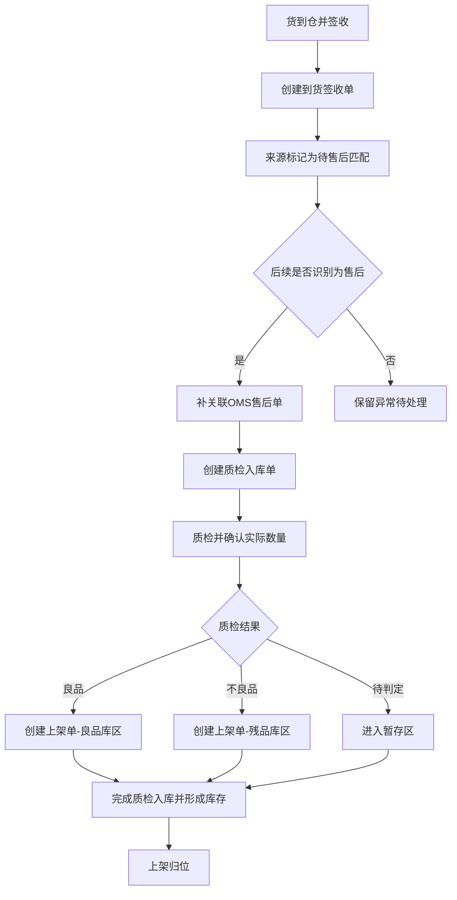
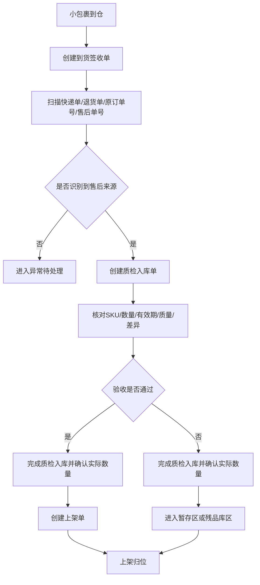
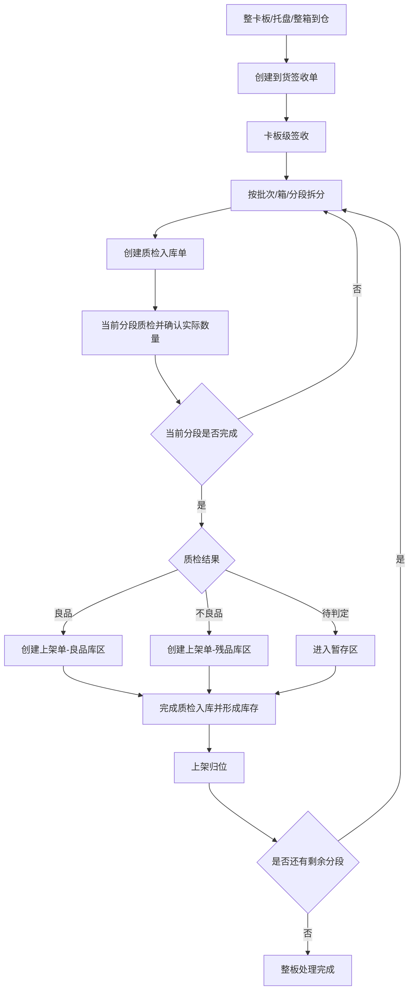
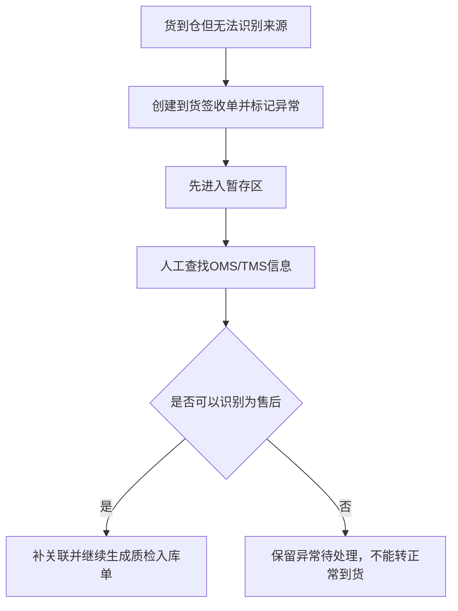

# xyWMS 售后到货入库需求分析文档

## 1. 文档信息

- 标题：xyWMS 售后到货入库需求分析
- 版本：V0.4
- 日期：2026-06-17
- 作者：Martin
- 相关方：仓库运营、收货岗位、质检岗位、上架岗位、仓内主管、OMS 对接、客服/售后、产品、研发、测试
- WMS 入库作业单据：到货签收单、质检入库单、上架单
- 来源材料：当前对话补充信息、现有 `00Requirements/After-sales Receipt Requirements.md`
- 模板来源：`reference/requirement-analysis-template.md`

## 2. 背景

- 为什么要做这件事：
  - 正常到货由 OMS 预先下发到货通知，并随货附纸质到货签收单处理，属于正常到货流程，超出本需求范围。
  - 本需求关注没有 OMS 预通知时人工创建的到货签收单，这类单据只允许后续匹配售后，不允许流转为正常到货。
  - 售后属性需要在后续通过 OMS、运单信息、人工补录或其他识别方式再确认。
  - 一旦确认这批货属于售后退回，就要继续走质检入库和上架流程，并由 WMS 在质检入库时确认实际数量并形成库存。
  - 小包裹电商退件和整卡板分销退货都属于售后退回货到仓场景，主链路一致，差异在到货形态和作业粒度。
  - 售后退回货需要按良品、不良品、有效期、少件、多件、错货等规则验收，并按良品库区、残品库区、暂存区分流。

- 当前业务或系统问题：
  - 售后退回货到仓时，如果等 OMS 售后单先到，实物会滞留，无法及时进入 WMS 作业。
  - 没有 OMS 预通知的到货，如果被人工创建到货签收单，就必须先按售后待匹配处理，不能误入正常到货流程。
  - 小包裹和整卡板如果走不同流程，现场收货、质检、上架会被拆成两套逻辑。
  - 整卡板货量大，不能要求一次性完成全量质检和全量上架，需要支持分段处理。
  - 如果没有统一的验收和库区规则，良品、不良品和待判定货物容易混放。

## 3. 目标

- 希望达到什么结果：
  - 支持无 OMS 预通知的到货先按人工创建的到货签收单进入待匹配状态，不因售后单晚到而阻断收货。
  - 支持后续识别为售后的到货继续生成质检入库单和上架单，并在质检入库时完成实际数量确认。
  - 支持电商小包裹和整卡板退回共用同一套售后入库主流程，并通过三类作业单据承载作业。
  - 支持整卡板分段质检、分段上架，直到整板处理完成。
  - 支持按照良品、不良品、有效期、少件、多件、错货记录验收结果，并分流到对应库区。

- 成功标准：
  - 无 OMS 预通知的到货能够先进入 WMS 的待匹配作业，不依赖售后单是否已到。
  - 人工创建的到货签收单只能继续匹配售后，不能转入正常到货流程。
  - 质检结果和库区分流规则清晰，良品、不良品和暂存货不混放。
  - 库存流水能够说明售后退回货从到仓、签收、质检确认数量、上架归位的全过程。

## 4. 问题定义

- 现在具体卡在哪里：
  - WMS 到货签收时无法判断货物是否售后，若流程要求先识别后签收，会导致作业卡顿。
  - OMS 售后单晚于货到仓时，仓库如果等单据到齐才收货，会导致实物滞留。
  - 小包裹和整卡板如果采用不同逻辑，仓内操作和系统记录会分裂。
  - 整卡板如果只能一次性完成质检和上架，现场无法按实际拆分节奏作业。
  - 如果没有统一的验收和库区规则，良品、不良品和待判定货物容易混放。

- 不解决会带来什么影响：
  - 售后退回货到仓后无法及时签收和处理。
  - 货品可能因为单据未到或来源未识别而长期滞留。
  - 整卡板退货无法按实际处理节奏拆分，影响作业效率。
  - 破损、过期、错货等异常品有机会误入正常库存。

## 5. 适用范围

- 这次要做什么：
  - 以人工创建的到货签收单承接没有 OMS 预通知的到仓货物，并作为售后匹配入口。
  - 对于后续识别为售后的到货，继续生成质检入库单和上架单。
  - 电商小包裹退件的收货、验收、入库和上架。
  - 整卡板售后退货的收货、分段质检、分段上架。
  - 验收异常处理和库存数量确认。

- 这次不做什么：
  - 不展开 OMS 售后单创建、审批和退款流程。
  - 不展开客服、财务、平台仲裁流程。
  - 不展开正常到货最终入库流程。
  - 不展开复核工位拦截返库上架链路。
  - 不新增到货签收单、质检入库单、上架单之外的入库作业单据类型。
  - 不允许人工创建的到货签收单转入正常到货流程。
  - 不设计具体接口、表结构、索引和事务实现。

## 6. 目标系统边界

- 目标系统：`WMS`

- 库存责任归属：
  - WMS 负责售后退回货到仓后的签收、质检入库、上架和库存数量确认。
  - OMS 负责下发售后单、原订单信息、客户信息和应退明细。
  - WMS 在没有 OMS 预通知时可以先创建人工到货签收单，但这类单据只允许补关联售后。
  - 到货签收单后续只能补关联到售后单；人工创建的到货签收单不允许流转到正常到货流程。
  - 正常到货由 OMS 预通知和纸质到货签收单承接，超出本需求范围。
  - WMS 入库环节仅生成到货签收单、质检入库单、上架单三类作业单据，其他状态与异常留痕作为附属记录存在。
  - 到货签收单只承接货到仓，不形成库存数量；质检入库单在完成时确认实际数量并形成库存；上架单只做库位归位，不再改变数量。

- 与其他系统的交互边界：
  - OMS：下发售后单、原订单号、客户信息、应退明细，后续可补关联到 WMS 的到货签收单。
  - TMS / 承运系统：提供运单号、到货信息、卡板或托盘运输信息。
  - WMS：负责签收、收货、质检、上架、库存数量确认、异常留痕；其中收货、质检、上架分别承载在到货签收单、质检入库单、上架单上。

## 7. 业务场景

- 场景 1：待售后匹配到仓后后续识别为售后
  - 用户是谁：收货员、仓内主管。
  - 用户做什么：没有 OMS 预通知的到货先由人工创建到货签收单并完成签收，系统标记为待售后匹配；后续再通过 OMS、运单或人工补录识别为售后，继续生成质检入库单和上架单。
  - 期望得到什么结果：人工创建的到货签收单只进入售后待匹配链路，不能转入正常到货流程，实际数量在质检入库时确认。

- 场景 2：电商小包裹退件
  - 用户是谁：收货员、质检人员、上架人员、仓内主管。
  - 用户做什么：按快递单号、退货单号、原订单号或售后单号识别退件包裹，先生成到货签收单，再通过质检入库单核对 SKU、数量、有效期、质量和差异，最后通过上架单完成归位。
  - 期望得到什么结果：信息一致的退件进入到货签收单-质检入库单-上架单链路；存在异常时进入异常处理。

- 场景 3：整卡板售后退货
  - 用户是谁：收货员、拆板/清点人员、质检人员、上架人员、仓内主管。
  - 用户做什么：按卡板、托盘、整箱或混箱接收整批退货，先做卡板级签收并形成到货签收单，再按批次分段拆分、清点、质检，过程中可多次生成质检入库单和上架单。
  - 期望得到什么结果：整卡板可以按批次分段质检和分段上架，直到整板处理完成。

- 场景 4：无法关联来源的异常到货
  - 用户是谁：收货员、仓内主管。
  - 用户做什么：货到仓后无法通过现有信息识别来源时，先创建到货签收单并标记异常，实物暂存，后续人工补录、补查。
  - 期望得到什么结果：无法关联来源的货物进入异常处理，不直接入良品库区。

## 8. 业务规则

- 触发条件：
  - 没有 OMS 预通知的到仓货物，先创建人工到货签收单并进入 WMS 售后待匹配链路。
  - 到货签收时不要求先识别是否售后，但人工创建单据默认只能匹配售后。
  - 后续识别为售后后，继续走质检入库和上架。
  - 整卡板允许按拆板、拆箱、分段清点的节奏多次执行质检和上架。
  - WMS 入库环节仅生成到货签收单、质检入库单、上架单三类作业单据。

- 状态变化：

| 对象 | 状态链路 | 说明 |
| --- | --- | --- |
| 到货签收单 | 待签收 / 签收中 / 已签收 / 异常中止 | 入库第一张作业单 |
| 质检入库单 | 待质检 / 质检中 / 已完成 / 异常中止 | 入库第二张作业单 |
| 上架单 | 待上架 / 上架中 / 已完成 / 异常中止 | 入库第三张作业单 |

> 来源识别状态、OMS 关联状态、质检分段状态作为附属记录存在，不单独作为 WMS 入库作业单据。

- 计算规则：
  - 差异数量 = 实收数量 - 应收数量。
  - 差异数量大于 0 记为多件，差异数量小于 0 记为少件。
  - 验收维度包含良品、不良品、有效期、少件、多件、错货。
  - 同一张到货签收单可产生多张质检入库单和多张上架单，单次记录只覆盖当前分段。

- 特殊场景：
  - 到货签收单创建时，来源默认是待售后匹配，后续才判断是否售后。
  - 后续识别为售后的货物继续生成质检入库单和上架单。
  - 良品进入良品库区，不良品进入残品库区，待判定或待补关联货物进入暂存区。
  - 整卡板允许在不同批次、不同分段上多次生成质检入库单和上架单。
  - 货物实际数量在质检入库单完成时确认；上架单只负责库位归位。

- 异常处理：
  - 无法识别来源时，先进入暂存区并记录异常。
  - 实物与应收信息不一致时，记录少件、多件、错货或其他异常原因。
  - 有效期不符合规则的货物不能进入良品库区。
  - 不良品不能直接进入正常库存。

## 9. 流程说明

### 9.1 待售后匹配到售后入库流程

按步骤描述：

1. 货物到仓后，收货员先完成签收并创建到货签收单。
2. 系统先把来源标记为待售后匹配，不判断是否售后。
3. 后续通过 OMS、运单或人工补录识别出是否售后。
4. 如果识别为售后，系统补关联 OMS 售后单并继续生成质检入库单。
5. 质检完成后，系统确认实际数量，并按结果生成上架单。
6. 货物进入良品库区、残品库区或暂存区，上架单只负责库位归位。

### 9.2 电商小包裹售后退件流程

按步骤描述：

1. 收货员接收小包裹退件并创建到货签收单。
2. 系统通过快递单号、退货单号、原订单号或售后单号识别来源。
3. 识别为售后后，系统生成质检入库单，收货员核对 SKU、数量、有效期、质量状态和差异。
4. 质检完成后，系统确认实际数量，并按结果生成上架单。
5. 验收通过的货物按结果进入对应库区，验收不通过的货物进入暂存区或残品库区，并记录异常原因。

### 9.3 整卡板售后退货流程

按步骤描述：

1. 仓库接收整卡板、托盘、整箱或混箱退货并创建到货签收单。
2. 收货人员完成卡板级签收。
3. 系统按批次、箱或当前分段拆分实物并生成质检入库单。
4. 当前分段质检完成后，系统确认实际数量并生成上架单。
5. 系统按结果进入良品库区、残品库区或暂存区，上架单只负责库位归位。
6. 如果整板还有剩余分段，继续拆分、质检和上架。
7. 整板可以分多次完成质检和上架，直到所有分段处理结束。

### 9.4 无法识别来源的异常到货流程

按步骤描述：

1. 货物到仓后，如果现场信息不足，收货员无法识别是否售后。
2. 系统先创建到货签收单并标记异常，将货物放入暂存区。
3. 主管或收货员补查 OMS / TMS 信息。
4. 能够识别为售后时，补关联正常售后入库链路并继续处理。
5. 不能识别为售后时，保留异常待处理，不直接入良品库区。

## 10. 数据说明

- 关键字段：

| 字段 | 说明 | 字段来源 |
| --- | --- | --- |
| 到货签收单号 | 售后入库第一张作业单号 | WMS 生成 |
| 质检入库单号 | 售后入库第二张作业单号 | WMS 生成 |
| 上架单号 | 售后入库第三张作业单号 | WMS 生成 |
| 签收单创建方式 | OMS预通知 / 人工创建 | WMS 记录 |
| 来源识别状态 | 待售后匹配 / 已识别为售后 / 无法识别 | WMS 记录 |
| OMS 售后单号 | 售后单主标识 | OMS 下发 / 后续补关联 |
| 原订单号 | 原始销售订单标识 | OMS |
| 到货形态 | 小包裹 / 整卡板 / 托盘 / 整箱 / 混箱 | 现场收货 / TMS 辅助 |
| 运单号 | 物流识别号 | TMS / 承运系统 |
| 包裹号 | 小包裹识别号 | 现场扫描 / 承运信息 |
| 卡板号 | 整卡板识别号 | 现场收货 |
| SKU | 货品编码 | 商品主数据 |
| 应收数量 | 理论应收数量 | OMS 售后单 / 退货明细 |
| 实收数量 | 现场实际数量 | WMS 收货记录 |
| 差异数量 | 实收数量 - 应收数量 | WMS 计算 |
| 质检结果 | 良品 / 不良品 / 有效期不合格 / 少件 / 多件 / 错货 | WMS 质检记录 |
| 库区类型 | 良品库区 / 残品库区 / 暂存区 | WMS 库位主数据 |
| 操作人 | 收货、质检、上架人员 | WMS 留痕 |
| 操作时间 | 操作发生时间 | WMS 留痕 |

- 枚举值：

| 枚举类型 | 枚举值 | 说明 |
| --- | --- | --- |
| 签收单创建方式 | OMS预通知 / 人工创建 | 用于区分正常到货和售后待匹配入口 |
| 来源识别状态 | 待售后匹配 / 已识别为售后 / 无法识别 | 用于到货签收单后续归类 |
| 质检结果 | 良品 / 不良品 / 有效期不合格 / 少件 / 多件 / 错货 / 待复核 | 用于验收分流 |
| 库区类型 | 良品库区 / 残品库区 / 暂存区 | 用于上架去向 |
| 到货形态 | 小包裹 / 整卡板 / 托盘 / 整箱 / 混箱 | 用于作业粒度 |

- 相关表：
  - 到货签收单主表：表名待确认。
  - 到货签收单明细表：表名待确认。
  - 质检入库单主表：表名待确认。
  - 质检入库单明细表：表名待确认。
  - 上架单主表：表名待确认。
  - 上架单明细表：表名待确认。
  - 库存流水表：表名待确认。
  - OMS 售后单关联表：表名待确认。

- 相关接口：
  - OMS 售后单下发接口：待确认。
  - 售后单补关联接口：待确认。
  - 到货签收接口：待确认。
  - 质检结果提交接口：待确认。
  - 上架确认接口：待确认。
  - 库存数量确认接口：待确认。

## 11. 权限与限制

- 谁能看：
  - 收货员可查看待签收、异常待处理记录。
  - 质检人员可查看待质检和质检中的记录。
  - 上架人员可查看待上架和暂存记录。
  - 仓内主管可查看全部记录、异常和处理进度。

- 谁能操作：
  - 收货员：创建并签收到货签收单，补录到货信息。
  - 质检人员：处理质检入库单，录入质检结果、标记异常、提交质检。
  - 上架人员：处理上架单，按库区完成上架确认。
  - 仓内主管：处理无法识别来源记录、确认异常分流。

- 有哪些限制：
  - WMS 是唯一库存数量确认和库存台账责任方。
  - 没有 OMS 预通知的到货不要求先识别是否售后，但人工创建的到货签收单只能进入售后待匹配。
  - 小包裹和整卡板共用同一套售后入库主流程，并共用三类作业单据。
  - 整卡板可以分多次质检、分多次上架。
  - 同一 SKU 不同有效期不能混成一条验收明细。
  - 良品、不良品和暂存货不能混放到同一库区记录中。

## 12. 验收标准

- 什么情况算完成：
  - 没有 OMS 预通知的到货，仍能通过人工创建的到货签收单完成售后待匹配收货。
  - 待售后匹配的人工到货签收单后续可以被识别为售后，并继续流转到质检入库单和上架单。
  - 小包裹和整卡板共享同一套售后入库主流程和三类作业单据。
  - 整卡板支持分段质检、分段上架，并能累积完成整板处理。
  - 验收规则能区分良品、不良品、有效期、少件、多件、错货。
  - 上架结果能按良品库区、残品库区、暂存区分流。
  - 库存流水能够反映货到仓、质检入库确认数量、上架归位和补关联过程。

- 什么情况算不通过：
  - WMS 到货时必须先识别是否售后才能收货。
  - 小包裹和整卡板无法共用同一套签收-质检-上架主流程和三类作业单据。
  - 整卡板无法分段质检或分段上架。
  - 良品、不良品、暂存货混入同一库区记录。
  - 售后入库完成后无法说明库存变化原因。

## 13. 待确认项

- 还没有定下来的内容：
  - 售后单后到时，WMS 用什么规则把待售后匹配的到货签收单识别为售后。
  - 到货签收单的创建方式和来源识别状态是否还需要更细分的取值。
  - OMS 售后单与已收货记录的补关联主键和匹配规则。
  - 整卡板分段质检和分段上架的拆分粒度：按箱、按托盘、按批次还是按库位。
  - 暂存区、残品库区、良品库区对应的库存状态定义。
  - 有效期的判定标准：是否区分临期、过期和不可售。
  - 真正无法识别来源的异常到货是否需要独立入口。

- 需要业务方补充的信息：
  - 典型仓库每天退件小包裹量、整卡板量。
  - 小包裹退件和整卡板退货的实际收货岗位与操作步骤。
  - 质检规则、有效期规则和异常原因字典。
  - 到货签收单、质检入库单、上架单三类作业单据的字段命名和状态定义。
