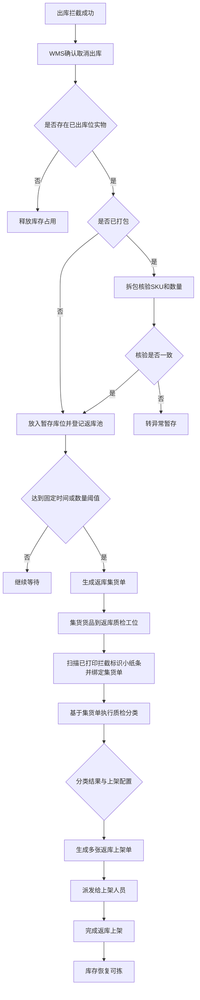

# xyWMS 拦截后返库上架需求分析文档

## 1. 文档信息

- 标题：xyWMS 拦截后返库上架需求分析
- 版本：V1.6
- 日期：2026-06-18
- 作者：Martin
- 相关方：WMS、仓库复核员、集货人员、质检人员、上架人员、仓内主管、产品、研发、测试
- 来源材料：当前对话补充信息

## 2. 背景

- 为什么要做这件事：
  - 出库拦截成功后，已经被拣出、复核、打包或推送到交接前的实物，需要回到可拣库存。
  - 这一步是 WMS 的内部仓内闭环，不是 OMS 关心的拦截结果。
  - 已打包包裹不能直接上架，必须拆包、核验后再返库。

- 当前业务或系统问题：
  - 拦截后如果不做统一返库，实物会长期滞留在工位旁暂存区。
  - 如果返库按单逐笔处理，仓库作业节奏会被打散。
  - 如果没有批量触发规则，集货和上架无法在固定节奏内完成。
  - 如果没有按仓库、货主、库区配置，返库触发规则无法覆盖不同仓库策略。
  - 返库池如果和暂存库位混为一谈，系统记录和实物位置会脱节。
  - 集货到返库质检工位后，如果没有扫码绑定集货单，后续质检分类和上架拆单无法建立单据追溯。
  - 标识小纸条的打印、模板尺寸和多国语言配置属于拦截域，返库上架域只消费已打印结果做扫码绑定。

## 3. 目标

- 希望达到什么结果：
  - WMS 能把出库拦截后的实物统一纳入待返库池。
  - 已打包包裹必须拆包核验后返库。
  - 待返库池支持按固定时间或数量阈值任一条件触发批量返库任务。
  - 返库任务支持按仓库、货主、库区配置。
  - WMS 推荐上架库位，完成上架后库存恢复为可拣。
  - 返库集货到返库质检工位时，支持通过已打印的拦截标识小纸条扫码绑定集货单。
  - 绑定完成后，系统按集货单执行质检分类，并按不同返库上架配置生成多张上架单派发给上架人员。

- 成功标准：
  - 未拣货订单只释放库存占用，不生成返库任务。
  - 已拣货、复核完成未打包、已打包、交接前剔除的实物都能进入正确的返库路径。
  - 已打包包裹不能跳过拆包核验直接上架。
  - 返库任务不是逐单生成，而是批量触发。
  - 返库完成后库存恢复为可拣。
  - 一单多件首件触发拦截后，系统能把同单后续货品强制归集到同一暂存库位。
  - 返库质检人员能扫码把实物绑定到集货单上，再基于集货单完成分类质检。
  - 系统能按不同返库上架配置生成多张上架单并派发给上架人员。

## 4. 问题定义

- 现在具体卡在哪里：
  - 出库拦截只解决“货还能不能继续发出去”的问题。
  - 真正回到库存可用状态，还需要拆包、核验、返库上架。
  - 同一批返库货可能来自多个复核工位、多个出库单，需要统一进入待返库池后再批量处理。
  - 返库规则如果不支持按仓库、货主、库区配置，不同仓的作业节奏无法统一。

- 不解决会带来什么影响：
  - 货物滞留在复核台、打包台或交接暂存区。
  - 返库节奏无法批量化，现场作业效率低。
  - 已打包包裹如果不拆包，会导致库存明细失真。
  - 库存恢复可拣的时点不清晰。

## 5. 适用范围

- 这次要做什么：
  - 接收出库拦截成功后的内部返库来源。
  - 对未拣货实物释放占用。
  - 对已拣货、复核完成未打包、已打包、交接前剔除的实物先进入暂存库位，再登记待返库池。
  - 按时间或数量阈值生成批量返库任务。
  - 推荐上架库位并完成返库上架。
  - 生成返库集货单，支持在返库质检工位通过已打印的拦截标识小纸条扫码绑定集货单。
  - 按集货单完成质检分类，并按返库上架配置生成多张上架单。
  - 恢复库存为可拣。

- 这次不做什么：
  - 不做出库拦截判断。
  - 不做 OMS 拦截结果回传。
  - 不做 TMS 交接结果处理。
  - 不做多包裹订单拦截。
  - 不做拦截标识小纸条打印、模板配置、重打和作废，这些由出库拦截需求承接。
  - 不展开异常暂存后的后续处理流程，相关处理由其他需求承接。
  - 不展开具体接口字段、表结构和索引实现。
  - 不展开售后退件或交接前售后流程的独立需求。

## 6. 目标系统边界

- 目标系统：`WMS`
- 库存责任归属：`WMS`
- 与其他系统的交互边界：

| 系统 | 职责 |
|---|---|
| OMS | 只关心是否拦截成功，不关心返库过程 |
| WMS | 负责返库来源汇集、拆包、批量返库、推荐库位、上架、库存恢复 |
| TMS | 不参与返库流程 |

## 7. 业务场景

### 7.1 返库来源场景

| 场景编号 | 来源状态 | 处理方式 |
|---|---|---|
| A1 | 未拣货订单被拦截 | 释放库存占用，不生成返库任务 |
| A2 | 已拣货未打包 | 放入暂存库位并登记返库池 |
| A3 | 复核完成未打包 | 放入暂存库位并登记返库池 |
| A4 | 已打包包裹被拦截 | 必须拆包核验后放入暂存库位并登记返库池 |
| A5 | 交接前包裹被拦截 | 从交接批次剔除后放入暂存库位并登记返库池 |
| A6 | 复核工位首件触发整单拦截 | 拦截域打印标识小纸条，WMS 锁定整单，同单后续货品归集到同一暂存库位并登记返库池 |

### 7.2 批量返库触发场景

| 场景编号 | 条件 | WMS 动作 |
|---|---|---|
| B1 | 待返库池未达触发条件 | 继续等待 |
| B2 | 到达固定返库作业时间 | 生成返库集货单 |
| B3 | 达到数量阈值 | 生成返库集货单 |
| B4 | 固定时间与数量阈值同时存在 | 任一条件满足即触发 |

### 7.3 返库质检与上架场景

| 场景编号 | 条件 | WMS 动作 |
|---|---|---|
| C1 | 返库集货单生成 | 发往返库质检工位 |
| C2 | 到达返库质检工位 | 扫描已打印拦截标识小纸条并绑定集货单 |
| C3 | 绑定完成 | 基于集货单执行质检分类 |
| C4 | 分类结果通过 | 按不同返库上架配置生成多张上架单 |
| C5 | 上架单派发 | 派发给对应上架人员 |
| C6 | 上架完成 | 库存恢复为可拣 |
| C7 | 实返 SKU 或数量不一致 | 标记异常分流，后续处理由其他需求承接 |

### 7.4 标识单扫码绑定场景

| 场景编号 | 条件 | WMS 动作 |
|---|---|---|
| D1 | 已打印拦截标识小纸条到达返库质检工位 | 扫码并绑定集货单 |
| D2 | 标识小纸条条码损坏或无法识别 | 提示重扫或人工处理 |
| D3 | 标识小纸条已绑定或集货单状态不允许绑定 | 提示不可重复绑定 |

### 7.5 与出库拦截场景的覆盖对照

| 拦截场景编号 | 拦截场景 | 本需求处理 | 是否进入返库闭环 | 备注 |
|---|---|---|---|---|
| A1 | OMS 发货订单状态变化，WMS 已存在出库单 | 作为返库来源入口，由 WMS 继续判断当前作业状态，不直接生成返库动作 | 否 | 入口层场景 |
| A2 | OMS 取消发货，WMS 已存在出库单 | 作为返库来源入口，由 WMS 继续判断当前作业状态，不直接生成返库动作 | 否 | 入口层场景 |
| A3 | OMS 重复下发同一状态变化 | 幂等处理，不重复生成返库任务 | 否 | 去重场景 |
| A4 | WMS 未匹配到出库单 | 记录未命中结果，不进入本需求核心流程 | 否 | 该场景在现网不发生 |
| B1-B2 | 复核前且尚未形成待拣实物 | 只释放库存占用，不生成返库任务 | 否 | 对应未拣货场景 |
| B3-B5 | 复核前但已形成待返库实物 | 放入暂存库位并登记返库池 | 是 | 对应已拣货或待复核实物 |
| C1-C3 | 复核完成未打包 | 放入暂存库位并登记返库池 | 是 | 对应复核完成未打包场景 |
| D1-D3 | 打包完成 | 已打包包裹必须拆包核验后放入暂存库位并登记返库池 | 是 | 对应已打包包裹场景 |
| E1-E4 | 交接前未完成交接确认 | 从交接批次剔除后放入暂存库位并登记返库池 | 是 | 对应交接前拦截场景 |
| E5 | 已完成交接确认 | 不允许拦截成功 | 否 | 直接失败 |
| F1-F3 | 拦截标识小纸条打印与模板变更 | 由拦截域负责，本需求仅消费已打印结果 | 否 | 外部依赖，不在本需求内实现 |

## 8. 业务规则

- 已打包包裹必须拆包后返库。
- 返库库位由 WMS 系统推荐。
- 返库库位推荐结果支持授权人员人工干预或覆盖。
- 返库不是逐单触发，而是进入待返库池后批量触发。
- 批量触发规则支持配置，固定时间和数量阈值任一满足即生成任务。
- 配置维度支持按仓库、货主、库区。
- 未拣货订单只做占用释放，不进入返库池。
- 待返库池是 WMS 内部逻辑待办池，不是物理库位；实物先进入暂存库位或暂存箱，再由系统登记返库池记录。
- 一单多件首件触发拦截时，拦截域负责打印标识小纸条并锁定整单，后续同单货品只能进入同一暂存库位。
- 返库集货单是批量返库的作业单据，返库质检工位通过扫描已打印的拦截标识小纸条将实物绑定到集货单后，才能开展质检分类。
- 返库上架域不负责标识小纸条打印、模板尺寸配置或多国语言输出。
- 质检分类维度至少包括良品、不良品、效期情况、生产批次情况、货主。
- 分类完成后，系统按不同返库上架配置拆分并生成多张上架单，派发给上架人员。
- 库存从返库待处理状态恢复到可拣状态后，WMS 内部闭环完成。

## 9. 流程说明

按步骤描述：

1. 出库拦截成功后，WMS 确认是否继续取消出库。
2. 如果没有已出库位实物，只释放库存占用。
3. 如果存在已出库位实物，先判断是否已经打包。
4. 已打包的包裹必须拆包，并核验 SKU 和数量。
5. 核验通过后，实物放入暂存库位并登记返库池。
6. 待返库池按固定时间或数量阈值触发返库集货单。
7. 集货完成后，货品到返库质检工位扫描拦截标识小纸条并绑定到集货单。
8. 基于集货单执行质检分类，按良品、不良品、效期、生产批次、货主等维度拆分。
9. 系统按不同返库上架配置生成多张上架单，并派发给上架人员。
10. 上架完成后，库存恢复为可拣。

## 10. 数据说明

- 关键字段：
  - 返库来源节点
  - 仓库
  - 货主
  - 库区
  - SKU
  - 数量
  - 实返数量
  - 标识单号
  - 标识单绑定状态
  - 暂存库位
  - 返库池编号
  - 返库集货单号
  - 质检分类结果
  - 上架配置编号
  - 上架单号
  - 推荐库位
  - 人工覆盖库位
  - 覆盖原因
  - 任务触发规则
  - 库存状态
  - 操作人

- 字段来源：
  - 拦截结果记录：返库来源节点、来源单号、来源包裹号。
  - 待返库池：返库池编号、仓库、货主、库区、SKU、数量、进入时间、暂存库位。
  - 返库集货单：返库集货单号、绑定状态、集货状态、触发规则、来源暂存位集合。
  - 拦截标识单：标识单号、关联出库单号、标识单绑定状态、扫码时间、扫码人、暂存库位。
  - 质检分类结果：良品/不良品、效期情况、生产批次情况、货主、分类数量。
  - 上架配置：上架配置编号、适用范围、生成规则、拆单规则。
  - 上架单：上架单号、目标库位、数量、执行状态。
  - 上架执行记录：推荐库位、人工覆盖库位、覆盖原因、覆盖人、确认时间。
  - 库存台账：库存状态、数量、库位、操作时间。
  - 主数据：仓库、货主、库区、SKU、库位。

- 枚举值：

| 枚举类型 | 枚举值 | 说明 |
|---|---|---|
| 来源节点 | 复核前 / 复核完成未打包 / 打包完成 / 交接前 | 返库来源 |
| 任务状态 | 待返库 / 返库中 / 已完成 / 异常中止 | 批量返库任务状态 |
| 集货单状态 | 待集货 / 集货中 / 待绑定 / 已绑定 / 已完成 / 异常中止 | 返库集货单状态 |
| 标识单状态 | 待绑定 / 已绑定 / 已作废 | 拦截标识单状态 |
| 库存状态 | 占用 / 返库待处理 / 可拣 / 暂存 / 异常 | 库存流转状态 |
| 触发方式 | 时间阈值 / 数量阈值 | 任务触发方式 |

- 相关表：
  - 待返库池：表名待确认。
  - 返库集货单：表名待确认。
  - 上架单：表名待确认。
  - 库存流水/库存台账：表名待确认。
  - 返库触发规则配置表：表名待确认。
  - 拦截标识单（外部引用）：表名待确认。
  - 返库质检分类结果表：表名待确认。
  - 上架配置表：表名待确认。

- 相关接口：
  - 拦截成功结果接收接口：来自出库拦截功能，复用已有流程。
  - 返库集货单生成接口：待确认。
  - 标识单绑定接口：待确认。
  - 质检分类提交接口：待确认。
  - 上架单拆分与派发接口：待确认。
  - 推荐库位接口：待确认。
  - 上架确认接口：待确认。

- 推荐库位接口返回字段建议：
  - `recommendedLocationCode`：推荐库位编码
  - `recommendedLocationName`：推荐库位名称
  - `recommendedLocationType`：推荐库位类型
  - `recommendedReason`：推荐原因或推荐规则来源

- 人工覆盖字段建议：
  - `overrideLocationCode`：人工覆盖库位编码
  - `overrideLocationName`：人工覆盖库位名称
  - `overrideReason`：覆盖原因
  - `overrideUser`：覆盖人
  - `overrideTime`：覆盖时间

- 返库触发规则配置建议字段：
  - 配置编号
  - 仓库
  - 货主
  - 库区
  - 触发逻辑，建议固定为 `任一满足即触发`
  - 时间触发开关
  - 固定作业时间
  - 数量触发开关
  - 数量阈值
  - 阈值单位，建议按件数或待返库明细数量统一
  - 优先级
  - 启用状态
  - 有效开始时间
  - 有效结束时间
  - 最后修改人
  - 最后修改时间

- 拦截标识单（外部引用）建议字段：
  - 标识单号
  - 关联出库单号
  - 关联返库池编号
  - 标识单类型
  - 暂存库位
  - 标识单绑定状态
  - 扫码时间
  - 扫码人

- 返库集货单建议字段：
  - 集货单号
  - 来源暂存位集合
  - 绑定状态
  - 集货状态
  - 质检状态
  - 派发状态

- 上架配置建议字段：
  - 配置编号
  - 适用仓库
  - 适用货主
  - 适用库区
  - 分类维度
  - 上架单拆分规则
  - 启用状态

## 11. 权限与限制

| 角色 | 权限 |
|---|---|
| 仓库复核员 | 查看拦截后待返库来源，放入暂存库位 |
| 集货人员 | 执行返库集货 |
| 质检人员 | 扫码绑定已打印标识小纸条，执行拆包核验和分类质检 |
| 上架人员 | 执行上架归位 |
| 仓内主管 | 配置触发规则，人工覆盖推荐库位，处理异常分流 |
| 系统管理员 | 配置仓库、货主、库区维度规则 |

限制：

1. 已打包包裹必须拆包后返库。
2. 返库任务不是逐单生成。
3. 返库触发规则必须支持按仓库、货主、库区配置。
4. 返库库位推荐结果必须支持人工干预。
5. OMS 不接收返库过程。
6. 返库异常分流不在本需求中继续定义处理流程。
7. 返库池是逻辑池，暂存库位是物理位。
8. 标识小纸条打印、模板配置、重打和作废不属于本需求边界。

## 12. 验收标准

| 验收点 | 通过标准 |
|---|---|
| 未拣货订单拦截 | 只释放库存占用，不生成返库任务 |
| 已拣货订单拦截 | 能进入待返库池 |
| 复核完成未打包拦截 | 能进入待返库池 |
| 已打包包裹拦截 | 必须拆包后才能进入返库 |
| 返库质检扫码绑定 | 扫码已打印标识小纸条并成功绑定集货单，才能进入分类 |
| 首件触发整单拦截 | 同单后续货品进入同一暂存库位 |
| 拦截场景覆盖 | B1-B5、C1-C3、D1-D3、E1-E5、F1-F3 都能在文档中找到对应处理或外部依赖说明 |
| 任务触发 | 固定时间或数量阈值任一满足时生成批量返库任务 |
| 规则配置 | 支持按仓库、货主、库区配置 |
| 推荐库位干预 | 支持授权人员人工覆盖推荐库位 |
| 上架完成 | 库存恢复为可拣 |

## 13. 待确认项

- 无。
