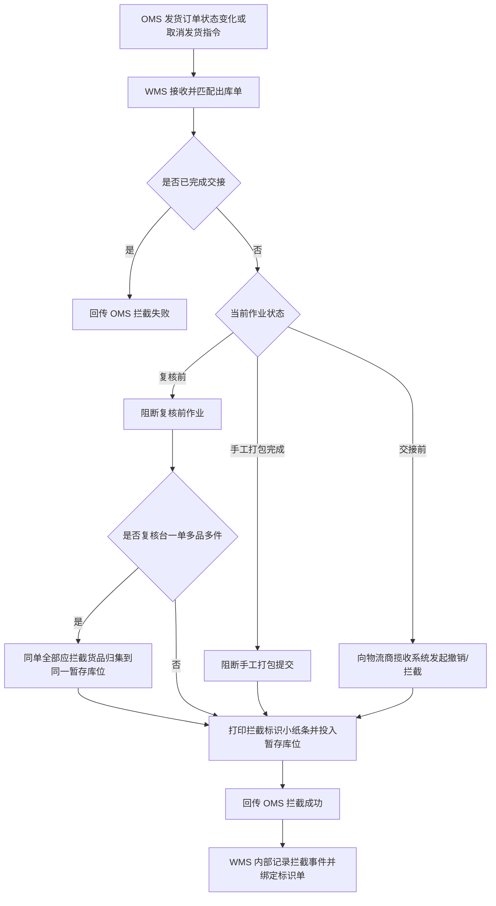

# xyWMS 出库拦截需求分析文档

## 1. 文档信息

- 标题：xyWMS 出库拦截需求分析
- 版本：V1.12
- 日期：2026-06-18
- 作者：Martin
- 相关方：OMS、WMS、TMS / 物流商揽收系统、仓库复核员、仓库主管、产品、研发、测试
- 来源材料：当前对话补充信息

## 2. 背景

- 为什么要做这件事：
  - 仓库在复核、手工打包、WMS 交接作业三个关键节点都可能收到拦截诉求。
  - 这些诉求来自 OMS 的发货订单状态变化，不是 OMS 侧新增拦截单。
  - WMS 必须在货物离仓前阻断后续出库动作，避免已经取消或暂停的订单继续流转。
  - 复核台拦截时，现场需要把同一出库单的实物和拦截标识放在同一个暂存库位，避免一单多品多件被拆散。

- 当前业务或系统问题：
  - 复核前、手工打包完成、WMS 交接作业前，这三类状态对拦截对象不一样，不能只用一个统一判断。
  - 复核完成未打包不是独立的有人机交互场景，不单列为拦截入口。
  - 如果拦截判断晚于仓内作业节点，货物会继续流入打包或交接，后续追回成本很高。
  - OMS 只需要知道这张发货订单是否被 WMS 成功拦截，不需要知道 WMS 内部返库处理过程。
  - 一单多品多件订单触发拦截时，拦截域需要锁定整单并归集同单全部应拦截实物，后续返库上架只消费该打印结果。

## 3. 目标

- 希望达到什么结果：
  - WMS 能判断当前出库单或包裹是否处于出库拦截相关可拦截节点。
  - WMS 成功阻断后续复核、手工打包或交接作业时，向 OMS 回传拦截成功。
  - 已完成交接的订单，WMS 回传拦截失败。
  - OMS 不新增拦截单，只通过发货订单状态变化触发拦截诉求。
  - 需要打印拦截标识小纸条，并支持模板尺寸、多国语言内容和重打作废控制。
  - 复核台拦截一单多品多件订单时，同一出库单需要拦截的全部货品必须归集到复核台旁同一暂存库位，并把拦截标识小纸条一起放入该暂存库位。

- 成功标准：
  - 复核前、手工打包完成、WMS 交接作业前三类场景都能被正确识别。
  - 复核完成未打包不作为独立拦截场景。
  - 已交接订单无法被误判为拦截成功。
  - WMS 对 OMS 的结果回传只覆盖拦截成功、拦截失败两个结果。
  - WMS 内部可以留存拦截记录，但不把它设计成 OMS 的业务单据。

## 4. 问题定义

- 现在具体卡在哪里：
  - 同一张发货订单，在不同作业节点上，拦截对象不同。
  - 复核前拦截的是出库单、拣货任务和未出库实物。
  - 复核完成未打包不作为独立场景。
  - 手工打包完成时，拦截的是已完成打包但尚未交接的包裹。
  - WMS 交接作业前，拦截的是已进入交接流程但尚未完成物流商揽收确认的包裹。

- 不解决会带来什么影响：
  - 已取消或暂停的订单继续出库。
  - 交接结果已经发送到 TMS / 物流商揽收系统后，仓库无法追回。
  - 仓库现场只能依赖人工口头通知，无法审计。

## 5. 适用范围

- 这次要做什么：
  - 接收 OMS 发货订单状态变化或取消发货指令。
  - 按当前出库节点判断是否允许拦截。
  - 阻断复核、手工打包、WMS 交接作业动作。
  - 在拦截成功后生成并打印拦截标识小纸条，供后续返库上架扫码绑定。
  - 明确复核台一单多品多件订单的暂存归集和标识投放规则。
  - 回传 OMS 拦截成功或拦截失败。

- 这次不做什么：
  - 不做返库上架、拆包、库存恢复流程。
  - 不做 OMS 拦截单设计。
  - 不做多包裹订单拦截。
  - 不做 TMS / 物流商揽收系统侧拦截判断。
  - 不展开具体接口字段、表结构和索引实现。

## 6. 目标系统边界

- 目标系统：`WMS`
- 库存责任归属：`WMS`
- 与其他系统的交互边界：

| 系统 | 职责 |
|---|---|
| OMS | 发起发货订单状态变化或取消发货指令；接收 WMS 拦截结果 |
| WMS | 判断可拦截节点；提供复核、手工打包和交接作业页面；阻断仓内作业；记录内部拦截事件；回传结果 |
| TMS / 物流商揽收系统 | 接收 WMS 传递的交接批次、撤销指令和正常揽收确认；不参与库存判断 |

## 7. 业务场景

### 7.1 拦截入口场景

| 场景编号 | 场景 | WMS 处理 | OMS 回传 |
|---|---|---|---|
| A1 | OMS 发货订单状态变化，WMS 已存在出库单 | 接收并匹配当前出库节点 | 拦截成功或拦截失败 |
| A2 | OMS 取消发货，WMS 已存在出库单 | 阻断后续作业 | 拦截成功或拦截失败 |
| A3 | OMS 重复下发同一状态变化 | 幂等处理 | 不重复回传 |
| A4 | WMS 未匹配到出库单 | 记录未命中结果 | 未命中，且不作为核心业务场景 |

### 7.2 复核前拦截场景

| 场景编号 | 仓库状态 | WMS 拦截动作 | OMS 回传 |
|---|---|---|---|
| B1 | 出库单已创建，未生成拣货任务 | 阻止生成拣货任务 | 拦截成功 |
| B2 | 已生成拣货任务，未开始拣货 | 冻结或取消拣货任务 | 拦截成功 |
| B3 | 拣货中，部分商品已拣出 | 阻止继续拣货 | 拦截成功 |
| B4 | 拣货完成，待复核 | 阻止复核扫描和提交 | 拦截成功 |
| B5 | 复核扫描中，未提交 | 阻止复核提交 | 拦截成功 |
| B6 | 复核台发现一单多品多件订单命中拦截 | 锁定整单，要求同一出库单全部应拦截货品归集到复核台旁同一暂存库位；全部归集完成后打印拦截标识小纸条并投入该暂存库位 | 拦截成功 |

复核台一单多品多件处理规则：

1. 首件或任一件命中拦截后，WMS 锁定整张出库单，阻止同单货品继续按正常出库链路流转。
2. 系统为该出库单确定一个复核台旁暂存库位，同单后续货品只能继续归集到该暂存库位。
3. 未全部归集完成前，暂存归集状态保持为“待归集”或“归集中”，不能结束拦截暂存动作。
4. 同一出库单全部应拦截货品归集完成后，系统打印拦截标识小纸条，复核员必须将纸条投入同一暂存库位。
5. 复核完成未打包不单列为独立拦截场景；如果系统中存在该状态变化，仅作为后台流转状态处理。

### 7.3 手工打包完成拦截场景

| 场景编号 | 仓库状态 | WMS 拦截动作 | OMS 回传 |
|---|---|---|---|
| C1 | 手工单已进入打包台，操作员未提交打包完成 | 阻止打包提交 | 拦截成功 |
| C2 | 手工单已完成打包，待进入交接 | 标记包裹不可交接 | 拦截成功 |
| C3 | 非手工单不存在打包完成节点 | 不适用 | 不作为拦截场景 |

说明：

- 打包完成只会出现在手工单作业流程中，且存在人机交互入口。
- 非手工单不进入“打包完成”拦截场景，系统不单列该状态。

### 7.4 WMS 交接作业拦截场景

| 场景编号 | 仓库状态 | WMS 拦截动作 | OMS 回传 |
|---|---|---|---|
| D1 | 包裹已完成打包，WMS 交接作业页已生成待交接单，未提交到物流商揽收系统 | 阻止创建/提交交接关系 | 拦截成功 |
| D2 | 交接单已提交到物流商揽收系统，物流商未开始揽收 | 撤销交接关系，或从交接批次剔除 | 拦截成功 |
| D3 | 物流商上门揽收中，WMS 交接作业页可见该批次正在处理，尚未提交揽收确认 | WMS 接收上游拦截指令后，在页面上执行撤销，并同步到物流商揽收系统或 TMS，阻止提交确认 | 拦截成功 |
| D4 | 物流商已完成揽收确认并回传成功 | 不允许拦截成功 | 拦截失败 |

交接前拦截说明：

- 交接作业在 WMS 页面上管理，仓库人员在 WMS 中查看待交接包裹、创建交接单/批次、提交或撤销交接；拦截诉求由上游系统发起后，WMS 负责执行。
- 物流商揽收系统或 TMS 负责接收 WMS 传递的交接批次、撤销指令和揽收确认结果。
- WMS 能拦截的窗口是“WMS 交接作业页已生成待交接单”到“物流商揽收确认提交前”。
- 如果物流商系统已经完成揽收确认并回传成功，WMS 必须判定为已交接，不能再返回拦截成功。
- 如果物流商系统不支持在线撤销或接口异常，WMS 只能冻结交接批次并通知仓内主管人工处理，不得假设已经拦截成功。

### 7.5 拦截标识小纸条打印场景

| 场景编号 | 触发条件 | WMS 拦截动作 | OMS 回传 |
|---|---|---|---|
| F1 | 拦截成功且实物需要进入暂存区 | 生成并打印拦截标识小纸条，绑定出库单号、暂存库位和拦截结果 | 拦截成功 |
| F2 | 一单多品多件订单在复核台触发整单拦截 | 锁定整单，同单全部应拦截货品归集到同一暂存库位；确认全部归集后打印标识小纸条并投入该暂存库位 | 拦截成功 |
| F3 | 模板尺寸或语言版本变更 | 按启用模板打印，纸条大小由模板配置决定 | 不影响拦截结果 |
| F4 | 拦截标识小纸条内容生成 | 按当前语言版本生成内容，必须包含“拦截”字样、出库单编码、SKU 明细、每个 SKU 的复核异常差异数量 | 不影响拦截结果 |

拦截标识小纸条内容规则：

1. 纸条大小由模板配置决定，WMS 按当前启用模板打印，不在业务规则里硬编码固定尺寸。
2. 内容支持多国语言，字段标题和描述文案按语言版本渲染。
3. 纸条中必须保留“拦截”字样，不能因为语言切换而省略。
4. 纸条中必须展示出库单编码。
5. 纸条中必须展示 SKU 明细，若同一出库单包含多个 SKU，按明细逐行展示。
6. 纸条中必须展示复核异常差异数量，复核异常差异数量与 SKU 明细逐行对应。
7. 打印完成后，纸条必须和该单暂存实物一起投入同一个暂存库位。

## 8. 业务规则

- OMS 不建拦截单，使用发货订单状态变化覆盖拦截诉求。
- OMS 只关心拦截成功、拦截失败两个结果。
- WMS 可以保留内部拦截记录，但不把它作为 OMS 的业务单据。
- 拦截诉求只能由 OMS 或对接的物流商揽收系统 / TMS 发起，WMS 不主动创建拦截诉求，只执行上游下发的拦截指令。
- WMS 内部拦截记录需要独立查询页面，支持查看、筛选和追溯拦截事件。
- 复核完成未打包不作为独立拦截场景，只作为后台流转状态处理。
- 本需求不覆盖多包裹订单拦截。
- 已完成交接后，不再允许拦截成功。
- 一单多品多件订单在复核台触发整单拦截时，必须锁定整单，同一出库单下全部应拦截货品只能归集到同一个复核台旁暂存库位。
- 复核台暂存归集完成后，必须打印拦截标识小纸条，并把纸条随货投入同一个暂存库位。
- 拦截标识小纸条大小由模板配置控制，内容支持多国语言。
- 拦截标识小纸条内容必须包含“拦截”字样、出库单编码、SKU 明细、每个 SKU 的复核异常差异数量，并按语言模板渲染。
- 拦截标识小纸条支持重打和作废控制。

## 9. 流程说明

按步骤描述：

1. OMS 发起发货订单状态变化或取消发货指令。
2. WMS 接收指令后，先匹配发货订单对应的出库单。
3. WMS 判断出库拦截相关当前作业节点是否处于可拦截状态。
4. 如果已完成交接，WMS 回传拦截失败。
5. 如果未完成交接，WMS 阻断复核、手工打包或交接动作。
6. 如果是复核台一单多品多件订单拦截，WMS 锁定整单，并要求同一出库单全部应拦截货品归集到同一暂存库位。
7. 复核台归集完成后，WMS 打印拦截标识小纸条，并记录模板、语言和打印状态；纸条必须随货投入同一暂存库位。
8. 对于交接场景，WMS 在交接页面上执行上游撤销/拦截，并同步到物流商揽收系统或 TMS；最终揽收确认结果由外部系统回传到 WMS 页面。
9. WMS 向 OMS 回传拦截成功。
10. WMS 留存内部拦截记录，并保留标识单对象供后续扫码追溯。

## 10. 数据说明

- 关键字段：
  - 发货订单号
  - WMS 出库单号
  - 出库拦截相关当前作业节点
  - 拦截结果
  - 拦截原因
  - 失败原因码
  - 失败原因说明
  - 拦截时间
  - 来源系统
  - 处理人
  - 上游请求编号
  - 是否手工单
  - 标识单号
  - 标识单模板编号
  - 标识单模板尺寸
  - 标识单模板语言
  - 标识单展示文案
  - 标识单必填内容：拦截字样、出库单编码、SKU 明细、每个 SKU 的复核异常差异数量
  - 暂存库位
  - 归集状态
  - 复核异常差异数量
  - 打印状态
  - 打印时间
  - 打印人
  - 重打次数
  - 作废状态

- 字段来源：
  - OMS 发货订单状态变化：发货订单号、状态变化、取消原因、来源系统、上游请求编号。
  - WMS 出库单：出库单号、出库拦截相关当前作业节点、作业状态、交接作业状态。
  - WMS 拦截事件：拦截结果、失败原因码、失败原因说明、拦截时间、处理人、内部记录编号、归集状态、暂存库位、是否手工单、交接批次号、上游请求编号。
  - WMS 标识单：标识单号、模板编号、模板尺寸、语言版本、展示文案、出库单编码、SKU 明细、每个 SKU 的复核异常差异数量、打印状态、打印时间、打印人、重打次数、作废状态。
  - WMS 交接作业单：交接批次号、交接单号、物流商、揽收状态、交接作业状态、提交时间、撤销时间、确认时间。

- 枚举值：

| 枚举类型 | 枚举值 | 说明 |
|---|---|---|
| 拦截结果 | 拦截成功 / 拦截失败 | OMS 只接收这两个结果 |
| 出库拦截相关当前作业节点 | 复核前 / 手工打包完成 / WMS 交接作业前 / 已交接 | 仅用于出库拦截判断，不代表 WMS 全量作业节点 |
| 是否手工单 | 是 / 否 | 区分是否存在打包完成节点 |
| 交接作业状态 | 待交接 / 已提交 / 揽收中 / 已揽收 / 已撤销 | WMS 交接页面识别用 |
| 来源系统 | OMS | 拦截诉求来源 |
| 标识单打印状态 | 待打印 / 已打印 / 已重打 / 已作废 | 标识小纸条打印状态 |
| 暂存归集状态 | 待归集 / 归集中 / 已归集 / 异常 | 复核台一单多品多件暂存归集状态 |

- 相关表：
  - 出库单头/明细：表名待确认。
  - 内部拦截记录表：表名待确认。
  - OMS 状态变化接收记录：表名待确认。
  - 拦截标识单表：表名待确认。
  - 标识单模板配置表：表名待确认。

- 相关接口：
  - OMS 发货订单状态变化下发接口：已有流程，字段沿用现状。
  - WMS 拦截结果回传接口：字段和枚举值见下文 10.1。
  - TMS 正常交接结果发送接口：已有流程，保持不变。

### 10.1 WMS 拦截结果回传接口

| 字段名 | 必填 | 说明 |
|---|---|---|
| 上游请求编号 | 是 | 上游拦截诉求的唯一编号，用于幂等和追踪 |
| OMS 发货订单号 | 是 | OMS 侧发货订单号 |
| WMS 出库单号 | 是 | WMS 侧出库单号 |
| 拦截结果 | 是 | 见下方枚举值 |
| 出库拦截相关当前作业节点 | 是 | 见下方枚举值 |
| 拦截时间 | 是 | WMS 判定并回传结果的时间 |
| 失败原因码 | 否 | 仅拦截失败时必填 |
| 失败原因说明 | 否 | 仅拦截失败时补充说明原因 |
| 交接批次号 | 否 | 交接场景回传使用 |

| 枚举类型 | 枚举值 | 说明 |
|---|---|---|
| 拦截结果 | 拦截成功 / 拦截失败 | OMS 只接收这两个结果 |
| 出库拦截相关当前作业节点 | 复核前 / 手工打包完成 / WMS 交接作业前 / 已交接 | 仅用于出库拦截判断，不代表 WMS 全量作业节点 |
| 失败原因码 | ORDER_NOT_FOUND / ALREADY_HANDED_OVER / NODE_NOT_ALLOWED / UPSTREAM_REJECTED / SYSTEM_ERROR | 仅拦截失败时使用 |

失败原因码说明：

| 失败原因码 | 说明 |
|---|---|
| ORDER_NOT_FOUND | 未找到对应出库单 |
| ALREADY_HANDED_OVER | 订单已完成交接 |
| NODE_NOT_ALLOWED | 当前节点不允许拦截 |
| UPSTREAM_REJECTED | 上游撤销或拦截失败 |
| SYSTEM_ERROR | 系统异常 |

## 11. 权限与限制

| 角色 | 权限 |
|---|---|
| 复核员 | 查看拦截提示，停止当前复核作业，打印拦截标识小纸条 |
| 仓库主管 | 查看拦截结果，处理异常情况，重打或作废标识单 |
| 系统管理员 | 配置节点识别规则、标识单模板尺寸和多国语言内容 |
| OMS 用户 | 查看 WMS 回传的拦截结果 |

限制：

1. 不支持多包裹订单拦截。
2. 已完成交接的订单不允许拦截成功。
3. OMS 不新增拦截单。
4. OMS 不接收返库过程信息。
5. 拦截标识小纸条打印、模板配置和重打作废归属 WMS 拦截域。
6. 复核完成未打包不作为独立拦截场景。
7. 复核台一单多品多件订单必须完成同单全部应拦截货品归集后，再把拦截标识小纸条投入对应暂存库位。
8. 打包完成仅适用于手工单流程。
9. 交接拦截由上游系统发起，WMS 页面负责执行和管理，并通过物流商揽收系统或 TMS 的撤销、剔除和确认阻断实现。

## 12. 验收标准

| 验收点 | 通过标准 |
|---|---|
| 复核前拦截 | WMS 能阻断复核流程并回传拦截成功 |
| 手工打包完成拦截 | WMS 能阻断手工打包提交并回传拦截成功 |
| WMS 交接作业拦截 | WMS 能在交接页面执行上游撤销/拦截并通过物流商揽收系统或 TMS 阻断交接确认并回传拦截成功 |
| 已交接场景 | WMS 回传拦截失败 |
| OMS 单据口径 | OMS 不新增拦截单，只接收拦截结果 |
| 复核台一单多品多件归集 | 同一出库单全部应拦截货品归集到同一暂存库位，系统记录暂存库位和归集状态 |
| 拦截标识打印 | 拦截成功后可打印标识小纸条，且模板尺寸和语言版本可配置 |
| 标识内容 | 标识小纸条内容必须支持多国语言，并包含“拦截”字样、出库单编码、SKU 明细、每个 SKU 的复核异常差异数量 |
| 内部拦截记录查询 | WMS 具备独立查询页面，可查看并检索内部拦截记录 |
| 标识投放 | 复核台归集完成后，拦截标识小纸条必须随货投入同一暂存库位 |
| 场景口径 | 复核完成未打包不作为独立场景，打包完成仅限手工单 |
