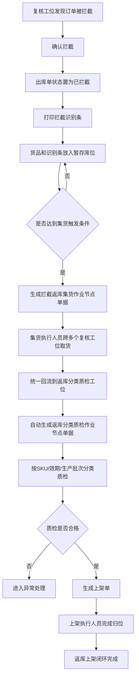
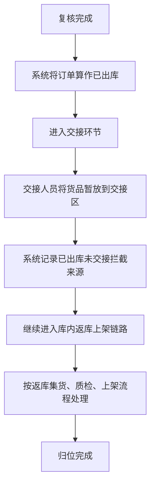

# WMS - 返库上架方案

## 一、方案目标
为了更好地进行仓内管理，系统需要支持返库上架场景，达到对作业流程全过程监控，并可向计费系统提供实际操作数据作为计费基础。

1. 需要实现仓内货物回到原库位，并对过程做记录。
2. 在返库过程中可以发现不良品、效期不好的品。

## 二、场景范围

### 2.1 返库上架主流程
本方案描述的是电商场景内“库内拦截返库上架”流程，包含两种场景：

1. 未出库拦截返库上架：订单在复核工位被拦截，出库单直接进入已拦截状态；
2. 已出库未交接拦截返库上架：订单在系统里已经算作已出库，但在交接前被暂存，仍回到库内返库链路处理，出库单主状态不再变更。

这两种场景下，拦截下来的货品都先进入复核工位旁的暂存库位，系统按照数量阈值、时间阈值或人工触发的组合条件，批量生成集货作业节点单据。集货完成后自动生成分类质检作业节点单据，质检合格后再生成上架单完成归位。整个返库链路只和原出库单建立关联，不回写改变出库单后续状态。容器是否使用可以待定，系统先按暂存库位/大箱的方式管理即可。  

售后到货返库上架属于另一条独立需求，不在本方案中。

### 2.2 相关支持场景
返库上架相关的来源场景只保留库内拦截两类：

1. 未出库拦截返库上架
   - 出库订单拦截：外部消息通知，不再让这张订单出库，会在复核工位拦截，存到暂存工位。
   - 货品异常拦截：复核台发现货品多拣货，报多拣，然后存到暂存工位。
2. 已出库未交接拦截返库上架
   - 系统中复核完成后已算作已出库，但在交接前被暂存的货品，仍回到库内返库链路处理。
   - 这类货品保留原订单关联，但不再回写改变出库单已出库状态。

售后到货返库上架另起文档，不放在本方案中。

### 2.3 单据对比关系

本方案里的单据对比按“单头 1:N 明细”来定义，不做 N:N 直连。

1. 出库单头和拦截识别条：1 张出库单头对应 1 张识别条，识别条内包含多条拦截明细。
2. 出库单头和拦截明细：1 个出库单头对应多条拦截明细；若同一出库单内出现整单拦截、多拣、少拣，统一落在同一张识别条里。
3. 拦截返库集货作业节点单据和来源明细：1 张集货单可以汇总多张出库单的多条拦截明细，集货单头承接汇总关系，集货单明细记录来源。
4. 返库分类质检作业节点单据和上架单：都按单头 1:N 明细处理；单头只负责承接汇总和状态，明细负责数量、SKU、效期、批次和库位拆分。

## 三、主流程说明

### 3.1 流程说明
本方案的主流程是电商场景内“订单拦截后的返库上架”。订单在复核工位被拦截后，出库单直接进入已拦截状态；拦截下来的货品进入暂存库位，系统按数量阈值、时间阈值或人工触发的组合条件生成集货作业节点单据。集货完成后自动生成分类质检作业节点单据，质检合格后生成上架单完成归位。

整个返库链路只和原出库单建立关联，不回写改变出库单后续状态。容器是否启用可以后续再定，当前先按暂存库位或大箱方式管理即可。

### 3.2 流程图

### 3.3 角色分工

| 角色 | 负责动作 | 系统支持 |
| --- | --- | --- |
| 复核员 | 确认拦截、打印识别条、放入暂存库位 | 拦截确认、识别条打印、暂存记录 |
| 集货执行人员 | 按集货单跨多个复核工位取货并回流 | 集货待办、来源工位提示、批量回流登记 |
| 质检人员 | 分类、验效期、验批次、判不良 | 质检单、质检结果录入、异常原因记录 |
| 上架执行人员 | 按上架单完成归位 | 上架单、目标库位推荐、上架确认 |
| 主管/调度 | 设置阈值、人工触发、处理异常 | 阈值配置、单据状态监控、异常干预 |

### 3.4 节点输入输出

| 节点 | 输入 | 输出 |
| --- | --- | --- |
| 拦截确认 | 出库单、拦截事件、复核工位 | 出库单已拦截、拦截识别条、暂存记录 |
| 批量集货 | 暂存库位中的被拦截货品、触发条件 | 拦截返库集货作业节点单据、集货完成记录 |
| 分类质检 | 集货完成的货品、SKU 主数据、效期/批次信息 | 返库分类质检作业节点单据、合格/不合格结果 |
| 上架执行 | 质检合格货品、库位主数据 | 上架单、上架完成记录 |

### 3.5 异常场景说明

| 异常场景 | 处理方式 |
| --- | --- |
| 纸条丢失或污损 | 允许重打识别条，不影响单据状态 |
| 暂存库位已满 | 暂停继续入位，通知主管处理或切换暂存位 |
| 集货时找不到货品 | 记录缺货异常，终止或拆分该集货单 |
| 质检发现不良品 | 记录不良原因，不生成正常上架单 |
| 质检发现过期或批次异常 | 进入异常处理，不进入正常库存 |
| 上架库位不足 | 暂停上架，等待重新分配库位或拆单处理 |
| 订单少拣但已被拦截 | 少拣数量只记差异，不进入返库实物流转 |

## 四、已出库未交接拦截补充说明

已出库未交接拦截不是售后到货入库场景，而是订单已经在系统中完成复核、状态算作已出库之后，在交接环节再被暂存并回流到库内返库上架链路处理的场景。

这类货品的处理链路和前面的“未出库拦截返库上架”共享同一条返库上架流程，只是出库单主状态保持已出库，不再回写变更。

### 4.1 补充流程

1. 订单复核完成后，系统已将该单算作已出库。
2. 货品在交接环节被交接人员暂放到边上或交接暂存位。
3. 系统记录该批货品来自已出库未交接拦截场景，后续继续进入库内返库上架链路。
4. 该场景不改变出库单已出库状态，但会保留与原订单、交接暂存位、经手人的关联。

### 4.2 补充规则

1. 该场景回到库内返库上架链路，不进入售后到货入库流程。
2. 该场景只记录关联和过程，不回写改变已出库状态。
3. 货品可保留与原订单的关联关系，便于追溯。

### 4.3 补充流程图

