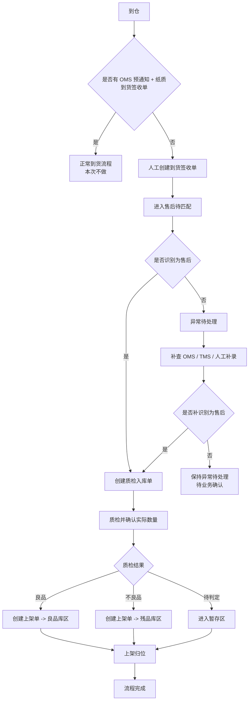

# xyWMS 售后到货入库 Plan 方案

> 需求分析文档已确认，本文档用于定义售后到货入库的方案边界、流程、规则、页面范围和数据边界。本文档确认后，才进入原型阶段。

## 一、需求理解

### 1.1 背景

- 业务背景：
  - 正常到货属于 OMS 预先下发到货通知，并随货附纸质到货签收单的流程，属于正常到货业务，不在本次范围。
  - 本次关注的是没有 OMS 预通知时，由 WMS 人工创建到货签收单进入售后待匹配的场景。
  - 售后退回货到仓后，需要继续完成质检入库、上架、库存数量确认和异常处理。
  - 电商小包裹退件和整卡板分销退货共用同一套售后入库主流程。

- 当前问题：
  - 人工创建的到货签收单如果被误当作正常到货入口，会和正常到货流程混淆。
  - 如果等待 OMS 售后单先到，实物会滞留，影响仓内作业。
  - 到货签收阶段无法确认实际数量，必须把数量确认放到质检入库阶段。
  - 整卡板货量大，需要支持分段质检、分段上架，而不是一次性处理完。

- 影响对象：
  - 收货员、质检人员、上架人员、仓内主管、OMS 对接人员。

### 1.2 目标

- 业务目标：
  - 建立一条只面向售后待匹配的 WMS 入库链路。
  - 让人工创建的到货签收单只承接售后匹配，不流转到正常到货流程。
  - 让质检入库单承担实际数量确认，且由 WMS 在这一阶段形成库存数量。
  - 让上架单只负责库位归位，不再改变数量。

- 用户目标：
  - 收货员可以先收货、后匹配。
  - 质检人员可以在质检入库时确认实际数量、差异和质量结果。
  - 上架人员可以按良品库区、残品库区、暂存区完成归位。

- 成功标准：
  - 没有 OMS 预通知的到货能够先进入售后待匹配。
  - 人工创建的到货签收单只能继续匹配售后，不能转入正常到货流程。
  - 小包裹和整卡板共用同一套流程和三张作业单。
  - 库存数量在质检入库单完成时确认，签收单不计库存。

## 二、范围定义

### 2.1 本次要做

| 模块 | 说明 | 优先级 |
|------|------|--------|
| 人工到货签收单 | 没有 OMS 预通知时创建，进入售后待匹配 | P0 |
| 售后匹配 | 通过 OMS、运单或人工补录后续识别为售后 | P0 |
| 质检入库单 | 质检时确认实际数量、质量和差异 | P0 |
| 上架单 | 完成库位归位，进入良品/残品/暂存区 | P0 |
| 整卡板分段处理 | 支持分段质检、分段上架、多次执行 | P0 |
| 异常待处理 | 无法识别来源、无法匹配售后、差异异常 | P1 |

### 2.2 本次不做

| 内容 | 不做原因 | 后续处理 |
|------|----------|----------|
| 正常到货流程 | 属于 OMS 预通知 + 纸质到货签收单链路 | 其他需求单独处理 |
| OMS 售后单创建/审批/退款 | 属于售后上游流程 | 后续需求补充 |
| 客服/财务/平台仲裁 | 不影响本次 WMS 入库链路 | 后续扩展 |
| 复核工位拦截返库上架 | 不是本次场景 | 其他需求处理 |
| 新增三单之外的入库单据 | 已明确 WMS 只保留三张作业单 | 不扩展 |

## 三、用户与场景

| 用户角色 | 使用场景 | 核心诉求 |
|----------|----------|----------|
| 收货员 | 没有 OMS 预通知到仓、人工创建到货签收单 | 先收货，再匹配售后 |
| 质检人员 | 质检入库 | 确认实际数量、良品/不良品/有效期/差异 |
| 上架人员 | 完成上架归位 | 按库区完成落位 |
| 仓内主管 | 异常处理、整卡板分段推进 | 盯进度、处理异常、补关联 |
| OMS 对接 | 售后单后到 | 支持与已收货记录补关联 |

## 四、业务流程

## 五、关键业务规则

| 规则编号 | 规则名称 | 规则说明 | 影响范围 |
|----------|----------|----------|----------|
| BR-001 | 正常到货隔离 | 正常到货必须有 OMS 预通知和纸质到货签收单，不在本次范围 | 入口控制 |
| BR-002 | 人工签收单仅匹配售后 | 没有 OMS 预通知时人工创建的到货签收单，只允许进入售后待匹配 | 到货签收单 |
| BR-003 | 签收不计库存 | 到货签收单只承接货到仓，不形成库存数量 | 签收环节 |
| BR-004 | 质检确认数量 | 实际数量在质检入库单完成时确认 | 质检入库单 |
| BR-005 | 上架只改库位 | 上架单只负责库位归位，不再改变数量 | 上架单 |
| BR-006 | 小包裹/整板共用流程 | 电商小包裹和整卡板退货共用同一套入库主流程 | 全链路 |
| BR-007 | 整板允许分段 | 整卡板允许按批次/箱/分段多次质检、多次上架 | 处理粒度 |
| BR-008 | 差异规则统一 | 少件、多件、错货、有效期异常、良品/不良品统一记录 | 验收规则 |
| BR-009 | 异常待处理闭环 | 识别不了是否售后时，必须进入异常待处理；补查后可继续售后链路，仍无法识别则保持待确认 | 异常处理 |

## 六、页面与操作范围

| 页面 | 页面目标 | 主要操作 | 备注 |
|------|----------|----------|------|
| 到货签收单列表/详情 | 管理人工创建的待售后匹配单据 | 新建、签收、补录、补关联、标记异常 | 核心入口 |
| 质检入库单列表/详情 | 记录质检结果并确认实际数量 | 创建、质检、确认数量、提交差异 | 核心页面 |
| 上架单列表/详情 | 完成库位归位 | 创建、领取、上架、完成 | 核心页面 |
| 异常待处理列表/详情 | 处理无法识别来源或无法匹配售后的记录 | 查看、补查、补关联、关闭 | 重点校验 |

## 七、数据与系统边界

### 7.1 关键数据对象

| 数据对象 | 来源 | 用途 |
|----------|------|------|
| 到货签收单 | WMS | 承接人工到货、售后待匹配入口 |
| 质检入库单 | WMS | 质检确认数量、记录差异和质量结果 |
| 上架单 | WMS | 记录库位归位结果 |
| OMS 售后单 | OMS | 售后匹配依据 |
| 运单/承运信息 | TMS | 辅助识别来源 |
| 库存台账（WMS内部模块） | WMS | 质检完成后形成库存数量 |
| 库位主数据 | WMS | 良品库区、残品库区、暂存区分流 |
| SKU 主数据 | WMS/主数据系统 | 质检和上架判断 |
| 关联记录/异常记录 | WMS | 追溯和补查 |

### 7.2 系统边界

- 目标系统：`WMS`
- 上游系统：`OMS`、`TMS/承运系统`
- 下游系统：后续出库业务模块
- 库存责任归属：WMS 在质检入库单完成时确认实际数量并形成库存；签收单不计库存；上架单不改数量

## 八、风险与待确认项

| 类型 | 内容 | 需要谁确认 | 影响 |
|------|------|------------|------|
| 待确认 | 人工创建签收单后，识别售后的最小匹配键是什么 | 业务方/OMS | 影响补关联准确率 |
| 待确认 | 到货签收单的创建方式和来源状态是否还要细分 | 业务方/WMS | 影响列表状态设计 |
| 待确认 | 整卡板分段拆分粒度按箱、托盘、批次还是库位 | 业务方/仓内主管 | 影响质检和上架节奏 |
| 待确认 | 良品库区、残品库区、暂存区的状态字典 | 业务方/WMS | 影响状态机 |
| 待确认 | 无法识别来源的异常是否需要独立入口 | 业务方/运营 | 影响异常页设计 |
| 风险 | 正常到货与售后待匹配混淆 | 业务方/产品 | 影响范围边界 |

## 九、原型建议

- 需要覆盖的页面：
  - 到货签收单列表/详情
  - 质检入库单列表/详情
  - 上架单列表/详情
  - 异常待处理列表/详情

- 需要重点表达的交互：
  - 人工创建签收单后默认进入售后待匹配
  - 质检入库时确认实际数量
  - 上架单只处理库位归位
  - 整卡板支持分段质检、分段上架
  - 异常记录支持补关联售后

- 需要重点校验的业务规则：
  - 人工创建签收单不能转正常到货
  - 签收不计库存
  - 质检入库确认数量
  - 上架不改数量
  - 小包裹和整板共用同一主流程

## 十、确认结论

- Plan 是否确认：待用户确认
- 进入下一阶段条件：用户明确确认 Plan 后，才生成原型
