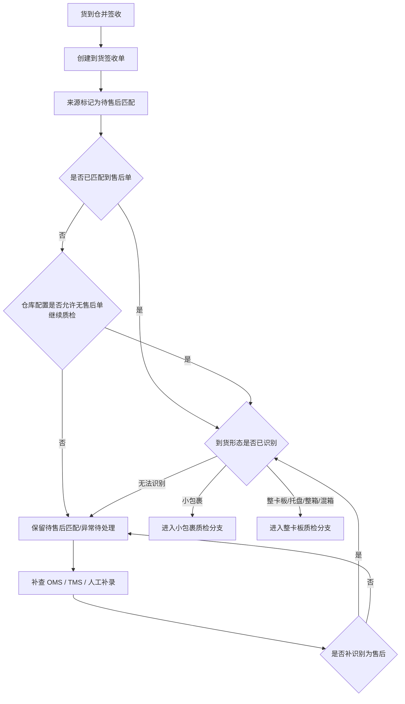
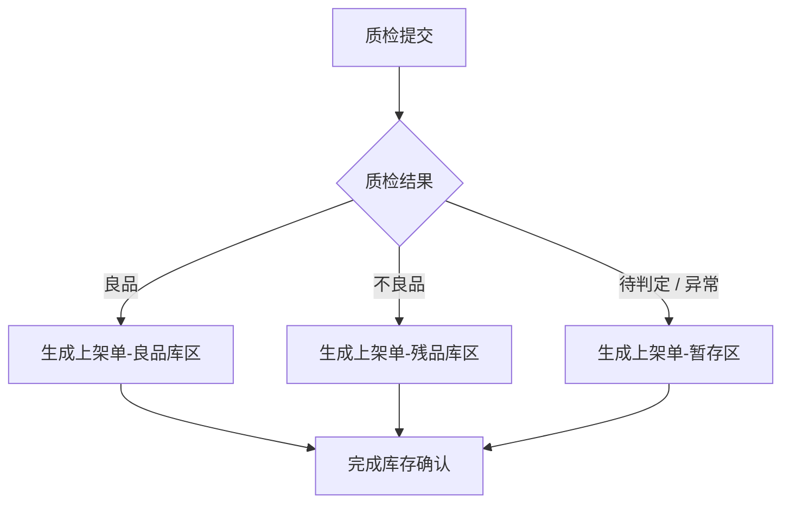
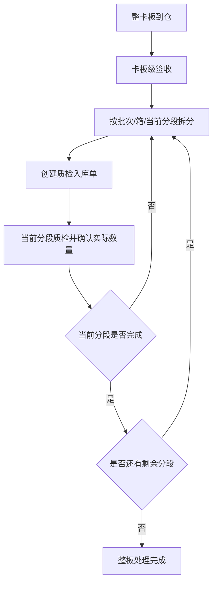
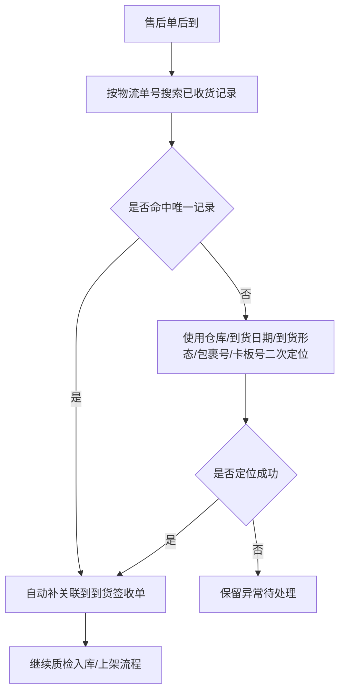

# xyWMS 售后到货入库 Plan 方案

> 需求分析文档已确认，本文档用于定义售后到货入库的方案边界、流程、规则、页面范围和数据边界。本文档确认后，才进入原型阶段。

## 0. 文档信息

- 标题：xyWMS 售后到货入库 Plan 方案
- 文档类型：Plan
- 版本：V1.0
- 日期：2026-06-18
- 作者：Martin
- 相关方：仓库运营、收货岗位、质检岗位、上架岗位、仓内主管、OMS 对接、TMS/承运对接、产品、研发、测试、实施/运维
- 来源材料：`00Requirements/After-sales Receipt Requirements.md`、当前对话确认信息
- 模板来源：`reference/plan-template.md`

## 一、需求理解

### 1.1 背景

- 业务背景：
  - 正常到货属于 OMS 预先下发到货通知，并随货附纸质到货签收单的流程，不在本次范围。
  - 本需求关注没有 OMS 预通知时，仓库人工创建到货签收单后进入售后待匹配的场景。
  - 售后退回货到仓后，需要继续完成质检入库、上架、库存数量确认和异常处理。
  - 电商小包裹退件和整卡板分销退货共用同一套售后入库主流程。
  - 到货签收只承接货到仓，不形成库存；实际数量在质检入库阶段确认；上架只负责库位归位。

- 当前问题：
  - 人工创建的到货签收单如果被误当作正常到货入口，会和正常到货流程混淆。
  - 如果等待 OMS 售后单先到，实物会滞留，影响仓内作业效率。
  - 到货签收阶段无法确认实际数量，数量确认必须放到质检入库阶段。
  - 整卡板货量大，如果不能分段处理，现场无法按实际节奏作业。
  - 如果没有统一的验收和库区规则，良品、不良品和待判定货物容易混放。

- 影响对象：
  - 收货员、质检人员、上架人员、仓内主管、OMS 对接人员、TMS/承运对接人员。

### 1.2 目标

- 业务目标：
  - 建立一条以人工创建到货签收单为入口、面向售后待匹配的 WMS 入库链路。
  - 让人工创建的到货签收单只承接售后匹配，不流转到正常到货流程。
  - 让质检入库单承担实际数量确认，并由 WMS 在这一阶段形成库存数量。
  - 让上架单只负责库位归位，不再改变数量。
  - 让小包裹和整卡板共享同一套主流程，并支持整板分段质检、分段上架。

- 用户目标：
  - 收货员可以先收货、后匹配。
  - 质检人员可以在质检入库时确认实际数量、差异和质量结果。
  - 上架人员可以按良品库区、残品库区、暂存区完成归位。
  - 仓内主管可以对无法识别来源、无法匹配售后的记录做补查和补关联。

- **成功标准**：
  - 没有 OMS 预通知的到货能够先进入售后待匹配，不因售后单晚到而阻断收货。
  - 人工创建的到货签收单只能继续匹配售后，不能转入正常到货流程。
  - 仓库级配置可以区分“阻断质检”和“放行质检”两种处理。
  - 小包裹和整卡板共用同一套三单链路。
  - 库存数量在质检入库单完成时确认，签收单不计库存。

### 1.3 方案边界一句话定义

- 这是一条以“人工到货签收单”为入口、以“售后匹配”为前置判断、以“质检入库确认数量”为库存记账点、以“上架归位”为结束动作的 WMS 售后退回入库方案。

## 二、范围定义

### 2.1 本次要做

| 模块 | 说明 | 优先级 |
|------|------|--------|
| 人工到货签收单 | 没有 OMS 预通知时创建，进入售后待匹配 | P0 |
| 售后匹配 | 通过 OMS、运单、包裹号、卡板号或人工补录后续识别为售后 | P0 |
| 无售后单处理策略 | 仓库级配置控制“阻断质检 / 放行质检” | P0 |
| 质检入库单 | 质检时确认实际数量、质量结果和差异原因 | P0 |
| 上架单 | 完成库位归位，进入良品/残品/暂存区 | P0 |
| 整卡板分段处理 | 支持分段质检、分段上架、多次执行 | P0 |
| 异常待处理 | 无法识别来源、无法匹配售后、差异异常 | P1 |
| 仓库级售后入库配置 | 维护无售后单处理策略和有效期规则 | P1 |

### 2.2 本次不相关

| 内容 | 不做原因 | 后续处理 |
|------|----------|----------|
| 正常到货流程 | 属于 OMS 预通知 + 纸质到货签收单链路 | 其他需求单独处理 |
| OMS 售后单创建 / 审批 / 退款 | 属于售后上游流程 | 后续需求补充 |
| 客服 / 财务 / 平台仲裁 | 不影响本次 WMS 入库链路 | 后续扩展 |
| 复核工位拦截返库上架 | 不是本次场景 | 其他需求处理 |
| 新增到货签收单、质检入库单、上架单之外的入库单据 | 已明确只保留三类作业单据 | 不扩展 |
| 人工创建的到货签收单转入正常到货流程 | 与需求边界冲突 | 不支持 |
| 技术实现细节 | 本阶段不展开接口、表结构、索引、事务实现 | 进入设计阶段再细化 |

### 2.3 5W2H 分析

| 维度 | 内容 |
| --- | --- |
| Why | 解决售后退回货到仓时的收货、匹配、质检、上架和库存确认问题，避免实物因售后单晚到而滞留。 |
| What | 建立一条以人工到货签收单为入口、由仓库级配置决定是否允许无售后单继续质检入库的 WMS 售后入库链路。 |
| Who | 收货员、质检人员、上架人员、仓内主管、OMS 对接人员、TMS/承运对接人员。 |
| When | 货到仓并完成签收后，依据是否匹配到售后单以及仓库配置决定后续是否继续质检入库。 |
| Where | WMS 的到货签收、质检入库、上架作业链路中，覆盖售后退回货场景。 |
| Which | 适用于电商小包裹退件、整卡板分销退货，以及无售后单匹配时的仓库级差异化处理。 |
| How | 先签收，再判断是否匹配售后单；若未匹配，则按仓库配置决定是否允许继续质检入库；库存数量在质检入库时确认。 |
| How much | 库存记账以 WMS 为准，数量确认发生在质检入库环节，签收单不计库存。 |

## 三、用户与场景

| 用户角色 | 使用场景 | 核心诉求 |
|----------|----------|----------|
| 收货员 | 货到仓后先创建人工到货签收单 | 先收货，再判断是否售后 |
| 质检人员 | 处理质检入库单 | 确认实际数量、质量结果和差异原因 |
| 上架人员 | 完成上架归位 | 按良品库区、残品库区、暂存区完成落位 |
| 仓内主管 | 异常处理、补查、补关联、整卡板分段推进 | 盯进度、处理异常、推进闭环 |
| OMS 对接人员 | 售后单后到 | 支持与已收货记录补关联 |
| TMS/承运对接人员 | 提供运单、包裹、卡板信息 | 为补关联和来源识别提供线索 |

## 四、业务流程

### 4.1 通用主控流程

按步骤描述：

1. 货物到仓后，收货员先完成签收并创建到货签收单。
2. 系统把来源标记为待售后匹配，不先判断是否售后。
3. 系统判断是否已匹配到售后单。
4. 已匹配时直接进入到货形态判断。
5. 未匹配时按仓库配置决定是否允许继续流转。
6. 允许继续时，系统先识别到货形态，再进入对应作业分支。
7. 不允许继续时，记录为待售后匹配/异常待处理，等待补查或补关联。
8. 后续通过 OMS、TMS/承运系统或人工补录补识别为售后后，再重新进入到货形态判断。

### 4.2 质检结果分流流程

按步骤描述：

1. 质检人员提交质检结果时，系统按质检结论分流。
2. 良品进入良品库区，不良品进入残品库区，待判定或异常进入暂存区。
3. 系统在质检入库完成时确认实际数量，并写入库存台账。
4. 上架单只负责库位归位，不再改变数量。

### 4.3 整卡板分段处理流程

按步骤描述：

1. 系统支持整卡板、托盘、整箱、混箱按批次/箱/当前分段拆分处理。
2. 每次只处理当前分段，允许重复创建质检入库单和上架单。
3. 当前分段完成后再处理下一分段，直到整板处理结束。

### 4.4 后到售后单补关联流程

按步骤描述：

1. 售后单后到时，系统优先按物流单号匹配已收货记录。
2. 同一物流单号命中多笔时，再结合仓库、到货日期、到货形态、包裹号或卡板号辅助定位。
3. 成功补关联后，继续推进质检入库和上架。
4. 无法定位时，保持异常待处理状态，不直接入正常库存。

## 五、关键业务规则

| 规则编号 | 规则名称 | 规则说明 | 影响范围 |
|----------|----------|----------|----------|
| BR-001 | 人工签收单仅承接售后待匹配 | 没有 OMS 预通知时人工创建的到货签收单，只允许进入售后待匹配 | 到货签收单 |
| BR-002 | 签收不计库存 | 到货签收单只承接货到仓，不形成库存数量 | 签收环节 |
| BR-003 | 质检确认数量 | 实际数量在质检入库单完成时确认 | 质检入库单 |
| BR-004 | 上架只改库位 | 上架单只负责库位归位，不再改变数量 | 上架单 |
| BR-005 | 无售后单处理策略按仓库生效 | 仓库级配置控制是否允许无售后单继续质检入库 | 仓库配置 |
| BR-006 | 后到售后单优先按物流单号补关联 | 售后单后到时，优先通过物流单号匹配已收货记录 | 售后匹配 |
| BR-007 | 同物流单号多笔命中需二次定位 | 同物流单号命中多笔时，按仓库、到货日期、到货形态、包裹号/卡板号辅助定位 | 补关联 |
| BR-008 | 小包裹和整卡板共用主流程 | 电商小包裹退件和整卡板退货共用同一套入库主流程和三类作业单据 | 全链路 |
| BR-009 | 整卡板允许分段处理 | 整卡板支持按批次、箱或当前分段多次质检、多次上架 | 处理粒度 |
| BR-010 | 差异数量口径统一 | 差异数量 = 实收数量 - 应收数量 | 质检规则 |
| BR-011 | 差异原因与质检结论分开记录 | 少件、多件、错货属于差异原因，良品/不良品/有效期不合格属于质检结论 | 质检记录 |
| BR-012 | 有效期规则单独控制 | 有效期状态按正常、临期、过期处理，临期阈值默认 30 天并支持按 SKU/品类/仓库配置 | 质检规则 |
| BR-013 | 同 SKU 不同有效期不得合并 | 不同有效期的同 SKU 必须拆成不同验收明细 | 明细粒度 |
| BR-014 | 库区与库存状态映射固定 | 良品库区对应可售库存，残品库区对应不可售库存，暂存区对应待处理库存 | 库存映射 |
| BR-015 | 异常来源不直接入正常库存 | 无法识别来源或无法匹配售后的记录，不得直接进入良品库区 | 异常处理 |

### 5.1 单据状态口径

| 对象 | 状态链路 | 说明 |
| --- | --- | --- |
| 到货签收单 | 待签收 / 签收中 / 已签收 / 异常中止 | 人工入口单据，不进入正常到货流程 |
| 来源识别状态 | 待售后匹配 / 已识别为售后 / 无法识别 | 后台流转状态，不单列为独立业务场景 |
| 质检入库单 | 待质检 / 质检中 / 已完成 / 异常中止 | 实际数量在此确认 |
| 上架单 | 待上架 / 上架中 / 已完成 / 异常中止 | 仅负责库位归位 |
| 仓库策略 | 阻断质检 / 放行质检 | 仓库级配置 |

## 六、页面与操作范围

### 6.1 页面清单

| 页面 | 页面目标 | 主要操作 | 备注 |
|------|----------|----------|------|
| 到货签收单工作台 | 管理人工创建的待售后匹配单据 | 新建、签收、补录、补关联、标记异常 | 核心入口 |
| 质检入库单工作台 | 记录质检结果并确认实际数量 | 创建、质检、录入差异、提交 | 核心页面 |
| 上架单工作台 | 完成库位归位 | 领取、上架、完成、重试 | 核心页面 |
| 异常待处理工作台 | 处理无法识别来源或无法匹配售后的记录 | 查看、补查、补关联、关闭 | 重点页面 |
| 仓库级售后入库配置 | 维护无售后单处理策略和有效期规则 | 查看、编辑、启停、保存 | 系统配置 |

### 6.2 关键查询条件建议

| 页面 | 查询条件 | 默认值 |
|------|----------|--------|
| 到货签收单工作台 | 单号、仓库、来源识别状态、到货形态、创建方式、处理状态、时间范围 | 最近 7 天 |
| 质检入库单工作台 | 质检单号、签收单号、SKU、质检结果、有效期状态、仓库、处理状态、时间范围 | 最近 7 天 |
| 上架单工作台 | 上架单号、库区类型、SKU、仓库、处理状态、时间范围 | 最近 7 天 |
| 异常待处理工作台 | 单号、异常类型、是否已补关联、仓库、创建时间 | 最近 7 天 |
| 仓库级售后入库配置 | 仓库、策略状态、有效期规则 | 全部 |

### 6.3 页面状态

- 空态：没有记录时展示空态说明和引导筛选条件。
- 加载态：接口请求中展示加载状态，不允许重复提交。
- 错误态：接口失败时展示失败原因，并保留当前筛选条件。
- 无权限态：无权访问时直接拦截并提示权限不足。
- 部分成功态：批量操作中允许对成功和失败条目分别展示结果。

## 七、使用者与系统交互场景（必填）

| 交互编号 | 使用者角色 | 使用入口 | 用户动作 | 系统响应 | 页面/状态变化 | 数据读取/写入 | 异常反馈 | 交互结果 |
|----------|------------|----------|----------|----------|--------------|---------------|----------|----------|
| INT-001 | 收货员 | 到货签收单工作台 | 货到仓后创建人工到货签收单 | 系统保存签收单并标记为待售后匹配 | 单据进入待签收/已签收流转，来源状态为待售后匹配 | 写入到货签收单、来源识别状态、操作人和时间 | 必填信息缺失时提示无法提交 | 形成待匹配签收记录 |
| INT-002 | 系统 | 签收后自动判断 | 判断是否已匹配售后单 | 系统按仓库策略决定放行或阻断 | 进入待售后匹配 / 异常待处理 / 继续质检流转 | 读取售后单、仓库配置、到货形态 | 未命中售后单且策略阻断时提示保留待处理 | 决定后续是否进入质检 |
| INT-003 | 质检人员 | 质检入库单工作台 | 录入实收数量、质量结果和差异原因并提交 | 系统确认实际数量并生成上架单 | 质检入库单变为已完成，上架单进入待上架 | 读取签收单、SKU、应收数量、有效期规则；写入实收数量、差异原因、质检结果 | 同 SKU 不同有效期未拆分时提示需分行录入 | 完成数量确认和上架前置 |
| INT-004 | 上架人员 | 上架单工作台 | 按良品/残品/暂存区完成上架确认 | 系统记录库位归位结果 | 上架单变为已完成，库存位置更新 | 读取上架单、库区类型、库位；写入上架结果和库位 | 库位不可用或权限不足时提示失败 | 完成归位 |
| INT-005 | 仓内主管 | 异常待处理工作台 | 对无法识别来源的记录进行补查和补关联 | 系统按物流单号及辅助条件重新匹配 | 来源状态从无法识别变为已识别为售后或保持异常 | 读取 OMS、TMS、包裹号、卡板号、仓库、到货日期；写入补关联记录 | 命中多笔且无法定位时提示人工确认 | 推进异常闭环 |
| INT-006 | 仓内主管 | 质检/上架工作台 | 处理整卡板分段任务 | 系统允许重复创建分段任务并累计进度 | 同一签收单下生成多张质检入库单和上架单 | 读取卡板号、分段信息；写入分段任务、完成状态 | 分段信息缺失时提示先补录分段 | 整板分段处理闭环 |

## 八、UC 用例清单（必填）

| 用例编号 | 用例类型 | 用例名称 | 用户角色 | 前置条件 | 触发条件 | 操作步骤 | 预期结果 | 优先级 |
|----------|----------|----------|----------|----------|----------|----------|----------|--------|
| UC-001 | 正常路径 | 无预通知到仓人工签收并进入待售后匹配 | 收货员 | 货物已到仓，OMS 未下发预通知 | 收货员创建到货签收单 | 1. 填写到货信息 2. 提交签收 3. 系统标记来源状态 | 形成待售后匹配签收记录，不进入正常到货流程 | P0 |
| UC-002 | 正常路径 | 无售后单且配置允许继续质检 | 收货员、质检人员 | 到货签收单已创建，仓库策略为放行质检 | 系统判断未匹配到售后单 | 1. 签收完成 2. 系统放行 3. 进入质检入库 | 生成质检入库单并继续后续流程 | P0 |
| UC-003 | 异常用例 | 无售后单且配置阻断质检 | 收货员、仓内主管 | 到货签收单已创建，仓库策略为阻断质检 | 系统判断未匹配到售后单 | 1. 签收完成 2. 系统阻断 3. 记录异常待处理 | 单据停留在待售后匹配/异常待处理，不进入质检 | P0 |
| UC-004 | 正常路径 | 售后单后到按物流单号自动补关联 | 仓内主管 | 存在已签收记录，后续 OMS 下发售后单 | 售后单到达 | 1. 按物流单号搜索 2. 自动命中 3. 补关联 | 到货签收单与售后单建立关联并继续流转 | P0 |
| UC-005 | 边界用例 | 同物流单号多笔命中时二次定位 | 仓内主管 | 同物流单号命中多条签收记录 | 补关联时出现多笔命中 | 1. 查看仓库 2. 查看到货日期 3. 查看到货形态 4. 查看包裹号/卡板号 | 定位唯一目标记录，无法定位时保留异常 | P1 |
| UC-006 | 正常路径 | 小包裹退件完成质检并上架 | 收货员、质检人员、上架人员 | 签收单已进入售后流程，货形态识别为小包裹 | 进入小包裹质检分支 | 1. 核对 SKU/数量/有效期 2. 提交质检 3. 生成上架单 4. 上架确认 | 完成数量确认与归位 | P0 |
| UC-007 | 正常路径 | 整卡板分段质检与分段上架 | 收货员、质检人员、上架人员 | 签收单已进入售后流程，货形态识别为整卡板 | 进入整卡板分支 | 1. 按分段拆分 2. 分段质检 3. 分段上架 4. 累计完成 | 多次执行后整板处理完成 | P0 |
| UC-008 | 异常用例 | 无法识别来源进入异常待处理 | 收货员、仓内主管 | 货到仓但缺少可识别信息 | 签收后无法识别售后来源 | 1. 创建签收单 2. 标记异常 3. 进入暂存区 4. 补查来源 | 不能直接入良品库存，等待补查结果 | P0 |
| UC-009 | 边界用例 | 同 SKU 不同有效期拆分验收明细 | 质检人员 | 同一批货存在不同有效期 | 录入质检明细 | 1. 按有效期拆分 2. 分行录入 3. 提交质检 | 不同有效期不合并为一条明细 | P1 |

## 九、数据与系统边界

### 9.1 关键数据对象

| 数据对象 | 来源 | 用途 | 关键字段 |
|----------|------|------|----------|
| 到货签收单 | WMS 生成 | 承接人工到货、售后待匹配入口 | 单号、创建方式、来源识别状态、到货形态、仓库、操作人、操作时间 |
| 售后单 | OMS 下发 | 售后匹配依据 | 售后单号、原订单号、物流单号、退货明细、客户信息 |
| 质检入库单 | WMS 生成 | 质检确认数量和差异 | 单号、签收单号、SKU、应收数量、实收数量、差异数量、质检结果、有效期状态 |
| 上架单 | WMS 生成 | 库位归位 | 单号、质检单号、目标库区、库位、上架结果 |
| 补关联记录 | WMS 生成 | 追踪后到售后匹配过程 | 签收单号、售后单号、匹配键、匹配结果、处理人、处理时间 |
| 异常记录 | WMS 生成 | 追踪无法识别或无法匹配的情况 | 异常类型、异常原因、处理状态、处理意见 |
| 仓库级配置 | WMS 配置 | 控制是否允许无售后单继续质检 | 仓库、策略状态、有效期阈值、启停状态 |
| 库存流水 | WMS 生成 | 记录数量确认和库位归位 | 单据来源、SKU、数量变化、库存状态、库位变化 |

### 9.2 字段口径

| 字段 | 口径 | 说明 |
|------|------|------|
| 签收单创建方式 | OMS预通知 / 人工创建 | 用于区分正常到货和售后待匹配入口 |
| 来源识别状态 | 待售后匹配 / 已识别为售后 / 无法识别 | 用于到货签收单后续归类 |
| 无售后单处理策略 | 阻断质检 / 放行质检 | 用于控制未匹配售后单时是否继续质检入库 |
| 到货形态 | 小包裹 / 整卡板 / 托盘 / 整箱 / 混箱 | 用于作业粒度划分 |
| 质检结果 | 良品 / 不良品 / 有效期不合格 / 少件 / 多件 / 错货 / 待复核 | 用于验收分流 |
| 库区类型 | 良品库区 / 残品库区 / 暂存区 | 用于上架去向 |
| 库存状态 | 可售库存 / 不可售库存 / 待处理库存 | 用于库存台账分类 |
| 有效期状态 | 正常 / 临期 / 过期 | 临期阈值默认 30 天，支持按 SKU/品类/仓库配置 |

### 9.3 系统边界

| 固定项 | 内容 |
|--------|------|
| 目标系统 | WMS |
| 库存责任归属 | WMS 在质检入库单完成时确认实际数量并形成库存；签收单不计库存；上架单不改数量 |
| 作业节点/状态口径 | 业务发生在到货签收、质检入库、上架三个作业节点；来源识别状态和仓库配置状态作为后台流转状态处理 |
| 是否手工单 | 本需求以人工创建的到货签收单作为售后待匹配入口，不作为正常到货入口 |
| 与物流商揽收系统/TMS 的交接口径 | 接收物流单号、包裹号、卡板号等信息，用于补关联和来源识别；交互动作以查询、补关联和信息回传为主 |
| 不应单列为业务场景的状态/节点 | 待售后匹配、已识别为售后、无法识别、仓库配置状态、补查动作、补录动作 |
| 上游系统 | OMS、TMS/承运系统 |
| 下游系统 | 后续出库、库存台账、报表模块 |

### 9.4 数据流向闭环

| 操作 | 输入 | 输出 |
|------|------|------|
| 到货签收 | 到货信息、仓库、操作人 | 到货签收单、来源识别状态、异常记录 |
| 售后补关联 | 售后单号、物流单号、包裹号、卡板号 | 签收单与售后单关联关系、补关联记录 |
| 质检提交 | 应收数量、实收数量、质检结果、差异原因 | 质检入库单完成、实际数量确认、库存流水 |
| 上架确认 | 目标库区、库位、上架单 | 上架单完成、库位归位记录 |

## 十、风险与待确认项

### 10.1 风险

| 风险编号 | 风险描述 | 影响 | 应对 |
|----------|----------|------|------|
| R-001 | 同物流单号命中多笔签收记录 | 影响补关联准确率 | 使用仓库、到货日期、到货形态、包裹号/卡板号二次定位 |
| R-002 | 仓库级配置落位不统一 | 影响阻断/放行策略执行 | 统一挂在仓库配置页或仓库参数组中维护 |
| R-003 | 整卡板分段粒度不一致 | 影响质检和上架节奏 | 支持批次、箱、当前分段三种作业方式 |
| R-004 | 同 SKU 不同有效期混录 | 影响质检结果和库存准确性 | 强制分行录入并校验有效期 |
| R-005 | 业务员误将签收单当作正常到货使用 | 影响流程边界 | 页面入口和文案明确“售后待匹配”属性 |

### 10.2 非功能要求

| 项目 | 要求 |
|------|------|
| 可追溯性 | 到货签收、补关联、质检、上架都要记录操作人、时间、来源单号和结果 |
| 幂等性 | 售后补关联、重复提交、重复查询不能生成重复有效结果 |
| 权限控制 | 收货员、质检人员、上架人员、仓内主管的可见可操作范围分离 |
| 数据一致性 | 签收不改库存，库存只在质检完成时确认，上架只改库位 |
| 页面性能 | 列表查询支持分页、筛选和状态过滤，提交动作必须即时反馈结果 |
| 审计要求 | 异常原因、补查结果、人工确认过程必须保留历史记录 |

### 10.3 待确认项

| 类型 | 内容 | 需要谁确认 | 影响 |
|------|------|------------|------|
| 待确认 | 无新增业务待确认项 | 业务方 / 产品 / 研发 | 无 |

### 10.4 落地计划

1. 先落地到货签收单待售后匹配入口、来源识别状态和仓库级策略。
2. 再落地售后单补关联、异常待处理和二次定位规则。
3. 然后落地质检入库单的数量确认、差异原因和质检结果分流。
4. 最后落地上架单、整卡板分段处理和库存流水闭环。

## 十一、原型建议

- 需要覆盖的页面：
  - 到货签收单工作台
  - 质检入库单工作台
  - 上架单工作台
  - 异常待处理工作台
  - 仓库级售后入库配置

- 需要重点表达的交互：
  - 人工创建签收单后默认进入售后待匹配
  - 仓库策略决定未匹配售后单时是否继续质检
  - 质检入库时确认实际数量并生成上架单
  - 上架单只处理库位归位
  - 售后单后到时支持按物流单号自动补关联
  - 整卡板支持分段质检和分段上架

- 需要重点校验的业务规则：
  - 人工创建签收单不能转正常到货
  - 签收不计库存
  - 质检入库确认数量
  - 上架不改数量
  - 小包裹和整板共用同一主流程

## 十二、确认结论

- Plan 是否确认：待用户确认
- 进入下一阶段条件：用户明确确认 Plan 后，才生成原型
