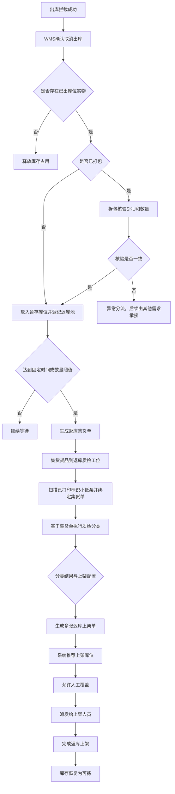

# xyWMS 拦截后返库上架 Plan 方案

## 0. 文档信息

- 标题：xyWMS 拦截后返库上架需求分析
- 版本：V1.6
- 日期：2026-06-18
- 作者：Martin
- 相关方：WMS、仓库复核员、集货人员、质检人员、上架人员、仓内主管、产品、研发、测试
- 来源材料：当前对话补充信息

## 一、需求理解

### 1.1 背景

- 业务背景：
  - 出库拦截已经在独立需求中完成，WMS 在复核、打包、交接前成功阻断后续出库作业。
  - 被拦截的实物不能留在工位旁长期滞留，需要回到可拣库存。
  - 返库上架是 WMS 内部仓内闭环，不回传 OMS 返库过程。

- 当前问题：
  - 返库来源分散，可能来自未拣货、已拣货未打包、复核完成未打包、已打包、交接前剔除等不同状态。
  - 已打包包裹不能直接上架，必须拆包核验。
  - 返库任务不能逐单触发，需要统一批量处理。
  - 返库触发规则需要按仓库、货主、库区配置。
  - 推荐库位需要支持人工覆盖。
  - 返库池是逻辑待办池，不是物理库位；暂存库位才是实物落点。
  - 复核工位一单多件首件触发时，由拦截域打印标识小纸条并锁定整单，返库上架只消费已打印结果，避免同单货品分散。

- 影响对象：
  - 仓库复核员、集货人员、质检人员、上架人员、仓内主管。
  - WMS 库存状态、库位状态、返库待处理队列。
  - OMS 只关心拦截是否成功，不关心返库过程。

### 1.2 目标

- 业务目标：
  - 把出库拦截后的实物统一纳入待返库池。
  - 按固定时间或数量阈值批量生成返库任务。
  - 对已打包包裹执行拆包核验后返库。
  - 返库质检工位能扫描已打印标识小纸条并绑定返库集货单。
  - 绑定后按集货单完成质检分类，并按不同上架配置生成多张上架单。
  - 推荐上架库位并支持人工覆盖。
  - 返库完成后库存恢复为可拣。

- 用户目标：
  - 复核员能快速把被拦截货品转入待返库链路。
  - 集货人员能按批次处理多工位拦截货品。
  - 质检人员能按 SKU、效期、批次完成核验。
  - 上架人员能按系统推荐库位完成归位。
  - 仓内主管能配置触发规则并在必要时覆盖推荐库位。

- 成功标准：
  - 未拣货订单只释放库存占用，不生成返库任务。
  - 已拣货、复核完成未打包、已打包、交接前剔除的实物都能进入正确的返库路径。
  - 已打包包裹必须拆包后才能返库。
  - 返库任务支持固定时间和数量阈值任一满足即触发。
  - 返库质检工位能成功完成标识小纸条扫码绑定后再进入分类。
  - 分类完成后系统能按上架配置拆分生成多张上架单并派发。
  - 返库推荐库位支持人工覆盖。
  - 返库完成后库存恢复为可拣。
  - 一单多件首件触发拦截后，同单后续货品能锁定到同一暂存库位。

## 二、范围定义

### 2.1 本次要做

| 模块 | 说明 | 优先级 |
|------|------|--------|
| 返库来源汇集 | 接收出库拦截成功后的返库来源，统一落入暂存位并登记待返库池 | P0 |
| 未拣货释放占用 | 未拣货订单只释放库存占用，不生成返库任务 | P0 |
| 已打包拆包核验 | 已打包包裹必须拆包并核验 SKU、数量后才能返库 | P0 |
| 批量返库任务 | 按时间阈值或数量阈值任一满足时生成返库任务 | P0 |
| 返库集货单 | 承载批量返库作业，统一组织多工位暂存货品 | P0 |
| 返库质检绑定与分类 | 扫描已打印标识小纸条，绑定返库集货单并执行分类 | P0 |
| 上架单拆分与派发 | 按分类结果和上架配置拆分生成多张上架单并派发 | P0 |
| 规则配置 | 支持按仓库、货主、库区配置返库触发规则 | P0 |
| 推荐库位 | 系统推荐返库上架库位，并允许人工覆盖 | P0 |
| 上架完成 | 返库上架后库存恢复为可拣 | P0 |

### 2.2 本次不做

| 内容 | 不做原因 | 后续处理 |
|------|----------|----------|
| 出库拦截判断 | 属于独立的“出库拦截”需求 | 已拆分到独立需求分析文档 |
| OMS 拦截结果回传 | 不属于返库上架闭环 | 由出库拦截需求承接 |
| TMS 交接结果处理 | 与返库上架无关 | 维持现有流程 |
| 多包裹订单拦截 | 本次不覆盖该边界 | 后续版本/待确认 |
| 异常暂存后的后续处理 | 超出本需求边界 | 其他需求承接 |
| 标识小纸条打印与模板配置 | 属于出库拦截域 | 由出库拦截需求承接 |

## 三、用户与场景

| 用户角色 | 使用场景 | 核心诉求 |
|----------|----------|----------|
| 仓库复核员 | 发现订单被拦截后，将实物放入暂存区；一单多件首件触发时沿用拦截域已打印结果并锁单 | 快速进入返库闭环并避免同单货品分散到多个暂存位 |
| 集货人员 | 按批次从多个工位收集拦截货品 | 统一处理、减少零散作业 |
| 质检人员 | 扫描已打印标识小纸条，绑定集货单后对返库货品做拆包核验和分类 | 保证单据追溯、SKU、数量、效期准确 |
| 上架人员 | 按推荐库位完成返库上架 | 快速归位并恢复可拣库存 |
| 仓内主管 | 配置触发规则、覆盖推荐库位 | 兼顾效率和现场灵活性 |

## 四、业务流程

## 五、关键业务规则

| 规则编号 | 规则名称 | 规则说明 | 影响范围 |
|----------|----------|----------|----------|
| BR-001 | 未拣货只释放占用 | 未拣货订单被拦截后，只释放库存占用，不生成返库任务 | 库存、待返库池 |
| BR-002 | 已打包必须拆包 | 已打包包裹返库前必须拆包并核验 SKU 和数量 | 返库作业、上架 |
| BR-003 | 批量触发 | 返库任务按时间阈值或数量阈值任一满足即触发 | 返库任务 |
| BR-004 | 规则可配置 | 支持按仓库、货主、库区配置触发规则 | 配置中心 |
| BR-005 | 推荐库位可覆盖 | 推荐库位支持授权人员人工覆盖 | 上架作业 |
| BR-006 | OMS 不关心返库过程 | OMS 只关心拦截成功与否，不接收返库过程 | OMS、WMS 边界 |
| BR-007 | 返库池是逻辑池 | 返库池只表示待处理队列，不对应物理库位；暂存库位/暂存箱才是实物落点 | 待返库池、暂存库位 |
| BR-008 | 首件触发整单锁定 | 复核工位一单多件首件触发拦截后，由拦截域打印标识小纸条并锁定整单，后续同单货品只能进入同一暂存库位 | 复核作业、标识单 |
| BR-009 | 质检扫码绑定 | 返库质检工位只扫描已打印标识小纸条并绑定返库集货单，不负责打印与模板配置 | 返库质检 |
| BR-010 | 分类后拆分上架单 | 分类完成后按上架配置拆分生成多张上架单并派发 | 上架作业 |

## 六、页面与操作范围

| 页面 | 页面目标 | 主要操作 | 备注 |
|------|----------|----------|------|
| 返库待办页 | 查看待返库来源和任务进度 | 查询、筛选、领取、查看详情 | P0 |
| 返库任务页 | 管理批量返库任务和返库集货单 | 新增、触发、领取、完成、异常 | P0 |
| 返库质检页 | 扫码绑定已打印标识小纸条并完成分类 | 扫码、绑定、分类提交 | P0 |
| 推荐库位页 | 查看系统推荐库位并允许覆盖 | 覆盖、确认、回退 | P0 |
| 上架单派发页 | 查看并派发多张上架单 | 查看、派发、重派 | P0 |
| 规则配置页 | 配置仓库/货主/库区触发规则 | 新增、编辑、启停 | P0 |
| 上架执行页 | 完成返库上架 | 扫描、确认、提交 | P0 |

## 七、使用者与系统交互场景（必填）

| 交互编号 | 使用者角色 | 使用入口 | 用户动作 | 系统响应 | 页面/状态变化 | 数据读取/写入 | 异常反馈 | 交互结果 |
|----------|------------|----------|----------|----------|--------------|---------------|----------|----------|
| INT-001 | 仓库复核员 | 返库待办页 | 将已拦截实物放入暂存区 | 记录返库来源并进入待返库池 | 待返库池新增记录 | 读取拦截来源，写入返库池记录和暂存库位 | 暂存区未找到时提示异常 | 返库来源已登记 |
| INT-002 | 仓内主管 | 规则配置页 | 配置仓库/货主/库区触发规则 | 保存配置并生效 | 规则状态变更为启用 | 写入规则配置 | 配置冲突时提示冲突原因 | 规则可用于触发任务 |
| INT-003 | 集货人员 | 返库任务页 | 领取批量返库任务，汇集多个工位的暂存货品 | 分配任务并锁定任务状态 | 任务状态变为返库中 | 读取待返库池，写入任务状态和返库集货单 | 任务已被领取时提示不可重复领取 | 返库集货单开始执行 |
| INT-004 | 质检人员 | 返库质检页 | 扫描已打印标识小纸条并绑定集货单 | 校验标识单状态并完成绑定 | 集货单状态变为已绑定 | 读取标识单号，写入绑定状态 | 标识单已绑定或无法识别时提示异常 | 进入质检分类 |
| INT-005 | 质检人员 | 返库质检页 | 基于集货单完成分类并生成上架结果 | 按分类结果拆分上架单 | 上架单状态变为待派发 | 读取分类结果，写入上架单和推荐库位结果 | 分类不一致时进入异常分流 | 上架单可派发 |
| INT-006 | 上架人员 | 上架执行页 | 使用推荐库位或人工覆盖库位完成上架 | 校验库位并提交上架结果 | 库存状态变为可拣 | 读取推荐库位，写入覆盖信息和上架结果 | 库位不可用时提示重选 | 上架完成 |

## 八、UC 用例清单（必填）

| 用例编号 | 用例类型 | 用例名称 | 用户角色 | 前置条件 | 触发条件 | 操作步骤 | 预期结果 | 优先级 |
|----------|----------|----------|----------|----------|----------|----------|----------|--------|
| UC-001 | 正常路径 | 未拣货订单释放占用 | 仓内主管 | 订单被拦截且尚未拣货 | 确认取消出库 | 1. 确认取消出库 2. 系统释放占用 | 不生成返库任务，库存恢复占用释放状态 | P0 |
| UC-002 | 正常路径 | 已打包包裹拆包返库 | 质检人员 | 订单已打包且被拦截 | 进入返库流程 | 1. 拆包 2. 核验 SKU 和数量 3. 进入待返库池 | 包裹拆解后进入批量返库链路 | P0 |
| UC-003 | 正常路径 | 批量触发返库任务 | 集货人员 | 待返库池满足时间或数量阈值 | 到达触发条件 | 1. 系统触发 2. 生成任务 3. 集货执行 | 生成批量返库任务 | P0 |
| UC-004 | 正常路径 | 返库质检扫码绑定集货单 | 质检人员 | 已生成返库集货单且拦截标识小纸条已打印 | 到达返库质检工位 | 1. 扫码 2. 绑定 3. 确认集货单 | 标识单与集货单完成绑定，进入分类 | P0 |
| UC-005 | 正常路径 | 质检分类后拆分上架单 | 质检人员 | 集货单已绑定且分类完成 | 提交分类结果 | 1. 录入分类结果 2. 系统拆分上架单 3. 派发 | 生成多张上架单并派发给上架人员 | P0 |
| UC-006 | 边界用例 | 推荐库位被人工覆盖 | 上架人员 | 任务已生成且存在推荐库位 | 现场库位不可用 | 1. 选择覆盖 2. 输入覆盖原因 3. 提交 | 使用人工覆盖库位完成上架 | P1 |
| UC-007 | 异常用例 | 重复触发任务 | 仓内主管 | 相同配置下已生成任务 | 再次满足触发条件 | 1. 系统检查 2. 阻止重复生成 | 按幂等规则处理，不重复生成任务 | P1 |
| UC-008 | 边界用例 | 首件触发整单锁定后同单货品归集 | 仓库复核员 | 一单多件且首件触发拦截 | 首件命中拦截规则 | 1. 沿用拦截域已打印结果 2. 锁定整单 3. 同单后续货品继续进入同一暂存库位 | 所有同单货品进入同一暂存位并可继续返库 | P0 |

## 九、数据与系统边界

### 9.1 关键数据对象

| 数据对象 | 来源 | 用途 |
|----------|------|------|
| 待返库池 | 出库拦截结果、拣货/复核/打包/交接前剔除结果 | 汇集返库来源的逻辑待办池，关联暂存库位和待处理状态 |
| 标识单 | 拦截域打印结果 | 作为返库质检扫码绑定的外部输入对象 |
| 暂存库位 | 复核工位旁物理暂存位置 | 承接被拦截实物 |
| 批量返库任务 | 待返库池、触发规则配置 | 批量组织返库作业 |
| 返库集货单 | 批量返库任务、暂存库位集合 | 承接多工位集货并驱动返库质检 |
| 返库质检分类结果 | 返库集货单、质检录入 | 记录分类结论并驱动上架拆单 |
| 推荐库位结果 | 库位主数据、上架规则 | 指引返库上架 |
| 人工覆盖记录 | 上架人员操作 | 记录实际执行库位 |
| 上架配置 | 分类结果、库区规则、货主规则 | 控制上架单拆分方式 |
| 上架单 | 返库质检分类结果、上架配置 | 派发给上架人员执行 |
| 库存台账 | 上架结果 | 恢复可拣库存 |
| 规则配置 | 仓库、货主、库区、时间阈值、数量阈值 | 控制任务触发 |

### 9.2 系统边界

- 目标系统：`WMS`
- 上游系统：`OMS`
- 下游系统：无独立对外下游，返库过程仅在 WMS 内闭环
- 库存责任归属：`WMS`

## 十、风险与待确认项

| 类型 | 内容 | 需要谁确认 | 影响 |
|------|------|------------|------|
| 待确认 | 推荐库位的人工覆盖权限控制粒度 | 业务方/仓内主管 | 影响页面按钮权限和审计字段 |
| 待确认 | 返库任务是否支持人工手工触发 | 业务方/仓内主管 | 影响任务页操作范围 |
| 待确认 | 异常分流的后续处理归属 | 业务方/其他需求负责人 | 影响异常边界 |
| 待确认 | 标识小纸条打印、模板和语言配置的具体规则 | 出库拦截需求负责人 | 影响返库质检扫码所依赖的外部输入 |

## 十一、原型建议

- 需要覆盖的页面：
  - 返库待办页
  - 返库任务页
  - 返库质检页
  - 规则配置页
  - 推荐库位页
  - 上架单派发页
  - 上架执行页

- 需要重点表达的交互：
  - 待返库池如何触发批量任务
  - 返库质检如何扫描标识小纸条并绑定集货单
  - 质检分类后如何拆分并派发上架单
  - 推荐库位如何覆盖
  - 上架完成后如何恢复可拣状态

- 需要重点校验的业务规则：
  - 已打包必须拆包
  - 固定时间和数量阈值任一满足即触发
  - 按仓库、货主、库区配置生效

## 十二、确认结论

- Plan 是否确认：待用户确认
- 进入下一阶段条件：用户明确确认 Plan 后，才生成原型
