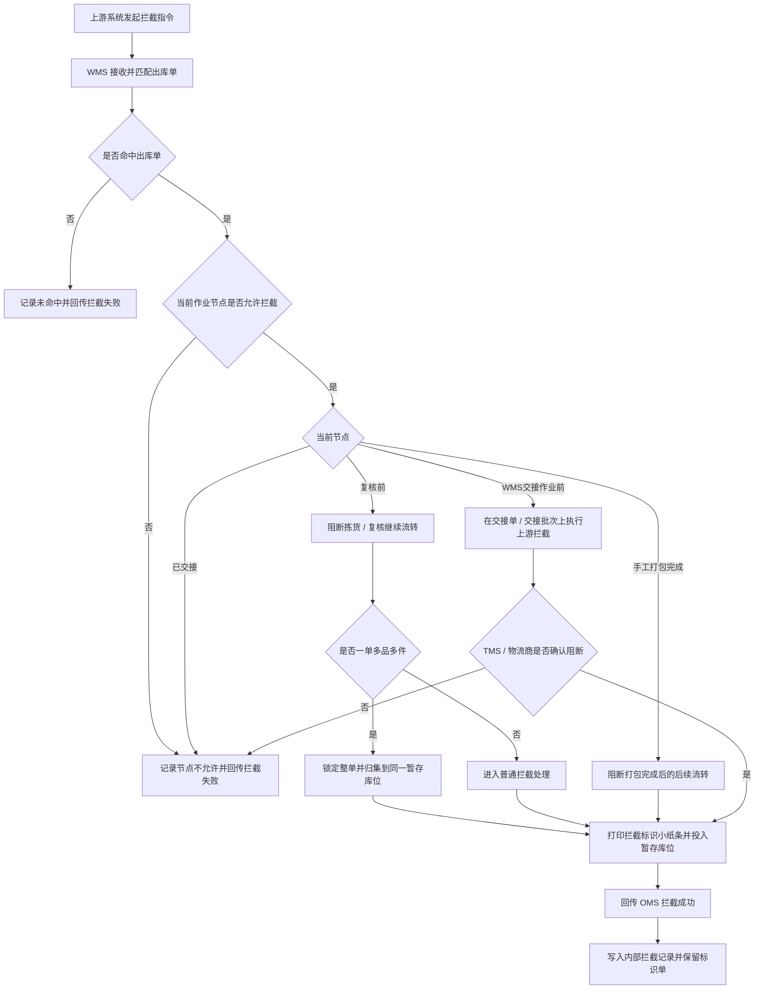

# xyWMS 出库拦截 Plan 方案

> 需求分析已收口，本文档用于定义出库拦截的方案边界、流程、规则、页面范围和数据边界。本文档确认后，才进入原型阶段。

## 一、需求理解

### 1.1 背景

- 业务背景：
  - 出库拦截发生在复核前、手工打包完成、WMS 交接作业前三个关键节点。
  - 拦截动作由上游系统发起，WMS 不主动创建拦截诉求，只执行上游下发的拦截指令。
  - 复核完成未打包不作为独立人机交互场景，不单列为拦截入口。
  - 打包完成只会出现在手工单作业流程中，且存在人机交互入口。
  - 交接确认不在 WMS 页面里直接完成，WMS 需要通过对接物流商揽收系统或 TMS 完成交接确认的执行和回传。
  - 复核台命中一单多品多件拦截时，必须把同一出库单全部应拦截货品归集到复核台旁同一暂存库位，并把拦截标识小纸条一起放入该暂存库位。

- 当前问题：
  - 复核前、手工打包完成、交接作业前这三类节点的拦截对象不同，不能用一套泛化规则代替。
  - 如果节点判断晚于现场作业动作，货品会继续流转到打包或交接环节，追回成本高。
  - WMS 需要有自己的交接单、交接批次和拦截执行入口，否则仓库现场没有操作载体。
  - OMS 只关心拦截结果，不关心 WMS 内部的返库或后续处理过程。
  - 标识小纸条是后续返库质检扫码的外部输入，必须在出库拦截域内闭环生成、打印和追溯。

- 影响对象：
  - 仓库复核员、手工打包员、交接作业人员、仓内主管、系统管理员。
  - OMS、WMS、TMS / 物流商揽收系统。
  - WMS 内部的出库单、交接单、交接批次、拦截记录、标识单和暂存归集状态。

### 1.2 目标

- 业务目标：
  - 让 WMS 在正确作业节点阻断出库动作，并向 OMS 回传拦截成功或拦截失败。
  - 让复核台一单多品多件拦截时，同单货品稳定归集到同一暂存库位，避免现场分散。
  - 让手工单打包完成场景能被系统识别并阻断后续交接。
  - 让交接作业页承接上游发起的拦截指令，并通过 TMS / 物流商揽收系统的撤销、剔除和确认结果完成阻断。
  - 让 WMS 内部具备独立的拦截记录查询能力。
  - 让拦截标识小纸条支持多语言、模板尺寸配置、重打和作废控制。

- 用户目标：
  - 复核员能按现场提示把同单货品和标识单放到同一个暂存库位。
  - 手工打包员能在系统提示下停止后续流转。
  - 交接作业人员能在 WMS 里看到交接单/交接批次状态，并执行上游拦截动作。
  - 仓内主管能在内部记录里追溯拦截原因、处理时间和执行人。
  - 系统管理员能维护标识单模板和语言内容。

- 成功标准：
  - 复核前、手工打包完成、交接作业前三类场景都能被正确识别。
  - 已完成交接的订单不会被误判为拦截成功。
  - 拦截动作只由上游发起，WMS 不主动发起拦截。
  - WMS 对 OMS 的结果回传只覆盖拦截成功、拦截失败两个结果。
  - 复核台一单多品多件场景下，同单全部应拦截货品都归集到同一暂存库位。
  - 标识小纸条支持多语言内容，并且必须包含“拦截”字样、出库单编码、SKU、复核异常差异数量。
  - WMS 内部能独立查询和追溯拦截事件。

## 二、范围定义

### 2.1 本次要做

| 模块 | 说明 | 优先级 |
|------|------|--------|
| 上游拦截指令接入 | 接收 OMS 或对接的 TMS / 物流商揽收系统发起的拦截指令，并做幂等匹配 | P0 |
| 节点判断 | 按出库拦截相关当前作业节点判断是否允许拦截 | P0 |
| 复核前拦截 | 阻断拣货、复核扫描和复核提交 | P0 |
| 一单多品多件归集 | 锁定整单，同单货品归集到同一暂存库位 | P0 |
| 手工打包完成拦截 | 仅在手工单流程中阻断打包完成后的后续流转 | P0 |
| 交接作业拦截 | 在交接单 / 交接批次上执行上游拦截、撤销或剔除动作 | P0 |
| 标识单打印 | 按模板尺寸和多语言内容打印拦截标识小纸条 | P0 |
| 标识单重打 / 作废 | 对已打印标识单进行重打和作废控制 | P0 |
| 内部拦截记录查询 | 提供独立查询页，支持查看、筛选和追溯 | P0 |
| 结果回传 | 向 OMS 回传拦截成功 / 拦截失败 | P0 |

### 2.2 本次不做

| 内容 | 不做原因 | 后续处理 |
|------|----------|----------|
| 主动发起拦截 | 拦截动作由上游系统发起，WMS 只执行 | 不在本次范围 |
| 返库上架 | 属于拦截后的后续闭环 | 其他需求单独处理 |
| 多包裹订单拦截 | 本次明确不覆盖 | 后续版本 / 待确认 |
| 复核完成未打包独立入口 | 不是独立人机交互场景 | 只作为后台状态流转 |
| OMS 拦截单设计 | OMS 不新增拦截单 | 由状态变化承载 |
| 交接确认由 WMS 自己闭环 | 需要借助 TMS / 物流商揽收系统回传 | 保持现有系统边界 |
| 具体表结构与索引实现 | 方案阶段不展开技术实现细节 | 后续设计补充 |

## 三、用户与场景

| 用户角色 | 使用场景 | 核心诉求 |
|----------|----------|----------|
| 仓库复核员 | 在复核台收到拦截提示，处理一单多品多件归集 | 现场快速锁单、减少同单货品分散 |
| 手工打包员 | 手工单打包完成后收到拦截阻断 | 及时停止后续交接动作 |
| 交接作业人员 | 在交接单 / 交接批次上执行上游拦截指令 | 通过 WMS 页面完成可追溯操作 |
| 仓内主管 | 查看内部拦截记录、处理异常、管理标识单 | 便于追踪和现场管理 |
| 系统管理员 | 维护标识单模板和语言内容 | 确保打印内容与现场规则一致 |
| OMS / TMS 对接人 | 处理上游状态变化、撤销和回传结果 | 确保系统间口径一致 |

## 四、业务流程

### 4.1 主流程说明

1. 上游系统发起拦截指令，WMS 接收后先匹配对应出库单。
2. WMS 判断当前出库拦截相关当前作业节点是否允许拦截。
3. 如果已完成交接，直接判定拦截失败并回传。
4. 如果处于复核前，WMS 阻断拣货或复核继续流转。
5. 如果是复核台一单多品多件场景，WMS 锁单并把同单应拦截货品归集到同一暂存库位。
6. 归集完成后，WMS 打印拦截标识小纸条并投入暂存库位。
7. 如果处于手工打包完成场景，WMS 阻断后续交接动作并记录结果。
8. 如果处于交接作业前，WMS 在交接单 / 交接批次上执行上游拦截动作，并通过 TMS / 物流商揽收系统回传阻断结果。
9. WMS 向 OMS 回传拦截成功或拦截失败。
10. WMS 留存内部拦截记录，供后续查询和追溯。

### 4.2 创建场景

- 拦截请求由上游系统创建，WMS 不主动创建。
- 内部拦截记录在 WMS 判定拦截结果时生成。
- 标识单在拦截成功且需要进入暂存区时生成。
- 交接单 / 交接批次在 WMS 交接作业链路中生成并用于承载拦截操作。

### 4.3 失效 / 完结场景

- 已完成交接的订单进入终态，不允许再判定为拦截成功。
- 标识单作废后不得再次作为有效质检输入。
- 内部拦截记录保留查询，不做物理删除。

### 4.4 分支流程

- 复核前命中时，需要判断是否一单多品多件。
- 手工单打包完成时，仅手工单存在该节点。
- 交接作业前命中时，必须依赖 TMS / 物流商揽收系统的撤销或剔除结果。
- 上游重复下发同一指令时，按幂等逻辑处理，不重复回传。

### 4.5 异常流程

- 未匹配到出库单时，记录未命中原因并回传失败。
- 当前节点不允许拦截时，记录节点不允许原因并回传失败。
- TMS / 物流商揽收系统撤销失败时，WMS 保留交接批次冻结状态并提示人工处理，不假定成功。
- 标识单打印失败时，拦截结果不应被误判为已完成，需要保留重打能力。

## 五、关键业务规则

| 规则编号 | 规则名称 | 规则说明 | 影响范围 |
|----------|----------|----------|----------|
| BR-001 | 拦截动作由上游发起 | WMS 不主动创建拦截诉求，只执行上游下发的拦截指令 | 全链路 |
| BR-002 | 节点口径固定 | 出库拦截相关当前作业节点只用于出库拦截判断，不代表 WMS 全量作业节点 | 节点识别 |
| BR-003 | 复核完成未打包不单列 | 复核完成未打包不作为独立人机交互场景，只作为后台流转状态处理 | 复核链路 |
| BR-004 | 打包完成仅限手工单 | 打包完成只出现在手工单作业流程中 | 打包链路 |
| BR-005 | 交接需联动外部系统 | 交接作业前的拦截必须依赖 TMS / 物流商揽收系统的撤销、剔除或确认结果 | 交接链路 |
| BR-006 | 已交接不可成功 | 已完成交接的订单不允许返回拦截成功 | 终态判断 |
| BR-007 | 一单多品多件锁单归集 | 复核台命中后必须锁定整单，并把同单应拦截货品归集到同一暂存库位 | 复核场景 |
| BR-008 | 标识单随货投放 | 拦截标识小纸条打印完成后，必须随货投入同一个暂存库位 | 现场作业 |
| BR-009 | 标识内容必须完整 | 标识小纸条内容必须支持多国语言，并包含“拦截”字样、出库单编码、SKU、复核异常差异数量 | 打印规则 |
| BR-010 | 复核异常差异数量为差异口径 | 纸条和记录中的差异数量统一采用复核异常差异数量口径 | 数据口径 |
| BR-011 | 内部记录独立可查 | WMS 必须提供独立的内部拦截记录查询页 | 查询能力 |
| BR-012 | 重复指令幂等 | 上游重复下发同一指令时，不重复回传、不重复生成内部记录 | 接口 / 记录 |

## 六、页面与操作范围

### 6.1 页面清单

| 页面 | 页面目标 | 主要操作 | 备注 |
|------|----------|----------|------|
| 出库拦截工作台 | 汇总查看当前拦截诉求和处理状态 | 查询、筛选、进入详情、查看回传结果 | 入口页 |
| 复核作业页 | 在复核台处理拦截和整单归集 | 触发拦截、锁单、归集、打印标识单 | 仅复核前 |
| 手工打包作业页 | 在手工单打包流程中阻断后续流转 | 查看拦截提示、停止提交、查看原因 | 仅手工单 |
| 交接作业页 | 管理交接单 / 交接批次并执行上游拦截 | 查看、提交、撤销、执行拦截、刷新状态 | WMS 执行外部指令 |
| 内部拦截记录查询页 | 独立追踪内部拦截事件 | 查询、筛选、导出、查看详情 | 必须独立 |
| 标识单模板管理页 | 配置尺寸、语言和打印内容 | 新增、编辑、启停、预览 | 系统管理员可见 |
| 标识单详情页 | 查看打印内容、重打和作废 | 预览、重打、作废 | 可挂在详情抽屉中 |

### 6.2 查询条件建议

| 条件字段 | 控件类型 | 筛选逻辑 | 默认值 | 联动行为 |
|---------|---------|---------|--------|---------|
| 出库单号 | 输入框 | 精确匹配 | - | - |
| OMS 发货订单号 | 输入框 | 精确匹配 | - | - |
| 拦截结果 | 下拉框 | 枚举筛选 | 全部 | - |
| 当前作业节点 | 下拉框 | 枚举筛选 | 全部 | - |
| 交接批次号 | 输入框 | 精确匹配 | - | - |
| 标识单状态 | 下拉框 | 枚举筛选 | 全部 | - |
| 时间范围 | 日期范围 | 区间筛选 | 最近 7 天 | - |
| 处理人 | 输入框 | 模糊匹配 | - | - |

### 6.3 页面状态

- 空态：没有拦截记录时展示空态说明和引导筛选条件。
- 加载态：接口请求中展示加载状态，不允许重复提交。
- 错误态：接口失败时展示失败原因，并保留当前筛选条件。
- 无权限态：无权访问时直接拦截并提示权限不足。
- 部分成功态：批量操作中允许对成功和失败条目分别展示结果。

## 七、使用者与系统交互场景（必填）

| 交互编号 | 使用者角色 | 使用入口 | 用户动作 | 系统响应 | 页面 / 状态变化 | 数据读取 / 写入 | 异常反馈 | 交互结果 |
|----------|------------|----------|----------|----------|-----------------|-----------------|----------|----------|
| INT-001 | OMS / TMS 对接系统 | 接口接入 | 下发拦截指令 | WMS 匹配出库单并判断节点 | 进入拦截处理态或失败态 | 读取出库单、上游请求编号、节点状态 | 未命中或重复指令时提示失败 | 形成拦截判定结果 |
| INT-002 | 仓库复核员 | 复核作业页 | 命中拦截后继续处理同单货品 | 系统锁单并把货品归集到同一暂存库位 | 暂存归集状态变为归集中 / 已归集 | 读取拦截对象、写入暂存库位和归集状态 | 暂存位不可用时提示异常 | 同单货品归集完成 |
| INT-003 | 仓库复核员 | 复核作业页 | 归集完成后确认打印 | 系统按模板打印标识小纸条 | 标识单状态变为已打印 | 读取模板、语言、SKU、复核异常差异数量 | 打印失败时允许重打 | 纸条投入同一暂存库位 |
| INT-004 | 手工打包员 | 手工打包作业页 | 提交打包完成 | 系统校验当前是否收到上游拦截指令 | 打包提交被阻断或标记不可交接 | 读取打包单、拦截状态、当前节点 | 当前不是手工单时不进入该场景 | 阻断后续流转 |
| INT-005 | 交接作业人员 | 交接作业页 | 查看交接单 / 交接批次并执行上游拦截 | 系统同步撤销 / 剔除请求到 TMS / 物流商揽收系统 | 交接单 / 批次状态变更为已撤销或冻结 | 读取交接批次、揽收状态、上游指令 | 外部系统返回失败时提示人工处理 | 阻断交接确认 |
| INT-006 | 仓内主管 | 内部拦截记录查询页 | 查询拦截记录并追溯原因 | 系统返回拦截结果、节点、时间和处理人 | 列表刷新 | 读取内部拦截记录、回传记录、标识单状态 | 无结果时返回空态 | 完成追溯 |
| INT-007 | 系统管理员 | 标识单模板管理页 | 维护模板尺寸和多国语言内容 | 系统保存模板配置并生效 | 模板状态变更 | 写入模板配置、语言配置 | 配置冲突或缺字段时提示错误 | 模板可用于打印 |
| INT-008 | 仓库主管 | 标识单详情页 | 对已打印标识单执行重打或作废 | 系统校验权限并记录操作 | 标识单状态变更为已重打或已作废 | 写入重打次数、作废标记、操作人 | 无权限时禁止操作 | 标识单状态可追溯 |

## 八、UC 用例清单（必填）

| 用例编号 | 用例类型 | 用例名称 | 用户角色 | 前置条件 | 触发条件 | 操作步骤 | 预期结果 | 优先级 |
|----------|----------|----------|----------|----------|----------|----------|----------|--------|
| UC-001 | 正常路径 | 复核前命中拦截并锁单归集 | 仓库复核员 | 出库单已创建，当前节点为复核前 | 上游发起拦截指令 | 1. 系统收到指令 2. 锁单 3. 归集到同一暂存库位 4. 打印标识单 | 拦截成功，内部记录生成，标识单可追溯 | P0 |
| UC-002 | 正常路径 | 一单多品多件同暂存位归集 | 仓库复核员 | 同一出库单存在多个 SKU / 多件 | 首件命中拦截规则 | 1. 首件触发 2. 后续同单货品继续归集 3. 完成后打印纸条 | 全部应拦截货品进入同一暂存库位 | P0 |
| UC-003 | 正常路径 | 手工单打包完成后拦截 | 手工打包员 | 当前单据为手工单 | 上游发起拦截指令 | 1. 收到提示 2. 阻断提交 3. 记录结果 | 打包完成后续流转被阻断 | P0 |
| UC-004 | 正常路径 | 交接作业前执行上游拦截 | 交接作业人员 | 已生成交接单 / 交接批次，尚未完成揽收确认 | 上游发起拦截指令 | 1. 打开交接页 2. 执行拦截 3. 同步撤销 / 剔除 4. 回传结果 | 交接被阻断，OMS 收到成功回传 | P0 |
| UC-005 | 异常用例 | 已完成交接后拦截失败 | 交接作业人员 | 物流商已完成揽收确认 | 再次发起拦截指令 | 1. 系统判断已交接 2. 直接失败回传 | 不允许拦截成功 | P0 |
| UC-006 | 边界用例 | 重复下发同一拦截指令 | OMS / TMS 对接系统 | 已处理过同一上游请求编号 | 再次下发相同指令 | 1. 系统校验请求编号 2. 命中幂等 | 不重复回传、不重复生成记录 | P1 |
| UC-007 | 边界用例 | 标识单重打 | 仓库主管 | 标识单已打印且未作废 | 需要补打 | 1. 打开详情 2. 执行重打 3. 记录次数 | 生成新的打印记录，原记录保留 | P1 |
| UC-008 | 异常用例 | 标识单作废 | 仓库主管 | 标识单已打印 | 纸条失效 | 1. 打开详情 2. 执行作废 3. 记录原因 | 作废后不再作为有效输入 | P1 |
| UC-009 | 异常用例 | 未命中出库单 | OMS / TMS 对接系统 | 上游请求编号合法 | 下发拦截但 WMS 未找到订单 | 1. 接收指令 2. 匹配失败 3. 返回失败 | OMS 收到未命中结果 | P1 |
| UC-010 | 边界用例 | 无权限访问内部记录查询页 | 普通作业员 | 用户无查询权限 | 访问页面 | 1. 打开菜单 2. 系统鉴权 | 页面被拦截，提示无权限 | P1 |

## 九、数据与系统边界

### 9.1 关键数据对象

| 数据对象 | 来源 | 用途 | 是否可编辑 |
|----------|------|------|----------|
| 上游拦截指令 | OMS / TMS / 物流商揽收系统 | 作为拦截诉求的输入 | 否 |
| WMS 出库单 | WMS | 承载当前作业节点和拦截结果 | 否 |
| 内部拦截记录 | WMS | 记录拦截事件、处理人、时间和原因 | 否 |
| 暂存归集记录 | WMS | 记录同单货品归集到的暂存库位 | 否 |
| 标识单 | WMS 打印结果 | 供后续返库质检扫码绑定 | 否 |
| 标识单模板 | 系统配置 | 控制尺寸、多语言和展示内容 | 是 |
| 交接单 | WMS | 承载交接作业和撤销动作 | 否 |
| 交接批次 | WMS / TMS | 追踪交接作业状态和揽收状态 | 否 |
| 回传记录 | WMS | 记录向 OMS 回传的结果 | 否 |

### 9.2 状态口径

| 状态对象 | 状态枚举 | 说明 |
|----------|----------|------|
| 出库拦截相关当前作业节点 | 复核前 / 手工打包完成 / WMS 交接作业前 / 已交接 | 仅用于出库拦截判断 |
| 拦截结果 | 拦截成功 / 拦截失败 | OMS 只接收这两个结果 |
| 暂存归集状态 | 待归集 / 归集中 / 已归集 / 异常 | 复核台一单多品多件专用 |
| 标识单状态 | 待打印 / 已打印 / 已重打 / 已作废 | 标识单生命周期 |
| 交接作业状态 | 待交接 / 已提交 / 揽收中 / 已揽收 / 已撤销 | 交接页识别口径 |

### 9.3 系统边界

- 目标系统：`WMS`
- 上游系统：`OMS`、`TMS / 物流商揽收系统`
- 下游系统：`OMS` 只接收拦截结果；`TMS / 物流商揽收系统` 接收撤销 / 剔除动作和揽收结果
- 库存责任归属：`WMS`
- 现场作业边界：WMS 负责判断、阻断、记录和回传；不负责上游拦截诉求的发起

## 十、风险与待确认项

| 类型 | 内容 | 需要谁确认 | 影响 |
|------|------|------------|------|
| 待确认 | 交接作业页里的“拦截”按钮文案是否统一为“执行拦截”或“处理上游拦截” | 产品 / 业务方 | 影响页面命名和引导文案 |
| 待确认 | 标识单模板管理页是独立菜单，还是挂在标识单详情页中 | 产品 / 研发 | 影响菜单结构 |
| 待确认 | 标识单默认纸张尺寸、语言默认值是否按仓库或货主配置 | 业务方 / 仓内主管 | 影响模板初始化 |
| 待确认 | 内部拦截记录查询页是否支持直接重打 / 作废，还是必须进入详情页操作 | 产品 / 业务方 | 影响列表操作区设计 |
| 风险 | 外部 TMS / 物流商揽收系统撤销失败时，WMS 只能冻结批次并人工处理 | 业务方 / 仓内主管 | 影响现场处理节奏 |

## 十一、原型建议

- 需要覆盖的页面：
  - 出库拦截工作台
  - 复核作业页
  - 手工打包作业页
  - 交接作业页
  - 内部拦截记录查询页
  - 标识单模板管理页
  - 标识单详情页

- 需要重点表达的交互：
  - 上游发起与 WMS 执行的边界
  - 复核台一单多品多件整单锁定和同库位归集
  - 交接单 / 交接批次上的拦截执行和撤销状态
  - 标识单多语言打印、重打和作废
  - 内部拦截记录的追溯链路

- 需要重点校验的业务规则：
  - WMS 不能主动发起拦截
  - 复核完成未打包不单列
  - 打包完成仅限手工单
  - 已交接不允许拦截成功
  - 标识小纸条必须包含“拦截”字样、出库单编码、SKU、复核异常差异数量

## 十二、确认结论

- Plan 是否确认：待用户确认
- 进入下一阶段条件：用户明确确认 Plan 后，再生成原型
