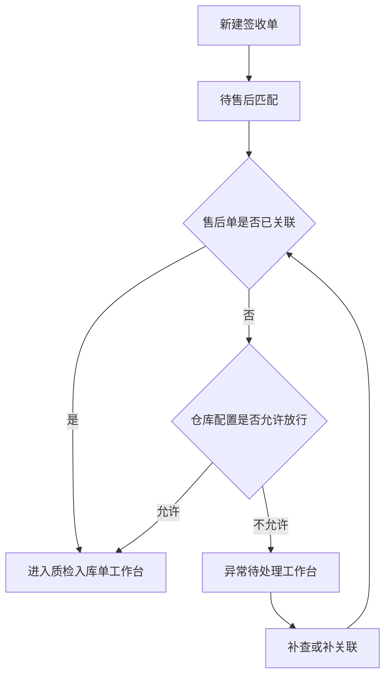
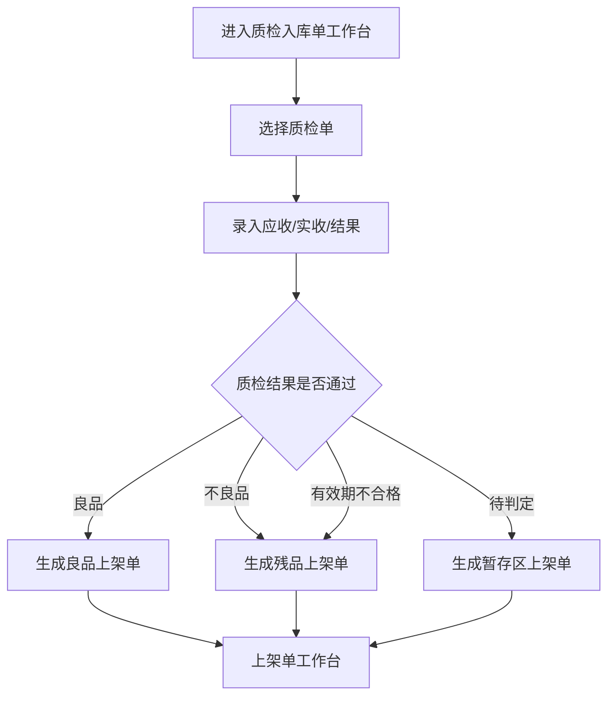
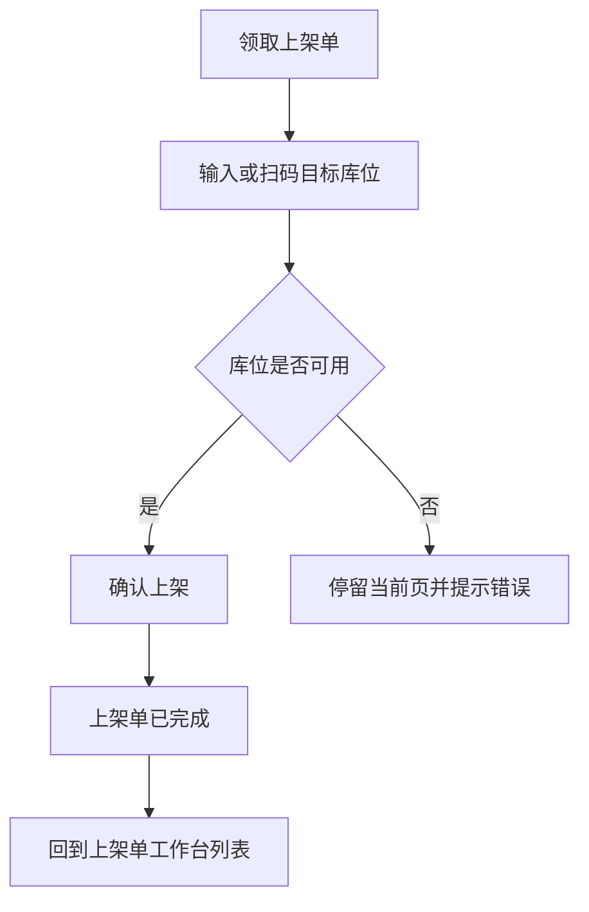
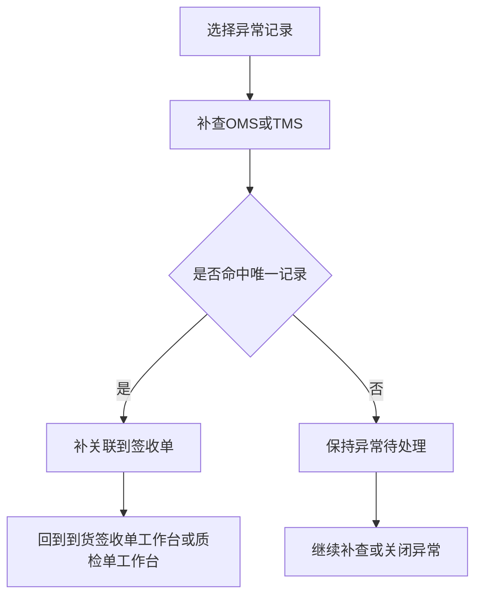
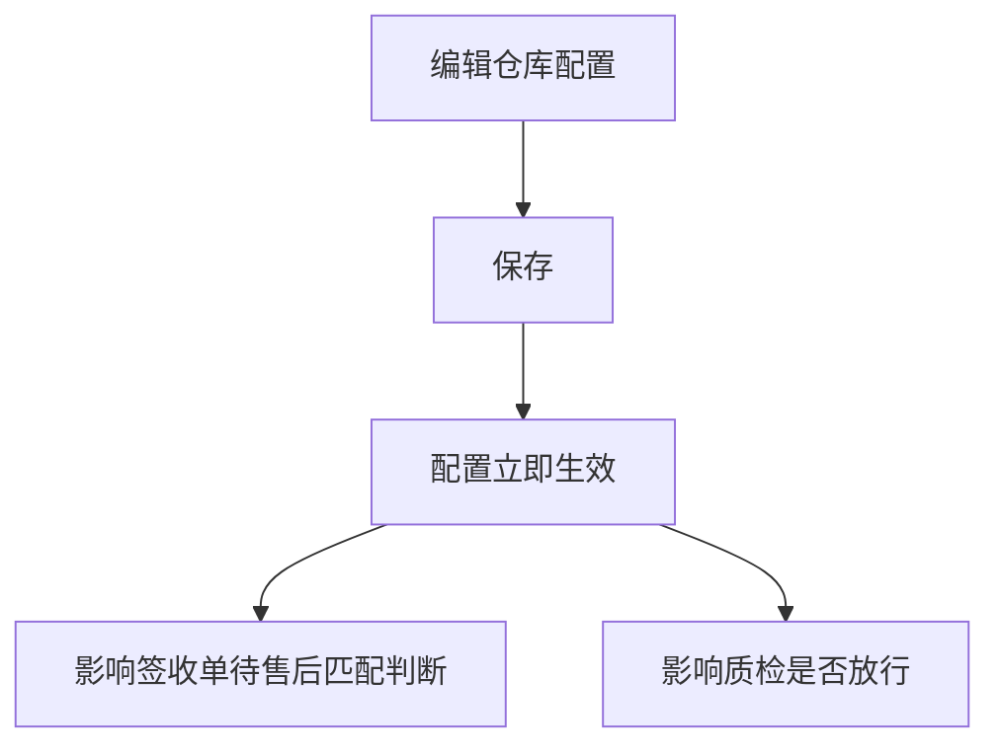

# xyWMS 售后到货入库原型

## 0. 文档信息

- 标题：xyWMS 售后到货入库原型
- 文档类型：原型
- 版本：V1.0
- 日期：2026-06-18
- 作者：Martin
- 相关方：仓库运营、收货岗位、质检岗位、上架岗位、仓内主管、OMS 对接、TMS/承运对接、产品、研发、测试、实施/运维
- 对应 Plan：`01Plan/20260617_Plan_AfterSalesReceipt.md`
- 模板来源：`reference/prototype-template.md`

## 一、原型范围

- 对应 Plan：`01Plan/20260617_Plan_AfterSalesReceipt.md`
- 覆盖页面：
  - 到货签收单工作台
  - 质检入库单工作台
  - 上架单工作台
  - 异常待处理工作台
  - 仓库级售后入库配置
- 不覆盖内容：
  - 接口定义
  - 数据库表结构
  - 前端视觉稿
  - 可点击交互实现
  - 正常到货流程
  - OMS 售后单创建/审批/退款
- 原型形式：Markdown 低保真多页静态稿
- 原型目标：
  - 让收货、质检、上架和仓内主管明确各自页面上的入口、动作、校验、状态和流转关系。
  - 让研发和测试可以直接据此拆分页面、按钮、状态、异常和验收点。

## 二、页面设计约束

- 默认以 PC 端业务页面为主。
- 每个页面只承载一个主要业务任务，避免把收货、质检、上架和配置混在同一页。
- 页面结构默认遵循“标题区 -> 查询区 -> 操作区 -> 列表/表单区 -> 分页或汇总区”。
- 主要操作按钮控制在 3 个以内，破坏性操作必须二次确认。
- 查询、列表、表单、状态、弹窗都要明确数据来源、校验规则、状态变化和结果反馈。
- 空状态、无权限、异常状态、处理完成状态都必须可见。
- 如果存在多状态流转，页面上必须能看出当前状态、可执行操作和下一步动作。
- 原型只表达页面执行稿，不表达接口、代码和实现细节。

### 页面流转原则


## 三、页面清单

| 页面编号 | 页面名称 | 页面目标 | 使用角色 | 对应交互/UC |
|----------|----------|----------|----------|-------------|
| P-001 | 到货签收单工作台 | 管理人工创建的到货签收单，完成待售后匹配、补关联和异常转派 | 收货员、仓内主管 | INT-001 / INT-002 / UC-001 / UC-002 / UC-003 / UC-004 / UC-008 |
| P-002 | 质检入库单工作台 | 录入质检结果、确认实际数量、生成上架去向 | 质检人员、仓内主管 | INT-003 / INT-006 / UC-002 / UC-006 / UC-007 / UC-009 |
| P-003 | 上架单工作台 | 完成库位归位，不改变数量 | 上架人员、仓内主管 | INT-004 / INT-006 / UC-006 / UC-007 |
| P-004 | 异常待处理工作台 | 处理无法识别来源、无法匹配售后的记录 | 仓内主管、收货员 | INT-005 / UC-003 / UC-005 / UC-008 |
| P-005 | 仓库级售后入库配置 | 维护无售后单处理策略和有效期阈值 | 仓内主管、实施/运维 | INT-002 / UC-002 / UC-003 |

## 四、页面结构

### 4.1 页面：到货签收单工作台

#### 页面目标

- 这个页面帮助用户完成人工创建、查看和处理到货签收单。
- 这个页面对应 `UC-001 / UC-002 / UC-003 / UC-004 / UC-008`。
- 页面重点是“先收货、后匹配”，并把售后待匹配、补关联和异常处理区分开。

#### 页面布局

```text
┌────────────────────────────────────────────────────────────┐
│ 到货签收单工作台  [新建签收单] [批量补关联] [查看异常]     │
├────────────────────────────────────────────────────────────┤
│ 查询区：单号 / 仓库 / 物流单号 / 包裹号 / 卡板号 / 状态    │
├────────────────────────────────────────────────────────────┤
│ 操作区：继续签收 / 补关联 / 标记异常 / 刷新                │
├────────────────────────────────────────────────────────────┤
│ 列表区：签收单列表 + 操作列                                │
├────────────────────────────────────────────────────────────┤
│ 右侧抽屉：单据详情 / 关联信息 / 操作日志                   │
└────────────────────────────────────────────────────────────┘
```

#### 查询条件

| 字段 | 控件 | 默认值 | 筛选逻辑 | 联动规则 | 权限/备注 |
|------|------|--------|----------|----------|------------|
| 单号 | 输入框 | - | 精确匹配 | - | 支持签收单号搜索 |
| 仓库 | 下拉框 | 当前默认仓库 / 全部 | 精确匹配 | 切换仓库后重置部分状态筛选 | 收货员、主管可见 |
| 物流单号 | 输入框 | - | 模糊匹配 | - | 用于后到售后单补关联 |
| 包裹号/卡板号 | 输入框 | - | 模糊匹配 | - | 按到货形态显示提示文案 |
| 来源识别状态 | 下拉框 | 全部 | 精确匹配 | - | 待售后匹配 / 已识别为售后 / 无法识别 |
| 售后关联状态 | 下拉框 | 全部 | 精确匹配 | - | 已关联 / 未关联 / 待补关联 |
| 到货形态 | 下拉框 | 全部 | 精确匹配 | - | 小包裹 / 整卡板 / 托盘 / 整箱 / 混箱 |
| 处理状态 | 下拉框 | 全部 | 精确匹配 | - | 待签收 / 已签收 / 异常中止 |
| 创建方式 | 下拉框 | 全部 | 精确匹配 | - | OMS 预通知 / 人工创建 |
| 时间范围 | 日期范围 | 最近 7 天 | 范围筛选 | 结束时间不能早于开始时间 | 按创建时间 |

#### 列表字段

| 列名 | 字段来源 | 展示规则 | 排序规则 | 数据属性/备注 |
|------|----------|----------|----------|--------------|
| 签收单号 | WMS 到货签收单 | 可点击进入详情，支持复制 | 默认按更新时间倒序 | 主标识 |
| 仓库 | WMS 到货签收单 | 显示仓库名称 | 不排序 | 用于跨仓筛选 |
| 到货形态 | WMS 到货签收单 | 显示为标签 | 不排序 | 小包裹 / 整卡板 / 托盘 / 整箱 / 混箱 |
| 创建方式 | WMS 到货签收单 | 显示为标签 | 不排序 | OMS 预通知 / 人工创建 |
| 来源识别状态 | WMS 签收来源状态 | 待售后匹配、已识别为售后、无法识别 | 不排序 | 状态色展示 |
| 售后关联状态 | WMS 关联关系 | 已关联、未关联、待补关联 | 不排序 | 影响是否可继续流转 |
| 处理状态 | WMS 作业状态 | 待签收、已签收、异常中止 | 默认按更新时间倒序 | 影响可执行按钮 |
| 操作人 | WMS 操作日志 | 显示最近处理人 | 不排序 | 显示姓名 |
| 更新时间 | WMS 操作日志 | 显示到分钟 | 默认倒序 | 列表默认排序字段 |
| 操作 | 页面动作 | 行内显示 2-3 个操作 | - | 继续签收 / 补关联 / 标记异常 |

#### 表单字段

| 字段 | 控件 | 必填 | 校验规则 | 默认值 | 数据写入/联动 |
|------|------|------|----------|--------|--------------|
| 仓库 | 下拉框 | 是 | 必须选择已启用仓库 | 当前仓库 | 写入签收单主档 |
| 到货日期 | 日期时间 | 是 | 不能晚于当前时间太多，不能为空 | 当前时间 | 写入签收单主档 |
| 到货形态 | 单选 | 是 | 必须在有效枚举内 | 小包裹 | 决定后续分支 |
| 物流单号 | 输入框 | 是 | 不能为空，建议唯一 | - | 用于后到售后单补关联 |
| 包裹号/卡板号 | 输入框 | 否 | 按到货形态提示输入 | - | 用于二次定位 |
| 来源说明 | 文本框 | 否 | 最大长度按系统限制 | 人工创建 | 写入备注字段 |
| 收货人 | 只读 | 是 | 当前登录人自动带出 | 当前用户 | 写入操作日志 |
| 备注 | 文本框 | 否 | 最大长度按系统限制 | - | 写入操作日志 |

#### 按钮与操作

| 按钮 | 位置 | 权限 | 点击后行为 | 成功提示 | 失败提示 | 影响数据 |
|------|------|------|------------|----------|----------|----------|
| 新建签收单 | 顶部主按钮 | 收货员、主管 | 打开新建弹窗，填写后创建待售后匹配签收单 | 已创建，进入待签收/待售后匹配 | 必填未填、单号重复、仓库无权限 | 写入签收单主档和操作日志 |
| 批量补关联 | 顶部主按钮 | 主管 | 打开补关联抽屉，按物流单号优先查询 | 已完成批量补关联 | 命中多笔、未命中、权限不足 | 写入关联关系和补关联记录 |
| 查看异常 | 顶部主按钮 | 收货员、主管 | 跳转到异常待处理工作台并带入筛选条件 | 已打开异常列表 | 无权限时提示 | 不直接修改数据 |
| 继续签收 | 行操作 | 收货员 | 继续处理待签收单据 | 已签收 | 状态不允许、重复提交 | 更新签收状态 |
| 标记异常 | 行操作 | 收货员、主管 | 打开异常标记弹窗 | 已转入异常待处理 | 原因未填、权限不足 | 写入异常记录 |
| 刷新 | 顶部次按钮 | 全部可见角色 | 重新加载当前筛选结果 | 已刷新 | 网络错误 | 不写入业务数据 |

#### 状态展示

| 状态 | 展示文案 | 颜色 | 可执行操作 | 状态来源/说明 |
|------|----------|------|------------|----------------|
| 待签收 | 待签收 | `#1677FF` | 继续签收 | 签收单创建后未完成确认 |
| 已签收 | 已签收 | `#52C41A` | 查看详情 | 收货动作完成 |
| 待售后匹配 | 待售后匹配 | `#FA8C16` | 补关联、查看异常 | 人工创建签收单默认状态 |
| 已识别为售后 | 已识别为售后 | `#52C41A` | 进入质检 | 售后单已关联成功 |
| 无法识别 | 无法识别 | `#F5222D` | 补查、标记异常 | 无法判断来源时使用 |
| 待补关联 | 待补关联 | `#FA8C16` | 继续补关联 | 后到售后单命中多笔时使用 |
| 异常中止 | 异常中止 | `#F5222D` | 重新处理、关闭异常 | 需要主管介入 |

#### 弹窗、抽屉或二级页面

| 触发操作 | 组件形式 | 展示内容 | 提交行为 | 关闭行为 | 校验/结果 |
|----------|----------|----------|----------|----------|----------|
| 新建签收单 | 弹窗 | 仓库、到货日期、到货形态、物流单号、包裹号/卡板号、备注 | 创建签收单并标记待售后匹配 | 取消后不保存 | 必填校验、单号重复校验 |
| 继续签收 | 抽屉 | 当前签收单基础信息、收货确认信息、操作日志 | 提交签收完成 | 关闭不写入 | 状态校验 |
| 补关联 | 抽屉 | 售后单号、原订单号、物流单号、包裹号、卡板号、仓库、到货日期查询结果 | 选择唯一目标后关联 | 退出不保存 | 命中多笔时必须人工确认 |
| 标记异常 | 弹窗 | 异常类型、异常原因、备注 | 写入异常记录并流转到异常待处理 | 关闭不保存 | 异常原因必填 |
| 签收详情 | 右侧抽屉 | 单据概览、关联信息、处理日志、异常信息 | 不直接提交 | 关闭抽屉 | 只读查看 |

#### 页面流转说明



按步骤描述：

1. 收货员在工作台新建人工签收单。
2. 系统默认把单据放入待售后匹配状态。
3. 系统判断是否已经关联到售后单。
4. 已关联则进入质检入库单工作台。
5. 未关联则依据仓库配置决定放行或转入异常待处理工作台。
6. 异常处理完成后，可重新回到签收单继续流转。

#### 异常与空状态

| 场景 | 页面表现 | 用户可执行操作 | 系统处理 | 是否影响后续流程 |
|------|----------|----------------|----------|----------------|
| 空数据 | 展示空态插画和引导文案 | 新建签收单、调整筛选 | 不写入数据 | 否 |
| 无权限 | 显示无权限提示页 | 返回上一页 | 阻断访问 | 是 |
| 物流单号重复 | 弹出重复提示 | 重新填写或继续补关联 | 不允许直接提交 | 是 |
| 售后单命中多笔 | 展示多结果选择列表 | 选择唯一目标后确认 | 不自动关联 | 是 |
| 服务异常 | 保留当前筛选条件并提示失败 | 重试 | 不修改业务状态 | 否 |

### 4.2 页面：质检入库单工作台

#### 页面目标

- 这个页面帮助用户完成质检结果录入、实际数量确认和上架去向生成。
- 这个页面对应 `UC-002 / UC-006 / UC-007 / UC-009`。
- 页面重点是“数量在质检时确认，上架只负责库位归位”。

#### 页面布局

```text
┌────────────────────────────────────────────────────────────┐
│ 质检入库单工作台  [新建质检单] [提交质检] [查看异常]       │
├────────────────────────────────────────────────────────────┤
│ 查询区：质检单号 / 签收单号 / SKU / 结果 / 有效期 / 状态   │
├────────────────────────────────────────────────────────────┤
│ 操作区：录入质检 / 分段拆分 / 提交 / 生成上架单            │
├────────────────────────────────────────────────────────────┤
│ 列表区：质检单列表 + 明细展开                             │
├────────────────────────────────────────────────────────────┤
│ 右侧抽屉：质检明细录入 / 差异原因 / 上架去向              │
└────────────────────────────────────────────────────────────┘
```

#### 查询条件

| 字段 | 控件 | 默认值 | 筛选逻辑 | 联动规则 | 权限/备注 |
|------|------|--------|----------|----------|------------|
| 质检单号 | 输入框 | - | 精确匹配 | - | 支持复制 |
| 签收单号 | 输入框 | - | 精确/模糊 | - | 关联签收单 |
| 售后单号 | 输入框 | - | 精确/模糊 | - | 售后后到时使用 |
| SKU | 输入框 | - | 模糊匹配 | - | 支持 SKU 编码或名称 |
| 质检结果 | 下拉框 | 全部 | 精确匹配 | - | 良品 / 不良品 / 有效期不合格 / 待判定 |
| 有效期状态 | 下拉框 | 全部 | 精确匹配 | - | 正常 / 临期 / 过期 |
| 目标库区 | 下拉框 | 全部 | 精确匹配 | - | 良品库区 / 残品库区 / 暂存区 |
| 处理状态 | 下拉框 | 全部 | 精确匹配 | - | 待质检 / 质检中 / 已完成 / 异常中止 |
| 仓库 | 下拉框 | 当前默认仓库 / 全部 | 精确匹配 | 切换仓库后刷新列表 | 仓内主管可筛全部 |
| 时间范围 | 日期范围 | 最近 7 天 | 范围筛选 | 结束时间不能早于开始时间 | 按创建时间 |

#### 列表字段

| 列名 | 字段来源 | 展示规则 | 排序规则 | 数据属性/备注 |
|------|----------|----------|----------|--------------|
| 质检单号 | WMS 质检入库单 | 可点击进入详情 | 默认按更新时间倒序 | 主标识 |
| 签收单号 | WMS 到货签收单 | 显示关联单号 | 不排序 | 回溯来源 |
| 售后单号 | OMS 售后单 | 有值则显示，无值显示 `-` | 不排序 | 后到关联可见 |
| 到货形态 | WMS 到货签收单 | 标签展示 | 不排序 | 小包裹 / 整卡板等 |
| SKU 数/明细行数 | WMS 质检明细 | 显示为 `x / y` | 不排序 | 辅助判断是否分段 |
| 应收数量 | WMS 质检明细 | 汇总展示 | 不排序 | 从签收/售后明细带出 |
| 实收数量 | WMS 质检明细 | 汇总展示 | 不排序 | 质检时确认 |
| 差异数量 | WMS 质检明细 | 以正负数显示 | 不排序 | 公式：实收 - 应收 |
| 质检结果 | WMS 质检结果 | 标签展示 | 不排序 | 良品 / 不良品 / 有效期不合格 / 待判定 |
| 目标库区 | WMS 质检结果 | 显示推荐去向 | 不排序 | 良品 / 残品 / 暂存 |
| 处理状态 | WMS 作业状态 | 待质检、质检中、已完成、异常中止 | 默认倒序 | 影响下一步动作 |
| 更新时间 | WMS 操作日志 | 显示到分钟 | 默认倒序 | 列表默认排序字段 |
| 操作 | 页面动作 | 行内显示 2-3 个操作 | - | 录入质检 / 提交 / 查看上架单 |

#### 表单字段

| 字段 | 控件 | 必填 | 校验规则 | 默认值 | 数据写入/联动 |
|------|------|------|----------|--------|--------------|
| 分段信息 | 只读区 | 是 | 需存在有效分段 | 当前分段 | 对应整卡板分段处理 |
| SKU | 只读 | 是 | 来自签收/售后明细 | 当前明细行 | 写入质检明细 |
| SKU 名称 | 只读 | 是 | 来自 SKU 主数据 | 当前明细行 | 写入质检明细 |
| 应收数量 | 只读 | 是 | 来自签收/售后明细 | 当前明细行 | 作为对照数量 |
| 实收数量 | 数字输入 | 是 | 必须大于等于 0 | - | 写入质检明细 |
| 质检结果 | 单选 | 是 | 只允许有效枚举 | 系统默认建议值 | 写入质检结论 |
| 差异原因 | 单选/多选 | 否 | 当实收与应收不一致时必须选择 | - | 写入差异原因 |
| 有效期状态 | 单选 | 是 | 正常 / 临期 / 过期 | 根据到期日自动带出 | 写入质检明细 |
| 目标库区 | 只读/下拉 | 是 | 必须与质检结果匹配 | 系统推荐值 | 决定上架去向 |
| 备注 | 文本框 | 否 | 最大长度按系统限制 | - | 写入操作日志 |

#### 按钮与操作

| 按钮 | 位置 | 权限 | 点击后行为 | 成功提示 | 失败提示 | 影响数据 |
|------|------|------|------------|----------|----------|----------|
| 新建质检单 | 顶部主按钮 | 质检人员、主管 | 打开新建质检单抽屉，选择签收单后生成质检任务 | 已创建质检单 | 签收单不存在、状态不允许 | 写入质检单主档 |
| 录入质检 | 行操作 | 质检人员 | 打开质检明细录入抽屉 | 已打开录入界面 | 当前单据已完成、无权限 | 不直接写入 |
| 提交质检 | 顶部主按钮 / 抽屉内按钮 | 质检人员 | 校验明细后提交，生成上架去向 | 质检已提交 | 实收数量未填、有效期不合规、分段未完成 | 写入质检结果、差异、库存流水 |
| 分段拆分 | 顶部次按钮 | 主管 | 打开整卡板分段拆分弹窗 | 已生成分段任务 | 分段信息缺失 | 写入分段任务 |
| 生成上架单 | 提交后自动或手动 | 系统/质检人员 | 按结果生成对应上架单 | 已生成上架单 | 质检未完成 | 写入上架单主档 |
| 查看异常 | 顶部次按钮 | 质检人员、主管 | 跳转异常待处理工作台 | 已打开异常列表 | 无权限 | 不直接写入 |

#### 状态展示

| 状态 | 展示文案 | 颜色 | 可执行操作 | 状态来源/说明 |
|------|----------|------|------------|----------------|
| 待质检 | 待质检 | `#1677FF` | 录入质检 | 进入质检前状态 |
| 质检中 | 质检中 | `#FA8C16` | 继续录入、提交 | 当前正在处理 |
| 已完成 | 已完成 | `#52C41A` | 查看详情、查看上架单 | 数量已确认 |
| 异常中止 | 异常中止 | `#F5222D` | 重新处理、查看异常 | 提交失败或规则不通过 |
| 待补分段 | 待补分段 | `#FA8C16` | 补分段 | 整卡板未拆完整 |
| 待上架 | 待上架 | `#1677FF` | 跳转上架单工作台 | 质检后自动生成 |

#### 弹窗、抽屉或二级页面

| 触发操作 | 组件形式 | 展示内容 | 提交行为 | 关闭行为 | 校验/结果 |
|----------|----------|----------|----------|----------|----------|
| 新建质检单 | 抽屉 | 关联签收单、仓库、到货形态、分段信息 | 创建质检任务 | 关闭后不保存 | 关联单必须存在 |
| 录入质检 | 抽屉 | SKU、应收数量、实收数量、质检结果、差异原因、有效期状态、目标库区 | 保存质检明细 | 关闭不提交 | 数量、结果和有效期校验 |
| 分段拆分 | 弹窗 | 拆分方式、分段编号、分段数量、备注 | 生成下一段任务 | 关闭不保存 | 分段数量不能为空 |
| 上架去向预览 | 二级区域 | 目标库区、推荐库位、库存状态 | 不直接提交 | 关闭返回 | 只读预览 |

#### 页面流转说明



按步骤描述：

1. 质检人员从签收单进入质检任务。
2. 页面展示应收数量和到货明细，要求录入实收数量。
3. 系统根据质检结果和有效期状态判断去向。
4. 质检提交后自动生成上架单。
5. 若是整卡板，需先完成分段拆分，再继续下一段。

#### 异常与空状态

| 场景 | 页面表现 | 用户可执行操作 | 系统处理 | 是否影响后续流程 |
|------|----------|----------------|----------|----------------|
| 空数据 | 展示空态说明 | 新建质检单、调整筛选 | 不写入数据 | 否 |
| 实收数量为空 | 表单高亮提示 | 补充数量 | 阻止提交 | 是 |
| 同 SKU 不同有效期未拆分 | 弹出校验提示 | 按行拆分后重试 | 阻止提交 | 是 |
| 质检结果与库区不匹配 | 显示错误提示 | 调整结果或库区 | 阻止提交 | 是 |
| 网络异常 | 保留当前输入 | 重试 | 不修改业务状态 | 否 |

### 4.3 页面：上架单工作台

#### 页面目标

- 这个页面帮助用户完成库位归位。
- 这个页面对应 `UC-006 / UC-007`。
- 页面重点是“只改库位，不改数量”。

#### 页面布局

```text
┌────────────────────────────────────────────────────────────┐
│ 上架单工作台  [领取上架单] [确认上架] [查看质检]           │
├────────────────────────────────────────────────────────────┤
│ 查询区：上架单号 / 质检单号 / 仓库 / 库区 / 库位 / 状态   │
├────────────────────────────────────────────────────────────┤
│ 操作区：领取 / 扫码库位 / 上架确认 / 重试                 │
├────────────────────────────────────────────────────────────┤
│ 列表区：上架单列表 + 目标库位                             │
├────────────────────────────────────────────────────────────┤
│ 右侧抽屉：上架确认 / 库位校验 / 操作日志                  │
└────────────────────────────────────────────────────────────┘
```

#### 查询条件

| 字段 | 控件 | 默认值 | 筛选逻辑 | 联动规则 | 权限/备注 |
|------|------|--------|----------|----------|------------|
| 上架单号 | 输入框 | - | 精确匹配 | - | 主单号 |
| 质检单号 | 输入框 | - | 精确/模糊 | - | 关联质检单 |
| 仓库 | 下拉框 | 当前默认仓库 / 全部 | 精确匹配 | 切换仓库后刷新库位选项 | 主管可见全部 |
| 目标库区 | 下拉框 | 全部 | 精确匹配 | - | 良品库区 / 残品库区 / 暂存区 |
| 目标库位 | 输入框 | - | 模糊匹配 | - | 支持扫码输入 |
| 上架状态 | 下拉框 | 全部 | 精确匹配 | - | 待上架 / 上架中 / 已完成 / 异常中止 |
| SKU | 输入框 | - | 模糊匹配 | - | 辅助查找 |
| 时间范围 | 日期范围 | 最近 7 天 | 范围筛选 | - | 按创建时间 |

#### 列表字段

| 列名 | 字段来源 | 展示规则 | 排序规则 | 数据属性/备注 |
|------|----------|----------|----------|--------------|
| 上架单号 | WMS 上架单 | 可点击进入详情 | 默认按更新时间倒序 | 主标识 |
| 质检单号 | WMS 质检入库单 | 显示关联单号 | 不排序 | 来源单据 |
| 签收单号 | WMS 到货签收单 | 显示关联单号 | 不排序 | 便于回溯 |
| SKU | WMS 上架明细 | 显示编码和名称 | 不排序 | 上架对象 |
| 数量 | WMS 上架明细 | 显示数量 | 不排序 | 数量不可改 |
| 目标库区 | WMS 质检结果 | 显示为标签 | 不排序 | 良品 / 残品 / 暂存 |
| 目标库位 | WMS 上架明细 | 显示建议库位或已确认库位 | 不排序 | 可扫码确认 |
| 上架结果 | WMS 上架结果 | 成功 / 失败 / 待处理 | 不排序 | 状态标签 |
| 处理状态 | WMS 作业状态 | 待上架、上架中、已完成、异常中止 | 默认倒序 | 影响按钮展示 |
| 上架人 | WMS 操作日志 | 显示姓名 | 不排序 | 完成后写入 |
| 更新时间 | WMS 操作日志 | 显示到分钟 | 默认倒序 | 列表默认排序字段 |
| 操作 | 页面动作 | 行内显示 2-3 个操作 | - | 领取 / 确认上架 / 重试 |

#### 表单字段

| 字段 | 控件 | 必填 | 校验规则 | 默认值 | 数据写入/联动 |
|------|------|------|----------|--------|--------------|
| 上架单号 | 只读 | 是 | 来自当前单据 | 当前单据 | 只读展示 |
| 质检单号 | 只读 | 是 | 来自当前单据 | 当前单据 | 只读展示 |
| 目标库区 | 只读 | 是 | 必须与质检结果一致 | 自动带出 | 决定库位范围 |
| 目标库位 | 输入框 / 扫码框 | 是 | 必须是可用库位 | 系统推荐值 | 写入上架结果 |
| 上架数量 | 只读 | 是 | 取自质检完成数量 | 当前数量 | 不允许修改 |
| 上架结果 | 单选 | 是 | 成功 / 失败 | 默认成功 | 写入上架结果 |
| 失败原因 | 文本框 | 否 | 失败时必填 | - | 写入异常原因 |
| 备注 | 文本框 | 否 | 最大长度按系统限制 | - | 写入操作日志 |

#### 按钮与操作

| 按钮 | 位置 | 权限 | 点击后行为 | 成功提示 | 失败提示 | 影响数据 |
|------|------|------|------------|----------|----------|----------|
| 领取上架单 | 顶部主按钮 | 上架人员、主管 | 抢占当前待上架任务 | 已领取 | 已被领取、权限不足 | 更新领取人 |
| 确认上架 | 顶部主按钮 / 抽屉按钮 | 上架人员 | 校验库位后提交 | 已完成上架 | 库位无效、重复提交、数量不一致 | 更新库位和上架状态 |
| 查看质检 | 顶部次按钮 | 上架人员、主管 | 打开对应质检单详情 | 已打开质检单 | 质检单不存在 | 不直接写入 |
| 重试 | 行操作 | 上架人员 | 对失败任务重新提交 | 已发起重试 | 状态不允许 | 更新操作日志 |

#### 状态展示

| 状态 | 展示文案 | 颜色 | 可执行操作 | 状态来源/说明 |
|------|----------|------|------------|----------------|
| 待上架 | 待上架 | `#1677FF` | 领取、确认上架 | 质检完成后创建 |
| 上架中 | 上架中 | `#FA8C16` | 继续确认 | 已被领取但未完成 |
| 已完成 | 已完成 | `#52C41A` | 查看详情 | 库位归位完成 |
| 异常中止 | 异常中止 | `#F5222D` | 重试、查看异常 | 库位不可用或提交失败 |

#### 弹窗、抽屉或二级页面

| 触发操作 | 组件形式 | 展示内容 | 提交行为 | 关闭行为 | 校验/结果 |
|----------|----------|----------|----------|----------|----------|
| 领取上架单 | 确认弹窗 | 单据号、目标库区、目标数量 | 确认领取 | 取消不领取 | 同一单据只能被一个人领取 |
| 确认上架 | 抽屉 | 目标库位、上架结果、失败原因、备注 | 提交上架完成 | 关闭不提交 | 库位校验、权限校验 |
| 选择库位 | 弹窗 | 库位列表、可用库存、库位状态 | 选择唯一库位 | 关闭返回 | 库位不可用时不可选 |
| 查看质检 | 二级页面 | 质检结果、实收数量、差异原因、有效期状态 | 不直接提交 | 返回上页 | 只读查看 |

#### 页面流转说明



按步骤描述：

1. 上架人员领取待上架任务。
2. 页面展示目标库区和建议库位。
3. 用户输入或扫码库位后，系统校验可用性。
4. 校验通过则确认上架，校验失败则停留当前页。
5. 上架完成后，只更新库位，不更新数量。

#### 异常与空状态

| 场景 | 页面表现 | 用户可执行操作 | 系统处理 | 是否影响后续流程 |
|------|----------|----------------|----------|----------------|
| 空数据 | 展示空态说明 | 领取其他任务、调整筛选 | 不写入数据 | 否 |
| 库位无效 | 红色错误提示 | 重新选择库位 | 阻止提交 | 是 |
| 单据已被领取 | 提示冲突信息 | 继续查看或刷新 | 不重复分配 | 否 |
| 上架失败 | 保留当前单据状态 | 重试、查看异常 | 不完成单据 | 是 |
| 无权限 | 无权限提示 | 返回上一页 | 阻断访问 | 是 |

### 4.4 页面：异常待处理工作台

#### 页面目标

- 这个页面帮助仓内主管处理无法识别来源、无法匹配售后的记录。
- 这个页面对应 `UC-003 / UC-005 / UC-008`。
- 页面重点是“先补查，再补关联，最后决定是否继续流转”。

#### 页面布局

```text
┌────────────────────────────────────────────────────────────┐
│ 异常待处理工作台  [补查] [补关联] [关闭异常]              │
├────────────────────────────────────────────────────────────┤
│ 查询区：单号 / 异常类型 / 仓库 / 来源状态 / 处理状态      │
├────────────────────────────────────────────────────────────┤
│ 操作区：查看线索 / 补查 OMS-TMS / 重新匹配 / 关闭异常     │
├────────────────────────────────────────────────────────────┤
│ 列表区：异常记录 + 处理进度                               │
├────────────────────────────────────────────────────────────┤
│ 右侧抽屉：异常详情 / 线索比对 / 处理意见                  │
└────────────────────────────────────────────────────────────┘
```

#### 查询条件

| 字段 | 控件 | 默认值 | 筛选逻辑 | 联动规则 | 权限/备注 |
|------|------|--------|----------|----------|------------|
| 单号 | 输入框 | - | 精确匹配 | - | 可输入签收单号 |
| 异常类型 | 下拉框 | 全部 | 精确匹配 | - | 无法识别 / 未匹配售后 / 单号冲突 / 信息缺失 |
| 仓库 | 下拉框 | 当前默认仓库 / 全部 | 精确匹配 | 切换仓库刷新结果 | 主管可见全部 |
| 来源识别状态 | 下拉框 | 全部 | 精确匹配 | - | 待售后匹配 / 已识别为售后 / 无法识别 |
| 处理状态 | 下拉框 | 全部 | 精确匹配 | - | 待补查 / 待补关联 / 已关闭 / 保持异常 |
| 是否已补关联 | 下拉框 | 全部 | 精确匹配 | - | 是 / 否 |
| 到货形态 | 下拉框 | 全部 | 精确匹配 | - | 用于二次定位 |
| 时间范围 | 日期范围 | 最近 7 天 | 范围筛选 | - | 按创建时间 |

#### 列表字段

| 列名 | 字段来源 | 展示规则 | 排序规则 | 数据属性/备注 |
|------|----------|----------|----------|--------------|
| 异常单号 | WMS 异常记录 | 可点击进入详情 | 默认按更新时间倒序 | 主标识 |
| 关联签收单号 | WMS 到货签收单 | 显示签收单号 | 不排序 | 回溯来源 |
| 异常类型 | WMS 异常记录 | 标签展示 | 不排序 | 无法识别 / 未匹配售后等 |
| 异常原因 | WMS 异常记录 | 显示原因摘要 | 不排序 | 需要人工处理 |
| 线索信息 | OMS / TMS / WMS | 显示物流单号、包裹号或卡板号 | 不排序 | 用于补查 |
| 处理状态 | WMS 异常记录 | 待补查 / 待补关联 / 已关闭 / 保持异常 | 默认倒序 | 决定下一步 |
| 是否已补关联 | WMS 关联记录 | 是 / 否 | 不排序 | 补关联结果 |
| 处理人 | WMS 操作日志 | 显示姓名 | 不排序 | 最近处理人 |
| 更新时间 | WMS 操作日志 | 显示到分钟 | 默认倒序 | 列表默认排序字段 |
| 操作 | 页面动作 | 行内显示 2-3 个操作 | - | 补查 / 补关联 / 关闭异常 |

#### 表单字段

| 字段 | 控件 | 必填 | 校验规则 | 默认值 | 数据写入/联动 |
|------|------|------|----------|--------|--------------|
| 异常类型 | 下拉框 | 是 | 必须选择有效类型 | - | 写入异常记录 |
| 异常原因 | 文本框 | 是 | 最大长度按系统限制 | - | 写入异常记录 |
| 物流单号 | 输入框 | 否 | 用于补查 | - | 查询 OMS / TMS |
| 售后单号 | 输入框 | 否 | 用于补查 | - | 查询 OMS |
| 原订单号 | 输入框 | 否 | 用于补查 | - | 查询 OMS |
| 包裹号/卡板号 | 输入框 | 否 | 用于二次定位 | - | 查询 WMS |
| 处理意见 | 文本框 | 否 | 关闭异常时可选 | - | 写入处理日志 |
| 备注 | 文本框 | 否 | 最大长度按系统限制 | - | 写入处理日志 |

#### 按钮与操作

| 按钮 | 位置 | 权限 | 点击后行为 | 成功提示 | 失败提示 | 影响数据 |
|------|------|------|------------|----------|----------|----------|
| 补查 | 顶部主按钮 | 主管 | 打开补查抽屉并发起查询 | 已返回补查结果 | 查询无结果、权限不足 | 不直接写入业务状态 |
| 补关联 | 顶部主按钮 | 主管 | 根据查询结果完成关联 | 已完成补关联 | 命中多笔、未命中 | 写入关联关系 |
| 关闭异常 | 顶部主按钮 | 主管 | 打开关闭异常确认弹窗 | 已关闭异常 | 未填写原因、权限不足 | 更新异常状态 |
| 重新匹配 | 行操作 | 主管 | 重新按线索执行匹配 | 已发起重新匹配 | 线索不足 | 更新匹配日志 |
| 返回签收单 | 行操作 | 主管 | 跳回签收单工作台并带入筛选条件 | 已打开签收单列表 | 无权限 | 不直接写入 |

#### 状态展示

| 状态 | 展示文案 | 颜色 | 可执行操作 | 状态来源/说明 |
|------|----------|------|------------|----------------|
| 待补查 | 待补查 | `#1677FF` | 补查 | 需要先找线索 |
| 待补关联 | 待补关联 | `#FA8C16` | 补关联 | 已识别到候选对象 |
| 已识别为售后 | 已识别为售后 | `#52C41A` | 返回签收单 / 进入质检 | 关联成功 |
| 保持异常 | 保持异常 | `#F5222D` | 继续补查、关闭异常 | 暂时无法定位 |
| 已关闭 | 已关闭 | `#BFBFBF` | 查看日志 | 主管已手动关闭 |

#### 弹窗、抽屉或二级页面

| 触发操作 | 组件形式 | 展示内容 | 提交行为 | 关闭行为 | 校验/结果 |
|----------|----------|----------|----------|----------|----------|
| 补查 | 抽屉 | 物流单号、售后单号、原订单号、包裹号、卡板号、仓库、到货日期、到货形态 | 发起查询并返回结果列表 | 关闭后不写入 | 查询条件不能为空 |
| 补关联 | 弹窗 | 候选签收单列表、匹配原因、确认按钮 | 选择唯一目标后关联 | 取消不保存 | 命中多笔时必须人工确认 |
| 关闭异常 | 弹窗 | 关闭原因、处理意见 | 标记已关闭 | 取消不保存 | 关闭原因必填 |
| 异常详情 | 右侧抽屉 | 异常原因、处理进度、日志、关联历史 | 不直接提交 | 关闭抽屉 | 只读查看 |

#### 页面流转说明



按步骤描述：

1. 仓内主管在异常列表中选择待处理记录。
2. 页面按物流单号、包裹号、卡板号等信息补查来源。
3. 命中唯一记录时直接补关联。
4. 无法唯一定位时保持异常待处理。
5. 关闭异常前必须填写原因。

#### 异常与空状态

| 场景 | 页面表现 | 用户可执行操作 | 系统处理 | 是否影响后续流程 |
|------|----------|----------------|----------|----------------|
| 空数据 | 展示空态说明 | 补查其他条件、返回上页 | 不写入数据 | 否 |
| 命中多笔 | 提示需要人工确认 | 继续补查或关闭 | 不自动关联 | 是 |
| 关闭原因为空 | 表单红框提示 | 补充原因 | 阻止关闭 | 是 |
| 重新匹配失败 | 保留当前状态 | 再次补查 | 不修改主状态 | 否 |
| 无权限 | 无权限提示 | 返回上一页 | 阻断访问 | 是 |

### 4.5 页面：仓库级售后入库配置

#### 页面目标

- 这个页面帮助仓内主管维护无售后单处理策略和有效期阈值。
- 这个页面对应 `UC-002 / UC-003`。
- 页面重点是让签收和质检页面的放行逻辑有统一的仓库级配置来源。

#### 页面布局

```text
┌────────────────────────────────────────────────────────────┐
│ 仓库级售后入库配置  [新增配置] [保存] [启用/停用]         │
├────────────────────────────────────────────────────────────┤
│ 查询区：仓库 / 策略状态 / 启用状态 / 临期阈值              │
├────────────────────────────────────────────────────────────┤
│ 操作区：编辑 / 保存 / 启停 / 查看变更记录                  │
├────────────────────────────────────────────────────────────┤
│ 列表区：仓库配置列表                                       │
├────────────────────────────────────────────────────────────┤
│ 右侧抽屉：配置编辑 / 生效说明 / 变更日志                  │
└────────────────────────────────────────────────────────────┘
```

#### 查询条件

| 字段 | 控件 | 默认值 | 筛选逻辑 | 联动规则 | 权限/备注 |
|------|------|--------|----------|----------|------------|
| 仓库 | 下拉框 | 全部 | 精确匹配 | - | 主筛选条件 |
| 无售后单处理策略 | 下拉框 | 全部 | 精确匹配 | - | 阻断质检 / 放行质检 |
| 启用状态 | 下拉框 | 全部 | 精确匹配 | - | 已启用 / 已停用 |
| 临期阈值 | 数字输入 | - | 范围筛选 | - | 按天数筛选 |
| 更新时间 | 日期范围 | 最近 7 天 | 范围筛选 | - | 按变更时间 |

#### 列表字段

| 列名 | 字段来源 | 展示规则 | 排序规则 | 数据属性/备注 |
|------|----------|----------|----------|--------------|
| 仓库 | WMS 仓库主数据 | 显示仓库名称 | 默认按仓库名排序 | 每仓一条主配置 |
| 无售后单处理策略 | WMS 配置 | 显示为标签 | 不排序 | 阻断质检 / 放行质检 |
| 临期阈值（天） | WMS 配置 | 显示数值 | 不排序 | 默认 30 天 |
| 启用状态 | WMS 配置 | 已启用 / 已停用 | 不排序 | 控制是否生效 |
| 更新人 | WMS 操作日志 | 显示姓名 | 不排序 | 最近维护人 |
| 更新时间 | WMS 操作日志 | 显示到分钟 | 默认倒序 | 列表默认排序字段 |
| 操作 | 页面动作 | 行内显示 2-3 个操作 | - | 编辑 / 启用 / 停用 |

#### 表单字段

| 字段 | 控件 | 必填 | 校验规则 | 默认值 | 数据写入/联动 |
|------|------|------|----------|--------|--------------|
| 仓库 | 下拉框 | 是 | 必须选择有效仓库 | - | 写入配置主键 |
| 无售后单处理策略 | 单选 | 是 | 仅允许两个有效值 | 阻断质检 | 影响签收后是否放行 |
| 临期阈值（天） | 数字输入 | 是 | 必须大于等于 0 | 30 | 影响有效期判定 |
| 启用状态 | 开关 | 是 | 只能启用或停用 | 启用 | 决定配置是否生效 |
| 备注 | 文本框 | 否 | 最大长度按系统限制 | - | 写入变更日志 |

#### 按钮与操作

| 按钮 | 位置 | 权限 | 点击后行为 | 成功提示 | 失败提示 | 影响数据 |
|------|------|------|------------|----------|----------|----------|
| 新增配置 | 顶部主按钮 | 主管 | 打开新增配置抽屉 | 已打开新增配置 | 仓库已存在配置、权限不足 | 不直接写入 |
| 保存 | 顶部主按钮 / 抽屉按钮 | 主管 | 保存当前配置并立即生效 | 已保存并生效 | 校验失败、权限不足 | 写入配置主档 |
| 启用/停用 | 顶部主按钮 / 行操作 | 主管 | 切换配置启用状态 | 状态已切换 | 状态冲突、权限不足 | 更新启用状态 |
| 查看变更记录 | 次按钮 | 主管 | 打开变更日志抽屉 | 已打开日志 | 无记录 | 不直接写入 |

#### 状态展示

| 状态 | 展示文案 | 颜色 | 可执行操作 | 状态来源/说明 |
|------|----------|------|------------|----------------|
| 已启用 | 已启用 | `#52C41A` | 编辑、停用 | 当前配置生效 |
| 已停用 | 已停用 | `#BFBFBF` | 编辑、启用 | 当前配置不生效 |
| 阻断质检 | 阻断质检 | `#F5222D` | 编辑 | 未匹配售后单时不放行 |
| 放行质检 | 放行质检 | `#52C41A` | 编辑 | 未匹配售后单时继续流转 |

#### 弹窗、抽屉或二级页面

| 触发操作 | 组件形式 | 展示内容 | 提交行为 | 关闭行为 | 校验/结果 |
|----------|----------|----------|----------|----------|----------|
| 新增配置 | 抽屉 | 仓库、处理策略、临期阈值、启用状态、备注 | 保存后立即生效 | 关闭不保存 | 仓库唯一性校验 |
| 编辑配置 | 抽屉 | 当前配置全部字段 | 保存后覆盖原值 | 关闭不保存 | 数值和状态校验 |
| 启用/停用 | 确认弹窗 | 目标仓库、当前状态、切换后的状态 | 二次确认后切换 | 取消不切换 | 防止误操作 |
| 变更日志 | 右侧抽屉 | 修改人、修改时间、变更前后内容 | 不直接提交 | 关闭抽屉 | 只读查看 |

#### 页面流转说明



按步骤描述：

1. 仓内主管在配置页维护仓库策略和临期阈值。
2. 保存后配置立即生效。
3. 签收单工作台和质检入库单工作台直接读取该配置。
4. 如果仓库配置改为阻断质检，未匹配售后的记录会留在异常待处理链路。

#### 异常与空状态

| 场景 | 页面表现 | 用户可执行操作 | 系统处理 | 是否影响后续流程 |
|------|----------|----------------|----------|----------------|
| 空数据 | 展示空态说明 | 新增配置 | 不写入数据 | 否 |
| 仓库重复配置 | 提示仓库已存在 | 继续编辑现有配置 | 阻止新增 | 否 |
| 临期阈值非法 | 数字校验提示 | 修正数值 | 阻止保存 | 是 |
| 启停冲突 | 关闭确认提示 | 重新确认 | 阻止误操作 | 否 |
| 无权限 | 无权限提示 | 返回上一页 | 阻断访问 | 是 |

## 五、原型确认结论

- 原型是否确认：待用户确认
- 进入下一阶段条件：用户明确确认原型后，才生成 PRD
