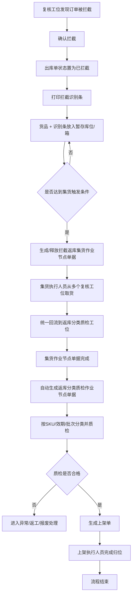
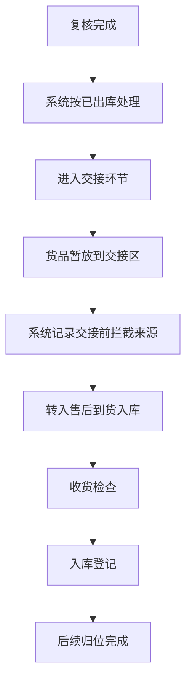
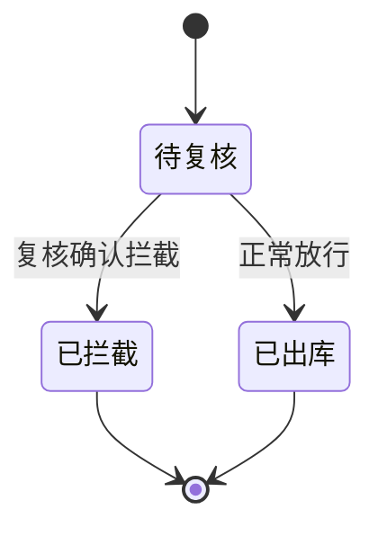
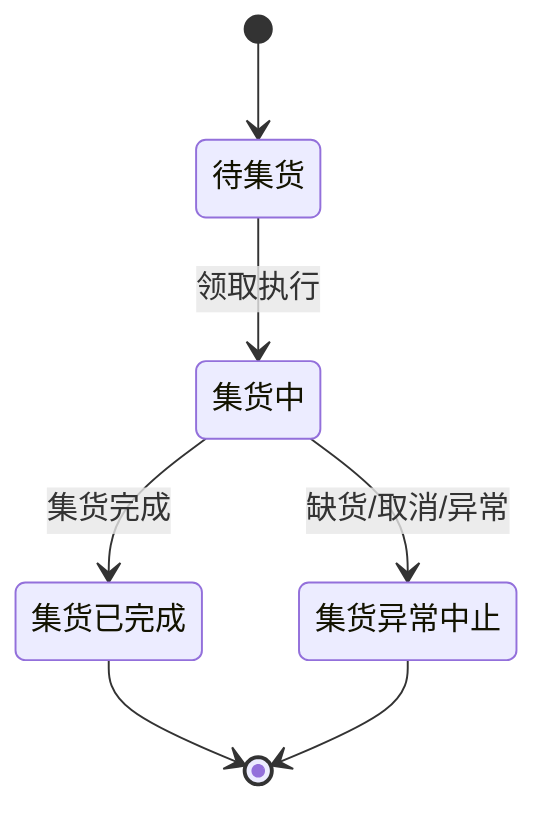
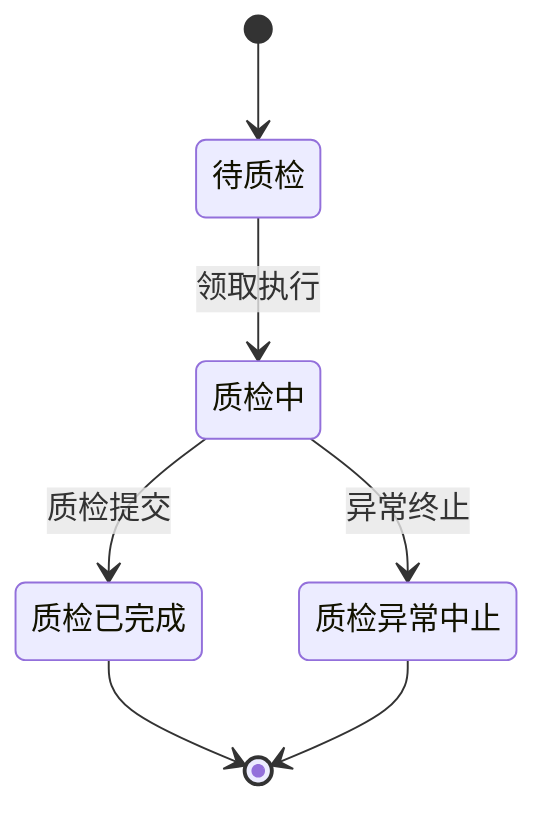
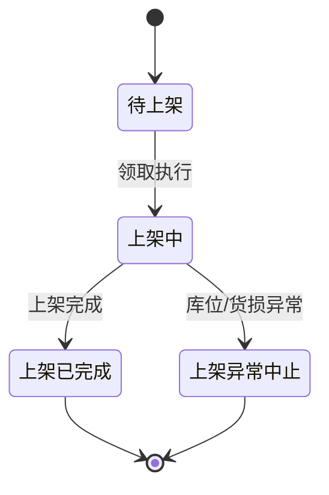
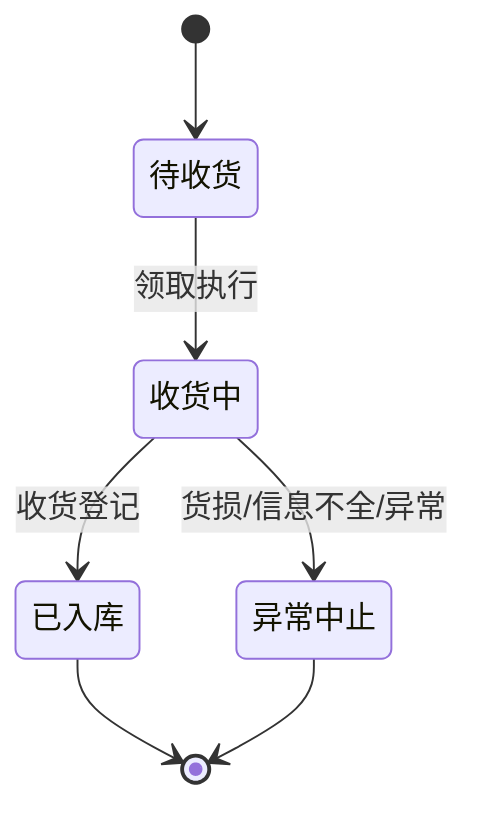

# xyWMS 订单拦截后返库上架与售后到货入库说明

- 文档状态：草案
- 适用范围：电商场景下，订单在复核工位被拦下来后的返库、分类质检、上架流程，以及交接前拦截后的售后到货入库流程
- 适用系统：xyWMS
- 说明：这份文档只讲返库上架和交接前拦截后的售后到货入库怎么做，不讲出库单是怎么被拦下来的，也不改拦截后的状态

## 1. 功能定义

### 1.1 背景

订单已经拣到复核环节，如果在这里被拦住，货就不能继续出库了，需要先回到仓内再处理。这个场景不是一单一单马上做，而是先把多个复核工位的拦截货放到暂存区，等攒到一定量后再统一集货、质检、上架。除了这条主线，还有一条并列场景，是复核完成后在交接环节被暂存，再转到售后到货入库。

### 1.2 目标

1. 做到订单被拦后可以批量返库上架。
2. 集货单可以按数量阈值或时间阈值自动触发。
3. 集货完成后，系统自动生成分类质检单。
4. 质检完成后自动生成上架单，并按库位规则完成上架。
5. 全程都能查到来源，出库单、识别条、集货单、质检单、上架单之间要能串起来。
6. 支持交接前拦截后的货品转入售后到货入库，并保留原订单关联。
7. 库存变动要看得明白，是位置变了、状态变了，还是数量真的变了。

### 1.3 范围

这次只做 `xyWMS` 里的这些流程：

- 出库单在复核工位被拦截后，状态记为 `已拦截`
- 复核工位旁暂存库位/箱的管理
- `拦截返库集货作业节点单据`
- `返库分类质检作业节点单据`
- `上架单`
- 拦截识别条打印与重打
- 交接前拦截后的售后到货入库

这次不做这些：

- 出库拦截怎么判定
- 计费系统规则
- 容器强制化管理

### 1.4 角色

| 角色 | 职责 |
| --- | --- |
| 复核员 | 发现拦截后做标记、打印识别条、放到暂存库位 |
| 集货执行人员 | 按集货单从多个复核工位把货取回并集中处理 |
| 质检人员 | 对回流货品做分类、看效期、看批次、判断不良 |
| 上架执行人员 | 按上架单把货放回对应库位 |
| 售后岗位/售后员 | 接收交接前拦截货品，完成收货检查、入库登记和归位 |
| 仓内主管/调度 | 配阈值、看待办、手工发起集货或处理异常 |

### 1.5 术语

| 术语 | 定义 |
| --- | --- |
| 暂存库位 | 复核工位旁边用来临时放拦截货的库位，物理上可以是箱子或大箱 |
| 拦截识别条 | 打印后跟着货一起放进暂存库位的纸条，按出库单汇总打印 |
| 作业节点单据 | 系统里用来承载执行过程的单据，不另外建“任务”模型 |
| 集货 | 从多个复核工位的暂存库位把拦截货收回来，集中到一个地方 |
| 分类质检 | 按 SKU、效期、批次和质量状态，把回流货拆开并判断 |
| 交接前拦截 | 复核完成后、正式交货前，在交接环节被先暂存的货品 |
| 售后到货入库 | 交接前拦截后的货品进入售后链路，完成收货检查、入库登记和归位 |

## 2. 业务规则

| 规则编号 | 规则描述 | 说明 |
| --- | --- | --- |
| R1 | 出库单拦截后直接置为 `已拦截` | 复核工位确认拦截后，后面的返库、质检、上架都不再改出库单主状态 |
| R2 | 不引入独立“任务”对象 | 返库上架流程只靠作业节点单据跑，不另外建任务 |
| R3 | 集货作业节点单据为批量作业 | 一张集货单可以包含多个复核工位、多个出库单、多个拦截明细 |
| R4 | 集货作业节点单据采用组合触发 | 数量够了、时间到了，或者主管手工触发，都可以生成/释放集货单 |
| R5 | 分类质检单在集货单完成后自动生成 | 集货完成是前置条件，质检单不由人工直接新建 |
| R6 | 同一个 SKU 不同效期必须拆分 | 质检和上架都要区分效期，不能混成一行 |
| R7 | 同一个 SKU、同一个效期、不同批次默认拆分 | 如果要合并，要靠配置打开，不作为默认做法 |
| R8 | 可混货质检 | 多个订单、多个工位回流的货，可以先混着送到质检工位，再按规则拆开 |
| R9 | 拦截识别条按出库单汇总打印 | 不是按拦截明细一行一行单独打；整单拦截打整单，多拣打多拣 SKU，少拣打差异信息 |
| R10 | 拦截识别条与货品同箱流转 | 识别条放进暂存箱/暂存库位，方便后面认来源 |
| R11 | 暂存容器非强制 | 物理上可以是箱子、大箱或其他载具，系统只要能映射成暂存库位就行 |
| R12 | 少拣场景仅记录差异，不进入返库实物流转 | 订单可以拦，但实际不存在的货不进返库质检和上架 |
| R13 | 异常品不直接上架 | 不良、过期、批次异常的货，不进正常上架单 |
| R14 | 上架单只承接质检合格货品 | 只有质检通过的货才会进入上架单 |
| R15 | 交接前拦截后的货品转入售后到货入库链路处理 | 保留原订单关联，不回写改变已出库状态 |
| R16 | 库存流转默认按位置和状态变化处理 | 只有报废、短少差异、真实入库/出库才改变总数量 |

## 3. 流程说明

### 3.1 主流程

1. 复核工位发现订单被拦截，复核员在系统中确认拦截。
2. 出库单状态直接记为 `已拦截`，后面的返库动作只保留关联，不再改出库单状态。
3. 系统生成或允许打印 `拦截识别条`，识别条按出库单汇总展示订单信息、拦截货品明细和差异信息。
4. 拦截货品连同识别条一起放进复核工位旁的暂存库位/暂存箱。
5. 系统持续累计同类拦截货品，数量够了、时间到了，或者主管手工触发时，生成或释放 `拦截返库集货作业节点单据`。
6. 集货执行人员在待办里看到这张单，按单从多个复核工位取货，统一回流到返库分类质检工位。
7. 集货单完成后，系统自动生成 `返库分类质检作业节点单据`。
8. 质检人员在分类质检工位对回流货品做分类、看效期、看批次、判断不良。
9. 质检合格的货品自动进入上架单生成逻辑，按库位策略生成 `上架单`。
10. 上架执行人员按上架单完成归位，流程结束。

### 3.2 流程图

### 3.3 文字说明补充

- 集货不是一单来了就马上处理，而是攒到一定量后再批量做。
- 集货执行人员可以跨多个复核工位取货，不用固定在一个工位。
- 分类质检工位可以先混货再拆分，但拆分维度必须满足业务规则。
- 质检通过后再生成上架单，避免不合格货直接进正常库存。

### 3.4 交接前拦截后的售后到货入库

这条链路和返库上架是并列的，不是返库上架的附属步骤。它发生在订单已经完成复核、系统也已经把它算作 `已出库` 之后，货品还没正式交出去，在交接环节被先放到边上或交接暂存位，后面再转给售后岗位处理。

系统要做的，是把这批货和原订单关联起来，记录来源、时间、经手人和暂存位置，然后按售后到货入库流程继续走。这里不生成返库集货单、质检单、上架单，但要能把货品转到售后入库链路里，直到完成收货检查、入库登记和后续归位。

- 这条链路不回到复核工位返库上架流程。
- 这条链路会保留原订单关联，便于追溯。
- 这条链路最终要进入售后到货入库的收货、检查、入库和归位流程。

## 4. 数据来源

| 数据来源 | 用途 | 关键字段 |
| --- | --- | --- |
| 出库单头/明细 | 识别被拦截的订单及明细 | 出库单号、SKU、计划数量、已拣数量、复核工位、订单状态 |
| 复核拦截事件 | 记录某次拦截发生的事实 | 拦截时间、复核工位、操作员、拦截原因、拦截数量 |
| 拦截识别条打印数据 | 生成纸条与重打内容 | 纸条编号、出库单号、拦截明细、差异明细、打印次数 |
| 拦截返库集货作业节点单据 | 承载批量集货执行 | 单据号、来源工位集合、来源订单集合、触发方式、状态 |
| 返库分类质检作业节点单据 | 承载分类质检执行 | 单据号、质检组、SKU、效期、批次、质检结果 |
| 上架单 | 承载归位执行 | 单据号、目标库位、SKU、数量、执行状态 |
| 售后到货入库记录 | 承接交接前拦截来源并继续售后入库 | 来源订单号、来源类型、交接暂存位、收货人、检查结果、入库状态 |
| 库存流水/库存台账 | 记录位置变更、状态变更和数量变更 | 来源单据号、来源类型、原库位、目标库位、数量、库存状态、操作时间 |
| SKU 主数据 | 质检与上架判断 | SKU、温层、包装规格、是否可混批等 |
| 库位主数据 | 上架归位与容量判断 | 库位编码、库位类型、容量、启用状态 |
| 质检规则/效期规则 | 分类与判定标准 | 近效期阈值、批次拆分策略、不良判定规则 |
| 容器/暂存库位数据（可选） | 记录物理载具或箱位 | 容器编码、暂存库位编码、绑定状态 |

## 5. 页面交互

### 5.1 待办列表

| 项目 | 说明 |
| --- | --- |
| 使用者 | 集货执行人员、质检人员、上架执行人员、主管 |
| 展示内容 | 作业节点单据号、类型、状态、来源工位、来源订单数、数量、创建时间、优先级 |
| 主要操作 | 查看详情、领取/开始、完成、异常中止、筛选、搜索 |

### 5.2 集货单详情

| 项目 | 说明 |
| --- | --- |
| 展示内容 | 来源出库单、来源复核工位、暂存库位、拦截货品明细、差异明细、触发方式 |
| 主要操作 | 打印/重打识别条、开始集货、集货完成、异常处理 |
| 关键交互 | 可以直接看这张单要去哪些复核工位取货 |

### 5.3 质检单详情

| 项目 | 说明 |
| --- | --- |
| 展示内容 | SKU、效期、批次、数量、来源集货单、来源订单、质检建议分组 |
| 主要操作 | 录入质检结果、拆分/合并建议确认、标记不良、提交完成 |
| 关键交互 | 可以先按混货查看，再按规则拆成多个质检行 |

### 5.4 上架单详情

| 项目 | 说明 |
| --- | --- |
| 展示内容 | 合格货品明细、推荐库位、数量、容器信息（如有） |
| 主要操作 | 执行上架、确认库位、拆单上架、异常中止 |
| 关键交互 | 上架库位可按系统推荐值执行，也可在权限范围内调整 |

### 5.5 识别条打印

| 项目 | 说明 |
| --- | --- |
| 展示内容 | 出库单号、拦截明细、差异明细、打印次数、最后打印时间 |
| 主要操作 | 打印、重打、预览 |
| 关键交互 | 识别条为过程追溯凭证，不作为业务唯一执行入口 |

### 5.6 售后到货入库

| 项目 | 说明 |
| --- | --- |
| 展示内容 | 来源订单、交接暂存位、收货检查结果、入库状态、归位信息 |
| 主要操作 | 收货、检查、入库登记、完成 |
| 关键交互 | 这批货必须能查到原订单，也要能看出它来自交接前拦截 |

## 6. 操作后发生什么

| 操作 | 系统动作 | 后续影响 |
| --- | --- | --- |
| 确认订单拦截 | 出库单置为 `已拦截`，生成拦截记录 | 出库单后续不再按正常出库流转 |
| 打印拦截识别条 | 生成纸条内容并记录打印次数 | 纸条随货进入暂存库位/箱 |
| 货品放入暂存库位 | 暂存库存量增加 | 等待集货单触发 |
| 触发并生成集货单 | 创建/释放集货作业节点单据 | 待办列表里出现这张单，多个工位可以一起处理 |
| 集货完成 | 集货单状态变为已完成 | 系统自动生成分类质检单 |
| 质检完成且合格 | 合格货进入上架单生成逻辑 | 生成待上架单据 |
| 质检不合格 | 记录异常原因 | 不进正常上架单，转异常处理流 |
| 上架完成 | 库存归位到目标库位 | 上架单完成，链路可追溯到原出库单 |
| 重打识别条 | 只增加打印记录 | 不改变任何业务状态 |
| 交接前拦截转入售后到货入库 | 记录交接前拦截来源并转入售后链路 | 后续按售后到货入库继续处理 |
| 售后到货入库完成 | 完成收货检查、入库登记和归位 | 售后链路结束，可追溯到原订单 |

### 6.1 库存变动口径

这套方案里，大部分动作改的是库存位置和库存状态，不是总数量。简单说，就是货从一个地方挪到另一个地方，库存还在，只是放的位置变了；只有报废、短少差异、真实入库/出库这几类动作，才会让总数量真的变化。

| 场景 | 库存变化 | 说明 |
| --- | --- | --- |
| 复核确认拦截 | 正常出库链路库存转入复核暂存库存 | 总量不变，只换位置和状态 |
| 放入暂存库位 | 暂存库位库存增加 | 货进入待处理库存 |
| 生成并执行集货 | 暂存库位库存减少，质检待处理库存增加 | 只是从一个待处理位置转到另一个待处理位置 |
| 集货完成 | 不改变总量 | 只表示单据完成，货已到质检环节 |
| 质检合格 | 质检待处理库存减少，待上架库存增加 | 货从质检状态转入上架状态 |
| 上架完成 | 待上架库存减少，正常库位库存增加 | 货正式回到可管理库存 |
| 质检不良/过期/批次异常 | 质检待处理库存减少，异常库存增加 | 不进入正常上架库存 |
| 少拣差异 | 不产生实物库存变动 | 只记差异，不进返库实物流转 |
| 交接前拦截转入售后到货入库 | 交接暂存位库存减少，售后待收货库存增加 | 后续按售后入库流程继续走 |
| 售后到货入库完成 | 售后待收货库存减少，售后/正常库位库存增加 | 具体落位按售后流程决定 |

库存记录至少要能看出这几项：来源单据、来源类型、原库位、目标库位、数量、库存状态、操作时间。

## 7. 约束与限制

1. 这套流程不依赖“任务”模型，后面要扩展也优先复用作业节点单据。
2. 集货要能批量做，不要求一单来了就立刻处理。
3. 集货触发要同时支持阈值触发和人工触发。
4. 复核工位旁的暂存区可以是箱、筐或其他可识别区域，但系统里要能映射成暂存库位。
5. 识别条只是过程标识和追溯标识，不是唯一入口。
6. 分类质检要支持混货回流后再拆分，而且必须区分 SKU、效期、批次。
7. 如果某些货在实物里根本不存在，比如少拣数量，就不进入返库实物流转。
8. 返库后续流程只关联出库单，不回写改变出库单已拦截后的状态。
9. 容器管理先不强制，后面如果要启用，字段要留好扩展空间。

## 8. 状态机

### 8.1 出库单状态

| 状态 | 说明 | 迁移 |
| --- | --- | --- |
| 待复核 | 订单进入复核环节 | 复核完成后进入已出库或已拦截 |
| 已拦截 | 在复核工位确认拦截 | 终态，不因返库流程再变化 |
| 已出库 | 正常出库完成 | 终态 |

### 8.2 拦截返库集货作业节点单据

| 状态 | 说明 | 迁移 |
| --- | --- | --- |
| 待集货 | 已生成但尚未开始执行 | 领取后进入集货中 |
| 集货中 | 集货执行人员正在取货 | 完成后进入集货已完成 |
| 集货已完成 | 已完成批量集货 | 自动生成质检单 |
| 集货异常中止 | 因缺货、库位异常、人工取消等原因终止 | 终态 |

### 8.3 返库分类质检作业节点单据

| 状态 | 说明 | 迁移 |
| --- | --- | --- |
| 待质检 | 集货单完成后自动生成 | 领取后进入质检中 |
| 质检中 | 质检人员正在分类与判定 | 完成后进入质检已完成 |
| 质检已完成 | 质检结果已提交 | 合格货品进入上架单 |
| 质检异常中止 | 质检过程异常终止 | 终态 |

### 8.4 上架单

| 状态 | 说明 | 迁移 |
| --- | --- | --- |
| 待上架 | 质检通过后生成 | 领取后进入上架中 |
| 上架中 | 执行人员正在上架 | 完成后进入上架已完成 |
| 上架已完成 | 上架结束 | 终态 |
| 上架异常中止 | 库位异常、货损等原因中止 | 终态 |

### 8.5 状态机图

#### 出库单

#### 拦截返库集货作业节点单据

#### 返库分类质检作业节点单据

#### 上架单

说明：

- `拦截返库集货作业节点单据` 完成后自动生成 `返库分类质检作业节点单据`
- `返库分类质检作业节点单据` 完成后自动生成 `上架单`

#### 售后到货入库记录

说明：

- 交接前拦截的货品进入售后到货入库记录后，再由售后岗位完成收货、检查、入库和归位
- 这条链路保留原订单关联，但不回到返库上架流程

## 9. 典型用例

| UC 编号 | 场景 | 前置条件 | 主要步骤 | 预期结果 |
| --- | --- | --- | --- | --- |
| UC-01 | 整单拦截返库 | 订单在复核工位被整单拦截 | 1. 确认拦截 2. 打印识别条 3. 放入暂存库位 4. 等待集货 5. 质检 6. 上架 | 出库单为已拦截，货品完成返库上架链路 |
| UC-02 | 多拣拦截返库 | 订单中存在多拣 SKU 被拦截 | 1. 确认拦截 2. 识别条记录多拣明细 3. 放入暂存库位 4. 集货 5. 质检 6. 上架 | 多拣 SKU 被纳入返库链路，差异可追溯 |
| UC-03 | 少拣但订单被拦截 | 订单被拦截，但部分货品并未实际在场 | 1. 确认拦截 2. 识别条记录缺少数量 3. 仅对实物部分入暂存 4. 其余数量记差异 | 仅实物进入返库流程，缺少数量不进入返库实物流转 |
| UC-04 | 多工位批量集货 | 多个复核工位都有已拦截货品 | 1. 系统累计拦截量 2. 达阈值生成集货单 3. 集货员按单跨工位取货 4. 回流质检 | 集货单能聚合多工位货品并统一处理 |
| UC-05 | 同 SKU 不同效期拆分 | 回流货品存在相同 SKU 但不同效期 | 1. 进入质检 2. 系统按效期拆分 3. 逐组判定 | 不同效期不会被合并为同一质检/上架行 |
| UC-06 | 同 SKU 同效期不同批次 | 回流货品存在相同 SKU、相同效期、不同批次 | 1. 进入质检 2. 默认拆分批次 3. 按配置决定是否允许合并 | 默认拆分，若开启配置可按规则合并 |
| UC-07 | 质检不良品处理 | 质检发现不良、过期、批次异常 | 1. 录入异常 2. 不生成正常上架单 3. 进入异常处理 | 异常品不进入正常库存 |
| UC-08 | 识别条重打 | 纸条丢失或污损 | 1. 打开拦截单详情 2. 点击重打 3. 重新打印 | 仅增加打印记录，不改变业务状态 |
| UC-09 | 交接前拦截转售后入库 | 订单复核完成后在交接环节被暂存 | 1. 记录交接前拦截 2. 转入售后到货入库 3. 收货检查 4. 入库登记 5. 归位 | 原订单可追溯，货品进入售后到货入库链路 |

<!-- ## 10. 数据字典

> 说明：以下为建议的逻辑表名，实际物理表名可按现有 `xyWMS` 规范落地。

### 10.1 出库单头 `wms_outbound_order`

| 字段 | 说明 |
| --- | --- |
| outbound_order_no | 出库单号 |
| order_status | 出库单状态，示例：待复核、已拦截、已出库 |
| intercept_flag | 是否被拦截 |
| intercept_time | 拦截时间 |
| intercept_station_code | 拦截发生的复核工位 |
| intercept_reason | 拦截原因 |

### 10.2 出库单明细 `wms_outbound_order_line`

| 字段 | 说明 |
| --- | --- |
| outbound_order_no | 出库单号 |
| line_no | 行号 |
| sku_code | SKU 编码 |
| plan_qty | 计划数量 |
| picked_qty | 已拣数量 |
| intercepted_qty | 拦截数量 |
| shortage_qty | 少拣数量 |
| expiry_date | 效期，必要时参与拆分 |
| batch_no | 生产批次 |

### 10.3 拦截识别条 `wms_intercept_tag`

| 字段 | 说明 |
| --- | --- |
| tag_no | 识别条编号 |
| outbound_order_no | 关联出库单号 |
| tag_type | 标签类型，示例：整单拦截、部分拦截、多拣、少拣 |
| print_count | 打印次数 |
| last_print_time | 最后打印时间 |
| temp_location_code | 暂存库位编码 |
| container_code | 容器编码，可选 |

### 10.4 拦截返库集货作业节点单据 `wms_intercept_return_collect_doc`

| 字段 | 说明 |
| --- | --- |
| collect_doc_no | 集货单号 |
| trigger_mode | 触发方式，示例：数量阈值、时间阈值、人工触发 |
| doc_status | 单据状态 |
| source_station_count | 来源工位数 |
| source_order_count | 来源订单数 |
| source_total_qty | 集货总数量 |
| start_time | 开始时间 |
| finish_time | 完成时间 |
| executor_user | 集货执行人员 |

### 10.5 拦截返库集货作业节点单据明细 `wms_intercept_return_collect_line`

| 字段 | 说明 |
| --- | --- |
| collect_doc_no | 集货单号 |
| source_station_code | 来源复核工位 |
| outbound_order_no | 来源出库单号 |
| sku_code | SKU 编码 |
| qty | 集货数量 |
| expiry_date | 效期 |
| batch_no | 批次 |
| temp_location_code | 暂存库位编码 |

### 10.6 返库分类质检作业节点单据 `wms_return_qc_doc`

| 字段 | 说明 |
| --- | --- |
| qc_doc_no | 质检单号 |
| source_collect_doc_no | 来源集货单号 |
| doc_status | 单据状态 |
| qc_station_code | 质检工位 |
| auto_generated_flag | 是否自动生成 |
| total_qty | 总数量 |
| pass_qty | 合格数量 |
| fail_qty | 不合格数量 |

### 10.7 返库分类质检作业节点单据明细 `wms_return_qc_doc_line`

| 字段 | 说明 |
| --- | --- |
| qc_doc_no | 质检单号 |
| group_no | 质检分组号 |
| sku_code | SKU 编码 |
| qty | 数量 |
| expiry_date | 效期 |
| batch_no | 批次 |
| qc_result | 质检结果，示例：合格、不良、过期、批次异常 |
| defect_reason | 异常原因 |
| putaway_group_no | 对应上架分组号 |

### 10.8 上架单 `wms_putaway_order`

| 字段 | 说明 |
| --- | --- |
| putaway_order_no | 上架单号 |
| source_qc_doc_no | 来源质检单号 |
| doc_status | 单据状态 |
| strategy_code | 上架策略编码 |
| total_qty | 上架总数量 |
| target_location_count | 目标库位数 |
| executor_user | 上架执行人员 |

### 10.9 上架单明细 `wms_putaway_order_line`

| 字段 | 说明 |
| --- | --- |
| putaway_order_no | 上架单号 |
| sku_code | SKU 编码 |
| qty | 上架数量 |
| target_location_code | 目标库位 |
| expiry_date | 效期 |
| batch_no | 批次 |
| container_code | 容器编码，可选 |

### 10.10 库位主数据 `wms_location`

| 字段 | 说明 |
| --- | --- |
| location_code | 库位编码 |
| location_type | 库位类型，示例：复核旁暂存、质检位、正常库位 |
| capacity | 容量 |
| enabled_flag | 是否启用 |
| zone_code | 所属库区 |
-->
