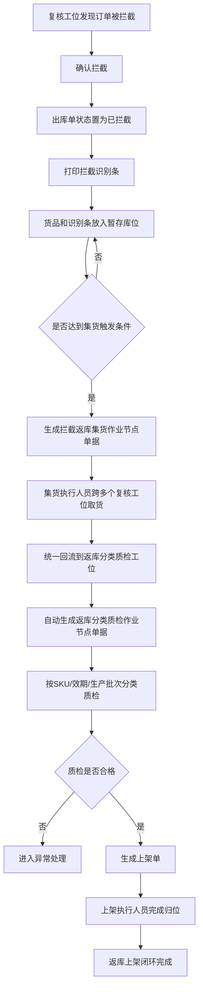
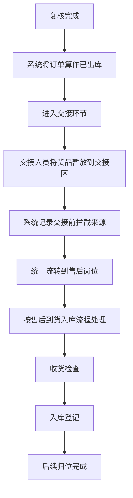

# WMS - 返库上架方案

## 一、方案目标
为了更好地进行仓内管理，系统需要支持返库上架场景，达到对作业流程全过程监控，并可向计费系统提供实际操作数据作为计费基础。

1. 需要实现仓内货物回到原库位，并对过程做记录。
2. 在返库过程中可以发现不良品、效期不好的品。

## 二、场景范围

### 2.1 返库上架主流程
本方案描述的是电商场景内“订单拦截后的返库上架”流程。订单在复核工位被拦截后，出库单直接进入已拦截状态；拦截下来的货品先进入复核工位旁的暂存库位，系统按照数量阈值、时间阈值或人工触发的组合条件，批量生成集货作业节点单据。集货完成后自动生成分类质检作业节点单据，质检合格后再生成上架单完成归位。整个返库链路只和原出库单建立关联，不回写改变出库单后续状态。容器是否使用可以待定，系统先按暂存库位/大箱的方式管理即可。

### 2.2 相关支持场景
返库上架相关的来源场景可以分为两类：

1. 返库上架主流程
   - 出库订单拦截：外部消息通知，不再让这张订单出库，会在复核工位拦截，存到暂存工位。
   - 货品异常拦截：复核台发现货品多拣货，报多拣，然后存到暂存工位。
2. 售后入库来源
   - 售后入库：售后到货的货品，存储在售后暂存工位。
   - 交接前拦截：系统中复核完成算作已出库，后续还有一个交接环节，交接的员工把货品放到边上，统一流转到售后岗位去做售后到货入库。
   - 交接区回流：货品在交接区被暂存，不进入正常出库流转，后续统一交给售后岗位做售后到货入库。

其中前两项进入返库上架主流程，后三项统一归入售后到货入库链路处理。

## 三、主流程说明

### 3.1 流程说明
本方案的主流程是电商场景内“订单拦截后的返库上架”。订单在复核工位被拦截后，出库单直接进入已拦截状态；拦截下来的货品进入暂存库位，系统按数量阈值、时间阈值或人工触发的组合条件生成集货作业节点单据。集货完成后自动生成分类质检作业节点单据，质检合格后生成上架单完成归位。

整个返库链路只和原出库单建立关联，不回写改变出库单后续状态。容器是否启用可以后续再定，当前先按暂存库位或大箱方式管理即可。

### 3.2 流程图

### 3.3 角色分工

| 角色 | 负责动作 | 系统支持 |
| --- | --- | --- |
| 复核员 | 确认拦截、打印识别条、放入暂存库位 | 拦截确认、识别条打印、暂存记录 |
| 集货执行人员 | 按集货单跨多个复核工位取货并回流 | 集货待办、来源工位提示、批量回流登记 |
| 质检人员 | 分类、验效期、验批次、判不良 | 质检单、质检结果录入、异常原因记录 |
| 上架执行人员 | 按上架单完成归位 | 上架单、目标库位推荐、上架确认 |
| 主管/调度 | 设置阈值、人工触发、处理异常 | 阈值配置、单据状态监控、异常干预 |

### 3.4 节点输入输出

| 节点 | 输入 | 输出 |
| --- | --- | --- |
| 拦截确认 | 出库单、拦截事件、复核工位 | 出库单已拦截、拦截识别条、暂存记录 |
| 批量集货 | 暂存库位中的被拦截货品、触发条件 | 拦截返库集货作业节点单据、集货完成记录 |
| 分类质检 | 集货完成的货品、SKU 主数据、效期/批次信息 | 返库分类质检作业节点单据、合格/不合格结果 |
| 上架执行 | 质检合格货品、库位主数据 | 上架单、上架完成记录 |

### 3.5 异常场景说明

| 异常场景 | 处理方式 |
| --- | --- |
| 纸条丢失或污损 | 允许重打识别条，不影响单据状态 |
| 暂存库位已满 | 暂停继续入位，通知主管处理或切换暂存位 |
| 集货时找不到货品 | 记录缺货异常，终止或拆分该集货单 |
| 质检发现不良品 | 记录不良原因，不生成正常上架单 |
| 质检发现过期或批次异常 | 进入异常处理，不进入正常库存 |
| 上架库位不足 | 暂停上架，等待重新分配库位或拆单处理 |
| 订单少拣但已被拦截 | 少拣数量只记差异，不进入返库实物流转 |

## 四、交接前拦截补充说明

交接前拦截不是复核工位的返库上架场景，而是订单已经在系统中完成复核、状态算作已出库之后，在交接环节再被暂存并回流到售后岗位处理的场景。

这类货品的处理链路建议单独作为“售后到货入库”的来源之一理解，和前面的“订单拦截返库上架”并列存在，但不要混成同一条流程。

### 4.1 补充流程

1. 订单复核完成后，系统已将该单算作已出库。
2. 货品在交接环节被交接人员暂放到边上或交接暂存位。
3. 系统记录该批货品来自交接前拦截场景，后续统一流转到售后岗位。
4. 售后岗位按售后到货入库流程继续处理，包括收货、检查、入库和后续归位。

### 4.2 补充规则

1. 该场景不回到复核工位的返库上架链路。
2. 该场景的后续动作应并入售后到货入库流程管理。
3. 货品可保留与原订单的关联关系，但不应改变已出库状态。

### 4.3 补充流程图

