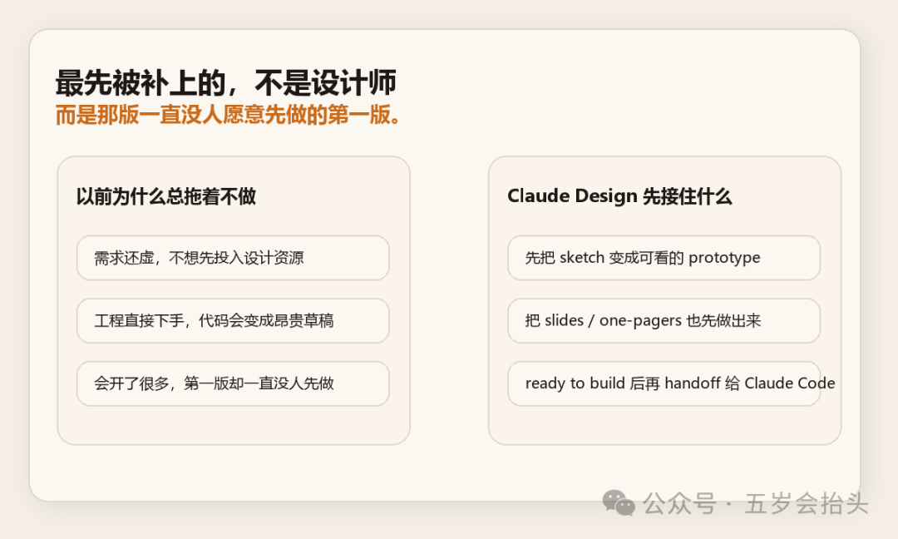
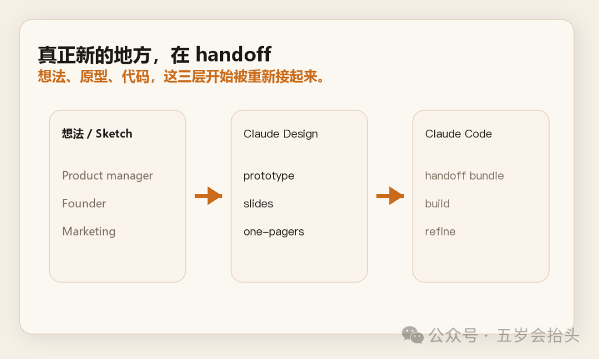

很多产品讨论，最后都卡在一个很熟悉的地方。

不是没人有想法。

也不是没人会写需求。

而是那版“先做出来看看”的东西，迟迟没人先做。

产品经理能把逻辑讲清楚，设计师能把东西做漂亮，工程师能把东西做出来。

但从一句模糊的话，到一个能点、能看、能讨论的第一版，中间往往会空很久。

我觉得 Claude Design 第一批最值得看的，不是它会不会替代设计师。

而是它有可能先把这段空白填上。

官方发布：

https://www.anthropic.com/news/claude-design-anthropic-labs

## 先替掉的，不是设计师

Anthropic 这次其实写得很直白。

Claude Design 可以用来做 `designs`、`prototypes`、`slides`、`one-pagers`。

更关键的一句是，官方直接写了：

产品经理可以先把功能流程 sketch 出来，再把它交给 Claude Code 去实现，或者交给设计师继续 refine。

这句话比一堆宣传词都重要。

因为它说的不是“AI 会设计了”。

它说的是：以前那段没人特别想先做、但又必须先有个东西的中间稿，现在开始有人来接了。

很多团队里，最贵的从来不是最后那层精修。

最贵的是第一版。

那版不够正式，不能直接上线，也不值得投入整套流程，但没有它，后面的讨论都容易悬在空中。

## 第一版原型为什么一直很贵

第一版原型贵，不是因为它技术上最难。

恰恰相反。

它往往看起来最像“谁都能顺手做一下”。

但现实是，这一步最容易被拖。

产品经理知道自己要什么，但未必能很快把它变成一个能演示的界面。

设计师当然能做，但如果需求还很虚，先接这件事常常像在替整个团队试错。

工程师也能硬做，可一旦还没收敛，代码就会变成最贵的草稿纸。

所以很多会最后开成一种奇怪状态：

大家都觉得方向差不多了，但谁都不太想先做第一版。

这就是为什么我觉得 Claude Design 值得看。

它不是把“最终设计”自动化了。

它更像是在接那种以前会被反复口头讨论、却迟迟没有可视化结果的工作。

## 真正新的地方，在 handoff

这类产品以前不是没有。

能生成页面、能出线框、能做演示稿的 AI 工具，过去一年已经很多了。

但大部分产品的问题也很像：

出一版不难。

难的是出完以后，谁来接。

Anthropic 这次最重要的，不只是它能做原型。

而是它把 `handoff to Claude Code` 明明白白写进了产品流程里。

官方原话是：当设计 ready to build 之后，Claude 会把内容打包成一个 `handoff bundle`，然后你可以用一条指令把它交给 Claude Code。

这就不再只是“AI 帮你画一张图”了。

它开始碰的是另一层东西：

想法、原型、代码，这三层之间原本断开的地方，正在被重新接起来。

这也是为什么我会觉得它对产品经理特别有吸引力。

很多产品经理真正缺的，不是想法。

缺的是一个足够便宜、足够快、又不至于太假的第一版出口。

## 第一批最适合它的，可能就是产品经理

官方自己列的使用人群，其实已经说明了很多事。

除了设计师，它还反复提到了 founders、product managers、marketers。

这不是一句客套话。

因为这几类人有一个共同点：

他们经常最先有方向，但不一定有最顺手的生产工具。

Founder 想先把 pitch deck 拉出来。

Marketing 想先把 campaign 视觉感受做出来。

产品经理想先把 feature flow 讲清楚。

这些工作都有一个共同特征：

它们不是终稿。

但它们必须先存在，团队后面才能接得住。

如果 Claude Design 真能把这一步做得足够顺，那它最先改变的，未必是设计团队内部怎么工作。

更可能是产品、市场、创始人这些原本总是卡在“我脑子里有，但我还拿不出第一版”的角色。

## 这件事可能会先改掉团队里的一个习惯

以前很多团队的默认顺序是：

先开会。

再整理需求。

再等设计。

再看有没有时间做第一版。

Claude Design 如果真能跑通，顺序可能会变成另一种样子：

先把第一版做出来。

然后大家围着它继续讨论。

这不是小变化。

因为一旦第一版原型的成本掉下来，团队讨论的单位也会变。

以前大家讨论的是想法。

以后大家讨论的，可能会越来越早地变成一个可以被修改、被评论、被交接的半成品。

而很多产品决策，本来就是在这种半成品阶段才真正开始收敛的。

## 我现在更关心的，不是它画得多好

Claude Design 当然还会有很多问题。

比如第一版看起来会不会太顺，顺到让团队误以为方向已经对了。

比如它能不能真的理解复杂产品里的交互细节，而不是只给一个好看的壳。

再比如，设计系统接入、多人协作、后续维护，到底会不会像宣传里那么顺。

这些都要再看。

但对我来说，这条发布最值得盯的，已经不是“AI 能不能做设计”。

而是另外一个更具体的问题：

以后产品经理会不会先学会的，不是怎么把需求文档写得更长。

而是怎么更快地把第一版原型说出来。