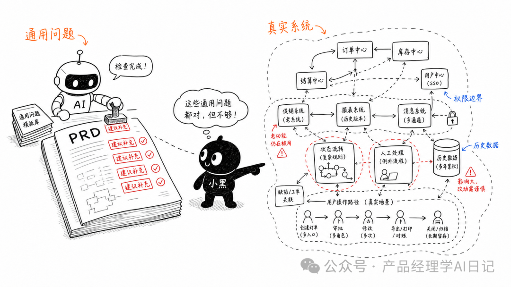
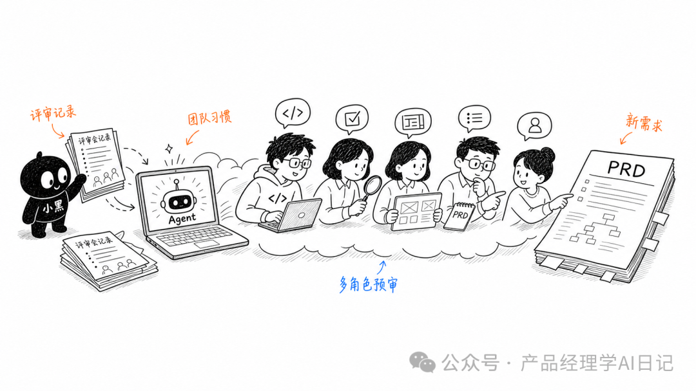
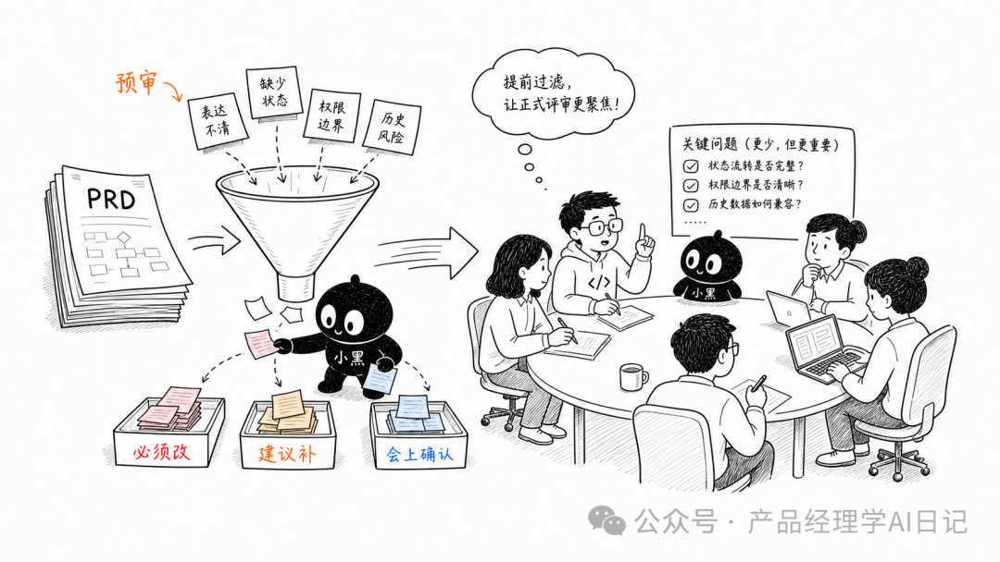

最近做需求的时候，我发现了一个挺实用的用法。

不是让 AI 直接帮我写需求文档。

而是让它当一个“需求评审前的审稿团队”。

因为我现在做的是企业内部的 To B 系统，整个平台已经比较大了，里面也有很多功能已经上线。它不是一个独立小工具，也不是一个可以从零开始随便设计的 demo。

在这种系统里做迭代，AI 直接生成需求文档，效果往往不太稳定。

它容易写得很完整、很标准、很像那么回事。

但真正一看，会发现很多地方不贴业务，不贴已有系统，也不贴团队以前踩过的坑。

看起来像需求文档，完全没法用

为什么通用审核不太够



以前我也试过一种常见做法：

把需求文档发给AI，然后让它按照一些通用方法论、检查清单、用户故事、验收标准之类的框架来审核。

这个方法不是没用。

它可以帮你检查文档有没有目标、有没有流程、有没有异常场景、有没有验收标准。

但问题是，它经常只能审出“通用问题”。

> 比如：
>
> 这里建议补充边界条件。  
>
> 这里建议明确用户角色。  
>
> 这里建议增加异常状态说明。  
>
> 这里建议补充验收标准。

这些话都对。

但也都很像。

真正到企业内部系统里，大家评审时关心的东西往往更具体：

> 这个字段是不是影响已有流程？  
>
> 这个状态会不会和历史数据冲突？  
>
> 这个操作权限谁能看到？  
>
> 测试会不会漏掉某个老功能入口？  
>
> 开发改这里会不会牵一堆后端逻辑？  
>
> UI 这样设计，用户实际操作会不会绕？

这些问题，不是套一个通用模板就一定能审出来的。

我这次换了一个做法

最近我在做系统里一个新模块，这个模块拆下来，大概有十多个需求。

需求文档写到一半的时候，我没有急着让 AI 帮我“优化文档”。

我先做了一件事：

把前几次需求评审的沟通记录下载下来。

我们平时开需求评审会，会用飞书妙记记录会议内容。会后可以直接导出文字版。

我就把这些历史评审记录导出来，按项目资料放在项目文件夹里。

这些记录其实很有价值。

因为里面有真实的提问、真实的争论、真实的遗漏点，也有我们团队反复关注的内容。

它比“标准需求评审 checklist”更贴近自己的业务。

让 Agent 根据历史评审记录组一个团队



有了这些材料之后，我给 Agent 的提示词大概是这个方向：

```
请你结合我提供的历史需求评审记录和当前需求文档，生成一个需求文档评审团队。这个团队至少包含：- 开发- 测试- UI- 真实用户- 产品- 以及你认为还需要补充的角色请每个角色结合历史评审记录中我们团队经常关注的问题，审查当前需求文档可能存在的遗漏、冲突、风险和表达不清的地方。不要只套通用方法论。请优先指出和当前业务、已有系统、历史评审习惯相关的问题。最后按优先级输出：1. 必须修改的问题2. 建议补充的问题3. 可以在评审会上确认的问题
```

这次出来的结果，比单纯让它“帮我审核需求文档”要好很多。

因为它不是凭空想象一个完美需求文档应该长什么样。

而是先看我们之前开会时到底怎么挑问题，再用这些问题去审新的文档。

好用的点在于“贴合团队习惯”



这个方法最有用的地方，不是 AI 突然变聪明了。

而是它有了更贴近现场的上下文。

> 比如历史评审里，如果开发经常追问数据结构和状态流转，它就会在新文档里重点看这些地方。
>
> 如果测试经常关注异常场景、历史数据兼容、权限边界，它就会把这些问题提前列出来。
>
> 如果 UI 和用户经常卡在操作路径、信息展示、按钮位置，它也会从这些角度去审。

这就比通用审核更像真的评审。

不是因为它套了一个更高级的方法论。

而是因为它看过你们以前怎么评审。

我现在对它的定位

我不会把这种做法理解成：

“AI 可以替代需求评审。”

这个说法太满了。

真正的需求评审，还是要靠人。

尤其是企业内部系统里，很多判断依赖历史包袱、组织流程、用户习惯、开发实现、测试经验。这些东西不是一段提示词就能完全解决的。

但 Agent 很适合做评审前的一道预审。

这件事给我的启发

以前我用 Agent，更多会想：

能不能让它帮我生成一份文档？  

能不能让它帮我写代码？  

能不能让它直接给我一个结果？

但这次之后，在复杂系统里，刚开始使用AI提效的思路。

不要总想着让 Agent 一步到位地产出最终结果。

可以先让它基于已有的资料，模拟团队里不同角色的判断。

特别是企业内部 To B 系统。

系统越大，历史越多，越不能只靠通用模板。

这时候真正有价值的，不是让 AI “懂所有业务”。

而是把你们团队已经沉淀下来的评审记录、沟通习惯、历史问题，变成 Agent 可以参考的上下文。