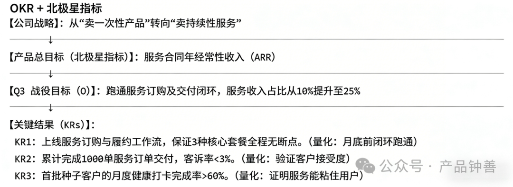
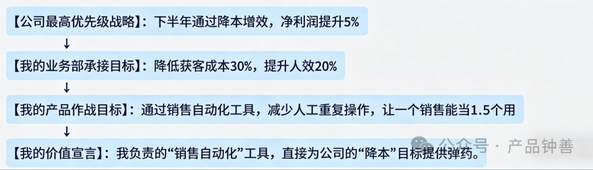
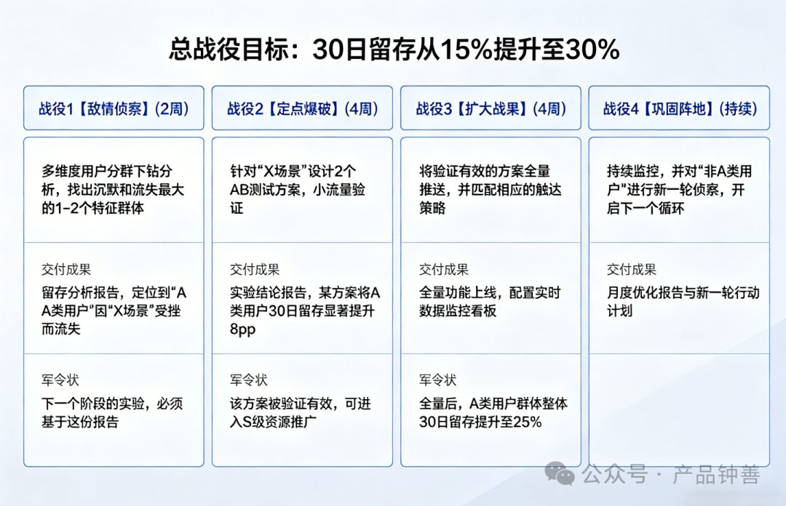
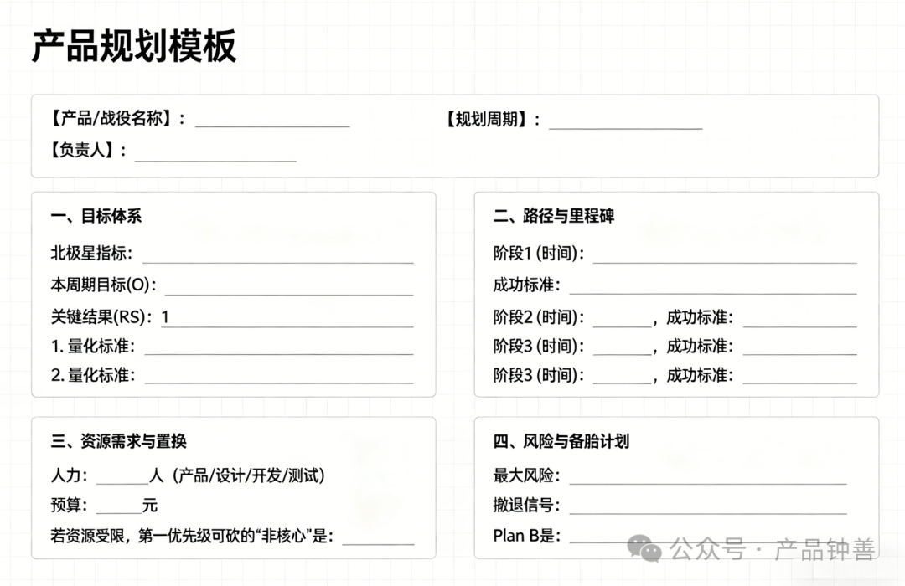
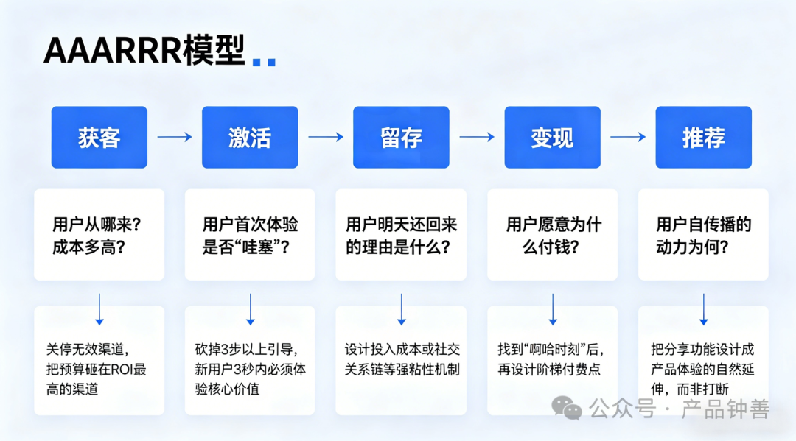
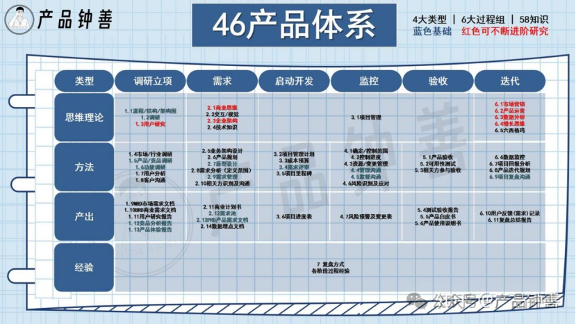

**先给一个残酷的判断标准：**  
如果你的产品规划文档里，只有“功能列表”和“上线时间”，而没有**“业务目标拆解”、“资源博弈逻辑”和“风险对冲方案”**，那你做的只是“排期表”，不是产品规划。你本质上是一个日程专员和原型仔，而不是产品经理。

**这篇文章不讲虚的，只讲一件事：**  
产品经理如何训练自己的“规划思维”，把一堆零散的功能需求，淬炼成一张支撑业务增长的**作战地图**。让你从被动接需求的“功能工厂厂长”，蜕变为能主动定义业务节奏的“操盘手”。

全文干货密度极高，分五部分，**建议收藏后，直接调出你手头的规划文档，逐条进行“尸检”和实践：**

> **第一部分：**
>
> 屠龙刀必须先开刃——产品经理最容易混淆的3个核心概念  
> **第二部分：** 作战地图四要素——你的规划里必须注入的灵魂  
> **第三部分：** 5步落地法——从飘在天上的战略，到踩在地上的路线图  
> **第四部分：** 产品经理的武器库——6个即拿即用的模型与模板  
> **第五部分：** 常见病与解药——99%的产品经理反复踩的坑

---

### 前言：为什么你不懂“规划”，就永远在“救火”？

你是否被这三个场景反复折磨？

* **场景A：需求混战变“三明治”**  

  销售要“客户跟进”，市场要“线索分配”，客服要“工单流转”。你夹在中间，看谁都得罪不起，最后只能按“谁嗓门大”来排期。因为你根本看不清这几个需求背后，那根把他们串起来的业务链条是什么。
* **场景B：战略脱节成“局外人”**  

  公司今年战略是“从卖产品转向卖服务”。可你Q3了还带着团队在死抠商品详情页的按钮颜色。直到老板在复盘会上拍桌子问“我们的服务体系在哪呢？”，你才惊觉，自己一直在旧船板上刷漆，而船早该换了。
* **场景C：资源黑洞变“烂尾楼”**  

  你顶着黑眼圈做了3个月的用户画像系统，上线后运营评价“数据不准，没法用”，技术两手一摊“算法还得再调”。项目无疾而终，而你猛然发现，竞争对手靠一条最简单的规则引擎，早就跑通了推荐业务。

这三个问题的病根完全一致：**产品经理眼里只有“功能点”的堆砌，没有“功能点之上”的业务目标、资源约束和风险对冲的意识。**

**产品规划，就是逼你在动手写PRD（产品需求文档）之前，先逼自己回答清楚：这仗该不该打？怎么打？打输了怎么办？** 它是那张让你从“被动响应”切换到“主动操盘”的作战地图。

---

### 第一部分：屠龙刀必须先开刃——产品经理该懂的3个核心认知

很多人拿到“规划”这把刀就开始乱砍，结果伤了自己。先开刃，弄懂最基本的概念。

**一、产品规划到底是个什么东西？**  
它是对产品未来一段时间内**目标、路径、资源、风险**的系统性设计。用一句话记住它：  
**我们要在哪几个山头插旗？分几路人马去打？需要多少弹药？万一哪路被打散了，是撤是援？**

* 如果产品是一场战役，产品规划就是作战指挥方案。
* PRD则是基于这个方案，在特定时间点下发给某个小队的“具体战术指令”。
* **残酷真相：**

  如果你不了解整个作战方案，你写的PRD指令可能是无效的，甚至会让整个队伍在错误的方向上猛冲。

**二、一张表分清“产品规划”与“需求排期”（别再混了！）**

很多人的“规划”之所以沦为排期，就是从一开始就没分清这哥俩的区别：

| 维度 | 产品规划 (Product Planning) | 需求排期 (Scheduling) |
| --- | --- | --- |
| 核心关注 | 做正确的事：为什么做？价值多大？ | 正确地做事：什么时候做？谁来做？ |
| 话语体系 | 业务目标、用户价值、竞争博弈、风险敞口 | 功能分解、人天评估、迭代节奏 |
| 回答问题 | “这仗值不值得打？该怎么打？” | “这任务什么时候能交付？” |
| 产出物 | 产品路线图、阶段战役目标 | 甘特图、任务看板、迭代计划 |

**关键认知升维：** 产品规划是需求排期的**唯一上游输入**。没有规划直接排期，无异于不看地图就急行军，执行力越强，错得越离谱。

**三、产品规划的4大灵魂构成（简版）**

这是你的规划能超越60%同行的关键，缺一个，你的规划都是残废的：

| 构成要素 | 一句话定义 | 产品经理的俯视视角 | 没有它的后果 |
| --- | --- | --- | --- |
| 目标体系 | 可量化的业务结果承诺 | 我的规划是否在直接为公司战略造血？可不可衡量？ | 做了一堆功能，当老板问“所以呢？带来什么价值？”时，你当场石化。 |
| 路径设计 | 从现状到终局的阶梯式节点 | 分几场战役？胜负标准是什么？各战役间的依赖关系是什么？ | 贪多嚼不烂，所有功能一拥而上，最后相互阻塞，哪个都没打透。 |
| 资源博弈 | 兵力、预算与时间的分配逻辑与交换策略 | 我的规划是“许愿池”还是经过精确计算的“投资计划”？资源不够时拿什么交换？ | 规划文档美如画，执行阶段被砍资源，最后项目烂尾，成为笑柄。 |
| 风险对冲 | 对不确定性的预判以及为失败准备的保险单 | 最大隐忧在哪？如果核心假设崩了，我的撤退路线是什么？ | 一条道走到黑，市场稍有风吹草动，整个产品线随之崩盘。 |

---

### 第二部分：作战地图的四大地标——你的规划里必须注入的灵魂

**一、目标体系设计：找到那颗“北极星”，否则哪里都是逆风**

**核心目的：** 确保每一个功能需求，都必须能找到它在上层的“直系亲属”——某个可量化的业务目标。拒绝“我觉得”。

**经典工具：OKR + 北极星指标**  
不要单独用，要联动：北极星是指南，OKRs是通往它的里程碑。

**产品经理的灵魂拷问：**  
把你的功能列表拿出来，逐一对照：

1. 这个功能为哪个KR直接输血？
2. 如果我把这个功能砍了，KR会大出血还是只蹭破点皮？
3. 有没有成本更低的方式能达成同样的KR？

**结论：** 无法依附于任何KR的功能，不能直接或间接驱动“北极星”的需求，请立刻把它们扔进“冷冻库”。**敢于不做什么，是高级产品经理的标志。**

**二、路径设计：把大象装进冰箱，关键在于“分几步”**

**核心目的：** 避免憋大招式自杀。用分阶段、可验证的节点，来对冲不确定性风险。

**路径设计三原则：**

| 原则 | 说明 | 反面教材（作死指南） |
| --- | --- | --- |
| 先验证，再放大 | 用最小成本测试核心价值假设，信号积极再行军 | 闭关6个月开发“完美版”，上线后发现用户需求是伪命题。 |
| 有依赖，先解耦 | B功能等A功能上线才能联调，此刻必须拆解或优先处理A | A还在图纸上，B团队已全员到位坐等3周，资源空转。 |
| 留缓冲，抗崩盘 | 每个里程碑节点预留20%的缓冲，用于应对突发风险和创造性工作 | 排期精确到小时，一个关键bug导致整个版本计划多米诺式崩塌。 |

**产品路线图（Roadmap）即拿即用模板：**

| 阶段 | 核心目标 | 关键交付物 | 生死线（成功标准） | 最大风险点 |
| --- | --- | --- | --- | --- |
| MVP验证 | 验证“核心用户愿不愿为服务付费” | 最小闭环订购流程 | 有10个客户付费，且至少1个复购 | 需求是伪命题，用户根本不买单 |
| PMF校准 | 找到可复制的获客与服务模型 | 完整服务+基础运营后台 | 付费客户50个，整体NPS>30 | 服务成本过高，规模不经济 |
| 规模化 | 标准化、自动化，支撑10倍增长 | 自动履约、客户健康度看板 | 月服务订单>500，人工介入率<20% | 技术架构被冲垮、服务质量失控 |
| 生态壁垒 | 建立双边网络效应 | 开放API、服务商入驻平台 | 第三方服务商入驻>20家 | 生态冷启动失败，沦为鬼城 |

**三、资源博弈：规划的本质是一场关于“投资回报”的商业谈判**

**核心目的：** 学会用华尔街投行的逻辑，而非文青的“情怀”来争取资源。

**资源博弈的四大方向要诀：**

| 方向 | 话术要诀 | 适用场景 |
| --- | --- | --- |
| 业务价值货币化 | “这个功能预计能减少客户流失2%，换算下来一年节省约300万成本。” | 向老板要HC，要预算 |
| 竞争态势武器化 | “竞品A已上线此功能，其销售正以此为矛抢我们头部客户。我们不做，半年内可能丢掉XX%市场。” | 争取优先级，驱动团队紧迫感 |
| 技术债务可视化 | “现在不重构订单模块，半年后技术新增需求的成本会翻3倍，且每次上线都像拆弹。” | 向技术总监要重构资源 |
| 用户声音具象化 | “这里有100位核心客户投诉的录音分析，其中63%直言这问题不解决就考虑竞品。” | 拍死“我觉得用户体验很好”的质疑 |

**资源分配矩阵（量化你的请求）：**

| 项目/功能 | 业务价值(1-10) | 技术成本(1-10) | 战略契合度(1-10) | 综合得分 | 你的资源分配决策 |
| --- | --- | --- | --- | --- | --- |
| 服务订购流程 | 9 | 6 | 10 | 15.0 | 核心部队，全力保障 |
| 客户健康度预警 | 7 | 4 | 8 | 14.0 | 常规兵力，按时推进 |
| UI全面改版 | 4 | 7 | 3 | 1.7 | 虚假繁荣，立即叫停 |
| 技术架构重构 | 5 | 9 | 8 | 4.4 | 分拆到各阶段，专项债处理 |

> **计算公式：**
>
> 综合得分 = (业务价值 × 战略契合度) ÷ 技术成本。分值越高，越值得投。

**四、风险对冲：**

**核心目的：** 确保核心假设失败时，团队不会失速崩盘，业务不会瞬间归零。

**风险矩阵（让你的忧患意识具象化）：**

| 风险类型 | 具体“黑天鹅” | 概率 | 破坏力 | 应对策略（Plan B） | 触发撤退的信号 |
| --- | --- | --- | --- | --- | --- |
| 需求风险 | 核心服务功能上线后无人问津 | 中 | 致命 | MVP提前技术性造势，预留业务转向预算 | 种子用户激活率和付费率均<20% |
| 技术风险 | 支付中台重构超期，阻塞全部业务 | 高 | 严重 | 新旧系统并行运行，关键路径降级为轻量方案 | 进度持续落后计划2周 |
| 竞争风险 | 巨头或竞品抢先发布并捆绑销售 | 中 | 严重 | 启动备胎方案，主打差异化服务体验 | 竞品发布会的核心功能与我们重合80% |
| 组织风险 | 核心研发或唯一对接人被离职 | 低 | 致命 | 硬性要求知识文档化、建立双人备份制 | 关键人突然提出休假或异常 |

**产品经理必做动作：** 在你的规划文档里，必须单列一章叫 **“风险与备用计划”** ，明确：**最大风险是什么？什么苗头出现时必须启动撤退？撤退的具体动作是什么？** 不能只说“到时候再看”。

---

### 第三部分：5步落地法——亲手画出你的第一张作战地图

**第一步：解码战略——把你的工作与公司的命脉接上（Why）**

**核心动作：** 找到公司当前“唯一重要的那件事”，把它翻译成你的产品语言。

**工具：战略解码画布**

**血泪检查点：** 如果你自己都说不清“我当前的工作，为公司那唯一的顶级目标贡献了什么？”，请立刻停止规划，回去重新对齐。

**第二步：洞察现状——搞清你现在手里到底有什么牌（Where）**

**核心动作：** 像投资人看财报一样，审视你的产品。找到账实不符的“坏账”。

**工具：产品健康度仪表盘**

| 维度 | 核心指标 | 残酷的现状 | 我们想达到的彼岸 | 触目惊心的差距 |
| --- | --- | --- | --- | --- |
| 用户规模 | DAU/MAU | 1万/20万 | 5万/80万 | 四倍增长 |
| 用户质量 | 30日留存率 | 15% | 30% | 差一倍 |
| 商业变现 | 付费用户ARPU | 50元 | 80元 | 提升60% |
| 产品体验 | NPS净推荐值 | 20 | 40+ | 翻倍 |
| 技术健康 | 核心功能可用性 | 99.5% | 99.95% | 看似微小，实则鸿沟 |

**产品经理动作：** 挑出1-2个差距最大、且与你解码后的战略最相关的维度，作为本轮规划的**最高优先级突破口**。**资源有限，伤其十指不如断其一指。**

**第三步：设计路径——把鸿沟填平成阶梯（How）**

**核心动作：** 将看似不可能的总目标，拆解成让团队有安全感的“小胜仗”。

**工具：阶段战役目标拆解表（以“提升30日留存至30%”为例）**

**第四步：博弈资源——把你的规划变成一个不可拒绝的投资提案（What）**

**核心动作：** 学会向上管理和谈判，而不是向上乞讨。

**工具：需求优先级RICE模型（谈判桌上的数字武器）**

| 功能 | Reach(触达) | Impact(影响) | Confidence(把握) | Effort(人天) | RICE得分 | 优先级判定 |
| --- | --- | --- | --- | --- | --- | --- |
| 一键下单 | 50万 | 3(高) | 90% | 15 | 9000 | P0 战略高地 |
| AI智能推荐 | 100万 | 2.5(中高) | 70% | 45 | 3889 | P1 重兵投入 |
| 社交裂变分享 | 30万 | 1.8(中) | 60% | 10 | 3240 | P2 正常跟进 |
| 夜间模式 | 10万 | 0.5(低) | 100% | 8 | 625 | P3 冷冻或砍掉 |

> **公式：**
>
> RICE = (Reach × Impact × Confidence) ÷ Effort。用数字代替“我感觉”。

**高阶谈判话术：**  
“老板，我申请将‘一键下单’列为P0。虽然它触达的用户数不如‘AI推荐’，但它工作量只有1/3，且我们对其成功的把握高达90%。这是一个低风险、高回报、快反馈的‘速赢’项目，能快速提振团队士气，并为后续的重投入项目赢得空间。”

**第五步：输出规划—— 一份“活的”、能撕能挡的执行文档（Output）**

**核心动作：** 把以上思考，沉淀为一份“一页纸”就可讲清的规划文档，方便对齐与撕逼。

**产品规划文档一页纸精华模板：**

---

### 第四部分：武器库——6个即拿即用的模型，大家根据使用场景选择

| 模型/工具 | 解决什么问题 | 最佳使用场景 | 你的产出物 |
| --- | --- | --- | --- |
| OKR | 目标拆解与对齐，力出一孔 | 年度/季度战略解码会 | 上下同欲的目标体系 |
| 北极星指标 | 找到最核心的增长引擎 | 方向迷茫、多头并进时 | 公司/产品级唯一关键指标 |
| RICE模型 | 需求优先级排序，理性博弈 | 资源紧张、需求池爆炸时 | 客观的需求优先级矩阵 |
| 产品路线图 | 阶段化路径设计与可视化 | 跨部门拉通、大型项目规划 | 时间轴上的产品演进图 |
| 风险矩阵 | 识别和管理不确定性 | 创新业务、重大版本发布前 | 风险登记册与Plan B清单 |
| AARRR漏斗 | 用户全生命周期增长分析 | 找增长瓶颈、设计增长策略 | 用户转化漏斗诊断报告 |

**参考案例-增长型产品经理的AARRR实战用法：**

---

### 第五部分：常见病与解药——99%的产品经理反复踩的坑

**病症1：清单式假性规划**

* **症状：**

  规划文档约等于功能点名的接力赛。“Q1做A，Q2做B，Q3做C”。
* **病根：**

  把动作当目的，用战术勤奋掩盖战略懒惰。
* **处方：**

  先定目标，再拆路径，最后才是功能。每个功能上线后的复盘中，必须回答：它为北极星指标贡献了多少？如果答不出来，下一个迭代就砍掉这类功能。

**病症2：完美主义窒息规划**

* **症状：**

  排期密不透风，假设一切资源准时、一切开发顺利。
* **病根：**

  学生思维，把现实当作了有标准答案的线性方程。
* **处方：**

  每个阶段强制预留20%的缓冲。关键路径上，必须有一个随时可启动的降级方案。

**病症3：形容词式务虚规划**

* **症状：**

  目标由形容词构成：“提升用户体验”“大幅优化性能”。
* **病根：**

  怕被数字衡量，怕被结果问责。
* **处方：**

  所有目标必须SMART化。“提升体验”改为“核心链路用户操作耗时从5分钟降至2分钟以内”，否则都是耍流氓。

**病症4：贪吃蛇式无边界规划**

* **症状：**

  只列出要做20件事，没列出不做的200件事。
* **病根：**

  缺乏优先级意识，不懂聚焦才是最高效的生产力。
* **处方：**

  每次发布规划，必须附带同等权重的 **“Not-to-do List”** （明确不做什么）。

**病症5：文物式冷冻规划**

* **症状：**

  年初呕心沥血写完规划，就封存入库再也不看，年底发现天差地别。
* **病根：**

  把规划当成一次性的政治任务，而非管理工具。
* **处方：**

  每月必须召开一次规划复盘会，根据市场数据和认知变化，光明正大地调整优先级和路线图。规划是迭代出来的，不是一次写出来的。

---

### 写在最后：让“产品规划”成为你需求产出的“导航系统”

很多产品经理会问，学了这么多规划，最后和我的需求产出到底是什么关系？

**这就像GPS导航仪和汽车前轮的关系。**

* **需求产出（PRD、原型、排期）是前轮，**

  负责脚踏实地地转动、向前、抓地。没有它，车一步也走不了。
* **产品规划是那个GPS导航仪，**

  它告诉你整个城市的交通全貌，提前规划最优路线，绕开拥堵，并在你走错路时及时提醒：“正在为您重新规划路线”。

当你没有产品规划时，你写的每一个需求，都像是在浓雾中驾驶，你非常努力地转着方向盘，车也非常快地往前开，但大概率是在在原地打转，或者更快地冲进死胡同。

**当你掌握了产品规划思维，你产出的每一份需求文档，都自带三重属性：**

1. **明确的目的性：**

   它能清楚地说明，自己是为哪个战役目标服务的。
2. **牢固的上下文：**

   它能衔接过去的需求和未来的计划，让你当下的每一步都在积累势能，而非消耗。
3. **灵活的可解释性：**

   当别人质疑你时，你不会只说“这是之前定的”，而是能从目标、路径、资源的角度，有理有据地解释或调整。

**下次再接到需求时，忍住打开Axure的冲动。先拿出一张纸，画清这四个框：**

* 这个需求，指向哪个业务目标？
* 它在我的路径图的哪个阶段发生？
* 它需要消耗多少兵和粮？我从哪调拨？
* 如果这事砸了，我的备胎是什么？

把这四个问题回答清楚再动手，你会发现，你敲下的每一行PRD，都变得异常扎实和有力。这，就是从“画图的产品经理”到“操盘的产品经理”的跨越。

**如果这篇内容给你带来了一点点关于“产品规划”的认知破局，请点赞收藏，让它帮助更多人。  
也欢迎在评论区留下你踩过的坑或你的实操方法，博主也会在后续更新更多体系内容，我们一起，把产品这件事，做得更有底气。**