零代码研究局——**简道云**旗下的数字化解决方案研究机构，专为中小企业量身打造高性价比的数字化转型路径！

文中涉及到的**所有系统都做成了模板**，文末戳**【阅读原文】**自取即可！

**点击蓝字 关注我们**

仓库管理这件事，看起来是执行工作，本质上是数据工作。

* 库里有多少货
* 什么时候该动
* 哪里在消耗资源

这些问题如果不能被量化，就很难稳定下来。

很多企业在流程、制度、人员上投入了不少精力，但只要缺少一套清晰的指标体系，管理效果往往很难沉淀。

这篇文章不做泛泛而谈，就围绕**10个在实际业务中经常用到的库存管理指标**展开。

每一个指标，都对应一个具体管理问题，也都可以直接落到日常工作中。

以下解读中所用到的WMS系统——简道云仓库管理系统，已经做成了完整的模板，可直接参考使用：**https://s.fanruan.com/f4drg**

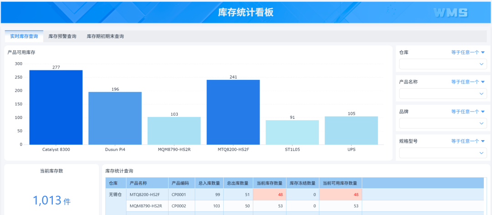

**十个核心仓库管理公式**

**1**

**库存周转率**

公式：

库存周转率反映的是库存动得快不快。它直接影响资金占用，也间接影响库存结构。

在实际调研中，不同企业对库存规模的理解差异很大，但一旦用周转率来衡量，就能统一判断标准：

* **周转率低，**不要急着压采购，先去看哪些物料在拖后腿
* **周转率高，**也别高兴太早，可能意味着在吃库存，后面会断货

周转率不是越高越好，而是要在一个**合理区间内稳定**。

很多企业会按物料或品类拆分周转率，识别出周转偏慢的部分，再结合销售节奏或采购策略做调整。

因此，周转率不仅是一个统计指标，也可以作为库存优化的起点。

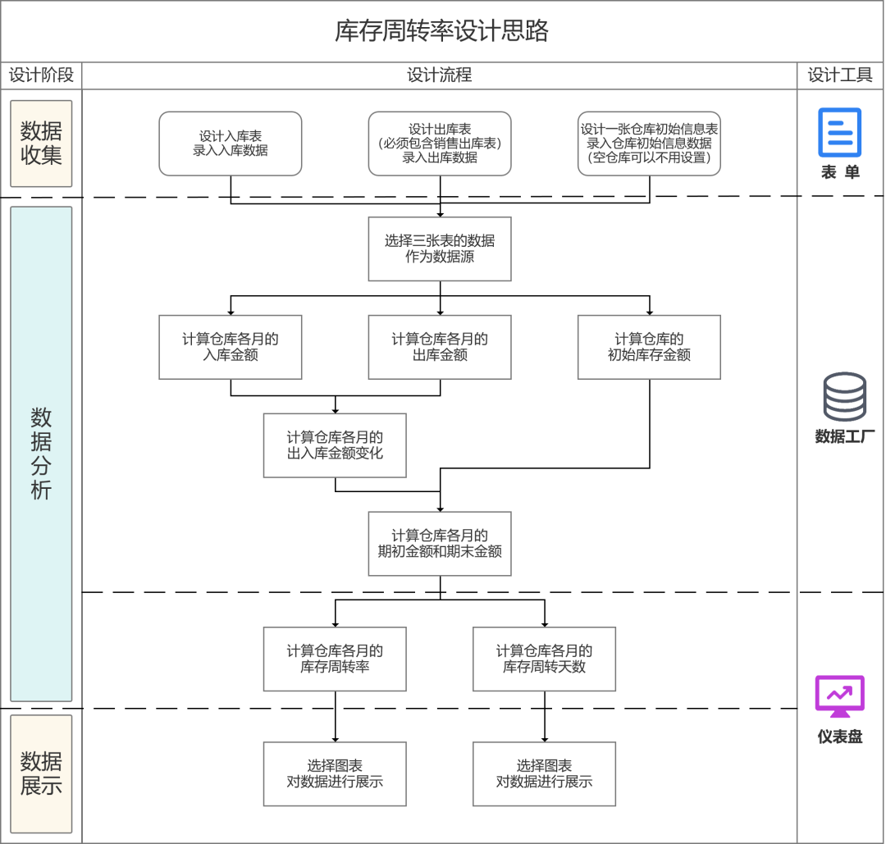

**2**

**库存周转天数**

公式：

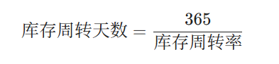

库存周转天数可以理解为，当前库存水平，可以支撑多少天的业务需求。

在实际应用中，有的企业会设定不同产品线的目标周转天数，并通过系统持续跟踪变化趋势。

例如，稳定品类维持在30–45天，波动品类适当提高，关键物料则根据供应周期动态调整。

当周转天数能被持续跟踪时，库存管理就从结果判断变成了过程控制。

在数据获取上，一些企业会通过**简道云**这类**仓库管理工具**，把出入库和库存数据打通，周转天数可以自动生成趋势变化，而不需要人工统计，这样指标的使用频率会明显提高。

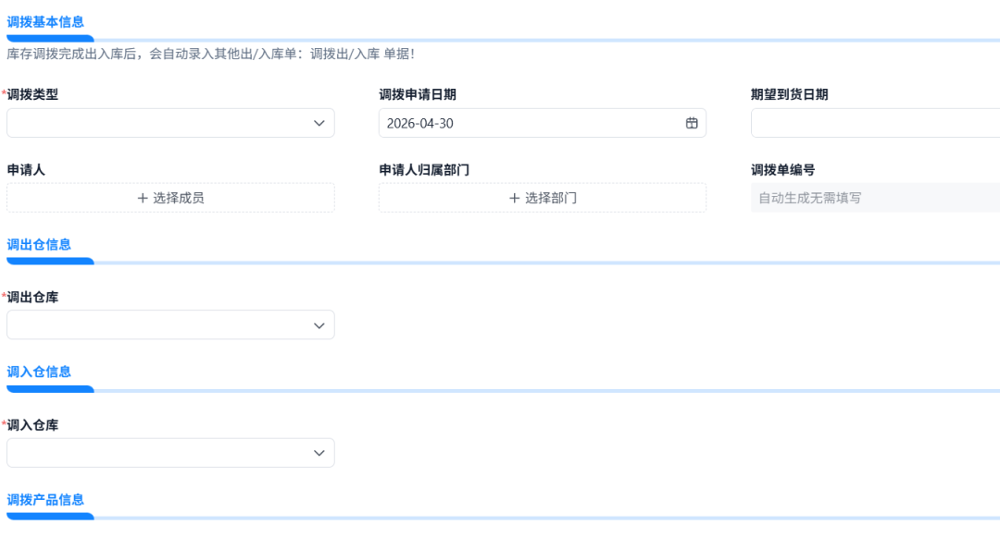

**3**

**安全库存**

公式：

安全库存的作用，是应对需求波动和供应不确定性。

在实际业务中，不同物料的安全库存策略差异很大。例如：

* **需求稳定且补货周期短的物料，**可以设置较低的安全库存
* **供应周期长或需求波动大的物料，**则需要更高的缓冲

有的企业会结合历史消耗数据，动态调整安全天数，而不是固定不变。可以把物料分级：

* A类（关键、高价值）
* B类（常规）
* C类（低价值、低影响）

这样可以在保障供应的同时，避免库存积压。

安全库存本质上是一种**风险管理工具**，不是越高越好，而是要匹配业务节奏。

**4**

**订货时间点**

公式：

订货时间点**解决的是什么时候补货的问题**。

在仓库管理中，补货时机如果缺乏统一标准，往往会依赖个人经验，稳定性较差：

* 感觉差不多了，补一下
* 最近卖得快，多备一点

但是，一旦人换了，经验就没了；业务一波动，判断就失准。

而订货点提供了一个可以量化的触发机制。

在应用过程中，一些企业会把订货点嵌入到系统中，当库存降到阈值时自动提醒或触发采购流程。这样可以减少人为判断带来的波动。

当订货点和安全库存配合使用时，库存节奏会更加平稳。

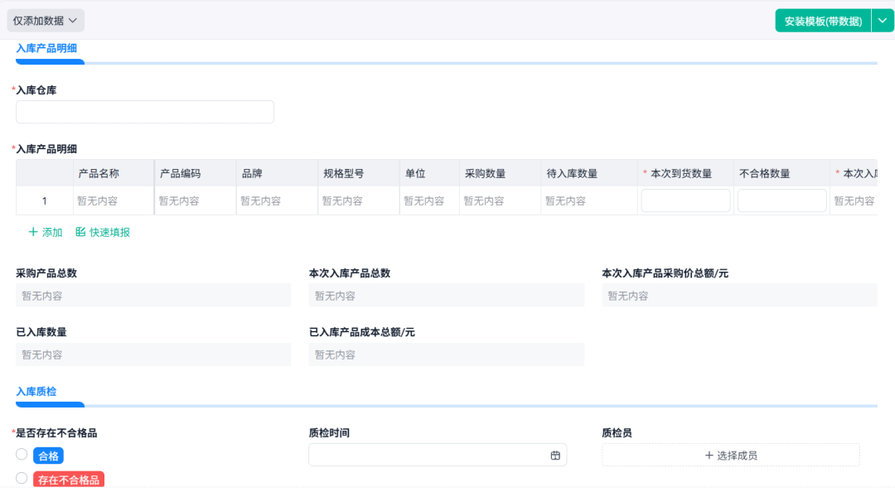

**5**

**库存准确率**

公式：

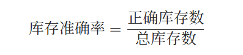

库存准确率是**所有库存管理工作的基础**。只有当账实一致时，其他指标才有参考价值。

在实际管理中，这个指标通常通过盘点来校验，但更重要的是对差异原因的记录和分析。要去找：

* **是收货环节出问题？**
* **还是发货漏记录？**
* **还是库位混乱？**

只有把原因固化到流程里，准确率才会上来。

通过这种方式，库存准确率不只是一个结果指标，还可以反映流程执行情况。

有些企业会用**简道云**把盘点流程做成标准化流程：

* 盘点任务自动下发
* 差异自动记录
* 每一笔都有责任人

后续分析和改进会更有依据。

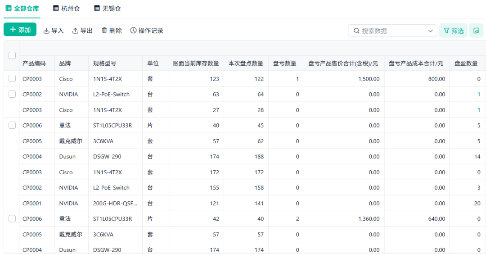

**6**

**拣货效率**

公式：

拣货效率**直接影响发货速度**，是仓库现场管理的重要指标。

这个指标往往会按人员、班组或时间段进行拆分，用来分析作业差异。

* 库位没有规划，来回跑
* 动线设计不合理
* 拣货没有指引，全靠找

这些问题不解决，加再多人也只是“多几个人一起低效”。

**可以通过对比不同区域或不同班组的拣货效率，发现库位布局或作业路径的优化空间。**

一些企业还会结合系统指引优化拣货路径，减少无效移动，从而提升整体效率。

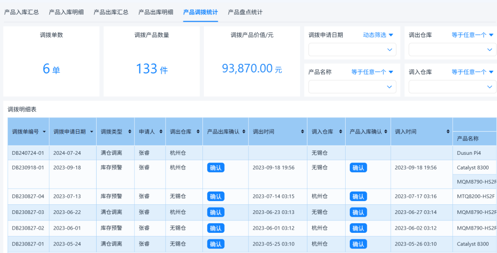

**7**

**库位利用率**

公式：

库位利用率**反映仓库空间是否被充分利用**。

在实际管理中，库位利用率不仅影响存储能力，也影响作业效率。如果库位分布不均或缺乏规划，会增加找货和搬运成本。

有的企业会通过库位编码、分区管理以及动态调整机制，使库位使用更加均衡。

当库位利用率与拣货效率结合分析时，可以更全面地评估仓库布局。

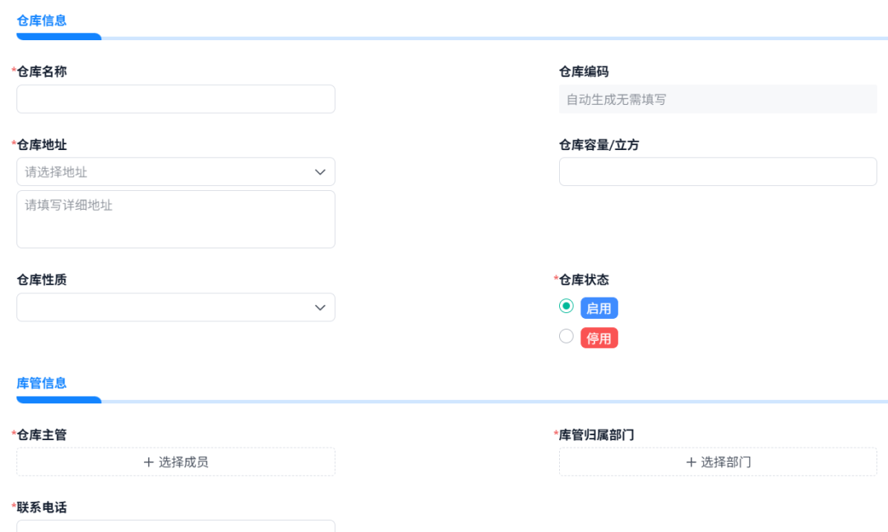

**8**

**呆滞库存率**

公式：

呆滞库存率**反映库存中低流动部分的占比**。

在实际应用中，这个指标通常需要结合时间维度来定义，例如超过90天未动或180天未动。

有的企业会定期输出呆滞库存清单，并根据不同原因采取处理措施，例如促销、替代使用或内部调拨。

不要等年底一次性清理，而是要常态化：

* **定期识别**
* **分类处理（促销、替代、报废）**

通过持续跟踪呆滞库存率，可以逐步优化库存结构，而不仅仅是控制总量。

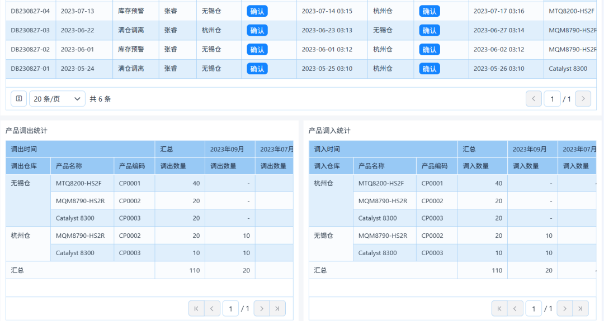

**9**

**收发及时率**

公式：

收发及时率**体现仓库对业务需求的响应能力。**

这个指标通常与订单节奏、生产安排等紧密相关。通过对及时率的跟踪，可以识别流程中的延迟点。

一些企业会通过系统记录每一笔收发操作的时间节点，并生成趋势分析，从而定位瓶颈环节。

例如，通过流程可视化工具（如**简道云**），可以清晰看到每个节点的处理状态：

* 每一步都有状态
* 延误自动提醒
* 数据直接反映瓶颈

管理者可以更快做出调整。

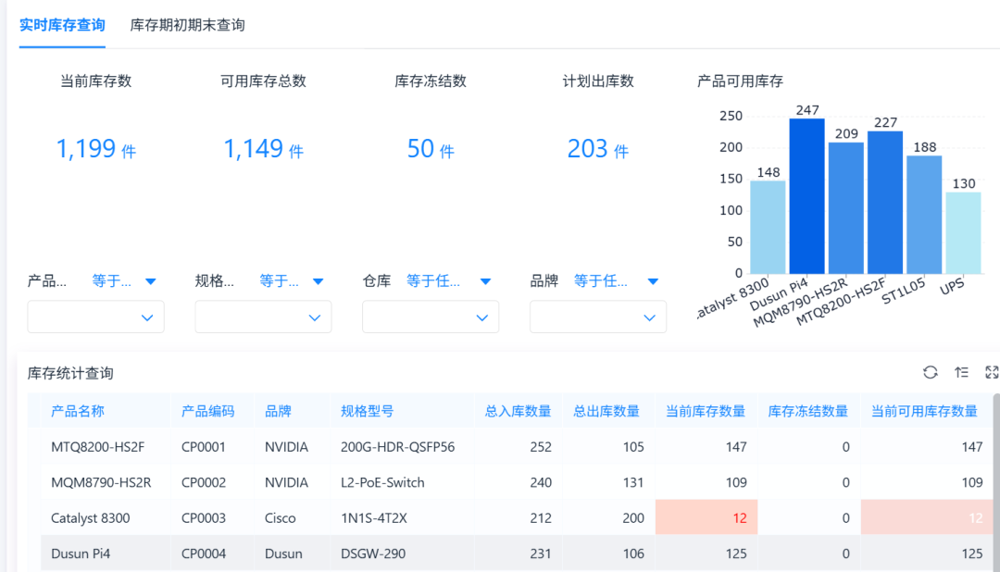

**10**

**订单履约率**

公式：

订单履约率是**仓库管理的综合结果指标。**

它直接反映仓库对客户交付的支持能力，也是业务部门最关注的指标之一。

而影响这个结果的，就是前面这九个指标。

* 周转慢，会缺货
* 准确率低，会发错
* 拣货慢，会延误

所以履约率，其实是整个仓库管理水平的综合体现。

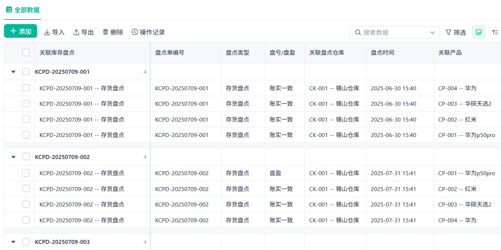

**十个指标的关联与管理意义**

把这10个指标放在一起看，会更容易理解它们的价值。

它们并不是独立存在的，而是围绕**三个核心问题**展开：

**1**

**库存规模与结构**

* 库存周转率
* 周转天数
* 呆滞库存率

这三个指标，决定库存是不是健康、资金占用是否合理。

**2**

**库存节奏与控制**

* 安全库存
* 订货点

它们共同作用，形成库存的动态平衡机制。

**3**

**执行效率与服务能力**

* 库存准确率
* 拣货效率
* 库位利用率
* 收发及时率
* 订单履约率

这一组指标，反映仓库在实际运行中的效率和稳定性。

当这三类指标能够被持续跟踪，并形成联动关系时，仓库管理就会从经验驱动逐步转向数据驱动。

这也是为什么越来越多企业开始用像**简道云**，把出入库、库存、流程、数据打通在一起。

数据一旦是自动流动的，能用数据说清楚仓库在发生什么，很多问题会自己消失。

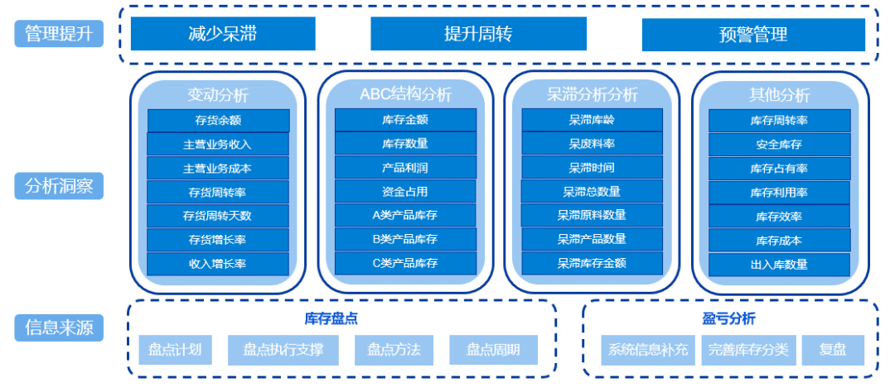

**最后一句话**

仓库管理并不复杂，但需要一套清晰的衡量方式。

这10个公式，本质上是把日常工作中的关键问题，用数据表达出来。

难点不在公式本身，而在数据的获取和流程的衔接。

* **当出入库、库存、流程数据能够打通，**并通过系统自动沉淀下来，这些指标才会真正发挥作用
* **当数据是连续的、可追溯的，**这套指标体系才会稳定下来，仓库管理也会逐渐变得清晰、可控

你会发现，仓库是可以变简单的。

**——The  End——**

**👇点击【阅读原文】，免费体验文中同款系统**