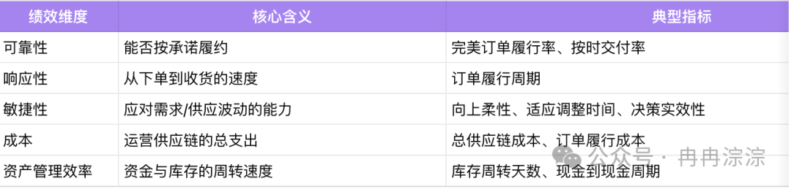
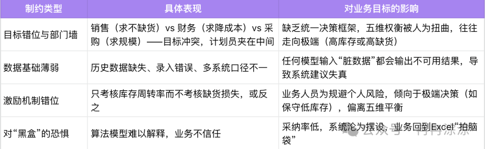
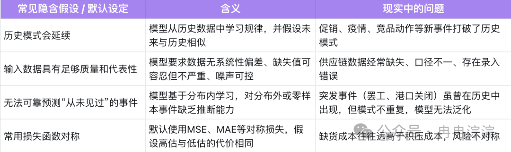
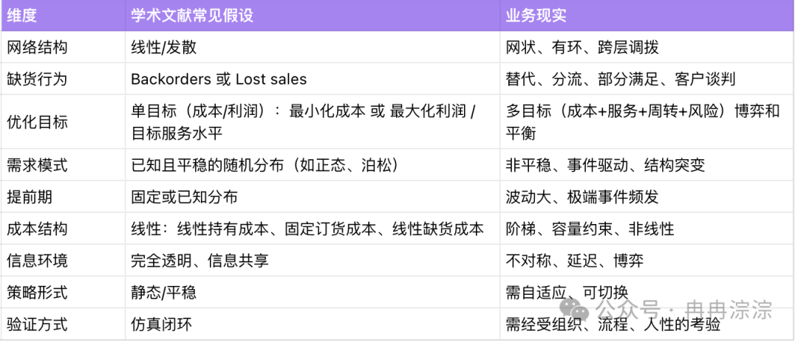
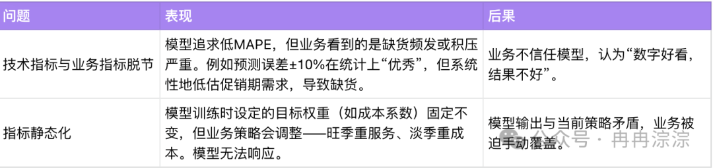

导语：

*“在数据智能体架构设计领域，一个常见的思维误区是陷入“唯模型论”的陷阱，即认为更大的模型、更多的数据、更复杂的算法是提升智能体能力的唯一路径。我们认为，这偏离了企业级应用的核心诉求。*”——*From 数据智能体实践指南by火山引擎*

这是来自于火山引擎发布的数据智能体实践指南白皮书中的一段话，虽然是从智能体建设中得出的结论，但也同样适用于供应链智能决策应用建设的场景中，本质上都是尝试用概率性的技术来解决确定性的业务问题，错配了。在我以往的工作日常中，这种对算法模型抱有过高预期，结果落地一地鸡毛的场景屡见不鲜。

* 案例一：之前在老东家，有位同行算法产品经理，负责某事业部销量预测板块，在周报中声称自己负责板块的准确率达到了98%，结果引起了业务高层的关注，质问到业务负责人，为什么准确率这么高了，库存指标还是没有任何改善，业务负责人很是尴尬，有苦说不出，生气的找到这位产品经理让他来解释。
* 案例二：很多次，我作为产品经理跟着售前去客户现场介绍智能补货产品，客户的第一个问题永远都是“你们准确率能做到多少？”这个问题背后暴露了行业内很多人的认知偏差，那就是依靠高精度模型就可以一劳永逸的解决业务库存的各种管理问题。
* 案例三：在一个消费品智能分销补货项目中，我们算法团队花费很大精力做促销优化（从业务调研、数据采集和清洗、再到特征工程和结果验证），最后准确率提高了3%～4%个百分点，结果却在高层汇报的时候讲不清楚业务价值。

除了亲身经历，行业里同样有无数案例，在诉说着陷入单点模型优化困局的痛苦与挣扎。

* 发布于美国领先的供应链与物流行业媒体 《Supply & Demand Chain Executive》 的官方网站上的一篇文章（“Supply Chain Failures Occur at Factory-Specific Execution Stage: LeanDNA”）发表如下观点：75%的受访者表示供应计划失败最可能发生在工厂层面的执行阶段，而非预测本身；80%的决策者承认仅靠预测无法应对现实世界的执行失败。近一半制造商（47%）报告10%以上的年收入因此损失或面临风险，问题不是预测不准，而是计划离开计划系统之后发生了什么——材料、供应商和生产优先级是否在工厂层面真正对齐。
* 瑞士企业 Board International 的官方网站发表了一篇名为“Decision Orchestration in S&OP: Turning Plans into Action”的文章，文中认为大多数供应链并不挣扎于“计划”，而是挣扎于“做出自信的决策”。预测建好了，场景模拟完了，仪表盘审阅过了，但决策却停滞了——权衡不可见，一致性在需求、供应和财务之间断裂。本质是决策编排问题（decision orchestration problem），而非计划问题。供应链优势不再是预测精度，而是决策信心。

*所以，供应链决策产品真正需要解决的问题，从来不是“模型能不能再准一点”。因为不确定性永远存在，促销会变、物流会延、机器会坏、客户会改主意、仓库员工会临时请假。。。。。。供应链决策产品设计的第一性原理不是无限依靠算法精度来消除不确定性，而是设计一套产品机制，让业务能看见不确定性、衡量它、并在它发生时理性应对。*

---

**一、什么是供应链决策产品的第一性原理**

笔者认为，供应链决策产品设计的第一性原理=是持续稳定的输出可靠、可用的决策。这依赖于系统的、工程化的方式来构建一套产品机制，让每一次业务决策都有据可依、风险可见可控、结果可追，而不是无限依赖高精度模型。

这意味着：

* 目标上，要与业务优化目标贴合，而非单一指标最优，做到真正与业务指标挂钩，决策质量可衡量。
* 方法上，要区分约束与不确定性，用算法、规则、人工、兜底多路径进行应对。
* 结果上，要让每一次决策都有据可依、风险可见、结果可追。

当产品能让业务在不确定性中依然从容决策，才是一个真正的好产品。

*不只要赌未来，更要能应对任何未来。*

---

## **二、为什么“更准的模型”解决不了问题？**

### **2.1 业务目标定义对了么？**

供应链决策产品的服务对象是计划员、采购、运营等业务角色。他们每天面对的决策问题，表面上是“补多少货”、“调多少库存”、“承诺多少交期”，看似是数字计算，实则是在多重约束下寻找最优权衡。

#### **业务的核心目标：五维绩效的平衡**

SCOR模型定义了五个维度来衡量供应链绩效。这五个维度构成了业务决策的目标空间：

其中，可靠性、响应性和敏捷性决定了企业对外部客户的承诺，成本和资产管理效率决定了企业内部的成本和代价。这五个维度通常相互制约。提高可靠性往往需要增加库存，推高成本、降低周转率；提升响应性可能导致物流成本上升；增强敏捷性则需要额外缓冲产能或库存。因此，业务决策的本质就是在客户期望与企业代价之间，找到可接受的平衡点。

#### **实现目标的挑战：外部不确定性与内部组织制约的双重挑战**

然而，现实中的供应链并不在真空中运行。业务在追求五维平衡的过程中，面临着来自外部环境和内部环境的双重挑战。

* 外部环境挑战：三种不确定性

### image.png

* 内部环境挑战：组织与能力制约

总结一句话：业务要的不是一个“最优数字”，而是一个“可信的决策过程”。

举个例子：某快消品公司计划员老张在做业务时，旧系统只输出“建议补货1200箱”，无解释，他不敢信，根据经验改成800箱，结果缺货。新系统输出：“基于过去4周销量（平均1050箱），考虑下周二电商大促（+15%），建议1100~1300箱。缺货概率12%，积压概率8%。可调整促销系数或查看备选方案。”老张输入“竞品也在促销”，系统重算为1000~1150箱。决策后自动记录。他会更信任系统——因为系统帮他降低了决策风险，而不是代替他做决定。

### **2.2 模型能力看清楚了么？**

任何模型都有其隐含的假设和约束以及能力边界。不理解这些边界，再复杂的模型也无法解决业务的实际问题。

* 常见的高精度预测模型通常默认：

* 任何补货模型也都有其隐含的假设和约束。我们拿学术论文中对多级库存优化算法的研究举例子：

模型一般是在一个可控环境下的经过验证的能给出最优解，尤其在网络结构简单、需求平稳的场景下。但通常过度简化了现实中的非线性、非平稳、信息不对称和多重约束，直接套用会导致“仿真优秀、落地失败”。

### **2.3 当单点优化遇上系统问题**

问题来了，业务需要的是系统性决策，模型输出的是局部数值。

业务决策的本质，是在SCOR模型的五维绩效空间中找到可行解：既要保证可靠性（不缺货、不延迟），又要控制成本，还要维持合理的库存周转。这些目标相互制约、动态变化。加之来自外部的三种不确定性（需求、供应、执行）和内部的组织制约（目标错位、数据薄弱、激励偏差），业务需要的不是一个“最可能的数字”，而是一套能够在不确定环境下持续做出稳健权衡的决策机制。

然而，模型（无论是预测模型还是补货算法）的输出往往只是一个数值：预测销量1200箱、建议补货1200箱、安全库存200箱。这个数值是在一系列简化假设下计算出来的——需求分布已知且平稳、提前期固定、成本线性、信息透明。一旦现实偏离假设，这个数值的“最优性”就大打折扣。

因此，目标不对、方法不对，结果自然不对。

#### **目标不对**

目标定义的不对，常见于以下两个问题：

目标不对，是因为没有把业务的多维、动态目标显式地传递给模型和产品。模型优化的只是一个“代理指标”，而不是业务真正想要的结果。

#### **方法不对**

即使目标定义正确，很多产品仍然失败，因为方法过于单一——只靠算法优化，试图用一个模型解决所有问题。

具体表现：

* 忽略时间约束：某些决策需要秒级响应（如订单占用），复杂模型来不及跑，但产品没有预计算或规则兜底，导致系统超时或不可用。
* 忽略不可量化不确定性：对于突发事件（港口拥堵、设备故障），模型无法提前学习，产品没有设计回退机制（人工规则、熔断），导致系统输出完全不靠谱。
* 忽略数据质量：算法对输入数据敏感，但产品没有数据质量看板或降级策略，数据一脏模型就崩。
* 忽略人工经验的价值：业务掌握着模型看不到的信息（临时促销、供应商口头预警），但产品没有提供干预接口，业务只能“全盘接受或全盘拒绝”。

方法不对，是因为把算法优化当成唯一解。真正的决策系统需要多路径协同：算法、规则、预计算、模拟推演、人工决策……根据场景特征动态调度。

---

三、做正确的事：通过产品设计来实现可靠的决策

前两章我们可以看出，在决策产品落地的时候，要么目标错位（技术指标脱离业务），要么方法单一（过度依赖算法优化）。那么，产品经理该如何设计，才能让系统真正“持续输出可靠、可用的决策”？

### **3.1 目标上：从单点指标到多维动态权衡**

**设计原则1：**目标对齐——产品优化的目标必须与业务真实追求的价值维度对齐，且能随业务策略动态调整。

例如：

* 明确业务供应链绩效衡量体系，作为产品设计的北极星。
* 允许业务方根据当前战略（如旺季重服务、淡季重成本）动态调整各维度的权重，产品据此重算最优建议。
* 所有模型训练的损失函数、评价指标应映射到业务指标，而非中间代理指标（如MAPE）。

### **3.2 方法上：从单一路径到多模态决策**

**设计原则2：**多模态决策——没有一种算法能应对所有不确定性。产品应内置多条决策路径（算法、规则、预计算、模拟、人工等），并根据不确定性特征和时间约束动态调度。

例如：

* 先分类决策场景（可量化程度、时间窗口、频率、影响），再为每类预置主路径和兜底路径，最后设计调度器自动或半自动切换。

* 对可量化+时间充裕的补货决策，走算法路径（预测模型+安全库存优化）。
* 对不可量化+时间紧张的订单承诺决策，走规则路径（if 库存>阈值 then 承诺，else 转人工）。
* 设置调度器：当预测置信度<60%或剩余决策时间<10分钟时，自动降级为规则兜底，并告警。

**设计原则3：**可解释与可干预——业务必须能理解建议的由来，并能主动修正或绕过系统，同时这些干预应被记录和用于学习。

例如：

* 可解释：系统输出“建议补货1100~1300箱，缺货概率8%。依据：过去4周平均1050箱，大促系数1.15，供应商历史准时率92%”。业务一目了然。
* 可干预：业务可拖动“风险偏好”滑块（保守/激进），系统实时更新补货量和风险概率；也可点击“切换规则”一键回退至“过去4周最大销量”。
* 可记录：所有人工调整（修改参数、切换规则、最终决策）自动记入决策记录本，作为后续归因和学习的原材料。

### **3.3 结果上：从一次性输出到闭环进化**

**设计原则4****：**闭环进化——系统必须记录决策全过程，自动归因，并将重复出现的人工模式转化为规则或模型参数更新，持续扩大可管理不确定性的范围。

例如：建立“决策记录→归因分析→知识提炼→参数调优”的闭环流程。

* 决策记录本：自动保存系统建议、业务调整、最终决策、实际结果，带时间戳和操作人。
* 归因分析：当实际需求与预测偏离超过阈值时，系统自动标记偏差来源（模型误差/数据错误/外部事件）。
* 知识提炼：发现“过去5次大促预测均偏低15%”，主动提示业务：“是否将促销系数从1.2调至1.4？”业务确认后模型更新。

在目标上对齐业务、在方法上准备多路径、在结果上构建闭环。当这三个维度都落地，供应链决策产品就不再是一个“黑盒计算器”，而是一个能持续输出可靠、可用决策的系统。