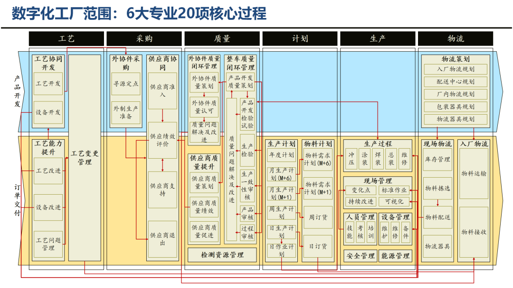
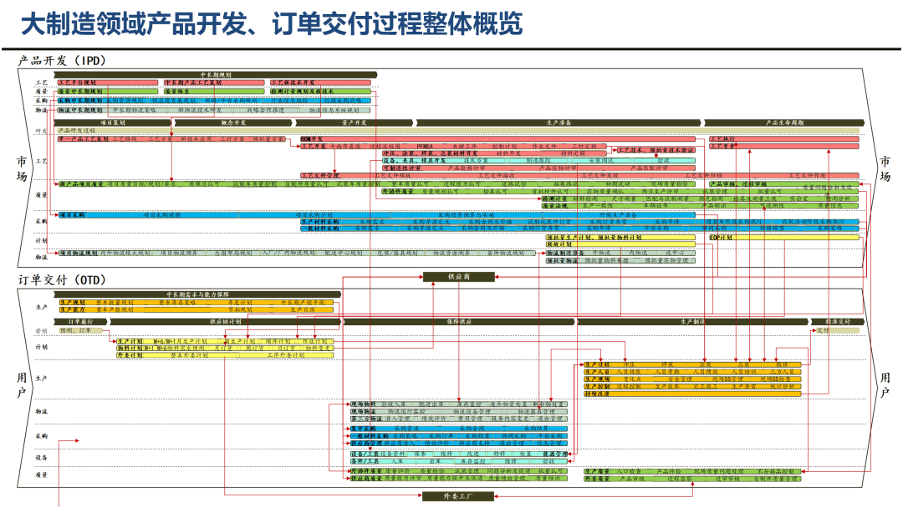
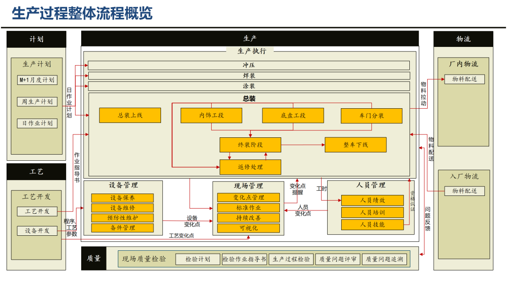
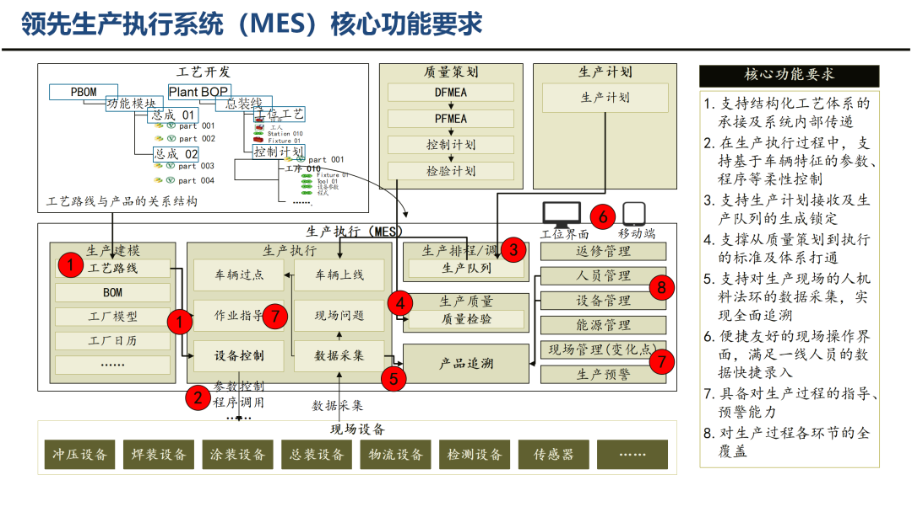
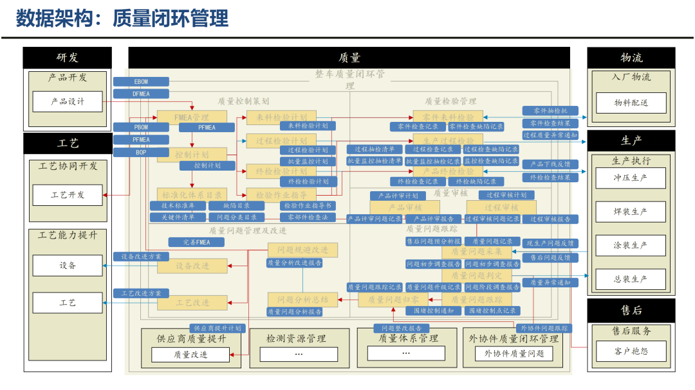

做制造行业供应链管理的同行应该都有体会，工厂数字化能力，直接决定了供应链优化最终能落地到什么程度。

不少团队推进转型时，总喜欢单点发力，只升级一套系统、更换一批设备，忽略了工艺、采购、质量、计划、生产、物流六大模块的联动配合。最后各个环节数据不通、流程割裂，投入不少却看不到明显效果。

今天结合这套整车制造数字化工厂全周期建设的实战经验，和大家聊聊整套可直接复用的建设思路，从整体框架、考核指标到落地执行逐一拆解。

## 一、理清建设边界，找准模块协同逻辑

数字化工厂的建设不是局限在车间内部，而是贯穿六个层级：现场层、控制层、操作层、工厂层、企业层以及生态协同层。

整个体系围绕**产品开发**和**订单交付**两条核心主线运转，六大专业模块环环相扣。计划端定好整体产销节奏，采购按需匹配物料供应，物流负责场内物料流转，生产承接加工制造，质量把控全流程标准，工艺则持续优化作业方式。

启动数字化改造之前，第一件事就是盘点自身能力短板。先看清传统模式和数字化模式的差异，才能精准找准改造方向。

| 管理维度 | 传统运行模式 | 数字化运行模式 |
| --- | --- | --- |
| 数据采集 | 手工填报单据、报表，数据滞后且易出错 | 设备 + 传感器自动采集，全流程数据实时同步 |
| 流程协同 | 各环节信息孤岛，跨部门沟通成本高 | 系统打通端到端流程，业务节点自动流转 |
| 异常处理 | 问题事后复盘，被动应对生产停线、物料缺料 | 智能预警前置，提前识别质量、设备、物流风险 |
| 指标管控 | 人工统计考核指标，统计口径容易不统一 | 系统自动计算指标，动态追踪目标达成 |
| 追溯能力 | 仅关键环节简单记录，全链路追溯难度大 | 物料、人员、设备、产品一键溯源 |

## 二、用好量化指标，让改造目标清晰可落地

指标相当于数字化建设的指挥棒，没有明确的量化目标，改造就很容易变成 “盲目跟风”。这套经过实战打磨的指标体系，主要分为效率、质量、成本三大板块，每一项都有明确的优化前后对比。

效率方面，产品开发周期从 23 个月压缩至 16 个月，订单交付周期从 29 天缩短至 23 天，厂内材料周转时间直接从 8 小时优化到 4 小时，整体流转效率提升十分明显。

质量层面，生产一次交检合格率从 89% 提升至 94%，千台车索赔频次稳步下降，产品综合品质得到有效保障。

成本管控上，单车制造成本、单车采购成本均实现 10% 的降幅，物流单车成本也下降 7%。这些指标不只是事后考核的标准，更是我们搭建系统、优化流程的核心依据。

## 三、分阶段推进，把控项目实施节奏

整套数字化项目跨度三年，我们主要依据**基础度、紧迫度、成熟度、速赢度**四个原则来排序落地顺序，循序渐进推进，避免一口吃成胖子。

项目前期，优先上线高级排程、采购平台、基础物流系统这类项目。这类改造落地快、见效直观，能快速让团队看到数字化的价值，也能为后续项目打下基础。

进入中期阶段，重心转移到 MES 生产执行、质量管理、设备预测性维护等核心系统上。这个阶段主要补齐能力短板，打通各个系统之间的壁垒，让数据和业务流转起来。

到了后期，再布局虚拟仿真、工业互联网、智能装备等智能化应用，完成整体体系的全面升级。

这里也想提醒大家一个普遍误区：很多人把数字化简单等同于上线软件、采购新设备。其实软硬件都只是载体，真正的核心是数据治理和流程重构。