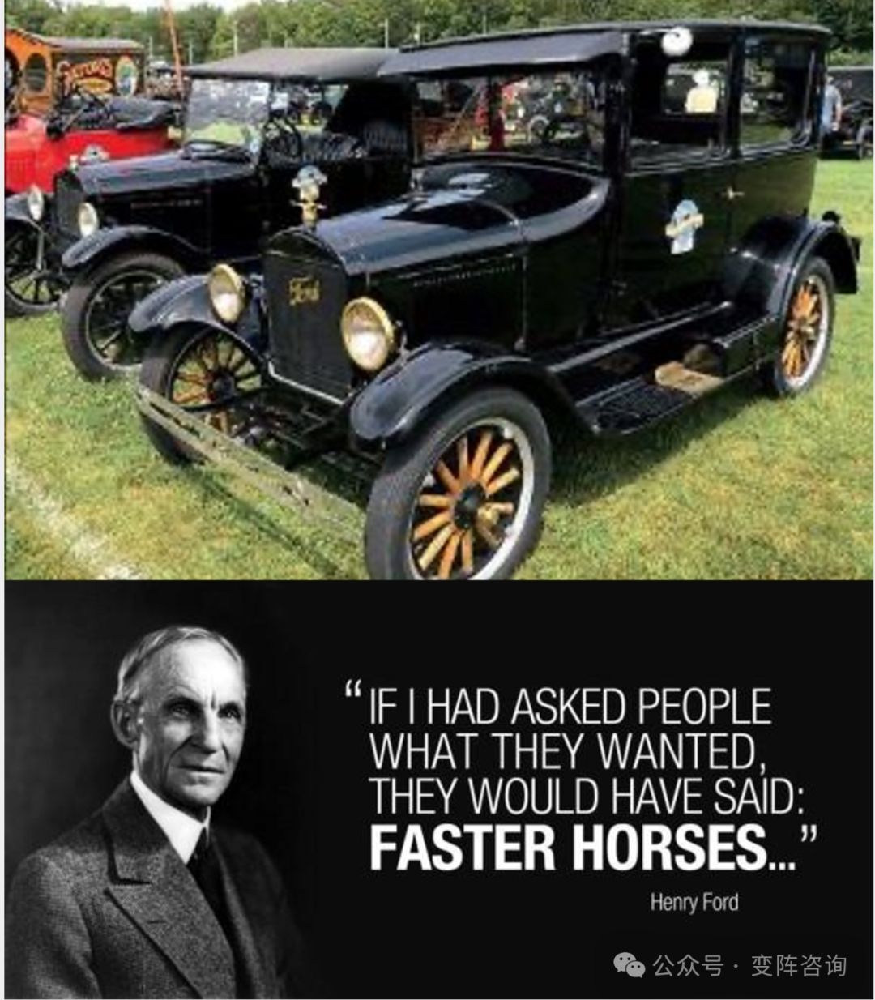
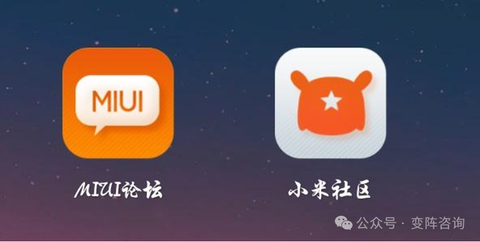
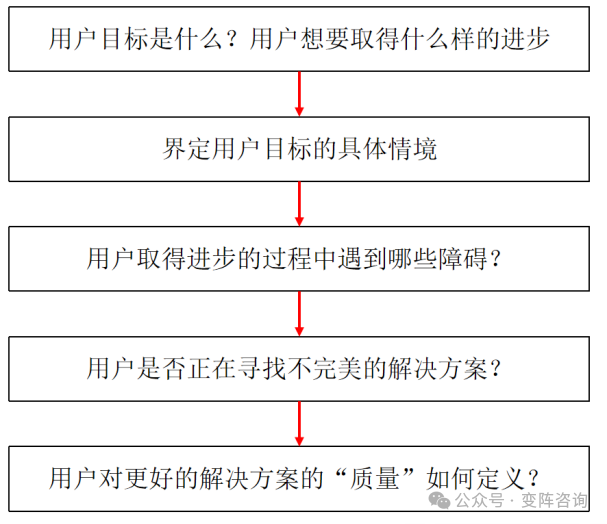
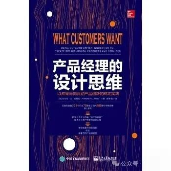
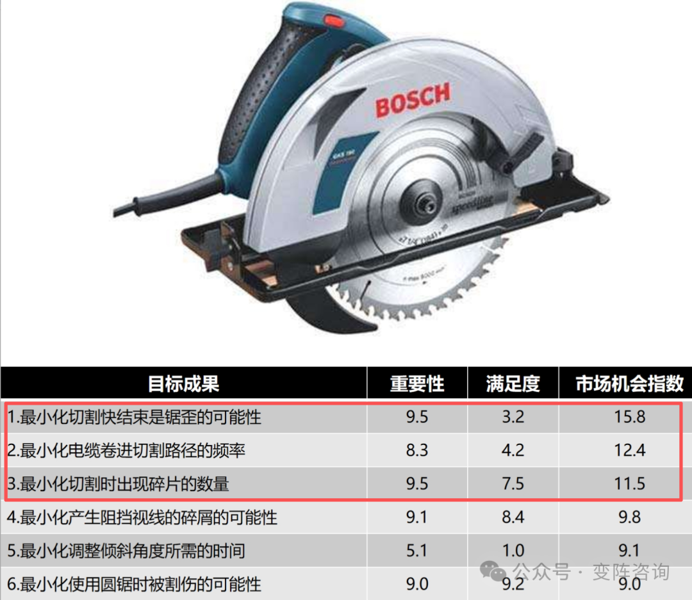
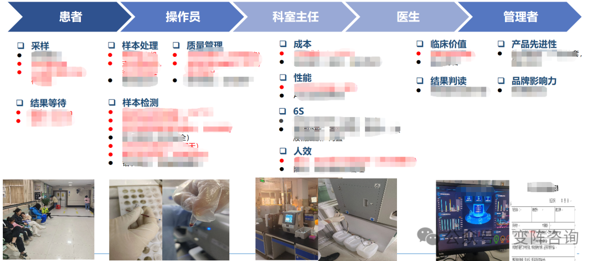
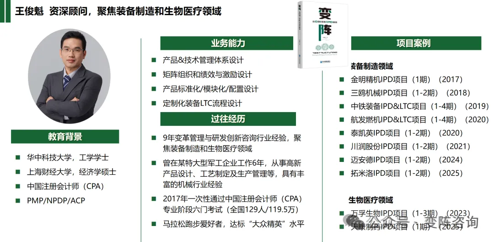
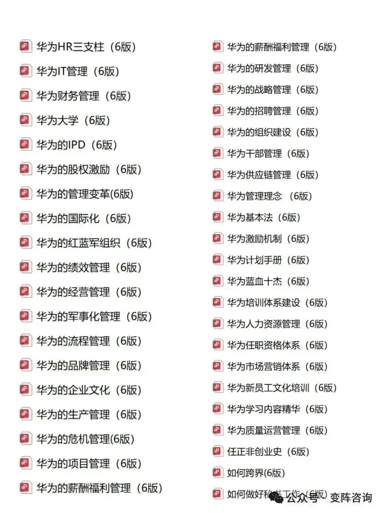

前一篇文章《[需求端到端管理的工具链详解：$APPEALS-KANO-MoSCoW](https://mp.weixin.qq.com/s?__biz=MzU4MTk2NjM4Mw==&mid=2247483905&idx=1&sn=8ca0dc55c6941a0297a5b1f63cab214e&scene=21#wechat_redirect)》系统讲解了端到端需求管理的核心工具。但所有分析的前提，是需求源头必须准确-若源头失真，后续再精细的分析与管理，只会让产品离真实价值越来越远。

本文聚焦原始需求洞察，系统梳理三大经典理论（VOC-JTBD-ODI）的起源、核心逻辑、落地工具与案例，从根源上保证需求精准、有效。

# 1.VOC（客户之声）：起源、工具及案例

## 1.1.VOC（Voice of the Customer）理论起源

工业时代早期，市场供不应求，企业奉行产品导向。福特曾有两句广为流传的话：

“不管顾客需要什么颜色的汽车，我只有黑色的”

“如果我问过人们他们想要什么，他们会说:更快的马......”

随着市场从卖方主导转向买方主导，消费者拥有充分选择权，以客户需求为起点成为企业经营的核心逻辑，VOC 理论应运而生。

1993年，客户之声（Voice of the Customer，简称VoC）在正式发表，首次明确提出：客户之声是深度理解客户诉求、统一产品开发语言、驱动产品创新的关键跳板。

六西格玛体系对VOC的定义更为精炼：

Voice of Customer 客户针对某一产品/服务所表达的期望、偏好、反馈与评价，是客户对产品价值的真实陈述。企业通过收集、解析、转化客户反馈，形成可落地的产品洞见，指导产品定义与设计。

## 1.2.VOC常用工具方法与实战案例

VOC 的核心是直接倾听、真实还原，最常用的落地工具是用户访谈。

通过一对一/小组访谈，还原用户使用场景、体验感受、品牌认知与未被满足的需求，同时收集潜在客户对早期产品概念的评价与建议。

VOC成功案例-小米的MIUI论坛。

小米在起步阶段搭建MIUI论坛，迅速积累了50万核心用户。这些用户不只是消费者，更是产品需求的直接提出者。小米基于用户真实反馈，对标苹果体验做深度优化，在通讯录、查找、系统流畅度等高频场景持续创新，配合高性价比策略，迅速在技术人群中打响“为发烧而生”的口碑，完成早期产品与品牌的冷启动。

## 1.3.VOC的局限

VOC 适用于产品早期、需求相对明确的阶段。但它存在天然短板：

客户能说出想要什么，却未必能表达真实需求；信息在传递中极易失真、过滤、曲解，导致产品仍可能偏离用户真正要解决的问题。

已关注

关注

重播    分享     赞

关闭

**观看更多**

更多

*退出全屏*

*切换到竖屏全屏**退出全屏*

变阵咨询已关注

分享视频

，时长00:28

0/0

00:00/00:28

切换到横屏模式

继续播放

进度条，百分之0

[播放](javascript:;)

00:00

/

00:28

00:28

[倍速](javascript:;)

*全屏*

倍速播放中

[0.5倍](javascript:;)  [0.75倍](javascript:;)  [1.0倍](javascript:;)  [1.5倍](javascript:;)  [2.0倍](javascript:;)

[超清](javascript:;)  [流畅](javascript:;)

继续观看

原始需求洞察理论及工具：VOC-JTBD-ODI

观看更多

转载

,

原始需求洞察理论及工具：VOC-JTBD-ODI

变阵咨询已关注

分享点赞在看

已同步到看一看[写下你的评论](javascript:;)

 

[视频详情](javascript:;)

# 2.JTBD与ODI：从“听客户说”到“挖掘真实任务”

## 2.1.JTBD/ODI理论起源

客户购买产品的本质，不是想要产品本身，而是“雇用” 它完成某项待完成的任务（Job）。

这一认知突破，催生了两大需求洞察经典理论：克里斯坦森的用户目标达成（Jobs to Be Done，JTBD）理论与伍维克的结果驱动创新（Outcome-Driven Innovation，ODI）理论。

（1）JTBD：用户目标达成

2003年，克里斯坦森在《创新者的解答》一书中，以“奶昔案例”提出核心观点：

企业应聚焦用户为什么“雇用”产品，而非用户说了什么；创新的关键，是找到用户在特定场景下，想要取得的进步与待完成的任务。

这一理论让创新从“凭感觉”转向“可推理”，成为颠覆性创新的底层逻辑。。

2016 年，克里斯坦森在《与运气竞争》（后更名为《创新者的任务》）中进一步完善 JTBD：创新不应依赖运气与猜测，而应站在用户立场，观察其日常场景中的真实任务、阻碍、痛点与期望结果，让创新可预测、可复制。

JTBD理论的框架如图所示，更具有落地性。

（2）ODI：结果驱动创新

2005 年，伍维克在《客户想要什么》中系统提出ODI（OutcomeDriven Innovation）结果驱动创新：跳出客户表面表达，聚焦用户要完成的任务，以用户期望达成的结果为创新锚点；通过“重要性满足度矩阵”、“市场机会指数” 等工具量化需求优先级，把模糊需求变成可衡量、可排序、可落地的产品指标。

书中应用博世CS20圆锯案例详细拆解了成果导向型创新的实施步骤。通过 ODI 拆解出三大核心改进方向，最终形成可量化的目标成果、重要性、满足度与市场机会指数，直接指导产品迭代。

## 2.2.JTBD/ODI的异同

两者都反对“客户说什么就信什么”的表面调研陷阱，主张挖掘未被言说的真实需求，关注用户需要完成的任务是什么：

JTBD：更擅长解释颠覆性创新的底层动机，聚焦“用户要完成什么任务”，定义更本质，但偏定性。

ODI：更擅长量化需求、排序优先级、落地产品规划，把任务转化为可测量指标，实操性更强。

简单理解：JTBD 解决“方向对不对”，ODI 解决“优先级清不清晰、落不落地”。

## 2.3.JTBD/ODI常用工具：非参与式观察（用户的一天）

非参与式观察是一种在不干预或影响用户工作环境的情况下观察、记录和理解用户需求的方法，研究人员在其中观察参与者的行为，但不参与其中，理解用户在正常工作环境中的行为和偏好，并转换为对用户需求的分析。

某生物医疗公司试剂项目，以检测全流程作为分析对象，现场观察并梳理从患者-操作员-医生-科室主任-管理者五类角色在“采样-样本处理-样本检测-结果等待-结果判读” 全链路中的待完成任务，最终提炼出成本、临床价值、性能、人效、质量管理等核心需求维度，为产品定义提供精准依据。

# 3.结语

孤立地看工具，它们只是术；需要把它们串成工具链，它们才是道。需求洞察的进阶路径，正是从VOC 听其言，到JTBD 悟其道，再到ODI量其值的完整闭环：

* 用VOC建立客户基线，避免闭门造车；
* 用JTBD穿透表象，抓住用户真实任务；
* 用ODI量化排序，让需求可落地、产品可成功。

真正的需求管理，始于精准洞察，成于体系落地。

往期文章：

[需求端到端管理的工具链详解：$APPEALS-KANO-MoSCoW](https://mp.weixin.qq.com/s?__biz=MzU4MTk2NjM4Mw==&mid=2247483905&idx=1&sn=8ca0dc55c6941a0297a5b1f63cab214e&scene=21#wechat_redirect)

[IPD研发体系：产品线PDT、技术领域与流程运行衡量指标拆解](https://mp.weixin.qq.com/s?__biz=MzU4MTk2NjM4Mw==&mid=2247483981&idx=1&sn=a0c17f10044e612b90230aed6384452e&scene=21#wechat_redirect)

[非标定制企业的破局之路：从纯非标到相对标准化](https://mp.weixin.qq.com/s?__biz=MzU4MTk2NjM4Mw==&mid=2247483857&idx=1&sn=c94de556641d7183e73537bc8881fa5d&scene=21#wechat_redirect)

[IPD体系的理论基础：系统工程&并行工程](https://mp.weixin.qq.com/s?__biz=MzU4MTk2NjM4Mw==&mid=2247483825&idx=1&sn=d4e12f8529d968fa29154a5746d35aa5&scene=21#wechat_redirect)

[从华为组织实践看：矩阵组织不是设计出来的，是靠流程分工长出来的](https://mp.weixin.qq.com/s?__biz=MzU4MTk2NjM4Mw==&mid=2247483880&idx=1&sn=f6c6e855b1f6bef7876c6dac50c2c24f&scene=21#wechat_redirect)

[下篇-从华为“呆死料”到“蓝血十杰”：提升变革紧迫感的7种武器及实践（从“愿景”到“内化”）](https://mp.weixin.qq.com/s?__biz=MzU4MTk2NjM4Mw==&mid=2247483956&idx=1&sn=14c05263c37395da611fb97a613398fe&scene=21#wechat_redirect)

[回望10年咨询路，变阵，面向下一个10年](https://mp.weixin.qq.com/s?__biz=MzU4MTk2NjM4Mw==&mid=2247483784&idx=1&sn=bf2fcc637832f06e00687ac9bca91875&scene=21#wechat_redirect)

文末福利，关注变阵咨询公众号送华为经营管理文集1&2、基于流程的矩阵组织材料。

