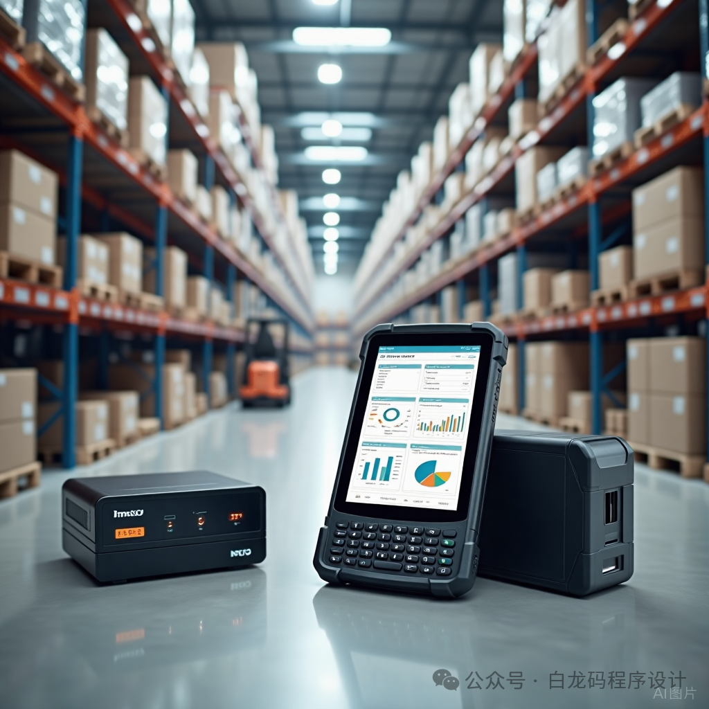

很多人做仓储业务、做系统开发，用了很久WMS系统，却始终说不清它的**核心价值**。

其实抛开繁杂的功能模块，WMS整套系统的底层逻辑、核心作用，完全可以浓缩为**三大核心能力：流程管控、算法支撑、数据交互**。

这三者相辅相成，构成了现代化智能仓库的完整运行体系，也是WMS区别于传统手工记账、简易台账系统的关键所在。

---

## 一、流程管控：标准化仓库作业，杜绝人为乱象

流程管控是WMS的**基础底盘**，核心目的就是把仓库所有线下杂乱作业，变成标准化、可追溯、可管控的闭环流程，彻底告别人工随意操作。

系统统一规范**入库、出库、盘点、移位、退货、单据审核、异常纠错**全链路业务流程，严格遵循**实物先动、单据落地、审核生效变更库存**的核心准则。

所有作业步骤层层约束、权责分明，搭配角色权限管控，规避错单、漏单、私改库存、账实不符等问题，每一步操作全程留痕、可查可追溯，实现仓库作业规范化、合规化运行。

## 二、算法支撑：智能驱动作业，大幅提升仓储效率

如果说流程管控解决了**“不乱”**的问题，那算法支撑就是解决**“更快、更省、更精准”**的效率问题，也是智能仓储的核心亮点。

WMS依托内置智能算法，替代人工经验判断，实现仓库作业智能化调度：

通过**库位智能推荐**，适配货品属性、库区规则、空余储位，规范货品上架存储；通过**波次订单合并策略**，批量聚合订单，告别一单一拣的低效模式；搭配**最优拣货路径规划**，减少仓管员无效折返跑路。

同时系统自动完成**批次FIFO先进先出计算、库存批量锁定与核销运算**，精准管控库存变动，在保证作业规范的前提下，最大化提升仓库人效、仓容利用率，降低人工失误成本。

## 三、数据交互：打通全链路数据流，实现信息互通闭环

数据交互是WMS的**连接中枢**，让仓库不再是信息孤岛，实现内外系统、软硬件、业务数据的全方位打通与实时同步。

**对内**，联动SKU基础数据、仓库库位数据、全类型单据数据、实时库存数据，实现库存变动、业务单据、货品信息的联动闭环，保证账实同步、数据统一；

**对上**，无缝对接ERP、OMS等上游系统，完成订单、单据、库存数据双向同步，承接上游业务指令、回传仓库作业结果；

**对下**，连通PDA、RFID、智能仓储硬件等终端设备，下发作业任务、采集现场实操数据，实现无纸化、智能化现场作业。

---

## 最后总结

**流程管控兜底规范，让仓库作业“不乱、可追溯”；**

**算法支撑提效增速，让仓库作业“更快、更精准”；**

**数据交互打通链路，让仓库作业“互通、智能化”。**

三者结合，就是WMS系统最核心、最本质的价值，也是现代智能仓储替代传统人工仓储的核心逻辑。