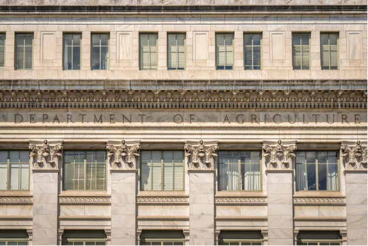
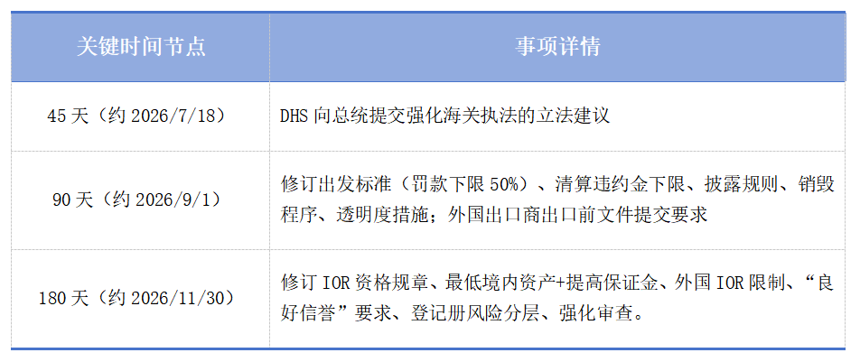
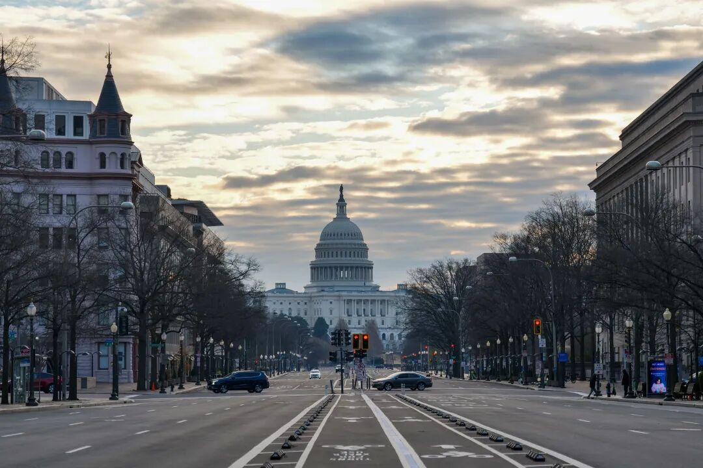

近期，美国总统签署了名为“加强海关执法”（Strengthening Customs Enforcement）的行政令（Executive Order），要求美国国土安全部（DHS）及海关与边境保护局（CBP）对现有的进口商资质与合规体系进行“全面改革”。简单来说，新规的核心目标就是重新定义“谁能成为美国进口商（IOR）” ，并大幅提高准入门槛。

/图源：网络

**基础门槛全面提高：IOR不再只是“一串编号****”**

新规不会“立即”生效，而是设定了多个关键时间节点。目前，DHS和CBP正在通过联邦公告程序与利益相关方沟通。

行政令明确，DHS和CBP需要在180天内修订进口商资质法规，核心要求全面抬升：

• 财务实体化： 所有进口商必须在美国维持一定水平的“有形资产”、提高海关保证金金额，或两者兼有。

• 信息全透明： 进口商需向CBP提供大量深度数据，包括“预计进口量、成立年份、所有权及最终受益所有人信息、业务关联方以及在美国境内的资产披露”等。

• 建立“良好信誉”评级：CBP将基于进口商的纳税与合规历史，建立新的“良好信誉”评级制度。不具备“良好信誉”的实体，将直接被剥夺对美进口资格，甚至不能通过指定报关行代为进口。

言下之意，以往那种仅凭一个EIN编号、没有美国实体资产的进口模式，未来将直接被政策层面排除在外。

/图源：网络

**美国IOR vs 外国IOR：划分身份，待遇天差地别**

新规中杀伤力最大的一处，是在法律概念上明确区分了“美国进口商”与“外国进口商”。

判定标准**非常严格**（需全部满足）：

1、企业需依照美国法律组建；

2、主要营业地（**principal place of business**）在美国；

3、实控人（受益所有人）必须是美国公民或合法永久居民；

4、公司在美国拥有**大量房地产**或**实质性有形资产**。

而“外国进口商” ，则是指所有不满足上述条件的实体。而这一身份的划分，直接决定了进口商能享受的待遇。根据新政指令：

• 禁止申报非正式报关： 外国进口商将被禁止使用Informal Entry（针对低值货物简化入境通道），所有货物必须走正式报关通道。

• 连续Bond受限： 正式报关时，外国进口商不能再依赖年度连续Bond（Continuous Bond），除非获得CBP特批、且证明财政收入完全受保护、合规有保障。

• 必须通过CTPAT认证或与经认证的报关行合作： 外国进口商若要走正式报关，要么自己通过CTPAT海关商贸反恐联盟认证，要么委托经过CTPAT认证的美国持牌报关行代理申报。

CBP还特别强调会采用“**实质重于形式**” 的审查标准——**邮箱地址、共享办公空间、虚拟办公室和其他代理安排，都不构成“真实的美国存在”**。

/图源：网络

**供应链信息预披露与50%罚款红线**

除了对准入资格的限制，新规还在操作层面埋了两颗重磅炸弹。

其一是**供应链信息预披露义务**。行政令指示，在**90天内**建立新要求——外国出口商在出口前向其本国海关提交的任何文件信息，未来将同样需要同步提交给美国CBP。

其二是**最低罚款红线**。CBP对违规进口商的高额罚款减免权限被大幅收紧，最低罚款额不得低于法定最高罚款的50%，重复违规者基本无减免空间。

/图源：网络

**给您及贵司的行动建议**

新规旨在解决一个长期问题：美国海关认为传统上对境外进口商（外国IOR）难以有效执法，部分企业通过各种方式逃避缴税与监管。因此，核心思路就是倒逼境外贸易实体要么在美建立“真实的存在”，要么就必须经历更严格、成本更高的合规流程。

/图源：网络

作为深耕行业的物流供应商，我们对这一政策保持高度关注。为了确保您的业务能够平稳过渡，我们建议您尽快从以下几个方面着手评估与准备：

1、立刻自查

您的身份是“美国IOR”还是“外国IOR”？请务必根据上文的具体标准，重新审视您或贵司的美国主体是否真的满足“实质存在”的要求。如果仅仅是在美国有过注册但无实际运营，CBP大概率仍会将其判定为“外国进口商”。

2、核查基础信息填报的准确性

请检查CBP Form 5106中的信息是否与您在美国IRS备案的企业信息完全一致（如企业名称、地址、EIN等）。若之前的数据与官方信息不符，CBP系统将直接拒收货物。

3、重新评估担保方案与新规应对策略

新规实施后，Continuous Bond年度循环保函的额度将大幅提高，且外国进口商必须采用CTPAT认证或与经CTPAT认证的美国报关行合作。请务必确保您的Bond额度充足，并与报关行确认其CTPAT认证状态。

4、密切留意后续法规通知

目前行政令签署不久，政府承诺将接受公众意见反馈。但我们不建议您等待最终版本出台才采取行动——CBP早在今年3月起就已开始主动核查、清理无效IOR编号，执法从未停止。

面对如此剧烈的贸易政策震荡，您无需单打独斗。作为您**可靠的物流与供应链伙伴**，我们将密切关注后续落地的法规细则，第一时间为您带来专业、精准的解读。

如果您在解读政策、评估企业现状或调整贸易方案上需要任何协助，欢迎**随时与我们联系**。

**专业DDP 一站****式服务联****系****人丨**

**shellybu@cntrans.cn**