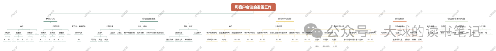

这是为自己而做的工作层次分解，也是只需要给自己看，因为这是给自己搭建框架体系。

## **01-做工作分解是提升自己**

在项目管理中，有一个核心工具叫WBS（Work Breakdown Structure）-工作分解结构，就是按层次将项目分解：**项目→主要可交付成果/阶段/子项目→子交付成果→工作包**，明确该项目中的最小交付物是什么。

借鉴这个思路，我们也可以自己的工作分解到最细一层，这最细的一层就是最小交付物以及对应的人、时间、地点等，这样做有一些实实在在的好处：

领导交代的任务，自己总会有不清晰的或者没和他达成共识的地方，此时列出最小的交付物去和领导讨论，能形成双方对工作内容的共识，为一次性又高效地完成这份工作打下基础。

当自己同时有很多工作需要完成，又需要和不同的人对接，容易忙得晕头转向，而将工作分解到最细一层，每次工作切换时，看一下分解表，就明白了自己需要完成工作的细节，能快速接上之前的工作。

如果一份工作成果缺失很多细节，或者被发现有很多细节需要修改，那会被认为这份的输出成果很差，或者是工作能力差，这对自己是很不利的，此时有一份这工作分解表用来核对检查工作成果，相信必然会大大提高自己工作成果的质量，也有利于建立和提升自己的形象。

## **02-自己的工作分解要比WBS更细致**

一些教材和文章会介绍WBS分解的几个核心原则，是值得借鉴的，但对于自己的工作分解，需要更细致一点：

**1.****以交付成果为导向：**需要明确最小的交付物，例如一份表单，一份图纸，一个螺丝，但需要更细致，例如表单包含的内容要点、字体、颜色、表头格式等，一个螺丝的材质、颜色、长度等，细分到不可再分。

**2.100%原则：**所有下层的工作相加等于上一层的总和，不遗漏但不重复；在工作内容之外，我们还需要加上一些额外的信息：交付方式（实物or电子文件）、交付人、干系人、交付时间、地点、信息来源等，确保这份工作最小交付的相关信息也是100%。

**3.****相互独立原则：**在工作分解时下一层结构中不会出现重叠的内容；对于自己的工作，就需要更细致一点：不要在同一时间需要交付两份工作成果，不要让自己的一份工作成果有两个交付人，交付方式必须是唯一的，干系人只能每个部门有一个等等；

**4.滚动规划原则：**紧跟工上作的任何信息更新、情况变化，确保自己的交付物是正确的，在对的时间、以对的方式交给对的人。

## **03-一个会议准备工作的分解案例**

让我们根据这几个原则来练习一下。

在需要和客户开会时，可以将会议准备工作进行分解，以提前做好准备工作，确保会议的顺利进行：

## **04-我们只需要在新工作前期和重要的工作做好分解**

我们不需要为每份工作都做工作分解，大部分时候是在新工作的前期或者重要的工作才进行。

在新工作前期做好工作分解，是为了整理自己的工作思路，形成从一个需求如何变成最小交付物的清晰路径。在做了几个新工作的分解后，会逐渐形成一套自己的工作模式的框架体系，在这套框架体系上建立一些基准和规范，就可以帮助自己更高效和更准确地完成相似的工作。

对于重要的工作，做好工作分解，明确了最小交付成果，能让自己把握好这个工作的方向，不至于被打断后导致工作思路的中断；关注好每一个细节，可以确保确保自己的工作是高质量的，有些时候细心比聪明重要；保持和每个干系人的沟通顺利，和他们在每一个细节都能达成共识；明确清晰每一个最小交付物，方便对照检查，确保输出的结果满足要求又无法太多的返工修改。

最好的方式永远是实践，不妨试一试写几个工作分解。