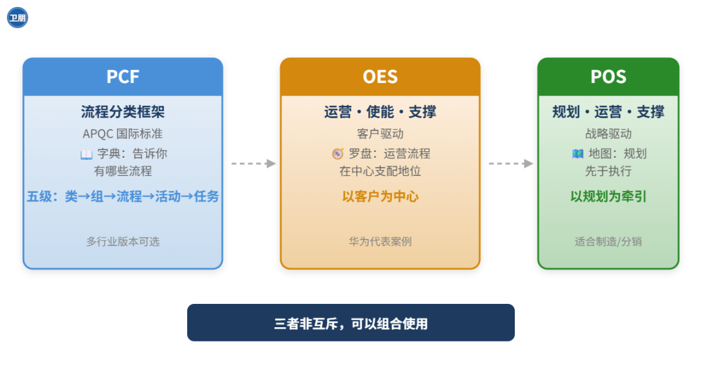
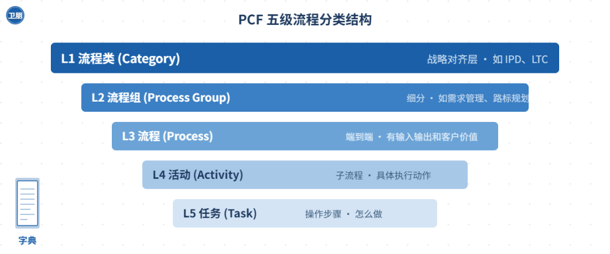
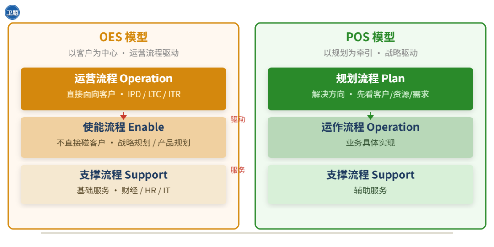
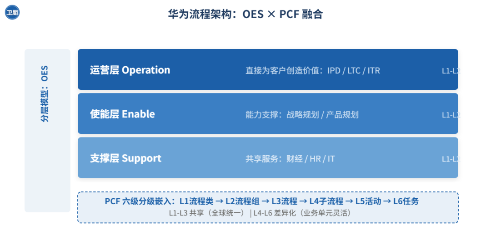
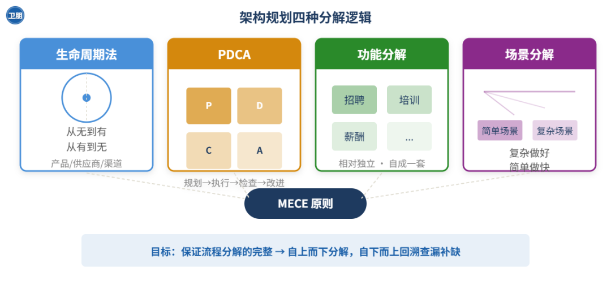

```
流程架构。
```

卫朋丨第 478 篇内容

阅读提示丨本篇内容2204字，阅读约需5分钟

内容说明 | 流程架构

企业做流程管理，往往第一步就会卡在架构层面上。

* 怎么给公司的业务流程分类？
* 按什么逻辑分层？
* 用哪套方法论？

**PCF（APQC流程分类框架）、OES（运营-使能-支撑）、POS（规划-运营-支撑）是市面上常见的三种框架**。

虽然看起来差不多，但底层逻辑是完全不同的。

* 选错了，流程体系就会越建越乱；
* 选对了，流程才能成为企业真正的管理底座。

相当一部分企业根本没意识到这三种方法的差异：

要么随便选一个，要么照搬华为的全套，结果水土不服。

这篇文章把三种方法论的本质差异讲清楚，帮你找到适合自己的那套逻辑。



图1：PCF、OES、POS 三种流程架构方法论的本质定位

字典、罗盘、地图，各司其职，可以组合

## PCF：一本流程字典

APQC（美国生产力与质量中心）是国际上专门研究流程的机构，每年发布流程分类框架的最新版本——简称 PCF。

它覆盖各个大中型企业，提供从一级到四级的架构和配套绩效指标，还按行业分了不同版本。

PCF（Process Classification Framework，流程分类框架），本质上可以把它看作是一份清单：

把企业里所有可能存在的任务和活动，按统一逻辑分门别类。

PCF 的分级结构是五级：

流程类（Category）→ 流程组（Process Group）→ 流程（Process）→ 活动（Activity）→ 任务（Task）。

覆盖从战略到执行的完整层级，每个层级还配有对应的绩效指标。



图2：PCF 五级结构——从战略到执行的完整层级，是一本流程字典而非实施方案

说白了，它是一本**「流程字典」**。

你企业里需要哪些字、哪些词，去字典里查就行了。

但字典不会告诉你这篇文章怎么写——那是你自己的事。

对标 APQC 时最容易犯的错，就是把别人的分类原封不动搬过来。

PCF 的价值在于它的完整性和通用性。

不管你是制造业、服务业还是科技公司，总能在里面找到对应的流程分类。

但它的局限也很明显：

它只会告诉你「有什么」，不告诉你「怎么排」。

比如流程之间的先后顺序、谁驱动谁、谁支撑谁，这些层面 PCF 管不了。

而这恰恰是架构规划的核心问题。

## OES 和 POS：两条完全不同的路

真正决定企业流程架构「骨架」的是 OES 和 POS 这两套分类逻辑。

### OES：业务驱动，客户说了算

OES 的全称是 Operation（运营）、Enable（使能）、Support（支撑）。

核心逻辑很简单：

**谁直接给客户创造价值，谁就排在最前面。**

运营类流程（Operation）是端到端的业务流程，直接面向客户。

从客户需求开始，到客户需求满足结束。

IPD、LTC、ITR——这些都属于运营类流程。

使能类流程（Enable）为运营流程提供能力支撑。

支撑类流程（Support）是基础服务：财经、人力资源、IT。

### POS：战略驱动，计划先行

POS 的 P 不是 Operation，是 Plan（规划）。

核心逻辑跟 OES 完全相反：

**处在支配和牵引地位的不是业务流程，而是战略规划流程。**



图3：OES vs POS——支配地位不同，驱动的源头不同。

OES 是客户说了算，POS 是战略说了算

本质是两种不同的管理哲学。

* OES 相信「客户需求会告诉你该做什么」；
* POS 相信「好的规划能让你更好地服务客户」。

没有哪个更好，只有哪个更适合你现在的情况。

## 华为怎么做的：融合，不是照搬

华为的流程架构，既不是纯 PCF，也不是纯 OES。

华为融合了两套体系：

分层模型用的是 IBM EPF 的三层逻辑——运营层、使能层、支撑层（这就是 OES）；

分级模型用的是 PCF 的六级——从 L1 流程类到 L6 任务。



图4：华为的融合方案——分层模型（OES 三层）+ 分级模型（PCF 六级）

顶层统一、下层灵活

华为 1998 年只有 10 亿美元营收，IBM 是 800 亿美元。

华为用了近十年的时间，走完了「先僵化、后优化、再固化」这三步，实现了流程的体系化赋能。

每一家企业的流程架构都应该是**「长出来的」，不是「抄出来的」**。

## 三种方法，一条原则

核心不在于哪套方法论更先进，在于你的企业现在处在什么阶段、面临什么竞争环境、组织能力到了什么水平。

三者也不是互斥的，是可以组合的。

比如华为，**顶层用 OES 定方向，分层用 PCF 定颗粒度，域内用 POS 定逻辑。**

## 四种分解逻辑：保证不遗漏

选定了 OES 或 POS，接下来是怎么把一级拆到二级、三级。

用什么逻辑拆，是关键。



图5：四种分解逻辑——生命周期法、PDCA、功能分解、场景分解

四种逻辑共同保证 MECE 完整穷尽

## 流程 Owner：没人扛旗，架构是废纸

流程 Owner 是对流程有战略责任的人。

一般是公司第一、第二管理层。

职责有三条：

管流程全生命周期、管管理要素落地、管支撑组织建设和平台运转。

如果 Owner 搞不定前后左右的部门，动不动请老板决策，那他就是虚的。

权力、能力、影响力、资源都不匹配，这个 O 大概率也是假的。

你管销售，不就是管销售的流程、人、组织和 IT 系统吗？

流程不是流程管理部门的流程，是业务部门的流程。

**责任必须背在业务负责人的脑袋上。**

## 别把架构当终点

很多人把流程架构做出来，装裱成一张漂亮的键盘图挂在墙上，就觉得大功告成。

流程是迭代出来的。

L3 以上的框架相对稳定，可以管三年五年。

L4 到 L6 必须不断迭代。

每一步到位不太可能。

今天设计一个流程就想让它超级牛，这件事就不现实。

每一次流程设计，都是一次重大的企业改进机会。

**流程管理，本质是让战略落到流程上，让流程见绩效。**

**架构是起点，不是终点。**

相关参考：

[「产品、IPD、战略、流程」知识图谱速查清单.v8.0（2026）](https://mp.weixin.qq.com/s?__biz=MzI5NTQ1ODM3MA==&mid=2247490829&idx=1&sn=d7cc7a56a2de51fa57d3d3ce2ae3cb71&scene=21#wechat_redirect)

[IPD流程落地：钉钉、飞书都有IPD模块了，还要适配吗？](https://mp.weixin.qq.com/s?__biz=MzI5NTQ1ODM3MA==&mid=2247490607&idx=1&sn=ad2660fc792843167c9f9e32ae5ccb4f&scene=21#wechat_redirect)

[流程架构设计：战略驱动五步法](https://mp.weixin.qq.com/s?__biz=MzI5NTQ1ODM3MA==&mid=2247490829&idx=1&sn=d7cc7a56a2de51fa57d3d3ce2ae3cb71&scene=21#wechat_redirect)

[流程设计实战：流程架构设计六步法](https://mp.weixin.qq.com/s?__biz=MzI5NTQ1ODM3MA==&mid=2247490829&idx=1&sn=d7cc7a56a2de51fa57d3d3ce2ae3cb71&scene=21#wechat_redirect)

[IPD系列《市场管理（MM）流程深度落地全案》](https://mp.weixin.qq.com/s?__biz=MzI5NTQ1ODM3MA==&mid=2247490735&idx=1&sn=fa07219de09f3895d4f71267e3c78aeb&scene=21#wechat_redirect)

[华为业务流程架构BPA进化的4个阶段](https://mp.weixin.qq.com/s?__biz=MzI5NTQ1ODM3MA==&mid=2247490829&idx=1&sn=d7cc7a56a2de51fa57d3d3ce2ae3cb71&scene=21#wechat_redirect)

[华为流程体系：流程架构（含视频和配图）](https://mp.weixin.qq.com/s?__biz=MzI5NTQ1ODM3MA==&mid=2247490735&idx=1&sn=fa07219de09f3895d4f71267e3c78aeb&scene=21#wechat_redirect)

[IPD不是大厂专利：轻量化RPM-IPD流程方法论](https://mp.weixin.qq.com/s?__biz=MzI5NTQ1ODM3MA==&mid=2247490735&idx=1&sn=fa07219de09f3895d4f71267e3c78aeb&scene=21#wechat_redirect)

**作者简介**

**卫朋，《硬件产品经理》作者，实战派产品及流程专家，人人都是产品经理受邀专栏作家，CSDN认证博客专家、嵌入式领域优质创作者，阿里云开发者社区专家博主。**