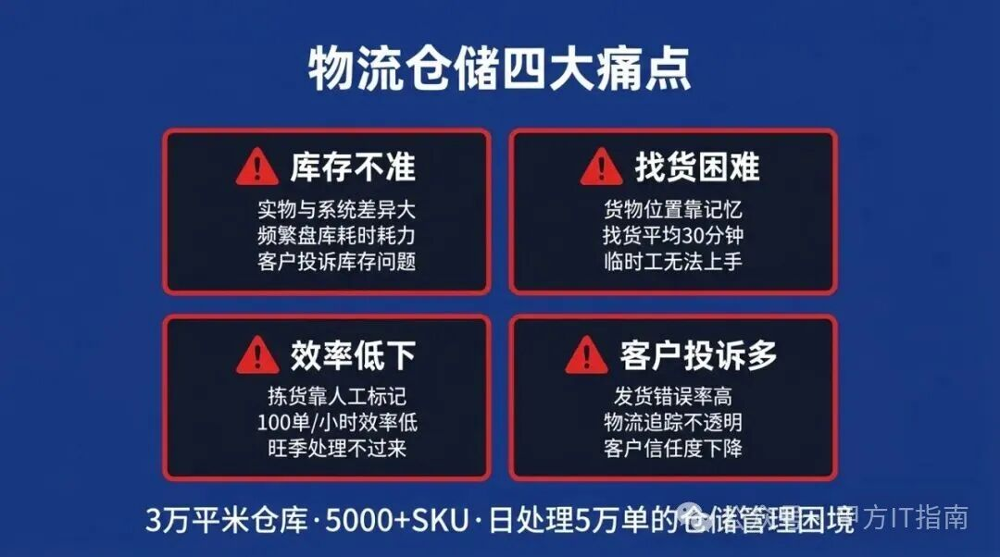

**一、物流企业的WMS需求**

### 1.1 典型场景

**某三方物流企业的仓储困境**

**企业情况:**

• 规模:3万平米仓库

• SKU:5000+

• 日处理:5万单

• 客户:20+

**困境:**

• 库存不准

• 找货困难

• 效率低下

• 客户投诉多

3万平米仓库、5000+SKU、库存不准、找货困难，这操作我也是服了。WMS这事儿，不是靠Excel，而是要靠系统。

我见过太多物流企业，仓储管理靠Excel、库存不准、找货困难、效率低下。最后客户投诉多，业务受影响。这种做法，说好听点叫"灵活"，说难听点就是拿业务开玩笑。

---

## 二、WMS核心功能

### 2.1 功能模块

| 模块 | 功能 | 重要性 |
| --- | --- | --- |
| 入库管理 | 收货、上架 | ⭐⭐⭐⭐⭐ |
| 出库管理 | 拣货、发货 | ⭐⭐⭐⭐⭐ |
| 库存管理 | 盘点、调拨 | ⭐⭐⭐⭐⭐ |
| 库位管理 | 库位改进 | ⭐⭐⭐⭐ |
| 质量管理 | 效期管理 | ⭐⭐⭐⭐ |
| 报表分析 | 数据分析 | ⭐⭐⭐ |

标准WMS核心功能：入库管理（收货、验货、上架）、出库管理（拣货、复核、发货）、库存管理（盘点、调拨、预警）、库位管理、质量管理（效期、批次追踪）、报表分析。

---

## 三、系统选型

### 3.1 选型维度

| 维度 | 权重 | 说明 |
| --- | --- | --- |
| 功能匹配 | 30% | 满足业务需求 |
| 行业适配 | 25% | 有同类案例 |
| 实施能力 | 20% | 供应商实力 |
| 成本 | 15% | 预算范围内 |
| 扩展性 | 10% | 未来可扩展 |

### 3.2 主流方案

**选型建议:**

| 类型 | 适用 | 预算 |
| --- | --- | --- |
| 国际品牌 | 大型物流 | 100万+ |
| 国内品牌 | 中型物流 | 30-80万 |
| SaaS版 | 小型物流 | 5-15万/年 |
| 自研 | 有开发能力 | 投入大 |

---

## 四、需求分析

### 4.1 业务调研

| 调研内容 | 方法 | 输出 |
| --- | --- | --- |
| 业务流程 | 访谈+观察 | 流程图 |
| 痛点分析 | 问卷+访谈 | 痛点清单 |
| 数据分析 | 系统数据 | 分析报告 |
| 需求优先级 | 讨论 | 需求清单 |

需求分析四步法：业务流程梳理→痛点问题分析→需求清单整理→供应商需求确认。

---

## 五、实施路径

### 5.1 实施阶段

| 阶段 | 时间 | 内容 |
| --- | --- | --- |
| 规划期 | 1个月 | 方案设计 |
| 准备期 | 1个月 | 数据准备 |
| 开发期 | 2个月 | 定制开发 |
| 测试期 | 1个月 | UAT测试 |
| 上线期 | 1个月 | 切换上线 |

### 5.2 关键任务

标准六阶段：规划期（1月）→ 准备期（1月）→ 开发期（2月）→ 测试期（1月）→ 上线期（1月）→ 稳定期（持续），总计6个月标准实施周期。

---

## 六、数据准备

### 6.1 数据类型

| 数据类型 | 内容 | 工作量 |
| --- | --- | --- |
| 主数据 | SKU、客户、供应商 | 大 |
| 库位数据 | 库位编码、属性 | 中 |
| 库存数据 | 现有库存 | 大 |
| 流程数据 | 规则配置 | 中 |

### 6.2 数据清洗

数据准备四步：数据收集→数据清洗（去重、统一编码）→数据校验（抽样核对实物）→数据导入（测试环境先导、上线前盘点）。**数据准备占整个项目工期的40%，切勿低估。**

---

## 七、硬件配套

### 7.1 硬件设备

| 设备 | 数量 | 预算 |
| --- | --- | --- |
| 手持终端 | 50台 | 10万 |
| 条码打印机 | 10台 | 3万 |
| 电子标签 | 100个 | 5万 |
| RFID设备 | 10套 | 8万 |

### 7.2 网络要求

仓库需覆盖工业级无线AP，全区域无盲点，手持终端通过WiFi与WMS服务器实时通信。

---

## 八、上线策略

### 8.1 上线模式

| 模式 | 特点 | 风险 |
| --- | --- | --- |
| 直接切换 | 一次性上线 | 风险高 |
| 平行切换 | 双系统运行 | 成本高 |
| 逐步切换 | 分模块上线 | 周期长 |

### 8.2 上线步骤

建议三阶段：**试点仓库先行**（1-2周，旧系统并行）→ **经验整理推广**（3-4周，分批培训）→ **全仓切换上线**（5-6周，旧系统正式停用）。

---

## 九、集成对接

### 9.1 系统集成

| 系统 | 对接方式 | 难度 |
| --- | --- | --- |
| ERP | API | 中 |
| TMS | API/EDI | 中 |
| 财务系统 | API | 低 |
| 电商平台 | API | 高 |

### 9.2 集成架构

WMS与ERP/TMS/电商平台/财务系统的集成均通过API对接，建议使用消息队列异步推送，避免实时调用造成系统耦合。

---

## 十、效果评估

### 10.1 量化指标

| 指标 | 实施前 | 实施后 | 提高 |
| --- | --- | --- | --- |
| 库存准确率 | 85% | 99% | +14% |
| 拣货效率 | 100单/时 | 200单/时 | +100% |
| 找货时间 | 30分钟 | 5分钟 | +83% |
| 盘点时间 | 3天 | 4小时 | +93% |

### 10.2 收益分析

某三方物流案例：实施WMS后库存准确率从85%→99%，拣货效率提高100%，找货时间从30分钟→5分钟，盘点时间从3天→4小时，**实施周期6个月，投资回收期约18个月**。

---

## 十一、避坑指南

### 11.1 常见错误

| 错误 | 后果 | 正确做法 |
| --- | --- | --- |
| 需求不清 | 系统不符 | 充分调研 |
| 选型只看价格 | 功能不足 | 综合评估 |
| 数据准备不足 | 上线延迟 | 提前准备 |
| 培训不到位 | 推广难 | 培训到位 |

### 11.2 成功要素

**成功四要素：** 需求清晰→选型合适→实施到位→持续改进。仓储系统失败的核心原因：需求不清（40%）+ 数据准备不足（35%）。

### 5.3 WMS与TMS/ERP接口对接的常见问题

WMS不是孤岛，打通上下游数据流才是价值实现。

| 接口场景 | 常见问题 | 应对建议 |
| --- | --- | --- |
| WMS ↔ TMS | 运单状态同步延迟，导致在途库存不准确 | 采用消息队列（MQ）异步推送，TMS状态变更触发WMS库存更新 |
| WMS ↔ ERP | 采购入库单和WMS入库记录对账不平 | 建立"日结对账"机制，每天定时校验两边数据一致性 |
| WMS ↔ 电商平台 | 订单推送延迟导致超卖 | 限流+本地缓存池，平台限流时本地排队，不丢单 |
| 多仓库WMS统一 | 各仓库编码体系不统一，汇总数据混乱 | 上MDM主数据平台，统一商品编码+仓库编码体系 |

**成功要素:**

• 需求清晰

• 选型合适

• 实施到位

• 持续改进

---

## 十二、可立即执行的行动清单

**今天就能做的事:**

1. **盘点现状**

• 评估现有系统

• 识别痛点

• 梳理需求

2. **了解市场**

• 调研主流WMS

• 了解价格

• 考察案例

3. **制定规划**

• 预算估算

• 实施计划

• 选型准备

4. **启动项目**

• 立项审批

• 招标采购

• 开始实施

---

*欢迎在评论区分享你的看法，也欢迎转发给需要的朋友。*

---

**如果这篇文章对你有帮助，欢迎点赞、收藏、转发。**

你们的支持是我继续写下去的最大动力。👇