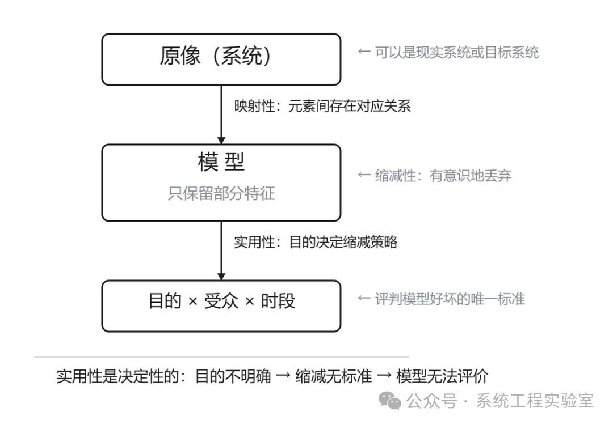
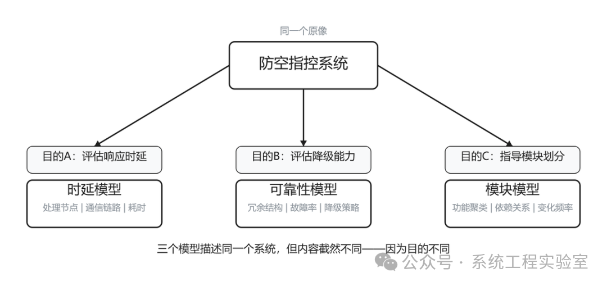
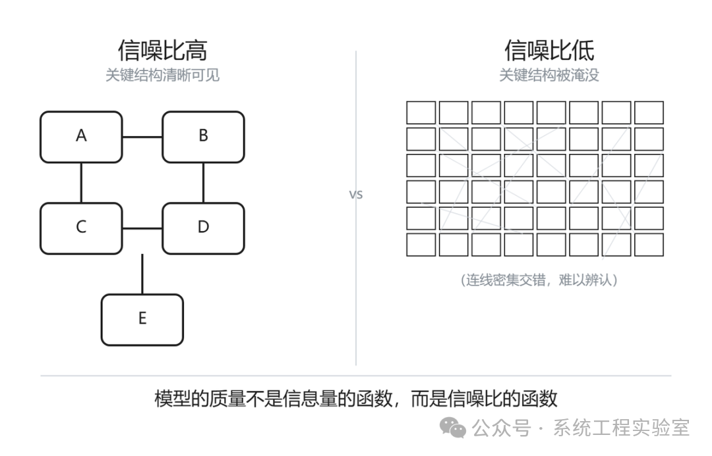

系统建模与设计：模型到底是什么

> 某项目组接到要求：为一个综合电子信息系统"建模"。

> 团队打开画图工具，花了两周画出一张巨大的框图——几十个方框，上百条连线，标注了所有子系统的名称和它们之间的接口关系。评审会上，领导觉得太细了看不懂；开发人员觉得太粗了没法用；测试人员觉得完全不知道该从中提取什么测试依据。

> 大家的结论是：这个模型没有用。

> 然后追加了一句：建模这件事本身就是浪费时间，不如直接写代码。

> 这个结论显然是错的。错误不在建模本身，而在于没有人想清楚一个更基础的问题：模型到底是什么？他们画的那个东西，在严格意义上根本不是模型。

一、模型不是图

**一张框图可以是模型的一种表示形式，但图本身不是模型**。就像乐谱不是音乐——乐谱是音乐的一种记录方式，同一首曲子可以用五线谱记录、用简谱记录、用MIDI数据记录、甚至用口哨吹出来。图是模型的记号，不是模型本身。

为什么这个区分重要？因为一旦把"建模"等同于"画图"，注意力就会从**结构性思考**转向**视觉排版**。团队开始纠结方框的大小、连线的走向、颜色的选择，而忘了追问那些真正关键的问题：这些方框代表什么？连线的语义是什么？这张图能回答什么问题？

**图是表示，结构性认知才是模型****。** 两者的关系是载体和内容的关系。后面我们讨论的一切，都是关于内容——那个看不见的结构性认知——而不是关于载体。

二、模型的三个本质特征

德国信息科学家Herbert Stachowiak在1973年提出了一般模型理论，给出了任何模型都必须满足的三个特征对"模型"这个概念严格界定。

**映射性**

 模型一定有一个原像（Original）——它是"关于"某个东西的。这个原像可以是已经存在的系统，也可以是尚未实现的目标系统。但必须能说清楚：这个模型是关于什么的？模型中的每个元素对应原像中的什么？

这看起来是废话，但大量实践中的"模型"违反了这一条。某个框图里画了一个叫"数据处理"的方框——它对应的是一个物理机箱？一个软件进程？一类功能？还是一个团队的职责范围？如果回答不上来，这个元素的映射关系就是不清晰的，包含它的图就不是严格意义上的模型。

**缩减性**

 模型不包含原像的全部特征，只保留了其中一部分。这不是模型的缺陷，是模型的**本质定义特征**。如果不缩减，就不是模型，而是原系统的复制品。

Borges写过一个寓言：一个帝国的制图师画了一张和帝国本身一样大的地图。这张地图精确无比，却完全无用——因为它没有简化任何东西，你在地图上找一个城市和在现实中找一样困难。缩减不是被迫的妥协，**缩减是模型之所以有用的根本原因****。**

**实用性**

模型是为特定的人、在特定的时间段内、为特定的目的而构建的。这一条是决定性的——它意味着脱离了目的和受众，无法判断一个模型是好是坏。

三个特征中，实用性是核心。因为它决定了缩减性：目的决定了保留什么、丢弃什么。

模型的本质特征与其关系

三、"目的"为什么是决定一切的

这不是一个可有可无的"最佳实践建议"。这是模型定义的逻辑必然。

假设我们面对一个典型的防空指控系统。现在要"给它建模"。这个任务描述是**不完整的**，因为没有说明目的。而不同的目的，会导致完全不同的模型：

**如果目的是评估系统在饱和攻击下的响应时延：** 模型应该包含处理节点、通信链路、消息流转路径和各环节的耗时。系统用了什么编程语言、数据库结构是什么样的，都是噪声，应该丢弃。

**如果目的是评估系统在关键组件故障后的作战能力降级程度：** 模型应该包含冗余结构、故障传播路径、降级策略、各组件故障率。消息协议的细节是噪声，应该丢弃。

**如果目的是指导下一期软件迭代的模块划分：** 模型应该包含功能聚类、模块间依赖关系、变化频率分析。硬件拓扑是噪声，应该丢弃。

三个模型描述的是同一个系统，但内容截然不同。它们都是正确的。

不同目的产出不同模型

现在回到开头的案例：那个项目组的框图为什么失败？因为它试图服务所有人——领导要看全貌，开发要看细节，测试要看验证点——结果对谁都不合适。

**不存在"通用模型"。一个试图服务所有目的的模型，实际上不能好好服务任何一个目的。** 这不是资源不够导致的遗憾，这是模型本质定义的逻辑结论：目的决定缩减策略，多个目的意味着多个互相冲突的缩减策略，一个模型无法同时执行互相冲突的策略。

四、模型是问题的回答机制

**一个好的模型，是你可以向它"提问"并得到有意义回答的东西。**

时延模型可以回答："从传感器发现目标到系统发出拦截指令，最坏情况下需要多长时间？"可靠性模型可以回答："如果主处理节点故障，系统是否还能维持基本的目标跟踪能力？"模块模型可以回答："如果要把目标识别算法从规则引擎换成深度学习，需要修改哪些模块的接口？"

如果一个模型不能回答任何具体问题——或者你说不清它应该回答什么问题——那它的存在就值得怀疑。

这也解释了一个普遍现象：为什么大量项目中的"模型"被束之高阁？因为它们在创建时就没有对应任何具体的问题。它们是为了"交付物清单里有一项叫模型"而画的，不是为了回答真实的工程问题而建的。

**模型是思考工具，不是交付物。** 如果一个模型在创建之后没有人向它提问，它就没有在发挥模型的作用——无论它画得多么精美、多么"标准"。

五、四个常见迷思

模型越详细越好

"这个模型太粗了，再细化一下。"——这是评审会上最常听到的反馈。

但从模型的定义出发，这个反馈本身就需要追问：**细化来回答什么问题？**

如果目的是做系统级的架构权衡，那么包含每个函数签名的模型不是"更好"，而是"更差"——因为过多的细节淹没了架构层面的关键关系，降低了模型的可提问性。

缩减性要求：模型的价值不来自它包含了多少信息，而来自它通过**有意识地丢弃**而让关键结构变得可见。加法不是改进，减法才是。

一张只有5个方框的图，如果这5个方框的划分准确、关系清晰、能回答目标问题，它比一张有50个方框但划分混乱的图更好——无论那张50方框的图"覆盖了更多细节"。

**模型的质量不是信息量的函数，而是信噪比的函数。**

模型质量=信噪比

模型越标准越好

"用UML画。""按SysML规范来。""符合DoDAF视图。"

标准化记法有价值——它让模型的**表示**具有共享的语义规则，减少解读歧义。但标准化记法不等于模型质量。

用UML活动图画了一个全是顺序节点、没有任何分支和并发的流程——这在语法上完全合规，但作为行为模型它传递了一个错误认知：这个系统没有并发和异常处理。语法正确不等于语义正确。

更隐蔽的问题是：当团队的注意力转向"画法是否合规"时，往往会忽视"内容是否正确"。某个方框用实线还是虚线画、某个箭头是否应该有空心三角——这些记法层面的讨论占据了评审时间，而"这个分解是否合理""这个接口是否真的需要"这类本质问题反而没有人追问。

**标准化是对表示的要求，不是对思考的要求。模型的质量取决于背后的思考，不取决于画法是否合规。**

代码就是最好的模型

"代码是可执行的、精确的、不会过时的——还需要什么模型？"

代码确实是一种模型——对计算过程的精确描述。但代码承担的职责远不止"描述系统本质结构"：它还要处理运行时细节、平台差异、性能优化、防御性编程、框架适配……

这意味着代码中的**建模信息被实现细节淹没了**。一个3万行的模块，其中真正体现设计决策的可能就是300行——接口定义、核心数据结构、关键算法步骤。其余的代码是让这300行能在具体平台上正确运行的"脚手架"。

从代码中逆向提取设计意图，远比从模型正向推导到代码困难。代码告诉你"系统是怎么运行的"，但很难告诉你"系统为什么是这样的" "设计者在哪些方案之间做了取舍" "哪些结构是本质性的、哪些是当时为了赶工期的临时方案"。

**代码和模型不是互相替代的。它们在不同的抽象层次上回答不同的问题。** 用代码替代模型，就像用施工图纸替代建筑方案图——施工图更精确，但你没法在施工图上讨论空间布局是否合理。

有了模型就有了共识

**画出一张图不等于团队达成了共识。**

如果映射关系不显式——图中的方框到底对应物理实体还是逻辑概念、连线到底表示数据流还是控制依赖——每个人会根据自己的经验去解读，得出不同的理解。

**更深层的问题是**：如果概念定义本身没有对齐，模型只是把分歧隐藏了。图上标注"情报融合"四个字，指挥领域的人理解的是多源情报关联与态势推理，软件开发的人理解的是不同数据格式的解析与合并。两个人看着同一张图，以为在讨论同一件事，其实在讨论完全不同的事。

**模型是共识的载体，但不是共识的替代品。** 没有经过概念对齐和认知校准的模型，只是把分歧从口头转移到了图纸上——分歧仍然存在，只是不容易被发现了。这比没有模型更危险，因为它制造了虚假的一致感。

（概念定义的问题，是后续"概念与定义"篇的核心主题。）

六、对"建模无用"论的回应

很多团队在经历了上述失败之后得出"建模无用"的结论：

**建了模型 => 模型没有用 => 所以建模无用**

这个推理的问题在第一步：创建的“模型”满足模型的三个本质特征吗？

* 映射关系清晰吗？图中每个元素都能说清对应什么吗？
* 缩减有原则吗？保留了什么、丢弃了什么，标准是什么？
* 目的明确吗？这个模型要回答什么具体问题？

如果这三条都答不上来，那失败的不是"建模"这件事，是你在没有想清楚这些问题的情况下画了一张图——然后把这张图叫做模型。

**"建模无用"大多数时候的真实含义是"无目的地画图无用"。** 这当然无用。但这不是建模的问题，是没有建模就说自己在建模的问题。

七、观点洞察

**在可视化建模之前，需要明确：这个模型要回答什么问题，给谁用。**

这是后续所有建模决策的判定标准——保留什么、丢弃什么、粒度到什么程度、用什么表示方式，全部由这句话决定。

**建模失败的根本原因，不是方法不对、工具不好、团队能力不足——而是在最基础的问题上没有想清楚：这个模型是给谁用的、用来回答什么问题。所有后续的建模决策，都以此为锚点。**