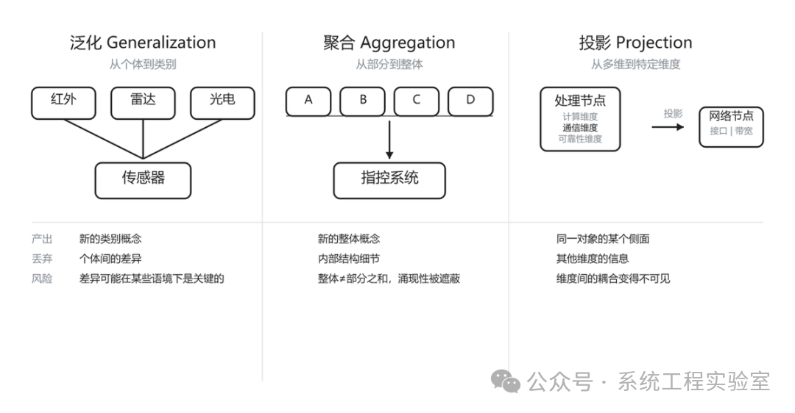

一个案例

> 某型综合信息处理系统的设计评审会上提出一个要求："把系统架构再抽象一下，层次太低了。"

> 软件组回去之后，把原来30个模块合并成了8个"子系统"，每个子系统包含若干模块。提交后总体组说："这不是抽象，这只是分组。"

> 软件组又试了一次。他们把30个模块归纳为四种类型——数据采集类、处理类、展示类、存储类——画了一张类型关系图。总体组看了看说："方向倒是对了，但这不是我们要的。我们要的是从作战能力角度来看系统的结构，不是从软件分类角度。"

> 三次尝试，三种不同的操作，三种不同的结果。但所有人自始至终用的都是同一个词："抽象"。

这就是问题所在。"抽象"不是一种操作，而是至少三种本质不同的思维操作的统称。混淆它们，不是"做得不够好"——是方向错了。

一、教科书定义的致命模糊

几乎所有教材都这样解释抽象："**抽象就是忽略不重要的细节，保留重要的特征。**"

这个定义有一个致命的缺陷：**什么叫"不重要的"？标准是什么？谁来判断？**

如果你回答"要看具体情况"——那这个定义实际上什么也没说。

更关键的是，这个定义把抽象描述为一个单一操作：选择性忽略。但开头那个案例已经说明了——软件组做的分组（合并归类）、做的分类（找共性归纳为类型）、总体组想要的切换视角（从作战能力维度看）——这是三种完全不同的思维操作，导向三种完全不同的模型。

前一篇我们确立了一个起点：**模型的目的决定了保留什么、丢弃什么。** 这一篇要回答更具体的问题：在目的确定之后，"丢弃"和"保留"到底有哪些不同的操作方式？不同的操作方式会产生什么性质完全不同的模型？

二、三种不同的抽象操作

泛化（Generalization）

观察多个具体事物，识别它们的共性，形成一个更一般的概念——这是泛化。

某型装备有三种不同的传感器：红外探测器、雷达、光电设备。它们的物理原理不同、探测距离不同、受天气影响的程度不同。但如果我们的建模目的是描述信息处理流程——从探测到跟踪到决策——那么在这个层次上，它们都是"传感器"：一个能输出目标观测数据的东西。

这就是泛化。我们把三个具体事物（红外探测器、雷达、光电设备）抽象为一个类别（传感器），丢弃了它们之间的差异，保留了它们的共性——"能产生目标观测数据"。

泛化的关键特征：**产出的是一个新的、更一般的概念。** 这个概念不是原来任何一个具体事物，而是它们的共性提取。

泛化的风险：**被丢弃的差异可能在某些语境下是致命的。** 如果你的建模目的是分析系统在大雾天气下的探测能力，那么把红外、雷达、光电统称为"传感器"就丢掉了关键信息——它们受雾影响的程度截然不同。泛化后你无法在这个模型上回答天气相关的问题。

注意区分：泛化不是模糊。"传感器"是泛化——它精确定义了共性（能产生目标观测数据的设备），也明确了个体差异被丢弃。"前端设备"是模糊——你不知道它包含什么、不包含什么，不知道边界在哪里，不知道共性是什么。**泛化之后，概念的内涵和外延都是清晰的；模糊之后，两者都不清晰。** 模糊不是抽象，是思维偷懒的产物。

聚合（Aggregation）：从部分到整体

将多个组成部分视为一个整体——这是聚合。

一个通信处理机、一组显控终端、一套数据库服务器、一个局域网——把它们放在一起，称为"指控系统"。这不是泛化——它们不是同类事物的不同个体，而是一个整体的不同组成部分。

聚合是最容易被误认为"抽象"的操作，也是开头案例里软件组第一次做的事情。他们把30个模块按照某种标准分组，然后用子系统名称代替这个分组——模块数量减少了，但观察层次没有真正改变。

聚合的关键特征：**产出的是一个整体，而非一个类别。** "指控系统"不是通信处理机和显控终端的"共性"，而是它们组装在一起时形成的整体。

聚合的风险：**整体的特性不等于部分特性的简单加总。** 一个指控系统的响应时延不是各组件时延之和——还有通信开销、排队等待、同步协调。如果你在聚合后仅凭组件特性推导整体特性，就会犯还原论错误。这正是系统工程中反复强调"涌现性"的原因。

还有一个容易混淆的点：**聚合不等于简化。** 把30个模块的接口关系图中"不重要的"10个模块去掉——这是简化，不是聚合。你还是在同一个层次（模块级）上看，只是去掉了某些元素。简化减少数量，聚合改变层次。当有人要求"抽象一下"时，他期望你换个层次来看，而不是在同一层次上删掉一些东西。

投影（Projection）：从多维到特定维度

从一个多维度的事物中，只取出某些维度来观察——这是投影。

同一个处理节点，从计算维度看是一个具有特定算力和内存的处理器；从通信维度看是一个具有特定接口和带宽的网络节点；从可靠性维度看是一个具有特定故障率和MTBF的组件；从物理维度看是一个具有特定尺寸、重量和功耗的设备。

这四个描述说的是同一个东西，但每个描述只取了它的一个维度。这就是投影——几何学里的概念，从高维空间投影到低维空间，必然丢失信息。

投影的关键特征：**原始对象不变，只是观察角度变了。** 泛化产生新概念，聚合产生新整体，投影不产生新东西——它只是用特定视角去看同一个东西。

投影的风险：**不同维度之间可能存在耦合，投影后看不到。** 一个处理节点的计算性能（计算维度）可能与散热条件（物理维度）强相关——满负荷运行时温度过高会降频。如果你只在计算维度上建模，会得出理想化的性能指标；只在物理维度上建模，不知道什么时候散热会成为瓶颈。这个耦合只有在同时考虑两个维度时才可见。

三种抽象操作的对比

三、抽象层次：能看到什么、看不到什么

除了操作类型之外，抽象还有一个关键维度：层次。

同一种操作（比如聚合），可以在不同的粒度上进行：

* 代码行 → 函数 → 类 → 模块 → 子系统 → 系统 → 体系

每一级聚合都丢弃了下层的内部细节，暴露一个更粗粒度的整体。

**抽象层次的选择，直接决定了你能看到什么问题、看不到什么问题。**

一个过于高层的模型（比如只有"传感器子系统→信息处理子系统→武器子系统"三个框），看到的是系统级的能力关系，但看不到模块间的接口耦合问题。一个过于低层的模型（比如精确到每个函数调用），看到的是实现细节，但看不到架构层面的结构性问题——因为这些问题存在于模块关系中，而模块关系被淹没在海量的函数调用细节里。

这里有一个反直觉的认知：

**在错误的层次上，你不是"看得不够清楚"，而是"根本看不到"。**

某型通信系统频繁出现消息丢失。在代码层面排查，每个模块的消息收发逻辑都是正确的——发送方正确发送，接收方正确接收。但问题出在模块间的交互时序上：A发给B，B收到后发给C，但B的处理有延迟，A以为B没收到就重发，B收到重复消息后的去重逻辑在某种边界条件下有缺陷。

这个问题在代码层面（函数级）根本看不到，因为每个函数本身是对的。它只在模块交互层面（通信时序级）才可见。如果你的模型停留在错误的抽象层次，你甚至不知道这个问题存在。

**抽象层次的选择不是"粗一点还是细一点"的偏好问题，而是"能看到还是看不到"的能力问题。**

四、抽象的不可逆性

这里有一个经常被忽视的事实：**抽象是不可逆的。**

泛化之后，个体差异丢失了——你无法从"传感器"这个概念反推出具体某型雷达的探测距离。聚合之后，内部结构丢失了——你无法从"指控系统"这个整体反推出它内部的通信拓扑。投影之后，其他维度丢失了——你无法从通信维度的模型反推出节点的物理布局。

这意味着：**从高层模型到低层细节，不能通过"展开"或"细化"来恢复——需要回到原始系统重新获取信息。**

一个常见的灾难场景：系统的架构模型按物理部署结构做了聚合——机柜A里的东西归为子系统A，机柜B里的归为子系统B。项目早期没人觉得这有问题。到了详细设计阶段，需要分析功能依赖关系时才发现：一个完整的作战功能（比如目标识别到威胁判断到武器分配）横跨三个机柜里的六个模块。按物理聚合得到的"子系统"划分完全无法映射到功能结构上。你不是需要"细化"这个模型——你需要推翻它，用另一种聚合维度重新来过。

两周的工作变成了沉没成本。更糟的是，如果基于这个错误聚合已经做了接口设计、写了接口文档、甚至开始了编码——推翻的代价就远不止两周了。

**抽象操作一旦选定，就决定了模型能向什么方向细化、不能向什么方向细化。** 选错了不是"不够好"，是"方向错了"。这就是为什么抽象操作的类型选择必须在建模初期就想清楚——它是一个高杠杆、难以逆转的决策。

五、观点洞察

不同的目的要求不同类型的抽象操作:

时延分析需要投影（投影到时间维度），可靠性分析也是投影（投影到故障维度），模块划分需要聚合（确定边界），接口设计需要泛化（找出共性）。搞清楚目的之后，下一步是选择正确的抽象操作类型——选错了类型，哪怕目的清晰，模型也不会好。

**当我们说"这个模型的抽象层次不对"时，真正的问题往往不是"不够高"或"不够低"，而是抽象操作的类型选错了。** 一个按物理结构聚合的模型，无论你把它拉到多高的层次，都不会变成一个功能视角的模型。层次错了可以调整，类型错了要推翻。而推翻的代价，随着项目推进呈指数增长。

三个自检问题：

* **泛化**

  时问：我丢弃的差异，在当前目的下真的不重要吗？
* **聚合**

  时问：我选择的分组维度，是否对齐了建模目的？整体特性是否可以从部分推出？
* **投影**

  时问：我忽略的维度，与保留的维度之间有没有强耦合？

**抽象层次的选择决定了你能看到什么、看不到什么。这不是偏好问题，是认知边界问题。在错误的抽象层次上，你不是看得模糊——你是看不到。**