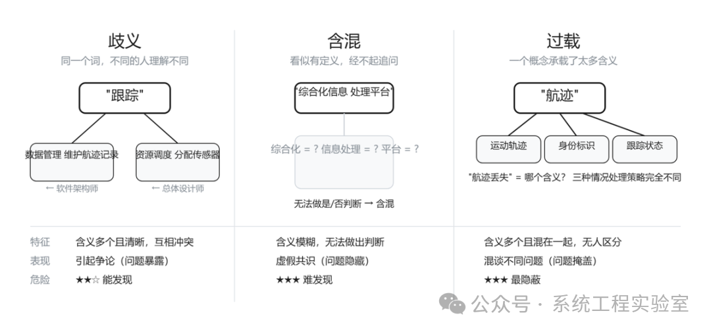

系统建模与设计：概念模糊是复杂性的第一来源

> 某型指控系统的需求评审会上，争论持续了两个小时。争论的焦点是一个听起来很简单的问题："系统需要支持多目标跟踪"。

> 项目经理问："多目标是多少个？"回答是"至少200个"。软件架构师说没问题，设计一个能管理200条航迹的跟踪引擎就行了。但总体设计师说不对——"多目标跟踪"不仅仅是数量问题，它意味着系统要在目标间切换注意力、处理航迹交叉和身份混淆、在资源不够时进行优先级决策。

> 两个小时的争论，本质上是一个概念没有定义清楚：**"跟踪"到底是什么意思？** 是"维护一条航迹记录"？还是"持续分配传感器资源对目标进行观测"？前者是数据管理问题，后者是资源调度问题。系统复杂度相差一个数量级。

> 如果当天没人发现这个分歧——代价不是两小时的争论，是三个月后的整体返工。

一、概念是模型的原子

上一篇我们区分了三种抽象操作。无论你做了哪种抽象——泛化、聚合还是投影——最终产出的模型都由**概念**构成。

"传感器"是一个概念。"指控系统"是一个概念。"响应时延"是一个概念。"目标跟踪"是一个概念。

模型中的每个元素——每个方框、每个节点、每条关系上的标注——背后都是一个概念。如果这些概念的含义是模糊的，那么无论模型的结构多么精巧，它传递的都是不可靠的信息。

**概念是模型的最小语义单元。模型的精确性上限，取决于其中最模糊的那个概念。**

第一篇我们说过：映射关系必须清晰——模型中的每个元素对应现实中的什么，要能说清楚。但"说清楚"的前提是：你用来命名和描述这个元素的概念本身，含义是无歧义的。否则你以为自己说清楚了，但每个人对同一个词的理解不同，"清楚"只是幻觉。

二、一个概念的定义需要什么

日常用语中，我们对概念的"定义"要求很低——大家大致知道什么意思就行。但在建模中，"大致知道"等于"不知道"。

一个概念的严格定义，至少需要三个要素：

**内涵（Intension）：这个概念的本质特征是什么。**

内涵回答的是"什么条件下一个东西可以被称为X"的问题。"传感器"的内涵可能是"能够感知物理世界的特定物理量并输出可处理数据的设备"。任何满足这个条件的东西都是传感器，不满足的就不是。

**外延（Extension）：这个概念的适用范围是什么。**

外延回答的是"哪些具体的东西属于X"的问题。"传感器"的外延包括雷达、红外探测器、声呐、光电设备……一个好的内涵定义应该能够让你判断任何一个具体事物是否属于外延——如果判断不了，说明内涵不够精确。

**边界（Boundary）：这个概念与相近概念的区别是什么。**

边界回答的是"X和Y有什么不同"的问题。"跟踪"和"探测"有什么区别？"航迹"和"目标"有什么区别？"任务"和"功能"有什么区别？如果两个概念的边界不清晰，使用者就会在二者之间混用——而混用会导致模型中不同元素的语义重叠或矛盾。边界的清晰度本质上是内涵精确度的体现——如果两个概念的边界模糊，说明至少有一个的内涵不够精确。但在实践中，单独追问边界是发现内涵缺陷的最有效手段。

回到开头的案例。"跟踪"这个概念出了问题，是因为它的**内涵**没有被统一：软件架构师的内涵是"维护航迹数据记录"，总体设计师的内涵是"持续分配资源进行观测并维护航迹"。两种内涵对应完全不同的系统设计。

怎么检验一个定义是否足够精确？两个方法：

**用判断句检验内涵。** 强制自己用"X是航迹，当且仅当……"的句式来写定义。这个句式迫使你说清楚充分必要条件。"航迹"的定义如果是"目标的运动轨迹"，那么我问你："系统中维护了一个对象，它记录了目标的当前位置和速度，但没有历史位置信息。它是不是一条航迹？"如果你的定义无法回答这个问题，它就不够精确。

**用反例检验边界。** 列出几个"差一点就属于这个概念、但不应该属于"的东西。如果我们把"传感器"定义为"能感知物理世界并输出数据的设备"——那么一个键盘是不是传感器？它感知了物理世界的按压动作，并输出了数据。如果你觉得键盘不应该算传感器，那定义就需要补充限定条件——比如"感知的对象是系统外部的战场环境"。没有经过反例检验的定义，通常都有边界不清的问题。

三、概念模糊的三种形态

概念定义出问题，在实践中有三种典型的表现形式。理解它们的区别很重要——因为应对策略完全不同。

歧义：同一个词，不同的人理解不同

这是最常见的形态，也是开头案例中的情况。

军工系统中高频出现的歧义概念：

* "任务"——是作战任务（一次具体的打击行动）？还是系统任务（软件中的一个可调度执行单元）？
* "消息"——是战术信息（如目标情报）？还是技术载体（一个数据包）？
* "接口"——是人机交互界面？还是软件模块间的调用契约？还是硬件设备间的电气连接？

歧义的隐蔽之处在于：**所有人都觉得自己理解了，没有人意识到需要追问。** 因为这些词太常见了，每个人在自己的语境中用了多年，以为别人的理解和自己一样。歧义甚至不只发生在不同人之间——同一个人在长文档中，对同一个词的理解也可能前后不自觉地滑动（第3页的"目标"是打击对象，第15页的"目标"变成了系统功能目标，作者自己都没发现）。只有当分歧导致了实际后果（比如开头案例中的两小时争论，或更糟的，几个月后才发现的设计错误），歧义才浮出水面。

含混：看似有定义，但经不起追问

"本系统是一个综合化信息处理平台。"

什么是"综合化"？什么是"信息处理"？什么算"平台"？每个词都模模糊糊能理解，合在一起说了等于没说——你无法依据这个定义判断任何具体的设计决策是否正确。

含混和歧义不同。歧义是多个清晰的含义互相冲突；含混是根本没有清晰的含义——一团模糊的感觉，不足以支撑精确的推理。

检验含混的方法很简单：**尝试用这个定义做一个是/否判断。** "X是否属于综合化信息处理平台？"如果你发现这个问题无法被干脆地回答——不是因为信息不够，而是因为定义本身不提供判断标准——那这个定义就是含混的。

过载：一个概念承载了太多含义

"航迹"在某些系统中，既代表目标的运动轨迹（一组时空坐标点），又代表目标的身份标识（这条航迹对应哪个目标），又代表系统的跟踪状态（这条航迹是否还活跃、置信度多高）。

三个不同的关注点被塞进了同一个概念。结果是：当有人说"航迹丢失了"，可能是指"目标飞出了探测范围"（运动轨迹中断），也可能是"目标ID搞混了"（身份关联错误），也可能是"跟踪资源被释放了"（系统状态变化）。三种情况的处理策略完全不同。

过载的危害比歧义更隐蔽：**它不是引起争论，而是让所有人觉得在讨论同一件事时，实际上在同一个词下混谈了多个不同的问题。** 争论至少能暴露问题，过载让问题被掩盖。

以下是三种形态的结构对比：

概念模糊的三种形态

四、为什么概念模糊如此普遍

如果概念精确定义这么重要，为什么实践中几乎所有项目都在用模糊的概念？

**第一，自然语言的经济性。** 日常沟通中，概念模糊是高效的。说"帮我处理一下这个问题"不需要精确定义"处理"和"问题"——上下文会消歧。这个习惯会被带入技术场景，但技术场景中上下文消歧经常失效——因为参与者的背景不同，各自脑中的"默认上下文"不同。

**第二，精确定义的成本。** 把一个概念定义到内涵、外延、边界都清晰的程度，需要深入思考和反复推敲。这在进度压力下被视为"浪费时间"。但它的实际成本远低于它避免的返工成本——只是返工成本是延迟支付的，定义成本是即时支付的，人类对即时成本更敏感。

**第三，模糊创造了虚假的共识。** 如果每个人对"平台化"的理解不同，但没有人追问精确含义，那么所有人都可以"同意"这个方向——因为每个人"同意"的是自己脑中的那个版本。精确定义会立刻暴露分歧，暴露分歧意味着需要解决分歧，这需要时间和精力。模糊是逃避分歧的方式。

**但逃避不等于解决。分歧早暴露是争论成本，晚暴露是返工成本。后者永远更高。**

五、从术语对齐到概念对齐

很多团队的应对方式是建立术语表——把关键术语列出来，写上一句话解释。这是有价值的第一步，但远远不够。

术语对齐解决的是"我们是否用同一个词指同一个东西"的问题。概念对齐解决的是"我们对这个东西的理解是否一致"的问题。这是两个不同层次的问题。

术语表上写"航迹：目标运动轨迹的记录"——这在术语层面是对齐了。但如果不进一步追问"记录包含哪些信息？精度要求？更新频率？什么条件下航迹终止？"，概念层面的对齐还是没有完成。

同样需要检查的是概念外延在上下游的一致性。如果需求文档中"目标"包括飞机、导弹、无人机和鸟群（因为鸟群也可能触发雷达），而软件设计中"目标"只包括飞机、导弹和无人机——那么鸟群在设计阶段被悄悄丢掉了。这不是设计决策，这是概念外延在上下游不一致导致的遗漏。

**术语表是起点，不是终点。真正的对齐发生在追问细节并消除分歧的过程中。** 在每一个使用概念的边界点（需求→设计、设计→编码、编码→测试），概念外延的悄悄缩小或膨胀，都是系统缺陷的根源。

概念定义不是建模之外的独立活动，而是建模过程的第一步——在确定模型结构之前必须完成的工作。如果跳过这一步直接开始画图，得到的"模型"在语义层面是不可靠的——你画了一个结构，但结构中每个节点的含义取决于读者的自行解读。这和第一篇中"模型不是图"的论点呼应：图是表示，结构性认知才是模型。**概念精确是模型可靠的前提条件。**

六、观点洞察

概念模糊不仅仅导致沟通低效。它导致**思考本身无法精确进行**。如果"跟踪"这个概念在你自己脑中就是含混的——既有数据维护的意思，又有资源调度的意思——那你在用这个概念进行任何推理时，结论都不可靠。你可能在某个推理步骤中用了含义A，在下一个步骤中不自觉地切换成了含义B，得出了一个看似合理但实际上逻辑断裂的结论。

**概念模糊是系统复杂性的第一来源。** 系统当然有固有的复杂性——组件多、交互多、需求变化快。但在这些固有复杂性之上，概念模糊制造了大量**人为的**复杂性：不是系统本身难以理解，而是我们用来理解系统的概念工具不够锋利。模糊的概念就像磨损的螺丝刀——不是拧不动螺丝，是每一下都在打滑，花了三倍的力气却只完成了一半的工作。

精确定义概念不是学术洁癖，是工程纪律。它的回报不是"显得专业"，而是**让后续所有基于概念的推理——需求分析、架构设计、接口定义、测试设计——都建立在可靠的基础上。**