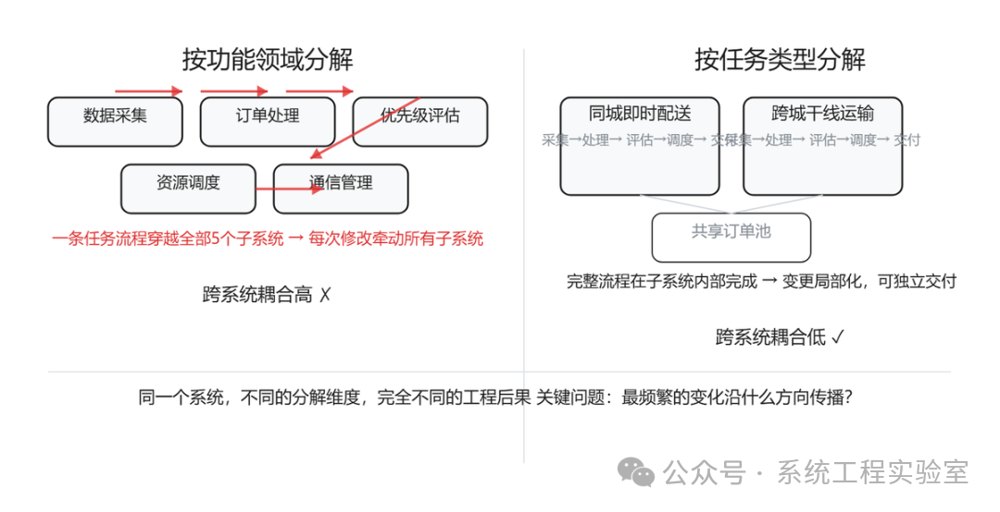
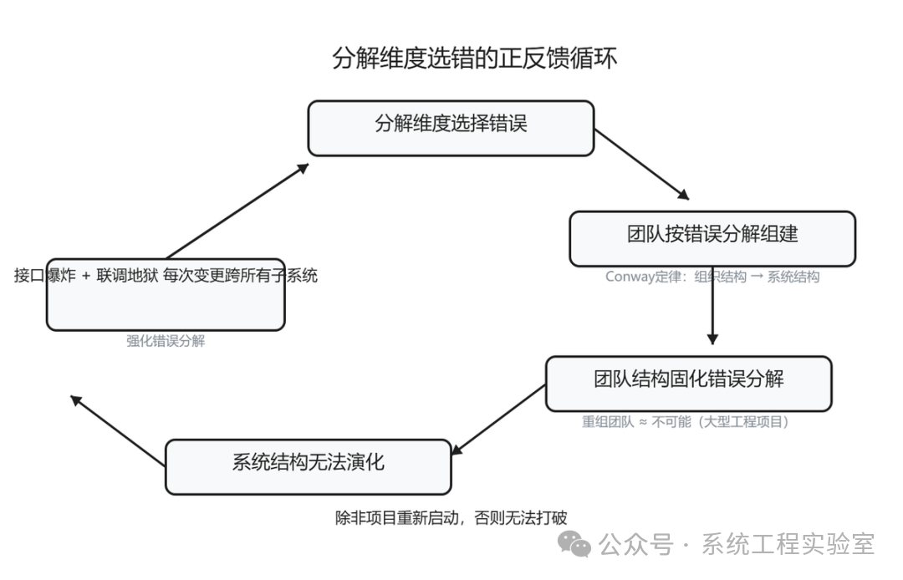
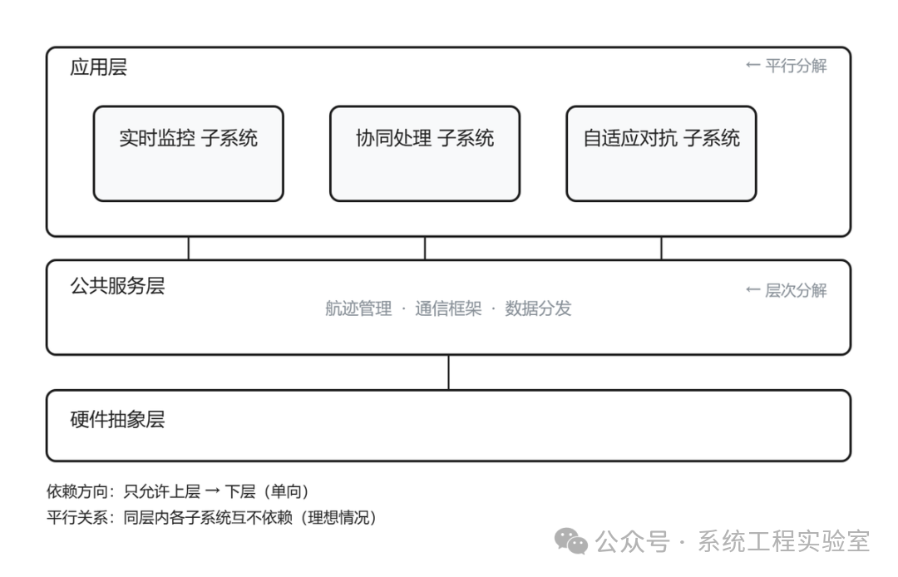

引言

> 某智能物流调度平台进入详细设计阶段。总体方案中将系统分解为五个子系统：数据采集子系统、订单处理子系统、优先级评估子系统、资源调度子系统、通信管理子系统。

> 分解依据是功能领域——每个子系统对应一类业务功能。看起来很合理。

> 进入开发后问题暴露了。一次完整的任务流程——从数据采集到订单信息、经过处理融合、评估优先级、调度资源、下达配送指令——这条路径穿过了全部五个子系统。每一次任务功能的修改，都需要同时改动五个子系统的代码。每一次联调测试，都需要五个子系统同时到位。没有任何一个子系统可以独立交付价值。

> 项目组的总结是："我们的分解粒度可能不对，应该把子系统拆得更细一些。"

> 这个总结抓错了重点。问题不在粒度，在于**分解维度**。按功能领域分解导致一条任务流程被切成五段，每段无法独立运作。如果换一个维度——比如按任务类型分解（同城即时配送、跨城干线运输、仓储调度）——每个子系统内部就包含了一条完整的从接单到交付的流程，可以独立开发、独立测试、独立交付。

> 同样的系统，不同的分解维度，完全不同的工程后果。

一、分解是建模中最关键的设计决策

前几篇讨论的内容——目的、抽象、概念、关系——都是建模的基础认知。分解是这些认知的第一个重大应用：**面对一个复杂系统，如何把它切成可以分别理解、分别处理的部分？**

分解之所以关键，是因为它直接决定了：

* 团队如何分工（通常每个子系统对应一个开发团队）
* 接口在哪里定义（子系统边界就是接口边界）
* 变化如何传播（一个修改是局部的还是跨子系统的）
* 系统如何集成测试（哪些东西必须同时在场才能测）
* 未来如何演化（哪些部分可以独立替换）

这些不是技术细节，是项目成败级别的决策。而这些决策的起点，就是分解维度的选择。

上一篇的结论是：系统的关键特性存在于关系中。分解本质上是对关系网络的切割——把一个大的关系网切成若干子网。**切在哪里，决定了哪些关系被保留在子系统内部（成为内部实现细节），哪些关系暴露在子系统之间（成为接口）。**

二、分解维度不是事实，是决策

同一个系统可以按不同的维度分解。这些维度不存在客观的"对"或"错"——只存在"是否对齐了建模目的"。

按功能领域分解

数据采集、订单处理、优先级评估、资源调度——每个子系统负责一类功能。

优势：每个子系统的职责在概念上清晰，容易解释。

代价：一条端到端的业务流程通常穿越多个子系统，跨系统协调成本高。

按任务流程分解

实时监控、数据融合、协同处理——每个子系统包含一条完整的从探测到执行的流程。

优势：每个子系统可以独立完成一种完整任务，独立测试和交付。

代价：不同子系统中会有功能重复（每个都有自己的目标处理逻辑），一致性维护成本高。在安全关键系统中，这个代价可能比跨系统协调更致命——两套不一致的威胁评估算法可能导致矛盾的系统决策。

按变化频率分解

稳定部分（底层通信框架、数据格式定义）和易变部分（业务规则、评估算法、显示方式）分开。

优势：频繁变化的部分不影响稳定部分，系统演化时改动局部化。

代价：需要预判哪些部分稳定哪些易变——预判可能错。

按部署单元分解

边缘处理设备上运行的部分、中心节点运行的部分、移动终端运行的部分。

优势：直接对应物理部署约束，每个子系统对应一个交付物。

代价：同一功能如果需要跨部署单元协作，会被强制拆开。

**没有"正确"的分解维度。** 以上四种是最常见的选项，实践中还有按信息域、按安全等级、按复用/定制等维度。每一种维度都是一个权衡：它让某些关系内聚（成为内部细节），同时迫使另一些关系外露（成为跨系统接口）。如果你不确定该选哪种维度，先问一个问题：系统中最频繁的变化沿什么方向传播？让那个方向被封装在子系统内部。

三、分解的核心启发式：最小化跨边界关系

尽管没有唯一正确的维度，但在大多数工程场景下，有一条跨维度适用的核心启发式：

**好的分解，应该让子系统之间的关系数量和复杂度最小化。**

这就是经典的"高内聚、低耦合"原则的实质含义——不是一条空洞的口号，而是对分解质量的精确判定标准。

内聚是什么？一个子系统内部的元素之间关系紧密，它们共同完成一个有意义的整体功能。

耦合是什么？两个子系统之间需要交互的关系——接口调用、数据传递、时序约束、共享资源。

**分解的质量，可以用一个直觉指标衡量：子系统内部关系的数量和强度与子系统间关系的数量和强度的比值。** 比值越高，分解越好——意味着大部分复杂性被封装在了子系统内部，子系统之间的交互相对简洁。注意这里不只是数量——上一篇建立的认知在此适用：一条强依赖的跨系统关系，其影响可能超过十条弱关联的内部关系。同时，这个比值只在分解粒度合理的前提下有意义——不分解不是高内聚，是拒绝面对复杂性。

回到开头的案例。按功能领域分解后，一条任务流程穿越五个子系统——这意味着五个子系统之间存在大量的跨系统数据传递和时序协调关系。子系统间的耦合度极高。按任务类型分解后，主要的数据流和控制流都在子系统内部完成，子系统之间只需要共享基础数据（如目标航迹库）——跨系统关系大幅减少。

这不是说按任务类型分解"永远更好"——它有自己的代价（功能重复）。但在"降低跨系统协调成本"这个优化目标下，它显著优于按功能领域分解。

两种分解维度的对比

四、分解维度选错的代价

分解维度一旦确定，整个系统的物理结构、团队结构、接口结构都会围绕它生长。改变分解维度，实质上是推翻重来。

这就是为什么分解决策是"最关键的设计决策"——不是因为它最复杂，而是因为它**最难修改**。

匡威定律定律的反作用

Conway定律说组织结构决定了系统结构。反过来，分解决策也会反过来固化组织结构：按功能领域分解后，团队就按功能领域组建了；一旦团队按功能领域组建，想要改变分解维度就意味着重组团队——这在大型工程项目中几乎不可能。

分解维度错了→团队结构按错误的分解组建→团队结构固化了错误的分解→系统结构无法演化。这个正反馈循环一旦形成，除非项目重新启动，否则很难打破。

分解维度选错的正反馈循环

接口爆炸

错误的分解维度导致大量关系暴露在子系统边界上。每一条跨系统关系都需要一个接口来承载。接口越多，维护成本越高，集成测试的复杂度越高，版本兼容的风险越大。

某型系统按功能领域分解为五个子系统后，子系统间定义了200多个接口。每次需求变更平均需要修改十几个接口——不是因为需求复杂，而是因为分解把本应在一处完成的变更切割成了跨多个子系统的协调修改。

**接口数量多不是"系统复杂"的证据，而是"分解不当"的症状。** 如果分解维度选对了，大部分变化应该只涉及一个子系统的内部，跨系统接口应该是稳定的。

集成测试的不可承受之重

如果一个有意义的端到端场景穿越了所有子系统，那么测试这个场景就需要所有子系统同时就位。这意味着：

* 任何一个子系统的开发延迟，都会阻塞整体测试
* 出了问题时，定位困难——不知道是哪个子系统的问题
* 联调测试窗口稀缺且昂贵——五个团队的时间必须同时对齐

**好的分解应该让大部分有意义的测试场景在单个子系统内部就可以完成。** 如果你的系统必须"联调才能测"，这是分解质量差的强信号。

五、层次分解 vs 平行分解

分解有两种基本模式，它们的目的和效果不同。

**层次分解（Layered Decomposition）**：把系统按抽象层次分割。上层使用下层的服务，下层不知道上层的存在。依赖方向单向：只允许上层依赖下层。实际中下层可能需要向上层发通知（如事件、回调），但应通过抽象机制实现，保持下层对上层具体实现的无知。

典型的层次分解：应用层→领域逻辑层→基础设施层→硬件抽象层。

层次分解的核心价值是**控制依赖方向**。单向依赖意味着：下层的变化可能影响上层，但上层的变化不影响下层。底层稳定，上层灵活。

层次分解的陷阱：**跨层调用。** 如果应用层经常跳过领域逻辑层直接调用基础设施层，层次结构就被破坏了——依赖方向不再单向，层次分解退化为一团混乱。

**平行分解（Parallel Decomposition）**：把系统按职责领域分割。各子系统是平行的，没有层次关系。

典型的平行分解：监控子系统、协同处理子系统、自适应对抗子系统。

平行分解的核心价值是**隔离变化范围**。每个子系统独立演化，互不影响。

平行分解的陷阱：**共性遗漏。** 如果多个平行子系统有共享的能力需求（如目标航迹管理），但没有被识别出来作为公共层，每个子系统各自实现一套，不一致性会逐渐累积。

**实际系统通常是两者的组合：先按层次分解出基础层和应用层，再在应用层内按领域做平行分解。** 这需要同时思考两个维度，也是分解设计困难的原因之一。

层次分解与平行分解的组合

六、分解的三个常见错误

错误一：按组织结构分解

"我们有三个开发团队，所以系统分成三个子系统。"

这不是技术决策，是行政决策。按组织结构分解意味着子系统边界由团队规模和人员分配决定，而非由系统本身的关系结构决定。结果是边界切在了关系最密集的地方——因为能力相近的人被分到了不同团队，他们负责的功能之间恰恰关系最紧密。

Conway定律描述的是现象（组织结构倾向于映射到系统结构），不是最佳实践。理想的做法是反过来：**先确定合理的系统分解，再让组织结构去适应。** 但在大型工程项目等组织结构高度刚性的环境中，这往往不现实。此时至少应该让系统分解决策**意识到**组织约束的存在，而不是假装约束不存在——否则设计出的分解方案在落地时必然变形。

错误二：过早细化

系统还没开发就把分解做到第三、第四层——子系统→模块→组件→类。

问题是：越低层的分解，需要的信息越多。在项目早期，你对系统行为细节的认识还不充分，此时做细粒度分解是在信息不足的情况下做高风险决策。而分解一旦确定，修改成本极高。

**分解应该逐步细化：先做顶层分解（子系统级），在开发过程中随着认知深入再做下一层分解。** 不要试图在一开始就把整个分解树画完——你没有足够的信息来做正确的决策。

错误三：只做一种维度的分解

只按功能分解，或只按层次分解，或只按部署分解。

实际系统同时受多种力的作用：功能需要组织、层次需要控制、部署需要适配、变化需要隔离。单一维度的分解只能优化一个方面，同时牺牲其他方面。

**成熟的系统分解是多维度的叠加。** 但这不意味着画一张包含所有维度的图——那会回到第一篇的错误（一个模型服务所有目的）。而是在不同的模型中、为不同的目的、用不同维度来分解同一个系统，然后管理这些分解之间的一致性。这正是后续"视角与一致性"篇要讨论的问题。

七、观点洞察

回到开头的场景。五个子系统的分解导致每次任务功能修改都需要改动五个子系统——不是因为系统复杂，而是因为分解维度把最高频的变化路径切成了碎片。

**分解维度的选择是架构的核心决策。** 它不是"画个框图然后标上名字"那么简单的活动。它是一个需要权衡多种质量属性、考虑变化方向、预判演化趋势的战略选择。

做这个决策时需要追问的核心问题是：**系统中最频繁的变化沿什么方向传播？** 好的分解应该让这个方向上的变化被封装在子系统内部，不穿越边界。如果最频繁的变化是"业务规则更新"，而业务规则的实现横跨了你的所有子系统，那说明你的分解维度和变化方向正交——每次变化都是跨系统的。

这里有一条反直觉的原则：**分解不是把大的东西变小，而是让变化局部化。** 分解的目的不是降低每个部分的规模（虽然这是副产品），而是让修改的影响范围可控。一个"大"但变化时只需要动一个地方的子系统，比五个"小"但每次变化都要一起改的子系统，在工程上好得多。

分解的本质是对关系网络的切割。切在关系稀疏处，跨边界的协调成本低；切在关系密集处，跨边界的协调成本高。**选择分解维度，就是选择"在哪里切"——把最紧密的关系留在内部，把最松散的关系放到边界上。**

下一篇，我们讨论系统思维与涌现性。前五篇关注了建模的基础元素：目的、抽象、概念、关系、分解。分解是驾驭复杂性的基本策略——但分解有一个根本局限：系统的某些关键特性，无法通过分解来理解。它们只在组件交互中才产生，只在整体层面才可观察。这就是涌现性——分解思维的边界。