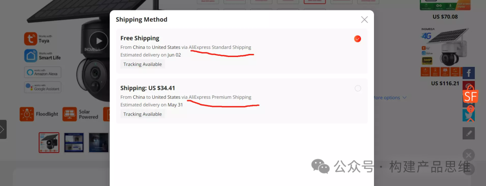
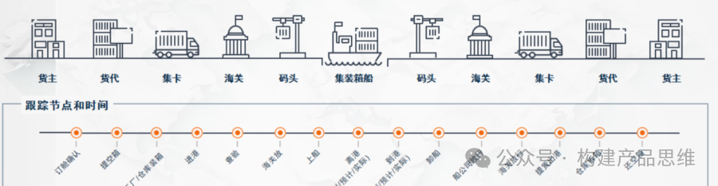
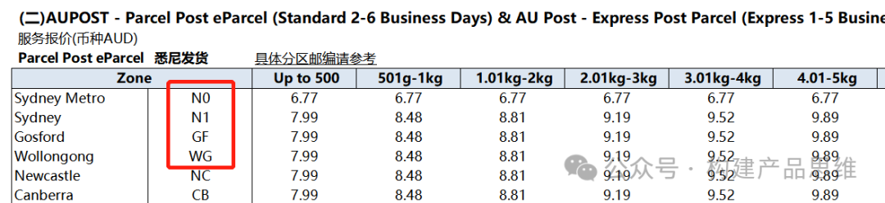
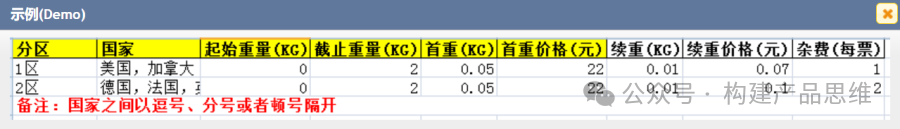
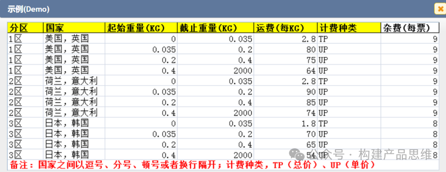
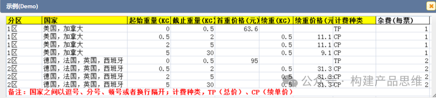
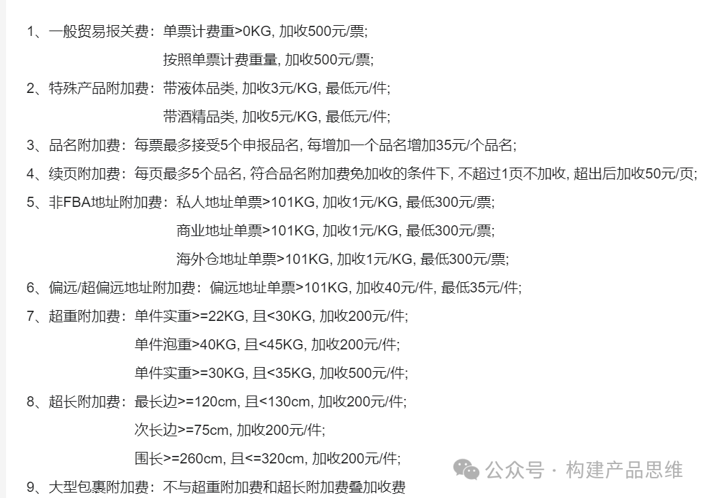

供应链的主要目的是降本增效，是跨境物流系统中最重要的部分，下面简要介绍一下跨境物流系统中的物流模块设计。

1. 跨境物流术语

在跨境电商中，一般有三种模式：FBA，直发，海外仓:

a.FBA：只有亚马逊有这种方式，卖家将货发送到亚马逊的FBA仓库。

b.直发：货物直接从国内发到国外客户的手中。

c.海外仓：货物发到海外仓，客户下单后直接从海外仓库发货到客户手中。

物流阶段又分为尾程和头程。

尾程：把货物发到目的国，然后在本地再发送到客户。

头程：跨境卖家把商品从国内发送到海外目的国。

货运的零担和整车。

零担：和拼车比较类似，一趟车可以装N个货主的货物。

整车：物流公司一趟车，只能装一个货主的货物。

2. 平台物流服务

客户在平台下单的时候，这个时候平台会提供对应的物流服务，如下图所示。

这些就是经常用的标准快递，2日到达，10reign到达等，这些服务是由平台设定，提供给用户选择的，平台支持哪些服务？这些就需要进行接口对接，获取平台支持的服务。

3.物流方案设计

第一步我们要搞清楚跨境物流整体是怎么运作的？最常见的都是海运和空运形式。如下图所示的方式。

跨境物流一般都分了很多节点，每个节点都可能会产生费用。

尾程：降货运输给客户。

国内端运输：将货主的货运送到公司的仓库。

国际运输：空运货海运。

国内码头：码头报关出关。

目的国码头：目的国码头报关和清关。

3.1 线路

我们以国内的线路为例子，这样大家才会更容易理解。如果从家里寄一个东到越秀金融大厦，那么收货地址就会填写广东省广州市天河区越秀金融大厦XX层XX室XXX公司收。

我们将这个地址拆分为下来就是：省，市，街道，楼栋，最后再加上国家就是6层地址。在国外的地址不是这样分，国外的地址只能定义到国家,省/州，城市，具体楼栋4层地址，因为很多国家没有街道这个概念。下图跨境寄往澳大利亚悉尼的物件。

3.2 计费项

物流模块设计不能少计费，跨境物流的链条比较长，整个链条中都有可能会产生费用，整个费用由6个部分组成。

a. 赔付：延期，丢货等异常情况，给客户进行赔付。

b.增值服务：常见的都是贴标换标服务。

c.优惠：作为物流公司给货主的优惠。

d.税费：常见的是入关和清关的费用。例如：欧盟的VAT税费。

e.附加费：超长超重费，加班费，验货费，贴标费，仓租，偏远地址费等。

f.运费：国外和国内的物流费用。

上面的费用，又分为非标准费用和标准费用。非标准费用就是一些没有规则的费用。标准费用就是可以依据规则计算出来的费用。

3.3 运费

提及到运费，就离不开计价表，跨境卖家来说，他们会接手到各个物流公司的计价表，每个物流公司的计价表都不一样，但是一般都会有自己的计费规则。对于卖家来说，就需要将这些计价表按照规则做成模版导入系统，系统会去解析这些模版的计费规则，去计算物流费用。物流模版的产品设计如下图所示。单机：

上图的计算方式为：总运费=运费\*重量+杂费。

3.4 续重

这种计算法方式为统计某个重量内的收费，超过重量段，按照超过的部分收费。例如：11KG以内运费为55元，超过11KG，每0.1KG就收费0.6元。

3.5 重量段

在某个重量段的区间内收费。例如：0-5KG收费110元，5-11KG收费510元。

3.6 重量段+单价

这种方式是重量段+单价的方式，在某个重量段区间内按照重量段计费，然后其它重量段按照单价计费。

3.7重量段+续重

这种方式是重量段+续重组成，在某个重量段内按照重量段计费，然后其它重量段按照续重计费。

4.附加费

附加费有非标准费用和标准费用。附加费的难点在于业务梳理，非标准的附加费不好做到系统中。每个物流服务商的收费标准不一样，某个跨境物流服务的附加费用如下图所示。

