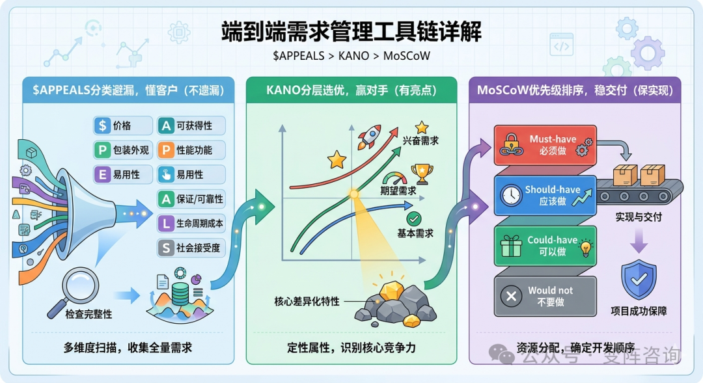
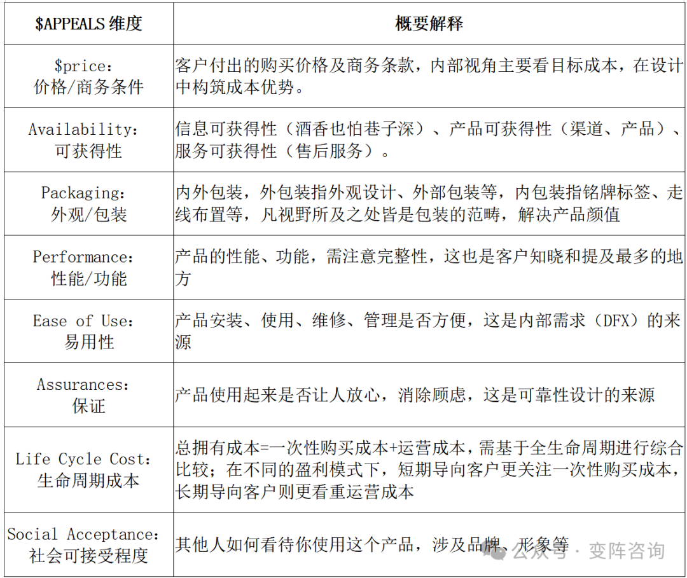
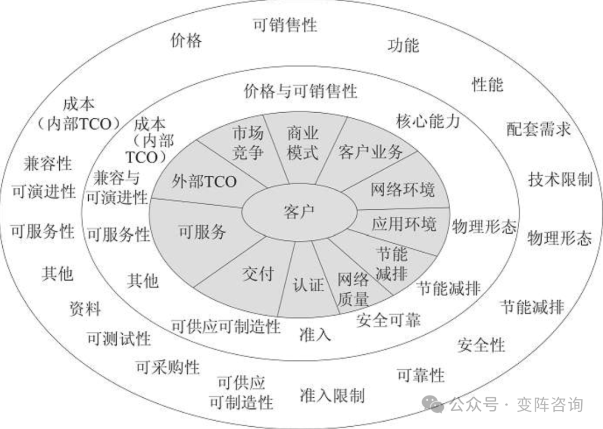
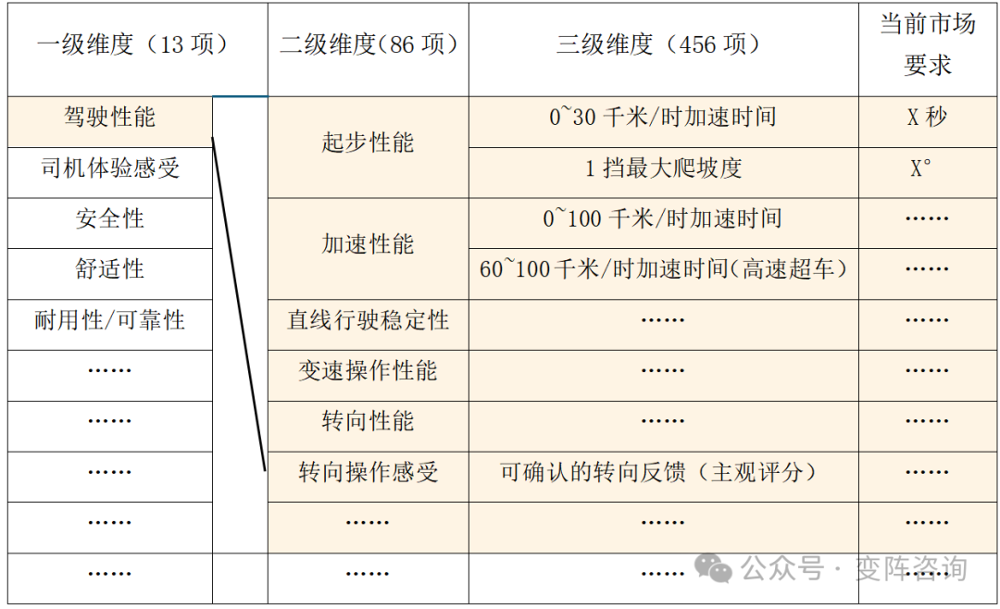
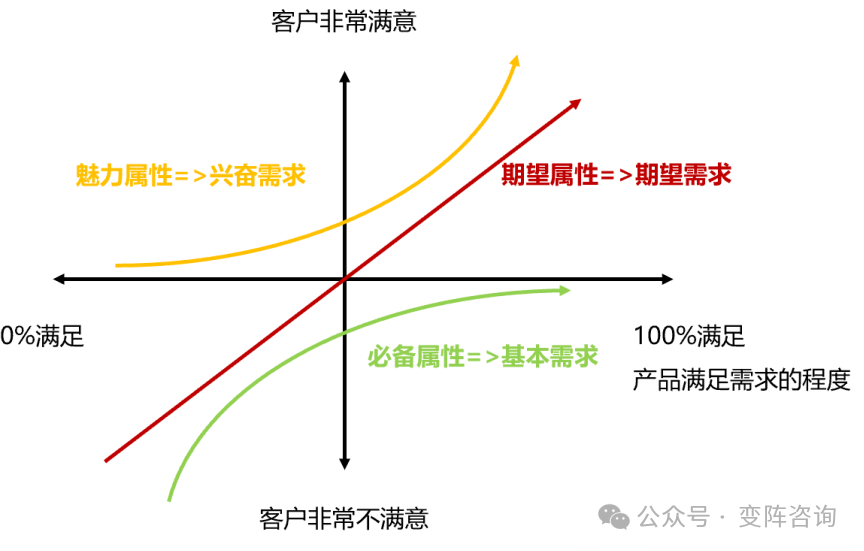
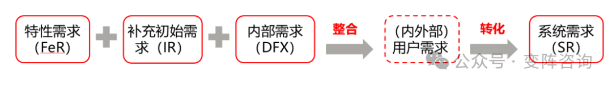
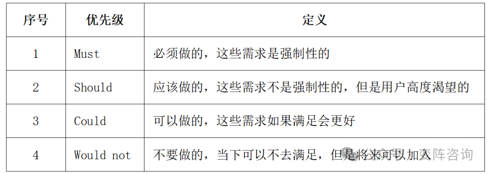
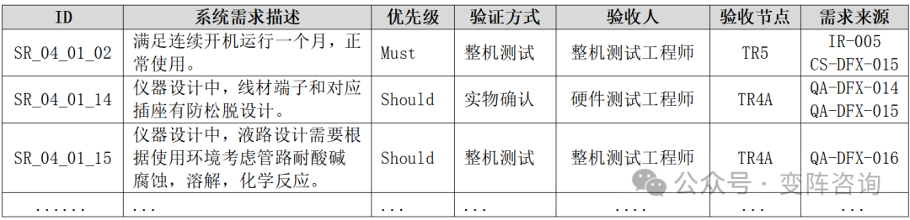
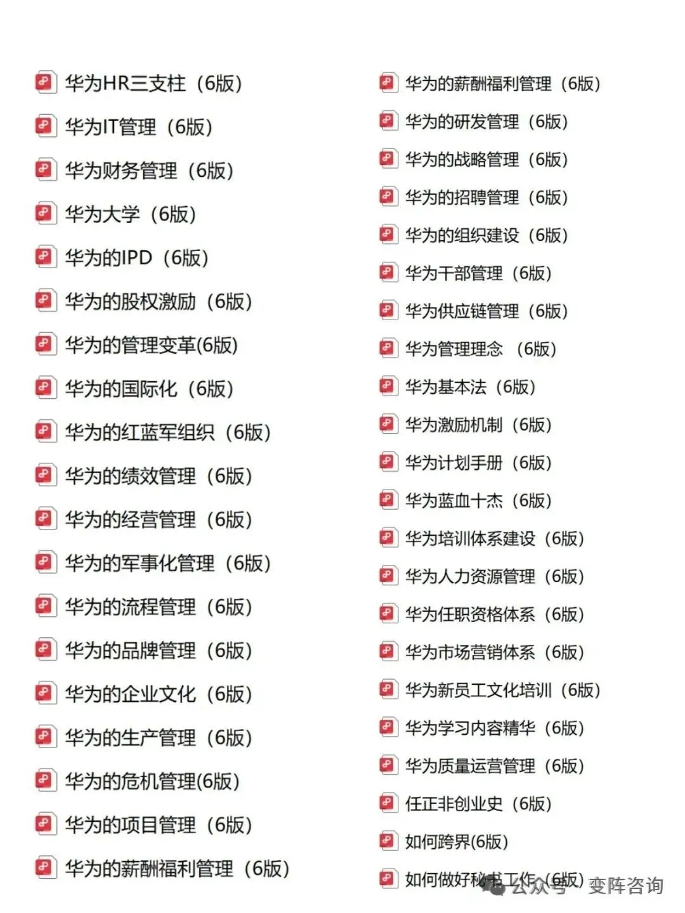

需求管理一直是研发体系建设的难点，很多企业面临的困境是：需求收集的不准，需求分析的不对，需求实现的不全。要解决需求“收集准不准、分析对不对、能不能交付”的痛点，不能靠零散的技巧，而要靠体系化的工具链。通过串联$APPEALS、KANO、MoSCoW 三大核心工具，形成一套端到端“不失真”的需求工具链，缓解需求管理痛点。

* $APPEALS分类避漏，懂客户（不遗漏）
* 卡诺（KANO）分层选优，赢对手（有亮点）
* 莫斯科（MoSCoW）实现优先级排序，稳交付（保实现）

# 1.建立场景化需求分层（$APPEALS）模型

有效开展需求管理的前提是知道自己想要什么，而不是漫天撒网，逮到什么是什么，明确要收集哪些需求，以及当下的市场基线情况，才能针对性的收集。借助$APPEALS模型对需求进行分类，进而构建基于场景的需求库，确立需求基线。

## 1.1.$APPEALS需求分类模型本地化

通过$APPEALS模型的八个维度整理需求，防止发生遗漏。

$APPEALS作为需求分类的通用模型，需结合企业自身业务特性与产品实际情况进行本地化调整，形成适配企业需求的专属分类模型。例如，华为将需求一级框架划分为客户业务、网络环境、应用环境、节能减排、网络质量、认证、交付、可服务、总拥有成本（TCO）、市场竞争等10个维度，来源于《从偶然到必然》。

## 1.2建立基于场景的企业需求分层模型

依据$APPEALS模型确定一级维度后，需进一步分层至二级、三级维度，且要与场景结合，这样才具备可操作性。针对产品品类，需持续积累数据，形成基于场景的需求库与需求基线。要识别场景并避免遗漏，可组建由产品经理及营销、研发人员构成的品类需求管理团队，从用户视角审视产品全生命周期运行场景，多维度挖掘客户需求。

某车企结合$APPEALS和自身情况，将需求分为三层：一级维度共13项；把一级维度中的某一需求按任务进一步拆分，如将驾驶性能拆分为起步、加速、直线行驶、变速操作、转向等，形成86项二级维度；再把二级维度按状态拆解，如起步性能可拆解为0~30千米/时加速时间、1档最大爬坡度等，形成456项三级维度。由于不同市场对各项的要求存在差异，需明确当前的市场要求，最终形成需求分层模型，如表所示。

# 2.打造产品核心竞争力的卡诺（KANO）模型

有了完整的需求库后，产品立项阶段，要在需求库里找到核心的差异化点，可借助卡诺（KANO）模型打造差异化的产品竞争力，在竞争红海里找到亮点。

卡诺模型将需求分为基本需求、期望需求、兴奋需求三大类，如图所示。

基本需求（必备属性），即产品或服务必须具备的基础功能或属性。如果不满足这些需求，用户会非常不满意，但即便满足，也不会显著提升满意度，如手机的通话功能。

期望需求（期望属性），其满足程度与用户满意度呈正比。满足这类需求，用户满意度会提升，反之则下降。它是增强产品市场竞争力的关键，如手机的电池续航能力与操作系统流畅度。

兴奋需求（魅力属性），指用户未明确提及，但提供后能极大提升其满意度的需求，是超越用户期望的特性，为产品带来差异化与创新点，也是保持客户黏性的关键，如手机拍照自带的AI构图功能。

通过雷达图与竞品相比，若满足基本需求相当，1~3条期望需求相较竞品做到绝对领先和1~3条兴奋需求相较竞品做到领先，产品竞争力就会很强。

如果只做基本需求，你只能打价格战；有了绝对领先的期望需求和兴奋需求，你才有定价权。

以华为P70手机为例，其围绕拍照功能这一核心特性，主打“全时段全焦段高画质”，凭借更大传感器、更强长焦、更智能算法，在客户期望和兴奋需求上做到了绝对领先，进一步巩固了在手机摄影领域的标杆地位。

此外，需求类型会随时间而改变，当下的兴奋需求，未来可能成为期望需求，再往后甚至会变成基本需求。以智能手机为例，其“快充”功能就经历了从兴奋需求到期望需求，再到基本需求的演变。因此，需要及时更新需求库与需求基线。

# 3.全面系统需求排序的莫斯科（MoSCoW）模型

在产品开发阶段，需整合产品立项确定的特性需求（FeR）、补充的初始需求（IR）以及内部需求（DFX），形成内外部用户需求清单，最终转化为系统需求（SR）清单，系统需求强调全面性、系统性，不能遗漏，如图所示。

描述系统需求（SR）的标准格式为：场景+功能+指标/规格。例如，医疗设备行业检测准确度的功能需求可描述为：在检测通量为800速（每小时处理800个样本）的场景下，仪器应能准确测量和分析待测样本，精确度不低于99.99%。

通常，若特性需求有3~5条，初始需求可能有几十条，系统需求最终会有几百条。但企业研发资源有限，必须给资源下“生死令”，需用莫斯科（MoSCoW）模型对系统需求进行优先级排序，具体如表所示。

需求执行原则为：确保Must、Should类需求实现，力争Could类需求也能实现；若有重要变更，可牺牲Could类甚至Should类需求以保障变更。若初始需求（IR）中的期望需求被采纳，需纳入Must类需求，务必实现。

某项目系统需求清单如下表所示，明确系统需求内容、来源、优先级、验证方式和验收节点等。

# 4.结语

孤立地看工具，它们只是术；需要把它们串成工具链，它们才是道。$APPEALS 的分类避漏、KANO 的分层选优、MoSCoW 的资源优先级排序，这三个工具的连续应用，实际上是对原始需求进行的一次“感性认识向理性实现的科学翻译”。

但要提醒各位管理者，比工具更重要的，是建立运用工具的组织能力。如果没有配套的评审机制、跨部门团队的协同、员工能力的支撑，工具链依然会被束之高阁，或者沦为新的流程负担。

真正的“变阵”，不是在墙上挂满流程图，而是让每一位产品经理和研发骨干，都能自觉地运用这套逻辑去审视每一个需求——懂客户、赢对手、稳交付。

往期文章：

[从华为组织实践看：矩阵组织不是设计出来的，是靠流程分工长出来的](https://mp.weixin.qq.com/s?__biz=MzU4MTk2NjM4Mw==&mid=2247483880&idx=1&sn=f6c6e855b1f6bef7876c6dac50c2c24f&scene=21#wechat_redirect)

[非标定制企业的破局之路：从纯非标到相对标准化](https://mp.weixin.qq.com/s?__biz=MzU4MTk2NjM4Mw==&mid=2247483857&idx=1&sn=c94de556641d7183e73537bc8881fa5d&scene=21#wechat_redirect)

[IPD体系的理论基础：系统工程&并行工程](https://mp.weixin.qq.com/s?__biz=MzU4MTk2NjM4Mw==&mid=2247483825&idx=1&sn=d4e12f8529d968fa29154a5746d35aa5&scene=21#wechat_redirect)

[从系统工程视角，拆解IPD落地的霍尔三维模型](https://mp.weixin.qq.com/s?__biz=MzU4MTk2NjM4Mw==&mid=2247483839&idx=1&sn=3516a5c1c78afeca60cd704b5767956e&scene=21#wechat_redirect)

[回望10年咨询路，变阵，面向下一个10年](https://mp.weixin.qq.com/s?__biz=MzU4MTk2NjM4Mw==&mid=2247483784&idx=1&sn=bf2fcc637832f06e00687ac9bca91875&scene=21#wechat_redirect)

文末福利，关注变阵咨询公众号送华为经营管理文集1&2、基于流程的矩阵组织材料。

节选自《变阵：从0到1落地IPD体系》，有修正，详见：