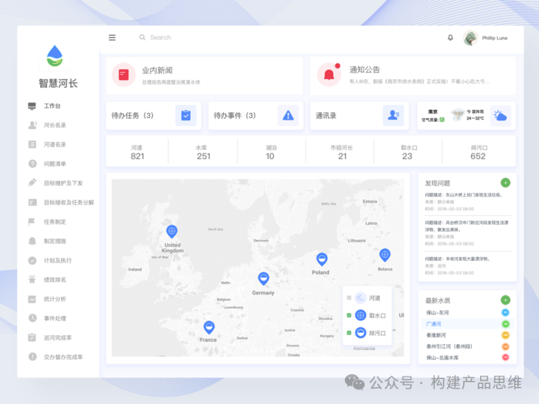
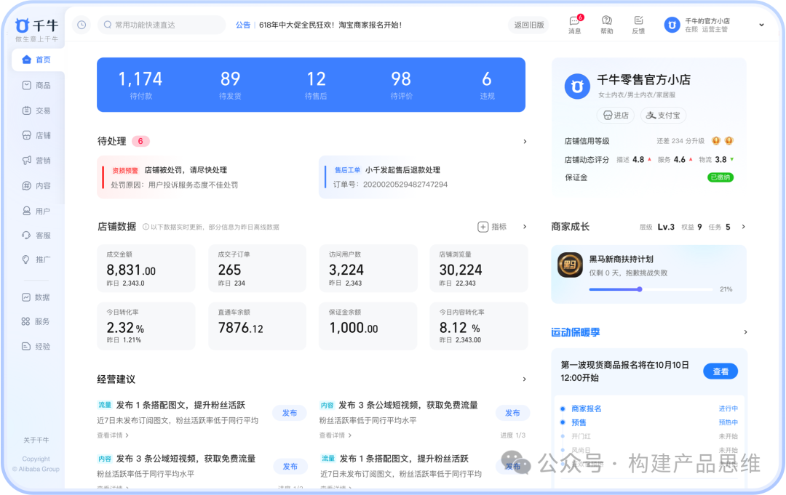
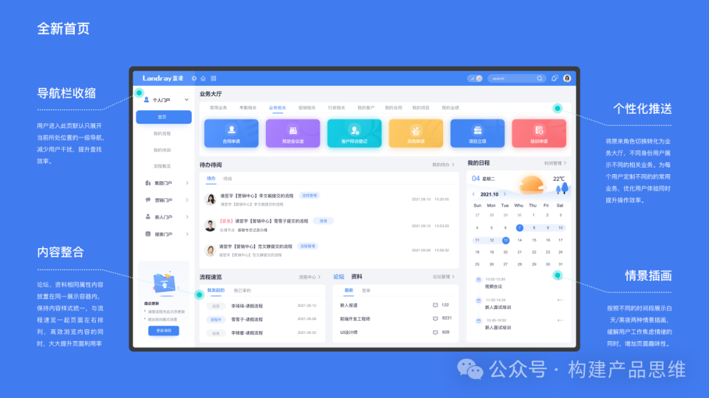
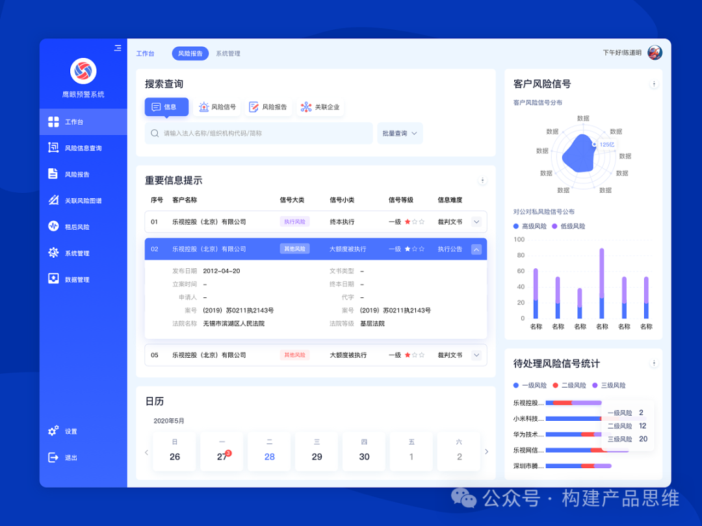

      在B端产品中，工作台是一个非常重要的功能，一个好的工作台，能极大地提升用户的工作效率和用户使用产品的体验。

1. 工作台定义

    工作台是指面向企业或组织的管理系统中最重要的工作界面。B端用户在进入系统时，最先进入的第一个页面就是工作台。

2. 工作台的用途

   工作台主要有下面几个重要的用途：

2.1 提高工作效率

    我们在设计B端工作台页面时，应该要考虑用户的操作习惯和使用习惯，让用户可以快速上手来使用系统，从而大幅提高工作效率。

2.2 提供操作入口

    B端产品的工作台页面一般是系统的核心功能和操作入口。B端用户通过使用工作台页面可以快速准确找到所需的功能，大幅提高工作效率。

2.3 提供消息提醒

     B端产品的工作台页面的消息中心提供了消息提醒，待办任务，系统通知等。让用户能实时了解系统的任务状态和系统动态。

2.4 支持个性化定制

     B端产品的工作台页面同时也支持个性化定制，B端用户可以根据自己的业务需求进行页面布局调整，功能设置等，大幅提高使用体验。

2.5 展示数据信息

     B端产品的工作台页面可视化各种报表，信息，数据等。B端用户无论何时都可以进行数据导出，编辑和查询等操作。

3. 工作台设计

   B端产品的工作台设计，主要包括下面几个步骤：

3.1 明确用户需求

     在设计之初，我们要明确用户的使用场景和业务需求，同时要知道用户的使用习惯和使用目的。接下来才能更好地进行页面和逻辑的设计。

3.2 功能模块

     通过上面获取用户需求，接下来就要进行功能和模块划分，梳理各个功能和模块的优先级顺序，再进行业务逻辑和页面布局和设计。

3.3 页面布局

     依据上面设计的模块和功能，在进行页面布局的设计。主要包括导航栏，工作区域，左侧菜单栏，消息中心，快捷操作区，系统设置，帮助中心和设计页面布局等。

3.4 页面风格

      依据用户需求和企业或组织的品牌形象，设计页面的样式和风格。主要包括图标，字体，颜色等。从而使页面有极佳的用户体验和视觉效果。

3.5 测试和优化

     在完成页面设计之后，接下来需要进行测试和优化，保证页面的稳定性，易用性和安全性。接下来数据分析和根据用户反馈进行改进和优化。

4. 页面组成

B端管理系统的工作台界面，会因为不同系统类型和功能会有所不同，但是通用的页面功能包括：

4.1 顶部导航栏

     主要包括系统logo,个人中心，模块导航等，可以让用户快速切换模块和进行账户管理等功能的操作。

4.2 工作区域

    用来展示系统各个模块的功能入口，通常按模块来划分，可以让用户快速定位到所需的功能。

4.3 消息中心

    通常用来展示系统消息提醒，待办任务，系统通知等，让用户可以快速了解系统动态和任务状态。

4.4 左侧菜单栏

     用来展示系统中各个模块的功能入口，通常按模块划分，让用户可以快速定位所需功能。

4.5 系统设置

      用来进行权限管理，数据备份，系统设置等操作。通常需要管理员权限才可以操作。

4.6 侧边栏

     通常用来辅助管理系统的各种操作，例如：客服标识，换肤，对话框等。

4.7 帮助中心

      通常用来提供常见问题解答，系统使用指南，技术支持等，解决用户在使用工作台时遇到的各种问题。

4.8 快捷操作区

     通常位于工作区域上方或左侧，用来展示常用的操作按钮，或者快捷入口，大幅方便用户快速进行操作。

    上述就是B端产品中工作台界面通用的内容构成，在实际的业务中，可能还需要依据系统类型和功能进行功能的调整和设计。